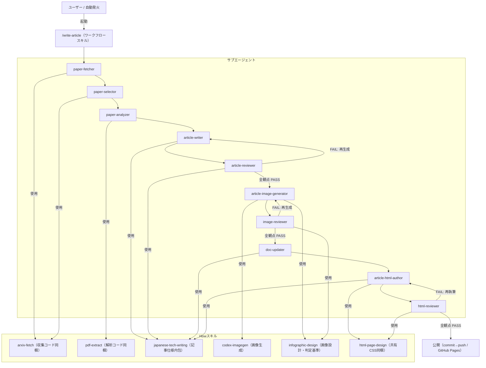

# アーキテクチャ

> 実装済み構成を反映した地図。ワークフロースキル・サブエージェント・How スキルは
> `.claude/` 配下に実在する（コードが真実の源泉、本書は地図）。実装変更時は本書を追従更新する。

## 実行モデル
本システムはアプリケーションコードを持たず、Claude（メイン／サブエージェント）が
実行主体となる。処理コード・手法・記事仕様はすべてスキルに内包され自己完結する。
`/write-article` は人間の承認ゲートを持たない全自動ワークフローで、Claude Code の
自主判断による自動発火も許容する（`disable-model-invocation` 未指定）。

## 全体構成

## パイプライン
| 段階 | サブエージェント | 役割 | 入出力 |
|---|---|---|---|
| ① 取得 | paper-fetcher | arXiv 検索・候補メタデータ取得 | 検索条件 → `work/<run-id>/papers/` |
| ② 選定 | paper-selector | 新着かつ未解説の 1 本を選定 | `papers/` ＋ `output/` 履歴 → `work/<run-id>/selected.json` |
| ③ 解析 | paper-analyzer | PDF→テキスト化・要点抽出 | `selected.json` → `work/<run-id>/analysis.md` |
| ④ 執筆 | article-writer | 日本語記事ドラフト執筆・再生成 | `analysis.md` → `work/<run-id>/article.md` |
| ⑤ 検証ループ | article-reviewer × 観点 / article-writer | 観点別並列レビュー → FAIL なら再生成、合格まで反復 | `article.md` → `review-<iteration>_<aspect>.md` |
| ⑥ 画像生成 | article-image-generator | 確定本文から記事冒頭のインフォグラフィック 1 枚を設計・生成 | 合格 `article.md` → `work/<run-id>/images/cover.png` |
| ⑦ 出力＋更新 | doc-updater | 整形出力（記事冒頭にカバー画像参照行を挿入）、必要時 docs/ 追従更新 | 合格 `article.md` ＋ `cover.png` → `output/<記事ファイル>`（＋ `output/images/`） |
| ⑧ HTML 執筆 | article-html-author | 確定 Markdown＋カバー画像から `/html-page-design` 準拠のリッチ HTML 記事ページと一覧トップを執筆 | `output/<記事>.md` ＋ `output/images/*-cover.png` → `docs/articles/<記事スラッグ>.html` ＋ `docs/index.html`（必要時 `docs/assets/style.css` 配備） |
| ⑨ HTML 検証ループ | html-reviewer × 観点 / article-html-author | 観点別並列レビュー → FAIL なら再執筆、合格まで反復（反復上限 2 周） | 記事 HTML → `work/<run-id>/html-review-<iteration>_<aspect>.md` |
| ⑩ 公開 | article-html-author | 全工程合格時のみ add→commit→push（`origin main` 固定・force 禁止） | 合格 HTML → push / GitHub Pages 公開 URL |

⑤の検証ループは `/multi-aspect-review` 契約に従い、`fact-check`（必須）・`readability`・`structure`
の 3 観点を並列レビューする。人間介在なしで反復・収束させ、反復上限（5 周）到達時は最終周回
レポートを残してパイプラインを打ち切る（`output/` への公開は合格時のみ）。

⑥の画像検証ループは `/multi-aspect-review` 契約に従い、`image-fact`（必須）・`image-coverage`・
`image-legibility`・`image-consistency` の 4 観点を並列レビューする（反復上限 5 周）。判定基準は
`/infographic-design` を単一真実源とする。

⑨の HTML 検証ループは `/multi-aspect-review` 契約に従い、`design-consistency`・`readability`
の 2 観点を並列レビューする（反復上限 2 周。Step ⑤/⑥ より低コスト）。判定基準は `/html-page-design`
の `## 観点別判定基準` を単一真実源とする。本文ファクトは Step ⑤ で確定済みのため HTML 工程では
再点検しない。⑩の公開（commit→push）は全工程（Step ⑤/⑥＋⑨）合格時のみ行い、push 失敗時は
自動 retry・force をせず中断する（HTML は生成済み・未公開。`output/*.md` の dedup 照合キーは保全）。

## データフロー
arXiv → `work/<run-id>/`（中間生成物）→ `output/`（生成記事 Markdown・dedup 照合キー）→ `docs/`（公開物 HTML/CSS/index）→ GitHub Pages（`main` ブランチ公開）

`output/<記事>.md`（Markdown）と `docs/articles/<記事スラッグ>.html`（公開 HTML）は**併存**する。
Markdown を廃止せず恒久保持するのは、上流 paper-selector の dedup 照合キー（既存記事履歴）として
使い続けるため。HTML は公開物として別ディレクトリ（`docs/`）へ生成し、Markdown と役割を分離する。

## 中間生成物の規約
実行単位ディレクトリ `work/<run-id>/`（`<run-id>` は起動時刻ベースの一意 ID）配下に固定名で配置する。
`<run-id>` 単位で分離することで並行実行・再実行時の衝突を避け、`work/` の掃除を容易にする。

- `work/<run-id>/papers/` — 候補論文メタデータ群（`<arxiv_id>.json` ＋ `index.json`）
- `work/<run-id>/selected.json` — 選定論文 1 本
- `work/<run-id>/paper_fulltext.txt` — PDF 全文テキスト（解析の中間ファイル）
- `work/<run-id>/analysis.md` — 解析結果・要点（記事素材・fact-check 照合元）
- `work/<run-id>/article.md` — 記事ドラフト（再生成で上書き）
- `work/<run-id>/review-<iteration>_<aspect>.md` — 観点別レビューレポート
- `work/<run-id>/regeneration-<iteration>.log` — 再生成ログ（追記）
- `work/<run-id>/html-review-<iteration>_<aspect>.md` — HTML 観点別レビューレポート（`design-consistency` / `readability`）
- `work/<run-id>/html-regeneration-<iteration>.log` — HTML 再生成ログ（追記）
- `work/<run-id>/images/cover.png` — 記事冒頭に置くインフォグラフィック（確定本文から生成）
- `output/<記事ファイル>` — 公開記事（恒久）。命名・体裁は `japanese-tech-writing` が規定。記事冒頭（タイトル直後）にカバー画像参照行を含む。
- `output/images/<記事ファイル名>-cover.png` — 公開記事のカバー画像（恒久）。`work/<run-id>/images/cover.png` を恒久側へ複製したもの。
- `docs/` — 設計ドキュメント（`docs/architecture.md` 等）＋公開物（下記「公開物の規約」）。同一 `docs/` 内で役割分離する（恒久）。

## 公開物の規約
GitHub Pages の公開元 = `main` ブランチ・`docs/` 配下。設計ドキュメント `docs/architecture.md` と
公開物（記事 HTML・トップ・共有 CSS）を同一 `docs/` 内で役割分離する。実体・デザイン規約・公開手順は
`html-page-design`（How スキル）を単一真実源とする。

- `docs/articles/<記事スラッグ>.html` — 記事 HTML（恒久公開物）。`article-html-author` が `output/<記事>.md` から執筆。
- `docs/index.html` — 記事一覧トップ（Pages エントリポイント）。新記事ごとにエントリを追加・更新。
- `docs/assets/style.css` — 全記事共有 CSS（単一真実源）。真実源は `html-page-design` 同梱 `assets/style.css` で、公開時に `article-html-author` が `docs/assets/style.css` へ配備する。1 箇所変更で全記事へ波及。

## スキル／エージェント構成（実装済み）
- ワークフロー: `write-article`（`.claude/skills/write-article/`）
- How スキル（`.claude/skills/`）:
  - `arxiv-fetch` — arXiv 検索・候補メタデータ取得（`scripts/fetch_arxiv.py`、標準ライブラリのみ）。検索条件既定値・メタデータ JSON 規約・新着/未解説判定の扱いを内包。
  - `pdf-extract` — PDF 取得・テキスト化（`scripts/extract_pdf.py`）。依存 `pypdf` はスクリプトが PEP 723 で自己宣言し `uv run` が隔離環境で自動解決する。`analysis.md` の要点抽出フォーマットと忠実性ルールを内包。
  - `japanese-tech-writing` — 記事仕様（読者像・トーン・構成・frontmatter）、レビュー 3 観点の判定基準、`output/` 命名規約、docs 追従方針を内包。
  - `codex-imagegen` — Codex CLI（`codex exec`）の組み込み `image_gen` ツールでインフォグラフィックを生成・保存する。`article-image-generator` から使用する。
  - `infographic-design` — 記事冒頭インフォグラフィックの設計・品質基準・画像内テキストの根拠規約・スタイル統一仕様・観点別判定基準の単一真実源。生成側 `article-image-generator` とレビュー側 `image-reviewer` が共有する。
  - `html-page-design` — リッチ HTML 記事ページのデザイン規約・共有外部 CSS（`assets/style.css` を同梱・単一真実源）・記事一覧トップ規約・公開元ディレクトリ規約・公開手順・HTML レビューの観点別判定基準（`design-consistency` / `readability`）の単一真実源。生成側 `article-html-author` とレビュー側 `html-reviewer` が共有する。
- サブエージェント（`.claude/agents/`）: `paper-fetcher` / `paper-selector` / `paper-analyzer` / `article-writer` / `article-reviewer` / `article-image-generator` / `image-reviewer` / `doc-updater` / `article-html-author` / `html-reviewer`（全 10 体、`model: opus`）

## 設計原則の適用
- DRY — 共有される手法は How スキルに一元化する。記事仕様は `japanese-tech-writing` のみが持ち、執筆・レビュー・出力の各エージェントは参照する。中間生成物規約は本書を唯一の根拠とする。
- 最小コンテキスト — CLAUDE.md は薄く保ち、具体的な作業はサブエージェントへ委譲する。メインはオーケストレーションに専念し、限定 Read 契約でサブの生成物を全読しない。
- 疎結合 — スキルは自己完結し docs/ に依存しない。記事仕様・収集/解析コードはスキルに内包する。各サブエージェントは担当工程の境界に閉じ、使用スキルを自プロンプトで個別宣言する。

## 既知の前提
- スキル内スクリプトは `uv run` で実行する。依存（`pypdf` 等）はスクリプトの PEP 723 ブロックで自己宣言し、uv が隔離環境で自動解決するため、メイン環境を汚さない（手動 pip install 不要。初回のみ依存取得のセットアップが入る）。
- 全自動運用のため、誤った記事の公開は `fact-check` 観点レビューが最後の砦となる。
