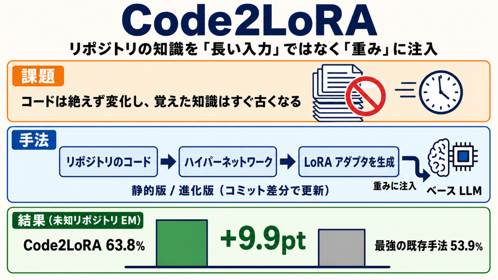

# リポジトリの知識を「長い入力」ではなく「重み」に注入する Code2LoRA

## この論文のひとことまとめ

コードを書く AI に、対象プロジェクトの作法やライブラリの知識をどう教えるかは難しい問題です。この論文は、その知識を毎回「長い入力文」として与える代わりに、リポジトリごとに専用の小さな調整部品（LoRA アダプタ）を自動生成してモデルへ組み込む手法 Code2LoRA を提案します。リポジトリのコードを入力すると、ハイパーネットワークと呼ぶ別のネットワークが 1 回の計算でそのアダプタを作り出します。静的なコードベース向けと、コミットのたびに差分で更新していく進化対応版の 2 形態を備え、専用ベンチマーク上で既存手法を上回りました。

## なぜこの研究が重要か

コードを補完する大規模言語モデル（LLM）は、import の解決、API の使い方、プロジェクト固有の命名規約など、そのリポジトリ全体に散らばった知識を必要とします。ところが現実のソフトウェアは絶えず変化します。コミットが入るたびに、いったん覚えさせた知識は古くなります。

この「知識をどう与え、変化にどう追従するか」という問いに、本論文は新しい角度から答えます。知識を入力トークンとして毎回与えるのではなく、モデルの重み（パラメータ）として注入し、しかもコードの進化に合わせて安く更新する、という発想です。これは、より低コストでカスタマイズ可能な AI コードアシスタントを作るうえでの土台になると著者らは位置づけています。

## 背景：何が問題だったのか

リポジトリの知識をモデルに与える既存手法は、大きく 2 つの方向に分かれます。どちらも一長一短があります。

1 つ目は、関連ファイルを「長い入力」として毎回モデルに渡す方式です。検索（RAG）や依存関係の解析で関連コードを集め、プロンプトの前に貼り付けます。ただしリポジトリの文脈は膨大になりがちで、LLM が一度に読める入力の長さ（コンテキスト窓）を圧迫し、検索の精度にも依存し、推論のたびにコストがかかります。

2 つ目は、リポジトリ単位でモデルや LoRA を学習し、知識をパラメータに押し込む方式です。一度学習すれば入力は短くて済みますが、学習コストが高く、進化するコードベースに対して脆いという欠点があります。コミットが入るたびにアダプタが古くなり、再学習が必要になります。

近年は、ハイパーネットワーク（hypernetwork）と呼ぶ、条件入力から別ネットワークの重みを生成するネットワークを使い、1 回の計算で凍結した LLM 向けの LoRA を作る研究も登場しています。ただし既存のものは短い自然言語のタスク記述や単一文書を対象に作られており、リポジトリが持つ長い文脈には対応できず、条件入力が固定的でコードの進化を追う仕組みも持っていませんでした。

## 提案手法：何をしたのか

本論文の中核は「リポジトリのコードを条件として、その場で LoRA アダプタを生成するハイパーネットワーク」です。著者らは設計を 2 つの軸で整理します。知識がどのようにパラメータへ入るか（how）と、いつ更新されるか（when）です。この整理のもとで 2 つの利用形態を実装します。

### 全体の構成

システムは 3 つの部品から成ります。

- **リポジトリエンコーダ（repository encoder）**: リポジトリ全体の文脈を 1 本の密ベクトルに圧縮する。
- **ハイパーネットワーク**: その埋め込みを LoRA の重みに変換する。
- **ベース LLM**: 生成されたアダプタを受け取って推論する。

このうち学習するのはハイパーネットワークだけです。リポジトリエンコーダとベース LLM は凍結（学習しない）したまま使います。学習は標準的な言語モデリングの損失で行います。

### リポジトリエンコーダ：コードを 1 本のベクトルに

リポジトリエンコーダは学習を必要としない 2 段階の埋め込みです。凍結した Qwen3-Embedding-0.6B というモデルを使います。

まずファイル単位（または差分単位）で、各ファイルを 4096 トークンのチャンク（512 トークン分を重ねる）に分割して埋め込み、平均をとって 1024 次元のファイルベクトルを得ます。次にリポジトリ単位で、各ファイルベクトルに重要度の重みを付けます。重みは、内容の特異性・ファイルサイズ・パスの重要度を組み合わせて決めます。最終的に、重み付き平均と最大値プール（max pooling、次元ごとに最大値を取って複数のベクトルを 1 本にまとめる操作）を連結した埋め込みを得ます。これらの埋め込みは学習時にあらかじめ計算しておきます。

### Code2LoRA-Static：静的スナップショット向け

静的版は、リポジトリの 1 つの埋め込みを 1 回の計算で LoRA アダプタに変換します。Transformer の各モジュール種別（q, k, v, o, gate, up, down の全 7 種）ごとに、共有の 2 層の多層パーセプトロン（MLP、層を重ねた小さなニューラルネットワーク）と専用の出力ヘッドで LoRA の行列を生成します。アダプタの大きさは学習可能なスケール係数で制御します。生成した LoRA はベース LLM の全層で共有して注入します。LoRA のランクは 16 で、ハイパーネットワークの学習可能パラメータは約 720M です。

近縁手法の Text2LoRA / Doc2LoRA とアーキテクチャは似ていますが、本手法は (1) タスク記述ではなく数百万トークンから要約した「リポジトリ全体の埋め込み」で駆動される点、(2) 一部のモジュールだけでなく全 7 種に LoRA を注入する点が異なります。

### Code2LoRA-Evo：進化に追従する

進化対応版は、コミットごとの差分の埋め込みを時系列順にまとめていく再帰型のハイパーネットワークです。集約には GRU という再帰ニューラルネットを使います。各コミットの差分埋め込みを取り込んで内部状態を更新し、その状態から静的版と同じ共有ヘッドで LoRA を生成します。こうして、リポジトリの一生にわたる「アダプタの軌跡（adapter trajectory）」が得られます。

ここが効率の鍵です。各更新はリポジトリ全体を再エンコードせず、保存済みの差分埋め込みに対する GRU 1 ステップだけで済みます。GRU と初期状態の射影器で約 25M のパラメータが加わり、合計で約 745M になります。著者らはこの GRU を「スナップショットの事前知識を置き換えるのではなく補強するもの」と位置づけています。

学習では、凍結したベース LLM のアサーション補完ペアに対するクロスエントロピー損失を最小化します。進化版は切断 BPTT（truncated backpropagation through time）で最適化し、内部状態を 16 ステップごとに切り離して勾配を止めます。バッチは「まずリポジトリを選び、その中から入出力ペアを選ぶ」順で構成し、データの多いリポジトリへの過適合を防ぎます。

## 結果：何が分かったのか

### 評価の土台：RepoPeftBench

著者らは評価用に RepoPeftBench という専用ベンチマークを整備しました。GitHub 由来の Python リポジトリ 604 件から成り、pytest または unittest を使い、寛容なライセンスで、最近の活動があるものを選んでいます。2025-04-01 を時間のカットオフとし、512 件を分布内、92 件を分布外（OOD、カットオフ後に作成されたリポジトリ）に分けています。

タスクはアサーション補完（assertion completion）です。テストコードのアサーションの期待値、つまり比較演算子の右辺や検証関数の最後の引数を予測します。分布内の 512 件は、学習に一切使わない未知リポジトリで評価する Cross-Repo（CR）と、学習に使うリポジトリ内で評価する In-Repo（IR）に分けます。さらに、1 つのスナップショットから抽出する Static トラックと、コミット履歴を再生して差分も保存する Evolution トラックの 2 系統で評価します。

評価には次の 3 つの指標を使います。Exact Match（EM、表記ゆれを吸収した緩い一致）、Edit Similarity（編集の類似度）、CodeBLEU（構文木やデータフローを加味した一致度）です。ベース LLM はすべての手法で共通して Qwen2.5-Coder-1.5B を使います。

### 静的なコードベースでの結果

Static トラックの Cross-Repo（未知リポジトリ）における EM では、Code2LoRA-Static が 63.8% を記録しました。最も強いベースラインである FFT+RAG（全パラメータ学習と検索の併用、53.9%）に対して 9.9 ポイント上回ります。検索や依存解析で文脈を入力に足す系統（RAG が 39.7%、依存解決済み文脈が 48.2%）も、ファインチューニング系統（全パラメータ学習が 51.4%、単一 LoRA が 47.4%）も下回りました。

興味深いのは、入力の与え方とターゲットの被覆を Code2LoRA に揃えて強化した Text2LoRA でも、同じ設定で 45.8% にとどまった点です。著者らはこれを、リポジトリレベル適応の弱点が Text2LoRA の LoRA 生成ヘッドにあることを切り分けた結果だと述べています。

In-Repo（学習に使ったリポジトリ内）では Code2LoRA-Static が 66.2% に達し、リポジトリ単位で個別に学習する Per-repo LoRA の上限（64.0%）に、リポジトリ単位の学習を一切せずに匹敵しました。

### 進化するコードベースでの結果

Evolution トラックでは、タスクが大きく難化します。素のベース LLM の Cross-Repo EM は 45.7% から 31.5% へ低下し、文脈を入力に足す系統は崩れ、RAG は素のモデルすら下回りました。

この難しい条件で Code2LoRA-Evo は Cross-Repo / In-Repo の両分割で最も高い 60.3% / 64.5% を記録しました。Cross-Repo では単一 LoRA（55.1%）に対して 5.2 ポイント上回り、In-Repo ではリポジトリ単位学習なしで Per-repo LoRA の上限（64.2%）を超えました。なお Code2LoRA-Static は同トラックで 55.7% / 60.6% にとどまり、コミット由来の入力では静的版が苦戦することも示されています。

### 分布外での結果と注意点

カットオフ後に作られた 92 リポジトリの OOD テストでは、Code2LoRA-Evo が 74.1% で最高でした。Code2LoRA-Static（72.2%）や単一 LoRA（72.3%）を上回ります。

ただし著者らは注意点も明記しています。OOD のアサーションは予測対象が系統的に短く（中央値 7 文字に対し、CR/IR テストは 12〜13 文字）、これが EM のスコアを全体的に押し上げています。そのため比較はこの表の中だけにとどめるべきだとし、その上で Code2LoRA-Evo が次点のアダプタ系統を約 1.8 ポイント上回り、Edit Similarity や CodeBLEU でも一貫していると述べています。

## 意義と限界

この研究の意義は、リポジトリの知識を「長い入力文脈」として与えるより、「パラメータとして注入し、ソフトウェアの進化を追って更新する」ほうが良い、という主張を専用ベンチマークで裏づけた点にあります。推論時に文脈トークンを追加で消費しないため、入力長やコストの問題を避けられます。著者らは Code2LoRA を、より強力で低コストな AI コードアシスタントの構成要素と位置づけています。

一方で、論文は次の限界も率直に認めています。

- **評価範囲が限定的**: Python リポジトリのみ、凍結したバックボーン 1 種（Qwen2.5-Coder-1.5B）、下流タスクもアサーション補完 1 種に限られます。原理的には言語・タスクに依存しない設計ですが、他言語・他モデル・他タスクへの実証は今後の課題です。
- **OOD のスコアの押し上げ**: 74.1% という OOD の EM は、予測対象が短いことで部分的に高く出ている可能性があり、著者らは OOD 内での比較（約 1.8 ポイント差）を強調しています。
- **指標の表層性**: Exact Match は機能的な等価性を見落とします。Edit Similarity や CodeBLEU、一部での実行プローブで補っていますが、全生成物を実行して意味的に評価することは計算予算の都合で範囲外です。
- **モデルサイズ**: 学習可能パラメータの大半をハイパーネットワークが占めます（静的版で約 720M、進化版で約 745M）。知見は 1.5B 規模で最も直接的に裏づけられており、はるかに大きなモデルで再帰的な集約が必要十分かは未解決です。

また著者らは潜在的なリスクにも触れています。private なリポジトリを入力した際に、学習リポジトリのアサーションが逐語的に表面化すると帰属の問題が生じうるため、ライセンスを考慮したフィルタや人手レビューなしの本番運用の安全性は主張しないとしています。コードと RepoPeftBench、ハイパーパラメータは採択後に公開予定です。

## まとめ

Code2LoRA は、リポジトリの知識を毎回の入力ではなく LoRA アダプタの重みとして注入し、それをハイパーネットワークで自動生成する手法です。静的版と、コミット差分で安く更新する進化版を備え、専用ベンチマークで既存手法を上回りました。ソフトウェアの絶え間ない変化に追従しながら、推論コストを抑える方向性を示した研究といえます。

## 用語集

- **LoRA（Low-Rank Adaptation）**: モデルの重みの更新を低ランクの行列に分解し、少ないパラメータで効率よくモデルを適応させる手法。本論文ではベース LLM の重みに加える形で注入します。
- **ハイパーネットワーク（hypernetwork）**: 条件となる入力信号から、別のネットワークのパラメータを生成するネットワーク。本論文ではリポジトリの埋め込みから LoRA の重みを生成します。
- **リポジトリレベル文脈（repository-level context）**: import や API、プロジェクト固有の規約など、コード補完に必要なリポジトリ全体に散らばった知識のこと。
- **推論時トークンオーバーヘッドゼロ（zero inference-time token overhead）**: 知識を入力トークンとして毎回与えず重みに注入するため、推論時に文脈トークンを追加で消費しないこと。
- **アサーション補完（assertion completion）**: テストコードのアサーションの期待値を予測するタスク。本ベンチマークの評価タスクです。
- **Cross-Repo（CR）/ In-Repo（IR）**: 未知のリポジトリへの汎化を測る分割（CR）と、学習に使ったリポジトリ内で評価する分割（IR）。
- **OOD（out-of-distribution、分布外）**: 時間のカットオフ後に作成された 92 リポジトリによる、時間的な保留テスト。
- **GRU**: 進化版が時系列のコード差分埋め込みをまとめるのに使う再帰ニューラルネット。各コミットで内部状態を更新します。
- **アダプタの軌跡（adapter trajectory）**: コミット履歴に沿って内部状態が更新されることで得られる、リポジトリの一生にわたる LoRA アダプタの時系列。
- **切断 BPTT（truncated backpropagation through time）**: 進化版の学習で、内部状態を一定ステップごとに切り離して勾配を止める最適化手法。

## 原論文

- Code2LoRA: Hypernetwork-Generated Adapters for Code Language Models under Software Evolution（https://arxiv.org/abs/2606.06492）
