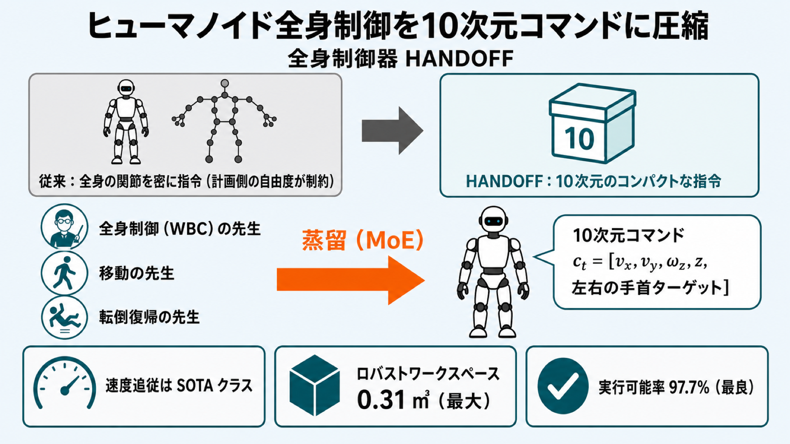

# ヒューマノイドの「指示の出し方」を10次元に圧縮する：3人の先生から学ぶ全身制御器 HANDOFF



## この論文のひとことまとめ

ヒューマノイド（人型ロボット）に動作を指示するとき、従来は全身の関節角度を細かく流し込む必要がありました。この論文が提案する HANDOFF は、その指示をわずか 10 次元のコンパクトなコマンドに置き換えます。さらに、得意分野の異なる 3 つの専門家（teacher）方策の知識を 1 つの制御器へ蒸留（distillation）することで、速度追従と操作範囲の両立を実現しました。実機の Unitree G1 で最先端（SOTA）並みの性能を示し、タスクごとのデータ収集や制御器の再調整なしに、自然言語による指示の実行までデモしています。

## なぜこの研究が重要か

人型ロボットを実世界で動かすうえで、意外に見落とされがちな設計判断があります。それは「上位の計画（プランナ）が下位の全身制御器に、どんな形で指示を渡すか」というインターフェースの選び方です。

人間は何かを取るとき、自分の関節の角度を逐一意識しません。「コーヒーを見つけて、近づいて、手を伸ばして、掴む」といった粗い目標（サブゴール）を立て、歩行やバランス維持は無意識の反射に任せます。ところが既存のロボット制御では、上位の計画側が全身の関節の動きを密に指定しなければならないことが多く、計画側の自由度が大きく制約されていました。

このインターフェースをコンパクトかつ汎用的にできれば、計画側を人間・幾何的なプランナ・VLM（Vision-Language Model、画像と言語を扱うモデル）など好きなものに差し替えられます。HANDOFF はまさにそこを狙った研究です。

## 背景：何が問題だったのか

現在の高性能な全身制御器（whole-body controller, WBC）の多くは、動作追従（motion-tracking）という方式を採ります。これは、制御器が動くたびに「全身の関節がこの瞬間にどうあるべきか」という密な参照軌道（dense full-body kinematic reference）を計画側に要求するものです。

この参照軌道を用意するには、次のような手間のかかるパイプラインが必要でした。

- 人間の遠隔操作（テレオペレーション）やモーションキャプチャでデータを集める
- それを特定のロボットの体格に合わせて変換する（retargeting）
- 動的に実現可能なフレームだけを選ぶフィルタリングを行う

新しいスキルやタスクの変種が増えるたびにこの手順を繰り返す必要があり、結果として計画側は「特定のデモ集を再生するだけのエンジン」に縮こまってしまいます。

論文は、理想的なコマンド空間が満たすべき性質を 4 つ挙げています（原文の表現）。

- **intuitive（直感的）**：人間でも幾何プランナでも VLM でも、有効なコマンドを出せる
- **general（汎用的）**：1 つのインターフェースで多様な移動＋操作（loco-manipulation）タスクに対応できる
- **modular（モジュラー）**：計画・知覚・制御が分離し、独立に交換できる
- **whole-body expressive（全身表現的）**：コンパクトな指示でも協調した全身動作を引き出せる

既存研究にはこれらを同時に満たせないトレードオフがありました。動作追従系は表現力のために密で制御器固有の指示を求め、上半身と下半身を分けた系（split-architecture）は移動コマンドこそコンパクトでも腕は関節ごとの指定を求め、潜在行動を使う系（latent-action）は計画側のモジュール性を犠牲にします。

## 提案手法：何をしたのか

### 中核：10 次元のコマンド

HANDOFF の制御器が受け取る指示は、次の 10 次元のベクトル 1 本だけです。

```
c_t = [v_x, v_y, ω_z, z, p^P_L, p^P_R]
```

各成分の意味は以下のとおりです。

- `v_x, v_y, ω_z`：平面上の進行速度（前後・左右）とヨーレート（向きを変える回転速度）（合わせて 3 次元）
- `z`：指令するルート高さ（root height、腰の高さに相当するスカラ値、1 次元）
- `p^P_L, p^P_R`：骨盤を基準とした座標系（pelvis-frame）での左右の手首ターゲット（各 3 次元、合わせて 6 次元）

うまくできているのは、各成分が異なる計画系統に対応している点です。移動を担う部分は `(v_x, v_y, ω_z)` を、把持を担うプランナは手首ターゲット `p^P_L/R` を、しゃがみやリーチのヒューリスティックは `z` を出せばよい構造になっています。

そして、同じ 10 次元のベクトルから多彩な全身動作が合成されます。例えば、低い `z` と前方の手首ターゲットを組み合わせれば「しゃがんで手を伸ばす（squat-and-reach）」協調動作が、ベース速度が非ゼロの状態で左右非対称の手首ターゲットを与えれば「歩きながら片手を伸ばす（reach-while-walking）」動作が引き出せます。

### 3 人の相補的な「先生」

10 次元という小さな指示で豊かな全身動作を実現するため、論文は得意分野の異なる 3 つの専門家（teacher）方策を用意しました。

1. **全身制御（WBC）の動作追従 teacher**：29 関節（29-DoF）を扱い、人間の動作クリップを変換したデータ上で強化学習（PPO、Proximal Policy Optimization。強化学習で広く使われる方策最適化アルゴリズム）で学習します。姿勢・リーチ・しゃがみ・両手協調の強い「型」を持ちますが、移動がデータに固定されるため、純粋な速度追従器としては不安定です。
2. **移動（locomotion）teacher**：脚と腰だけの 15 関節（body-slice）に絞り、平地で速度・角速度の追従を学習します。腕は別データで動かしながら学習させ、後の蒸留時に腕の動きで重心がずれても崩れないよう備えます。
3. **転倒復帰（fall-recovery）teacher**：29 関節を Adversarial Motion Prior（AMP、判別器を使って動作スタイルを模倣させる手法）で学習します。移動と「転んで起き上がる」シーケンスを混ぜて訓練し、転倒からの復帰能力を担います。

ここで重要なのは、転倒復帰のような能力は、専門の先生から蒸留しない限りそもそも生徒に存在しないという点です。

### 動的に無理な姿勢を直す安全フィルタ

人間の動作を変換した生データには、ロボットにとって物理的に実現不可能なフレーム（特にしゃがみ）が混じります。論文は学習前に、静的な圧力中心（center of pressure, CoP）の余裕に対する CBF（Control Barrier Function、安全制約を満たすための関数）による補正をかけてこれを直します。同じフィルタを推論時にも適用し、しゃがみ動作を改善しています。

### 3 人の知識を 1 人の生徒へ蒸留する

最終的に欲しいのは、3 人ではなく 10 次元コマンドで動く 1 つの制御器です。そこで、生徒（student）方策に 3 人の知識を蒸留します。

生徒は 10 次元コマンドと過去のセンサ履歴を観測し、Mixture-of-Experts（MoE、複数のエキスパートをゲートで切り替え・混合する構造）のヘッドから 29 関節の動作を出力します。teacher ごとにエキスパートを 1 つ（合計 3 つ）割り当て、ソフトに混合（soft routing）することで微分可能性を保ち、切り替えが二極化するアーティファクトを避けています。

蒸留の肝は、**状況に応じてどの先生がどの部分を教えるかを切り替える**点です。動作を脚＋腰（body slice）と腕（arm slice）に分け、指令速度の大きさと「復帰中か」を表す信号で監督を振り分けます。

- 脚＋腰：指令速度が小さい（0.1 m/s 未満）ときは WBC teacher に、大きいときは移動 teacher に重みを移す、連続的な混合で監督する
- 腕：基本は WBC teacher が監督する
- 転倒復帰中：fall-recovery teacher が動作全体の監督を引き受ける

この設計のうれしいところは、**新しい先生を追加するのが「エキスパートを 1 つとゲート付きの損失項を 1 つ足すだけ」で済む**拡張性です。

### 上位のエージェント的プランナ

制御器の上には、10 次元コマンドさえ出せれば何でも載せられます。論文は一例として、自然言語の指示を細かいタスクに分解する高レベル推論器、画像から目標位置を割り出す VLM、目標付近で手首ターゲットと高さを出すスキル選択器を組み合わせ、最終的に 10 次元コマンドの流れを蒸留制御器へ送る構成を示しています。

## 結果：何が分かったのか

評価は主に 2 つの軸で行われました。1 つは速度追従の精度（指令と実現のベース速度の平均絶対誤差 `|∆v|`、小さいほど良い）、もう 1 つは操作のしやすさを表す「ロバストワークスペース（Robust WS）」です。後者は、到達でき、かつ転倒せず安定を保てる実効的な体積（m³、大きいほど良い）として定義されます。

### 段階的な改良（アブレーション）

単純な単一の先生から出発し、要素を足すごとに性能が改善する様子が示されています（Table 2a より抜粋、`|∆v_x|`／`|∆v_y|`／`|∆ω_z|`／Robust WS の順）。

- 動作追従 teacher 単独：0.29／0.43／0.08／0.20（全軸で最も弱い）
- ＋移動 teacher を追加：0.14／0.25／0.09／0.31（速度追従が最も大きく改善）
- ＋コマンドのランダム化：0.14／0.13／0.05／0.29（横方向の速度ギャップが縮小）
- ＋分割 KL ＋ MoE（提案手法）：0.07／0.14／0.04／0.27
- ＋安定性報酬：0.07／0.18／0.04／0.31（ワークスペースを 0.31 m³ まで押し上げ）

このように、複数の先生をうまく調停することで、単一の先生では届かなかった速度追従と操作範囲の両立が達成されています。

### 既存手法（SOTA）との比較

公平を期すため、比較対象の各ベースラインには、手首の目標位置から各腕関節の角度を逆算して指令に変換する逆運動学（inverse kinematics, IK）ベースのアダプタ（differential IK）を付け、同じインターフェースで比べています（Table 2b より抜粋、`|∆v_x|`／`|∆v_y|`／`|∆ω_z|`／実行可能率 Feas.(%)／Robust WS の順）。

- FALCON：0.07／0.10／0.07／35.5%／0.06
- OpenHomie：0.06／0.12／0.10／62.9%／0.15
- AMO：0.06／0.19／0.01／80.9%／0.22
- SONIC：0.03／0.15／0.02／89.8%／0.26
- 提案手法（Ours）：0.07／0.14／0.04／87.1%／0.27
- 提案手法＋安定性（Ours + Stab.）：0.07／0.18／0.04／**97.7%（最良）**／**0.31（最大）**

論文の主張は、強力なアダプタを付けた既存手法と比べても、HANDOFF の速度追従は全軸で SOTA クラスタの中に収まりつつ、最大のロバストワークスペース（0.31 m³）を提供できる、というものです。安定性報酬を加えた版は実行可能率でも最良（97.7%）でした。

### 実機での展開

実機は 29 関節の Unitree G1 で、オンボードの RGB-D カメラ（ZED-M）と計算機（Nvidia Jetson Thor）を搭載し、ローカルの VLM と ChatGPT API の両方を利用します。pick-and-place（掴んで置く）、pick-transport-place（掴んで運んで置く）、squat-pick（しゃがんで掴む）、両手で掴んで手渡す（bimanual pick-and-hand-off）など複数のタスクをテストしました。

特筆すべきは、これらのタスク間で**制御器側の変更・追加のデータ収集・モデルの再調整（fine-tuning）が一切不要**だったことです。シミュレーションでは、転倒から復帰した後に同じ 10 次元コマンドの流れのままタスクを継続できることも示されました。これは復帰専門の先生を蒸留したからこそ可能になっています。

## 意義と限界

HANDOFF が示したのは、「移動＋操作タスクを表現できるほど豊かで、かつ多様な計画側が全身の関節指令を出さずに駆動できるほど小さい」コンパクトな 10 次元インターフェースを、現実的な性能とともに作れるということです。

論文は、単一の先生から生徒を作る素朴な蒸留ではこれがうまくいかないことも強調しています。動作追従の先生は表現力ある姿勢を与える代わりに速度追従が劣化し、移動の先生は速度は追えても全身協調を失います。両者を状況依存の蒸留で調停した点が貢献です。

一方で、論文は次の限界も認めています。

- **手首位置のみの指示**：インターフェースが扱うのは骨盤基準の 3 次元手首位置であり、グリッパの向きまで含む完全な 6 次元姿勢ではありません。向きのずれは実行時の補正で扱いますが、直接の 6 次元追従は今後の課題です。
- **限られた知覚**：頭部に固定した単一の RGB-D カメラを使うため、視野が前方に制限されます。可動式の頭部や手首カメラは今後の課題です。
- **専門家のカバー範囲**：先生の集合は広いものの網羅的ではなく、地形・接触・重荷重などの専門家は今後プラグインで追加する予定としています。

なお著者は、フルフレームワークをオープンソース化する予定としています。

## まとめ

HANDOFF は、ヒューマノイドへの指示を 10 次元のコマンドに圧縮し、得意分野の異なる 3 つの先生方策を状況依存の MoE 蒸留で 1 つの制御器にまとめた研究です。これにより SOTA 並みの速度追従と最大級の操作範囲を両立し、タスクごとの再調整なしに自然言語タスクの実行まで実機で示しました。計画と制御の「つなぎ目」を設計し直すという視点が、人型ロボットの実用化に向けた示唆を与えています。

## 用語集

- **全身制御器（whole-body controller, WBC）**：上位の指示に従い、ロボットの全関節を協調して動かす下位の制御器。
- **コマンド空間／インターフェース**：タスク計画と全身制御をつなぐ指示の形式。本論文の中心的な設計対象。
- **10 次元コマンド**：平面速度・ヨーレート・ルート高さ・左右の骨盤基準手首ターゲットからなるコンパクトな指示ベクトル。
- **多教師 KL 蒸留（multi-teacher KL distillation）**：複数の専門 teacher の出力分布へ、KL ダイバージェンスで生徒方策を近づける学習。
- **Mixture-of-Experts（MoE）**：teacher ごとに 1 つのエキスパートを持ち、ゲートで切り替え・混合する構造。本論文ではソフトな混合を採用。
- **AMP（Adversarial Motion Prior）**：判別器を使って動作のスタイルを模倣させる報酬。転倒復帰 teacher の学習に使用。
- **CoP（center of pressure）フィルタ**：圧力中心の余裕に対する CBF 射影で、動的に実現不可能な動作フレームを補正する安全フィルタ。
- **ロバストワークスペース（Robust WS）**：到達でき、かつ安定を保てる実効的なワークスペース体積（前方半空間に限定）。
- **VLM（Vision-Language Model）**：画像と言語を扱うモデル。10 次元インターフェースの上位層として想定される。

## 原論文

- HANDOFF: Humanoid Agentic Task-Space Whole-Body Control via Distilled Complementary Teachers（https://arxiv.org/abs/2606.06493）
