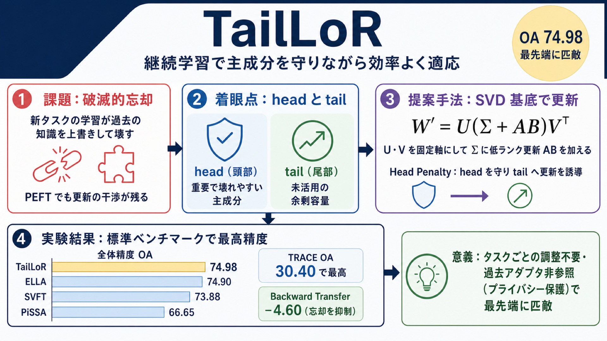

# TailLoR：継続学習で「壊れやすい主成分」を守りながら効率よくモデルを適応させる

## この論文のひとことまとめ

大規模言語モデルを次々と新しいタスクに適応させていくと、過去に覚えたことを忘れてしまう「破滅的忘却（catastrophic forgetting）」が起こります。本論文は、事前学習済みの重み行列を特異値分解（SVD）で分解し、その「重要な方向」への更新だけをソフトに抑え込みながら、更新を「あまり使われていない方向」へ誘導する手法 TailLoR を提案しました。タスクごとの調整を必要とせず、継続学習の標準ベンチマークで最先端手法に匹敵またはそれを上回る結果を示しています。

## なぜこの研究が重要か

大規模言語モデル（LLM）を実際の業務で使うとき、新しいドメインや新しいタスクへ次々と適応させたい場面はよくあります。しかし全パラメータを学習し直す通常の fine-tuning では、数十億のパラメータを更新する必要があり、計算コストもメモリコストも非常に高くつきます。

そこで近年は、ごく一部のパラメータだけを更新する「パラメータ効率的なファインチューニング（PEFT, Parameter-Efficient Fine-Tuning）」が広く使われています。ただし、複数のタスクを順番に学んでいく「継続学習（continual learning）」の設定では、新しい更新が過去に学んだ知識を上書きして壊してしまう問題が残っていました。

この研究は、その「壊れやすさ」を、モデルの重みが持つ数学的な構造に着目してうまく回避しようとする点に新しさがあります。過去のタスクの情報を保持しておく必要がない設計のため、プライバシーの観点でも扱いやすいという利点があります。

## 背景：何が問題だったのか

PEFT の代表格が LoRA（Low-Rank Adaptation）です。これは、タスク固有の更新は「低次元の小さな空間」に収まるという知見に基づき、事前学習済みの重みを固定したまま、2 つの小さな学習可能行列で更新を表現します。これにより更新するパラメータ数を大きく減らせます。

さらに、事前学習済みの重み行列を特異値分解（SVD, Singular Value Decomposition）で分解し、その構造に沿って更新を当てはめる手法群（PiSSA・MiLoRA・SVFT など）も登場しました。重みの構造に更新を合わせることで、より効率よく適応できると期待されたためです。

ただし、こうした低ランクの適応には共通の弱点があります。更新方向どうしが重なり合うことによる「干渉（interference）」です。特に複数のドメインや逐次的なタスクへ適応する継続学習では、この干渉が破滅的忘却を引き起こします。

ここで鍵になるのが、重み行列の「最大特異値」に対応する方向です。これはその行列のもっとも重要な構造的表現をエンコードしており、この部分空間を不用意に書き換えると、過去の知識が不釣り合いに大きく劣化してしまいます。つまり、闇雲に更新するのではなく、重要な方向を守る仕組みが必要だったのです。

## 提案手法：何をしたのか

本論文が提案する TailLoR の中核は、更新を「重みの標準的な座標」ではなく「スペクトル基底（特異ベクトルの方向）」の中で表現する、という発想です。

具体的には、重み行列 W を SVD によって W = UΣVᵀ と分解します。ここで U と V は特異ベクトルからなる行列、Σ は特異値を並べた対角行列です。TailLoR は、この U と V を固定された「参照フレーム（座標軸）」として使い、真ん中の特異値の部分にだけ低ランクの更新を加えます。更新後の重みは次のように構成されます。

- W' = U(Σ + AB)Vᵀ

ここで A と B が学習する小さな低ランク行列です（ランク r は行列の次元よりずっと小さく設定します）。つまり、学習している間ずっと、更新は元の SVD の方向に対して表現され続けます。

この発想の土台にあるのが、次の仮説です。

- 上位の特異ベクトル（"head"＝頭部）は、タスクをまたいで共有される基盤的な表現をエンコードしている。
- 小さい特異ベクトル（"tail"＝尾部）は、まだ活用されていない余剰の容量を表している。

そこで TailLoR は、頭部への更新を選択的に抑え、尾部へ更新を誘導します。これを実現するのが「Head Penalty（頭部ペナルティ）」と呼ぶソフトな正則化です。仕組みを順に追うと次のようになります。

- まず特異値を降順に並べ、最大値で割って正規化します（˜σ = σ/σmax）。
- 次にペナルティ行列を Ω_{i,j} = max(˜σ_i, ˜σ_j)^γ と定義します。γ はペナルティの強さの勾配を制御するハイパーパラメータです。これにより、大きな特異値が関わる成分ほど強く罰せられ、尾部へ向かうにつれて圧力が弱まります。
- ペナルティ全体の大きさが一定になるよう質量正規化（mass normalization）を施し、平均的な重みが 1.0 になるよう調整した正規化ペナルティ行列 ˜Ω を得ます。
- 最後に、この ˜Ω で重み付けしたアダプタ更新（AB）の大きさを測る正則化損失 L_reg を、本来のタスク損失に加えて学習します。

注目すべき特徴は、TailLoR が過去のタスクで作ったアダプタにアクセスする必要がない点です。既存の継続学習向け PEFT 手法（ELLA や O-LoRA など）の多くは、過去のアダプタや活性化の履歴を参照しますが、TailLoR は不要です。これにより、異なるユーザーが順番に適応していくような状況でも、各ユーザーのタスク固有パラメータや学習データのプライバシーを保てます。また、勾配を特定方向へ射影するようなハードな手法ではなく、LoRA の枠組みの中でソフトなスペクトル正則化を加えるだけで同様の保護を実現します。

## 結果：何が分かったのか

実験は、T5-large というモデルの query / value 射影部分をファインチューニングする設定で行われました。各タスクは 1 エポック、ランクは r = 8 です。TailLoR は全タスクに共通する単一のペナルティ重み λ と指数 γ を固定して使う一方、比較対象の ELLA は元の手順に従いタスクごとに係数を個別最適化しています。結果はいずれも 3 つのシードでの平均値です。

3 つの継続学習ベンチマーク（Standard CL、Long Sequence、TRACE）で評価した主な数値は次のとおりです。

- **Standard CL と Long Sequence（全体精度 OA, 3 シード平均）**: 頭部ペナルティ版の TailLoR (head) は全体 OA で **74.98** を記録し、最高値でした。タスクごとの調整を行う最先端手法 ELLA の 74.90 と並ぶ、または上回る競争力ある結果です。他のベースラインは SVFT 73.88、PiSSA 66.65、MiLoRA 63.03、IncLoRA 59.25、EWC 46.36 でした。
- **TRACE（各タスク 500 サンプル, 3 シード平均）**: TailLoR (head) は全体精度 **30.40** で最高を達成しました。Backward Transfer（過去タスクへの影響を測る指標）は -4.60 で、ELLA の -10.53 や MiLoRA の -13.98 と比べて忘却の度合いが小さく抑えられています。

著者らは、TailLoR (head) がタスク固有のハイパーパラメータ調整を要さずに、最先端の部分空間分割手法 ELLA と「highly competitive（高い競争力をもつ）」結果を達成したと述べています。

さらに、ペナルティの種類を変えるアブレーション（頭部 / 尾部 / 一様の比較）も行われました。頭部ペナルティが最も良く、すべての方向を同じに扱う「一様（uniform）」ペナルティは性能が落ちました。これは、主要な特異方向を過度な更新から守り、適応を構造的に尾部へ誘導することが効率的な継続学習につながる、という直観を裏づけています。

加えて、スペクトルがどれだけ活用されているかを測る「実効ランク（Roy-Vetterli effective rank, R_eff）」の推移も調べられました。頭部ペナルティは学習が進むにつれて実効ランクを一貫して増やしていく一方、尾部ペナルティでは更新が既に優勢な頭部成分に閉じ込められ、実効ランクはほぼ停滞しました。ELLA は干渉自体は抑えますが、重み行列の幾何を無視するため、実効ランクの伸びは平坦なままでした。

## 意義と限界

本論文の貢献は、継続学習における表現の干渉を、重み行列の幾何（SVD が定める方向）に基づいて緩和する「幾何学的に意識した（geometrically aware）」低ランク適応を示したことです。重要な事前学習知識を保持するだけでなく、ネットワークの実効的な容量を能動的に増やしながら、明示的な重み分割やタスクごとの調整なしに最先端手法に匹敵する結果を得ています。過去タスクのアダプタを参照しない設計のため、ユーザー間の逐次適応とプライバシー保護を両立できる点も実用的な利点です。

一方で限界もあります。本論文の本文には「Limitations（限界）」として独立した節は見当たりません。読み取れる範囲では、評価は T5-large というバックボーン、ランク r = 8、各タスク 1 エポックという設定に限られています。より大規模なモデルや異なる設定でどこまで一般化するかは、本論文の記述からは明らかではありません。

## まとめ

TailLoR は、事前学習済み重みを SVD で分解し、その「重要な方向（頭部）」への更新をソフトに罰しながら、更新を「未活用の方向（尾部）」へ誘導することで、継続学習の破滅的忘却を緩和する PEFT 手法です。過去のタスク情報を参照せずに、タスクごとの調整なしで最先端手法に匹敵する精度を達成した点が要点です。

## 用語集

- **PEFT（Parameter-Efficient Fine-Tuning）**: 大規模事前学習モデルを、ごく一部のパラメータだけ更新して適応させる手法群。
- **LoRA（Low-Rank Adaptation）**: 事前学習重みを固定し、2 つの学習可能な低ランク行列で更新を表す代表的な PEFT 手法。
- **SVD（特異値分解, Singular Value Decomposition）**: 重み行列 W を W = UΣVᵀ に分解する手法。U・V は特異ベクトルからなる行列、Σ は特異値を並べた対角行列。
- **継続学習（continual learning）／破滅的忘却（catastrophic forgetting）**: タスクを順番に学びながら過去の知識を保つ枠組みと、その逆に過去の知識が失われてしまう現象。
- **head／tail（スペクトルの頭部・尾部）**: 上位の特異ベクトル群（head＝タスク横断で共有される基盤表現）と、小さい特異ベクトル群（tail＝未活用の容量）。
- **Head Penalty（頭部ペナルティ）**: 主成分への更新を集中的に罰するソフトな正則化。Ω_{i,j} = max(˜σ_i, ˜σ_j)^γ で定義される。
- **実効ランク（Roy-Vetterli effective rank, R_eff）**: R_eff = Σ_i σ_i / σmax で定義され、値が高いほどスペクトルが平坦に活用されていることを表す指標。
- **Backward Transfer**: 新タスクの学習が過去タスクの性能に与える影響を測る指標。

## 原論文

- TailLoR: Protecting Principal Components in Parameter-Efficient Continual Learning（https://arxiv.org/abs/2606.06494）
