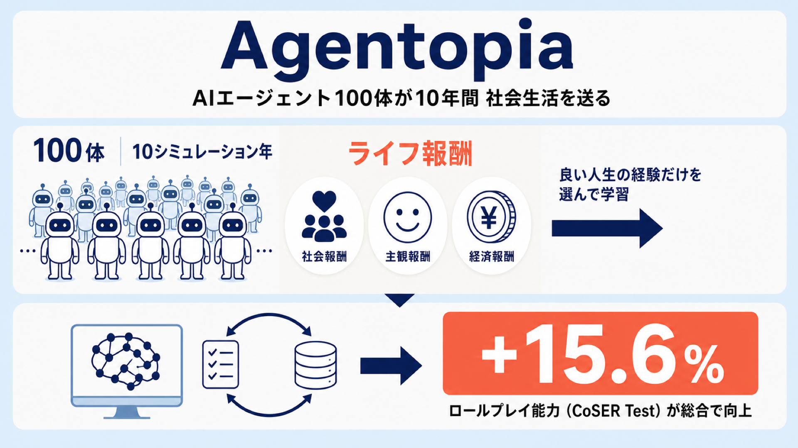

# AIエージェント100体が「10年間」社会生活を送る——生活から学ぶLLMの試み「Agentopia」

## この論文のひとことまとめ

大規模言語モデル（large language model、以下 LLM）で動くエージェント 100 体を、仮想世界の中で「10 シミュレーション年」にわたって自律的に生活させる長期ライフシミュレーション基盤 **Agentopia（エージェントピア）** を提案した研究です。著者らは、人間の幸福度（well-being）を写し取った **life reward（ライフ報酬）** という指標を定義し、その報酬が高かったエージェントの行動だけを選んで LLM を再学習させました。その結果、ロールプレイ能力を測る外部ベンチマークで総合 +15.6% の改善を達成しています。人間が用意したデータに頼らず、エージェント自身が「社会生活を送った経験」から学ぶ点が新しい試みです。

## なぜこの研究が重要か

現在の LLM は、人間が書いた大量のテキストから学んでいます。しかし、その人間データは枯渇に近づきつつあると指摘されています。そこで「人間データに頼らず、エージェント自身が経験から学べないか」という問いが重要になります（論文は Silver and Sutton, 2025 を引用しています）。

この研究は、その問いを「エージェントは、エージェント社会の中で生活を通じて学び・成長し、より人間らしくなれるか」という形で具体化しました。人間が一生の社会生活の中で人格や対人関係を育てていくように、AI エージェントにも長い「人生」を送らせ、その経験を学習に変えられるかを検証しています。

## 背景：何が問題だったのか

LLM エージェントに社会生活をさせる研究は、これまでにもありました。代表例が「Generative Agents」（Park et al., 2023）などのソーシャルシミュレーションです。ただし既存研究には、次のような限界がありました。

- **時間スケールが短い**：既存のソーシャルシミュレーションは「小麦を 2 個集めて小麦粉を 1 個作る」といった低レベルな操作（low-level operations）に LLM の呼び出しの大半を費やします。そのため、シミュレーションが進む期間は「日（days）」単位にとどまっていました。
- **ライフシミュレーションではない**：ペルソナを演じさせるロールプレイ研究は、個々の会話の中での演技に焦点があり、エージェント自身が長い人生を生きるものではありませんでした。さらに、その最適化は人間が用意したデータに強く依存し、収集コストが高く、規模を拡大しにくいという課題がありました。

つまり、これまでの研究は「日」または「単一の会話」というスケールにとどまり、年単位の長期ライフシミュレーションは未開拓でした。論文の比較表（Table 1）では、時間スケールが「年（Years）」に達するのは Agentopia だけだとされています。

## 提案手法：何をしたのか

Agentopia は、大きく分けて「シミュレーションの進め方」「エージェントの設計」「環境モデル」という 3 つの要素で構成されます。

### エージェントの設計

各エージェントは特定のペルソナ（人物像）を演じ、次の 3 つの情報を持ちます。

- **profile（プロフィール）**：背景となる物語、性格、才能、初期の職位や資産など。比較的安定した情報で、更新は年 1 回だけです。
- **social relationships（社会関係）**：友人・恋人・ライバルといった関係を、構造化されたデータではなく、相手ごとの**自由なテキストのメモ**として持ちます。これにより、あらゆる関係を統一的に扱えます。
- **dynamic states（動的状態）**：vitality（活力）、fulfillment（充足）、skills（スキル）、position（職位）、assets（資産）。fulfillment は心理学者マズローの欲求階層（Maslow, 1943）に基づき、気分・物質・社会・自尊の 4 次元から「主観的な満足度」を捉えます。この満足度は、人間が幸福にも次第に慣れてしまう「快楽順応（hedonic adaptation）」になぞらえて、毎週少しずつ自然に減衰します。

エージェントは、ファイルシステムを使った長期記憶（**memory files**）も持ちます。`read_file`・`update_file`・`list_files` といった関数を自分で呼び出し、何を覚え、何を捨てるかを自律的に決めます。誤って上書きしないよう、「更新する前にまず読む」という制約も課されています。

### 週単位で進む「人生」

シミュレーションの基本的な時間単位は **week（週）** です。LLM は一度に一手ずつ生成するため、ターン制の相互作用を前提に設計されています。低レベルな操作ではなく、抽象的な社会的なやり取りに焦点を当てることで、少ない LLM 呼び出しで豊かな社会行動を表現します。

各週は、次の 4 つのステージで進みます。

1. **Plan（計画）**：その週の目標や、お金をどれだけ使うか（生活水準）を決める。
2. **Contact（連絡）**：2 人の間でやり取りし、一緒に活動する予定を立てる。
3. **Activity（活動）**：実際に活動を実行する。
4. **Review（振り返り）**：週次の日記を書き、記憶を更新する。

さらに、各年の終わりには「プロフィールの更新」「新しい職位への応募（限られた空きを巡る競争）」「ライフ報酬の計算」という 3 つの処理が走ります。なお論文では、day・week・year は抽象的なシミュレーション時間の 3 階層であり、現実のカレンダーに厳密に対応するものではないと注記されています。

活動には、複数人が参加する **Joint Activity（共同活動）**、予定がないときの既定である **Solo Activity（単独活動）**、環境が用意する偶発的な **Encounter Activity（遭遇活動）**、共通の興味に基づく **Public Activity（公共活動）** の 4 種類があります。

### 環境モデル：ルールの代わりをするLLM

Agentopia の特徴的な仕組みが **environment model（環境モデル）** です。これは、ハードコードされたルールの代わりに働く、状態を持たない（stateless）LLM です。ある活動が実現可能かの判定、結果の評価、共同活動での次の話者の予測、偶発的な出会いの生成、職位応募者のランク付け、年末のプロフィール更新など、いわば「世界を動かすエンジン」の役割をすべて担います。

この上に、収入と支出を扱う経済システム、職位を扱う Position System、場所を扱う Location System が乗っています。Location System は、位置情報がないとエージェントが存在しない物や場所を捏造（hallucination）しやすかったために導入されました。

### life reward：人間の幸福を写した報酬

学習の鍵となるのが、人間の幸福度を写し取った **life reward（ライフ報酬）** です。マズローの欲求階層に基づき、次の 3 次元で定義されます。いずれもエージェントの自己申告ではなく、外部の環境が算定・推定する点が重要です。

- **Social Reward（社会報酬）**：社会的な地位を「他者からの評価」で測ります。心理学の Warmth-Competence モデル（Fiske et al., 2007）に基づき、affection（好意＝温かさ）と respect（尊敬＝有能さ）の 2 次元で各エージェントが互いを採点します。その評価を重み付き有向グラフにし、Web ページの重要度を測る **Weighted PageRank**（Page et al., 1999）の考え方で社会的地位スコアを計算します。さらに「自分が好意を寄せる相手から好意を返される」効果を強める補正（Mutual Affection Bonus）を加えます。
- **Subjective Reward（主観報酬）**：過去 1 年の fulfillment（気分・物質・社会・自尊の 4 次元）の履歴から計算します。各週・各次元で全エージェントの下位 25 パーセンタイルを下回るとペナルティが課されます。
- **Economy Reward（経済報酬）**：1 年間で預金がどれだけ増えたか（年末の預金 − 年始の預金）という客観的な財務上の利得です。

最終的なライフ報酬は、3 次元をそれぞれ z スコア（平均からのずれを標準化した値）で正規化し、重み付きで足し合わせて求めます。

### life reward training：良い経験だけを選んで学ぶ

このライフ報酬を使ってどう LLM を改善するかが **life reward training** です。1 エージェントは 1 年あたり数百回も LLM を呼び出し、1 回のシミュレーションは数十年規模になります。この超長期のホライズン（時間軸）では、強化学習の代表的手法である PPO のような end-to-end な学習は実行不可能だと著者らは指摘します。

そこで採用したのが **rejection sampling（棄却サンプリング）** です。考え方はシンプルで、報酬が高かった「優れた人生の軌跡」だけを選んで学習データに使う、というものです。具体的には次のように進めます。

- 各報酬期間で、advantage（後述）が上位 25% のエージェントを選び、その期間の全行動を学習データに含める。
- 不正な行動や、存在しないキャラを参照するような無効な応答を除外する。共同活動の応答は **16 個のロールプレイ原則** と照合し、違反したものは取り除く。
- 学習中に元の汎用能力を失う「破滅的忘却（catastrophic forgetting）」を防ぐため、汎用指示データに対するモデル自身の応答を **50:50** の比率で混ぜる。

ここでの advantage（アドバンテージ）は、各エージェントの「正規化した報酬の、前年からの伸び」で定義されます。他のエージェントとの絶対比較ではなく、各エージェント自身の過去と比べた改善を測ることで、もともと恵まれた初期条件のエージェントに学習が偏るのを防いでいます。

## 結果：何が分かったのか

著者らは、設定の異なる 3 つの世界——NYC のシェアハウス（The Apartment）、魔法学院（Arcane Academy）、中国の高校（The Campus、中国語で実行）——を用意しました。各世界は 100 エージェント・10 シミュレーション年です。エージェントと環境モデルの主モデルには Qwen3.5-397B-A17B を使い、無効な出力が出たときは Gemini 3 Flash にフォールバックして再生成しています。

### 長期シミュレーションで見えた傾向

100 エージェント × 10 年 × 3 世界の計 3,000 件の観測から、報酬の推移を分析しています。主観報酬と経済報酬は平均して上昇傾向を示す一方、社会報酬は相対的な順位に基づくため、おおむね安定していました。

報酬と行動の相関（Figure 4）からは、各報酬が何によって動いているかが読み取れます。たとえば社会報酬は「尊敬される・好かれる」といった評判の指標とほぼ専ら相関していました（相関係数 r = 0.68）。主観報酬は 4 つの充足次元——気分（r = 0.54）、物質（r = 0.73）、社会（r = 0.52）、自尊（r = 0.30）——に駆動され、ニーズが満たされないことによるペナルティが強い負の相関（r = −0.64）を示しました。経済報酬は預金の蓄積（r = 0.56）が主因でした。

### 学習による well-being の改善

次に、全 3 世界の最初の 4 年分のデータで Qwen3.5-397B-A17B を fine-tune（微調整）し、学習後のモデルを Qwen3.5-397B-Agentopia と呼んで、同じ世界設定で元のモデル（baseline）と比較しました。4 年平均の主な変化は次のとおりです（いずれも Table 2 の数値）。

- 経済報酬：1077 → 1104（+2.5%）
- 主観報酬：49.9 → 50.8（+1.8%）
- 尊敬された数（Respected By）：9.5 → 11.8（+24.2%）
- 好かれた数（Liked By）：6.9 → 8.0（+15.9%）

つまり、学習後のエージェントはより多くの仲間から尊敬・好意を得るようになりました。一方で、物質的な充足（Material Fulfillment）は 43.2 → 36.8（−14.8%）と低下しています。著者らは、経済報酬が消費よりも貯蓄を促した結果だと説明しており、現実の「消費か貯蓄か」のトレードオフを反映していると見ています。活動パターンにも変化があり、公共活動が増える一方、単独活動（−19.8%）やスキルの伸び（−29.6%）は減りました。報酬される行動へ誘導される反面、報酬されない行動は優先度が下がりうる、という観察です。

### 外部ベンチマークへの汎化

特に注目されるのが、ロールプレイ能力を測る下流ベンチマーク CoSER Test（Wang et al., 2025）での結果です。Qwen3-235B を審査役（judge）として 4 つの次元を評価したところ、Qwen3.5-397B-Agentopia の平均は **49.16** で、元の Qwen3.5-397B（42.51）を上回り、Claude-4.5-Sonnet（45.21）も上回りました。最も顕著だったのは Anthropomorphism（人間らしさ、+23.7%）と Character Fidelity（キャラクターへの忠実さ、+16.4%）で、全体では +15.6% の改善でした。

エージェント社会で「生活」させた経験が、別のロールプレイタスクの性能向上にもつながった、という点が本研究の一番の成果と言えます。

### 計算コスト

ただし、この規模のシミュレーションは安くありません。10 年のシミュレーション 1 回あたり、平均で約 137 億トークン、約 567,000 回の LLM 呼び出し、約 186 時間（実時間）を要しています。入力トークンが支配的で、ペルソナと記憶という重い文脈を反映しています。記憶が増えるほど計算が重くなり、これが長期シミュレーションの主要なボトルネックだと指摘されています。

## 意義と限界

この研究の意義は、ライフシミュレーションの時間スケールを「日」から「年」へ初めて拡張し、個人の成長・関係の構築・人生設計といった長期の社会ダイナミクスを扱えるようにした点にあります。さらに、人間データに頼らず、ライフ報酬によって LLM を最適化できることを示しました。

一方で、著者らは次のような限界も率直に認めています。

- **ターン制という設計**：一手ずつ生成する LLM に基づくため、人間のリアルタイムな知覚・反応とは根本的に異なります。
- **hallucination（捏造）**：テキスト生成ベースのため、存在しないキャラや場所を作り出しやすい傾向があります。各種の対策で緩和はしていますが、完全な排除は未解決です。
- **環境と数値システム**：事前に定義した数値システムと生成的な環境を、現実社会と完全に整合させるのは極めて困難です。
- **最適化とアライメント**：ライフ報酬が人間の well-being と完全に一致する保証はありません。また Agentopia は本質的に「人間社会」ではなく「エージェント社会」であり、すべてのフィードバックが他の AI モデル由来です。学習した LLM が人間の認知・心理パターンと整合できるかは、未解決の問いとされています。
- **計算コスト**：コストが高く、より多くの世界・エージェント・長い時間軸での実験や、別系統のモデルでの学習は実施できていません。

なお、CoSER Test では Claude 4.5-Opus（平均 62.43）や Gemini 3-Pro（61.80）が Qwen3.5-397B-Agentopia（49.16）より上位にあります。本研究が主張しているのは、あくまで元の Qwen3.5-397B および Claude-4.5-Sonnet に対する優位である点には注意が必要です。また著者らは、すべてのキャラクターと世界は架空であり、実在する個人を表すものではないと明記しています。

## まとめ

Agentopia は、LLM エージェント 100 体に年単位の社会生活を送らせ、その経験から定義した「ライフ報酬」を使って LLM 自身を改善する枠組みです。人間データに頼らずにロールプレイ能力を +15.6% 高めた点が成果ですが、計算コストの高さや、エージェント社会から学んだものが人間とどこまで整合するかという根本的な課題も残されています。

## 用語集

- **LLM（大規模言語モデル）**：大量のテキストで学習し、文章を生成する AI モデル。本研究のエージェントと環境モデルの中核。
- **life reward（ライフ報酬）**：人間の幸福度を写した報酬指標。社会・主観・経済の 3 次元を正規化して重み付きで合算する。
- **life reward training**：ライフ報酬が高かった「優れた人生の軌跡」だけを選んで LLM を学習させる手法（棄却サンプリングに基づく）。
- **environment model（環境モデル）**：ハードコードのルールの代わりに、活動の判定や結果評価、活動生成などを担う状態を持たない LLM。
- **memory files**：エージェントが関数呼び出しで自律管理する、ファイルシステムベースの長期記憶。
- **dynamic states（動的状態）**：活力・充足・スキル・職位・資産から成る、エージェントの変化する状態。充足はマズローの欲求階層に由来し毎週減衰する。
- **advantage（アドバンテージ）**：各エージェント自身の過去と比べた報酬の伸び。学習データを選ぶ基準。
- **CoSER Test**：古典文学のシナリオを使ってロールプレイ能力を測る下流ベンチマーク。本研究では性能評価に使用。

## 原論文

- Agentopia: Long-Term Life Simulation and Learning in Agent Societies（https://arxiv.org/abs/2606.07513）
