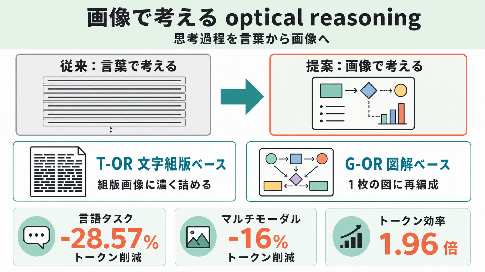

# 考えるのに「言葉」はいらない？ 画像を推論の媒体にする optical reasoning

## この論文のひとことまとめ

大規模言語モデルの推論は、これまで「途中の考え（思考過程）を言葉で書き出す」やり方が主流でした。この論文は、その途中の考えを**画像として表現し、画像そのものを推論の媒体にする** optical reasoning（光学的推論）を提案します。言葉で考える従来手法と同等以上の精度を保ちつつ、言語タスクで推論トークンを平均 28.57%、マルチモーダルタスクで 16% 削減し、トークンあたりの効率では 1.96 倍を達成したと報告しています。

## なぜこの研究が重要か

近年の言語モデルは、答えを出す前に途中の考えを順を追って書き出すことで精度を上げています。これは思考の連鎖（Chain-of-Thought, CoT）と呼ばれる手法です。さらに高性能な推論モデルは、より長い思考過程を生成して難しい問題に対応しています。

ただし、この「長く考える」方針には代償があります。途中の考えを書き出すほど消費するトークン（モデルが処理する文字の単位）が増え、計算コストと処理時間がかさみます。賢くなるほど、ひとつの問題に多くのトークンを使うわけです。

この論文は、その途中の考えを「言葉」ではなく「画像」で表してはどうか、と問いかけます。もし画像のほうがコンパクトに同じ情報を運べるなら、精度を落とさずにコストを下げられる可能性があります。専門外の読者にとっても、「考える効率」を上げる新しい切り口として興味深いテーマです。

## 背景：何が問題だったのか

思考の連鎖（CoT）は当初テキストの世界の手法でしたが、画像も扱えるマルチモーダル大規模言語モデル（MLLM）へと広がってきました。最近では、途中の考えのなかに「言葉による説明（textual rationale）」と「視覚的な根拠（visual evidence）」の両方を交互に含められる、交互モーダル推論（interleaved-modal reasoning）へと発展しています。

ただし、論文の整理によると、こうした既存手法はあくまで「言葉による説明を視覚情報で補強する」ものであり、推論の中心は依然としてテキストにありました。画像は補助役にとどまっていたのです。

一方で、長いテキストを画像にエンコードして入力トークンを減らす光学的圧縮（optical compression）という研究の流れもあります。代表例が DeepSeek-OCR です。しかしこちらでも画像は「テキストを圧縮して詰め込む容れ物」として扱われており、画像そのものを推論の主役とは見ていませんでした。

そこで著者らは率直な問いを立てます。すなわち「**画像だけ**で、言語タスクとマルチモーダルタスクの両方の推論媒体になり得るか？」という問いです。この論文は、画像を補助でも容れ物でもなく、単独（standalone）の推論媒体として扱う点に新しさがあります。

## 提案手法：何をしたのか

中核となる考え方は、途中の考え（rationale）を画像として表現し、その画像を推論の媒体として使うことです。

仕組みを大まかな流れで示すと次のようになります。

1. まず、言葉による説明と視覚要素が混ざった途中の考えを用意する。
2. それをレンダラー（描画器）が 1 枚の画像に描き出す。
3. その画像を視覚エンコーダ（visual encoder）が「視覚推論トークン（visual reasoning token）」の列に変換する。
4. モデルは元の質問とこの視覚推論トークンだけを手がかりに、最終的な答えを導く。

論文はこの考え方を、画像の作り方が異なる 2 つの方式（variant）で具体化しています。

- **文字組版ベースの方式（Typographic-based optical reasoning, T-OR）**: 途中の考えを、コンパクトな組版画像にレンダリングします。描画には組版ソフトの XeLaTeX を使い、元の考えの順序を保ったまま、テキストは文章・数式・表として、視覚要素は画像ブロックとして配置します。ポイントは「推論トークンの予算（budget）」を決め、その範囲内で最適なレイアウト（文字幅・フォントサイズ・行間・余白）を探索する点です。各候補レイアウトは、画像をどれだけ無駄なく埋めているか（fill ratio）から、余白の過不足などのペナルティを引いたスコアで評価し、最良のものを選びます。つまり「限られたトークン量に、読める範囲で情報を一番濃く詰める」工夫です。

- **図解ベースの方式（Graphical-based optical reasoning, G-OR）**: 途中の考えを、テキスト・図形要素・空間的なレイアウトで整理した 1 枚の統一的な図に変換します。描画には画像生成モデル Nano Banana 2（論文の脚注では Gemini-3-1-Flash-Image として参照）を構造化したプロンプトで用います。考えを推論ステップごとに分解し、各ステップを対応する図のパネルに割り当てる「ステップ整合構成（step-aligned composition）」を採り、重要な説明文や数式は注釈として残しつつ、図形と配置で考えを視覚的に再編成します。T-OR が元の順序をそのまま保つのに対し、G-OR は 1 枚のキャンバスの中で考えを組み直す点が違いです。

## 結果：何が分かったのか

評価には 5 つの最先端 MLLM（クローズドな GPT-5.1・Gemini 2.5 Flash・Claude Sonnet 4.5、オープンな Kimi K2.5・Qwen3-VL-235B）と、数学推論・科学推論・交互モーダル推論の各データセットが使われました。比較の基準（ベースライン）は、入力だけで直接答える「推論なし（No reasoning）」と、言葉による説明を与える「テキスト推論（Text reasoning）」の 2 つです。テキスト推論がこの設定での上限（upper bound）にあたります。

トークン効率の指標には Marginal Accuracy Gain（MAG）が使われます。これは「推論なしと比べてどれだけ精度が上がったか」を、使った推論トークン数で割った値で、論文の表では 1,000 トークンあたりの精度向上として示されています。

主な結果は次のとおりです。

- **言語タスク**: T-OR は 7 つの「モデル×ベンチマーク」の組み合わせでテキスト推論に並ぶか上回り、平均で推論トークンを 28.57% 削減しました。下回るケースでも、最良設定での平均精度差は 0.027 にとどまり、それでも 20% のトークン削減を達成しています。
- **マルチモーダルタスク**: T-OR は 5 つの組み合わせで並ぶか上回り、平均 16% のトークン削減を実現しました。下回る場合でも平均精度差はわずか 0.014 で、32% の削減です。
- **トークンあたりの効率**: MAG 指標のもとで、視覚推論トークン 1 個はテキスト推論トークン 1 個の 1.96 倍の効率を示しました。

代表的な数値として、GPT-5.1 ではテキスト推論が平均精度 0.7715（257.8 トークン）だったのに対し、トークンを 80% 削減した T-OR では 0.7404（51.8 トークン）と精度をほぼ保ちつつ MAG は 1.27 から 5.72 へ大きく向上しました。Gemini 2.5 Flash でもテキスト推論 0.8309 に対し、80% 削減の T-OR が 0.8279 とほぼ同等で、MAG は 5.95 に達しています。

図解ベースの G-OR についても興味深い結果があります。数学データセット AquaRat での比較（Table 2）では、G-OR の精度 0.8150 が最も高く、テキスト推論（0.7323）や T-OR の最良値（0.7835）を上回りました。著者らはこれを、画像が単なるテキストの圧縮容器ではなく、表現力を持つ（expressive）推論媒体であることの示唆だとしています。

さらに細かい分析からは次のような傾向が見えています。

- **レイアウトの作り方が効く（Table 3、GPT-5.1 / GPQA Diamond）**: 高コントラストな色（赤が最高で 0.7929、緑が最低で 0.7525）やクリーンなフォント、適度に小さい文字幅（2.0 インチが最高）のほうが精度が上がりました。文字が小さすぎる（8pt で 0.7222）と大きく下がります。コンパクトでも読みやすいレイアウトが鍵だとまとめています。
- **極端な圧縮にも耐える（Table 4、Gemini 2.5 Flash / AquaRat）**: 1 例あたり平均 1.2 トークン（98.75% 削減）まで切り詰めても精度 0.7008 で推論なし（0.6890）を上回り、平均 7.2 トークン（92.50% 削減）では 0.7992 とテキスト推論を上回る最良値になりました。
- **描画エンジンとモデルの相性がある（Table 5）**: 最適なレンダラーはモデルごとに異なり、Qwen3-VL-235B と Claude Sonnet 4.5 は XeLaTeX、Gemini 2.5 Flash は Matplotlib が最良でした。
- **既存の効率化手法より強い（Table 6、AquaRat / Gemini 2.5 Flash）**: テキストを切り詰める手法 LLMLingua-2 に対し、T-OR は一貫して上回りました（約 57 トークンで T-OR 0.7835 対 LLMLingua-2 0.6929）。
- **現実的な設定でも有効（Table 7、GPT-5.1 / GPQA Diamond）**: モデル自身が途中の考えを生成する「自由推論（free reasoning, 0.6869）」に対し、T-OR は 0.6919 と同等以上でした。

## 意義と限界

この研究の意義は、画像を「補助」や「圧縮容器」ではなく、それ自体が推論を担える媒体として位置づけ、複数の最先端モデルと多様なタスクでその有効性と効率性を実証した点にあります。とくに G-OR の結果は、画像がテキスト・図形・空間配置を 1 枚に統合できる「統一ビジュアルキャンバス」として、推論の構造化に独自の強みを持つ可能性を示しています。

一方で、論文は限界も率直に認めています。

- **モデルごとの見え方の違い（Model-dependent perception）**: optical reasoning の挙動は MLLM ごとに異なり、解像度・レイアウトの密度・描画スタイル・視覚トークンの予算に対する感度がモデル固有です。モデルに合わせて描画方法を変える戦略が今後の課題とされています。
- **図解の信頼性（Reliability of graphical rationales）**: 生成された図には不正確さ（図形の幻覚, graphical hallucination）が混じり得ます。微調整や、視覚的な正しさ・答えの正しさをフィードバックする強化学習による信頼性向上が今後の方向として挙げられています。

倫理面では、公開済みの推論ベンチマークのみを使い、新規の被験者データは収集していないと明記されています。

## まとめ

この論文は、言葉で書き出していた途中の考えを画像に置き換え、画像そのものを推論の媒体とする optical reasoning を提案しました。組版ベースの T-OR と図解ベースの G-OR の 2 方式を通じて、テキスト推論と同等以上の精度を保ちながら推論トークンを大きく削減できることを、複数の最先端モデルで示しています。「考えるのに必ずしも言葉が最適とは限らない」という発想の転換が、この研究の核心です。

## 用語集

- **思考の連鎖（Chain-of-Thought, CoT）**: 最終回答の前に途中の推論ステップを順に生成させ、モデルの性能を高める手法。
- **大規模推論モデル（Large Reasoning Models, LRMs）**: より長い推論の道筋を生成して難しいタスクに対応するモデル。
- **マルチモーダル大規模言語モデル（MLLM）**: テキストに加えて画像なども扱える大規模言語モデル。
- **交互モーダル推論（interleaved-modal reasoning）**: 途中の考えに、言葉による説明と視覚的根拠の両方を交互に含めるマルチモーダル推論。
- **optical reasoning（光学的推論）**: 本論文の中核概念。途中の考えを画像として表し、それを単独の推論媒体として使う考え方。
- **T-OR（Typographic-based optical reasoning）**: 途中の考えをコンパクトな組版画像に描き、トークン予算内で情報密度を最大化する方式（XeLaTeX で実装）。
- **G-OR（Graphical-based optical reasoning）**: 途中の考えをステップごとの複数パネルの図に再編成し、1 枚の統一画像にまとめる方式（Nano Banana 2 で実装）。
- **光学的圧縮（optical compression）**: 長いテキストを画像にエンコードして入力トークンを減らす考え方。
- **推論トークン**: モデルが推論のために処理する文字の単位。多いほど計算コストと時間がかかる。
- **Marginal Accuracy Gain（MAG）**: 推論なしと比べた精度向上を、使った推論トークン数で割った指標。トークンあたりの効率を測る。

## 原論文

- Optical Reasoning: Rethinking Images as an Expressive Reasoning Medium Beyond Text（https://arxiv.org/abs/2606.09585）
