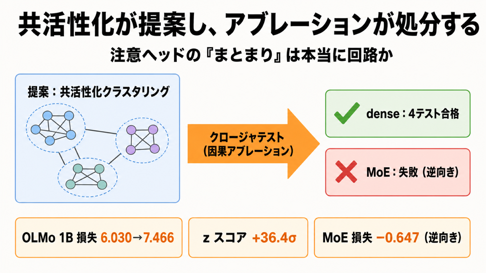

# 「一緒に光るヘッド」は本当に回路なのか：因果アブレーションで仮説を篩にかける

## この論文のひとことまとめ

大規模言語モデルの中身を理解しようとするとき、「一緒に発火する注意ヘッドのまとまり」を統計的に見つけ、それを機能の単位（回路）とみなす安価な手法が広まっています。この論文は、その「まとまり」が本当に機能を担う回路なのかを、ヘッドを取り除いて挙動の変化を測る因果的な検証（クロージャテスト）で確かめました。その結果、密なモデル（dense model）では候補がきちんと検証を通過する一方、Mixture-of-Experts（MoE）モデルでは統計的に強いシグナルが出ても検証に失敗する（しかも逆向きに）ことを示しました。著者は「安価なシグナルは回路の『提案』であって『確認された回路』ではない。両者を分けるのがクロージャである」と結論づけています。

## なぜこの研究が重要か

ChatGPT のような大規模言語モデルは、なぜそう答えるのかが外からは見えない「ブラックボックス」です。これを開けて、モデルのどの部品が何の機能を担っているかを突き止める研究分野を、機械的解釈可能性（mechanistic interpretability）と呼びます。

ここで主役になる部品が、注意ヘッド（attention head）です。これは Transformer の自己注意機構を構成する小さな処理単位で、入力のどの位置に注目するかをそれぞれ担当しています。本研究はこの注意ヘッドを単位として、モデルの内部を読み解きます。

近年この分野では、機能の最小単位を個々のニューロンではなく「部品のまとまり（グループ）」として捉える見方が主流になってきました。そして「まとまりは、一緒に活動する部品を統計的にクラスタリングすれば見つかる」という方法論が自然に導かれます。計算が安価で手軽なため魅力的です。

しかしここに落とし穴があります。「一緒に活動している」ことと「協力して機能を実装している」ことは、必ずしも同じではありません。本研究は、その安価な発見手法が本当に信頼できるのかを正面から問い直し、信頼性を担保するための検証手続きを提示している点で重要です。

## 背景：何が問題だったのか

統計的なクラスタリングで部品のまとまりを見つける手法は、たしかに「何か」を見つけてくれます。問題は、見つかったまとまりが次の 3 つのまったく異なる実態のどれなのか、出力だけでは区別できないことです。

- **本物の回路**：協力して機能を実装しており、取り除くと関連する入力でモデルの挙動が大きく損なわれるヘッド群。
- **共活性コミュニティ（co-active community）**：上流の共通の要因（共有入力やルーティング、位置のバイアスなど）で一緒に発火するだけで、出力への寄与は冗長または限定的なまとまり。回路ではありません。
- **打ち消し合うコミュニティ（cancellable community）**：似たバイアス信号を加えているものの、出力では他の部品が補償してしまうまとまり。取り除くとむしろ性能が上がることすらあります。

クラスタリングの出力は、この 3 つのどれとも矛盾なく解釈できてしまいます。つまり「一緒に光るヘッドの集まり」を見つけただけでは、それが load-bearing（機能を担っている）かどうかは分からない、というのがこの研究の出発点です。

## 提案手法：何をしたのか

中核となる考え方は、タイトルにもなっている「co-activation proposes, ablation disposes（共活性化が提案し、アブレーションが処分する）」です。共活性化のクラスタリングで回路を**提案**し、因果的なアブレーション（ablation、特定のヘッドの出力をゼロにして取り除く介入）による**クロージャテスト（closure test）**で採否を**判定**します。

各クロージャテストは 3 段階で進みます。

- **提案（proposal）**：モデルと入力バッチを与え、注意ヘッドを共活性化の統計でクラスタリングし、最もきれいな候補コミュニティを選ぶ。
- **予測（prediction）**：そのコミュニティを取り除いたとき、回路に期待される向き（損失が増え、正解率が下がる）にモデルが損なわれるなら「回路だ」と宣言する。
- **クロージャ（closure）**：実際に取り除き、同じサイズのランダムなヘッド集合 5 組と例ごとの被害を比較し、複数指標の z スコアを報告する。

提案フェーズの具体的な仕組みは次のように組み立てられています。

- **テンプレートフリーな信号抽出**：各例・各ヘッドについて、注意パターンの「最大の注意重み」（任意のキー位置への最大値）を信号とします。特定のキー位置を特別扱いしない、ヘッドの「集中度」だけを見る信号です。
- **中央値による二値化**：各ヘッドの信号を、自身の中央値で +1／−1 に変換します。これでどのヘッドもちょうど半数の例で +1 になり、単体ヘッドの発火率の偏りが消え、ヘッド同士の共活性化だけが結合の推定を駆動します。
- **ペアワイズ Ising モデルのフィット**：ヘッドを二値スピンとみなし、ヘッド間の結合の強さを擬似尤度（pseudolikelihood、各スピンを他の全スピンに回帰して結合を推定する安価な手法）で推定します。
- **コミュニティの復元**：推定した結合行列をスペクトラルクラスタリング（spectral clustering）でいくつかのコミュニティに分割します。分割数 k は、先行研究の教師ありプローブ分類との一致度（ARI、adjusted Rand index）が最大になるように選びます。教師ラベルは k の選択と候補の同定にのみ使い、クラスタリング自体には使いません。

判定フェーズ（クロージャ）では、ベースライン → 候補コミュニティのアブレーション → 同サイズのランダム対照 5 組、という順で挙動を測ります。評価には**クロスエントロピー損失**・**top-1 正解率**・**正解トークンのロジット（target-token logit）**の 3 指標を使います。合格条件は、損失が増え正解率と正解ロジットが下がるという正しい向きであり、かつその効果が同サイズのランダムなヘッド集合の分布の外にあること、です。

MoE モデルでは、入力ごとに使うエキスパートが切り替わるため、例をルーティングの重みでグループ分け（ルート条件付きクラスタリング）してから層ごとに Ising をフィットします。さらに、検出されたシグナルが本物かサンプル数による見かけのものかを、ルーティング情報を使わないランダム分割の帰無分布と比較して確かめています。

## 結果：何が分かったのか

検証対象は 1B（10 億パラメータ）規模の 3 モデル、Pythia 1B・OLMo 1B（いずれも dense）と OLMoE-1B-7B（MoE）です。入力は合成の induction バッチ（induction は、直前に現れたパターンを繰り返す単純な系列課題）と自然テキストの 2 種で、それぞれ 2000 例です。著者は 5 つのクロージャテストを主たる証拠として提示しました。結論を先に言うと、dense の 4 テストはすべて合格し、MoE の 1 テストは失敗しました。

**OLMo 1B（自然テキスト）— 最もきれいな結果。** L0 と L1 にまたがる 10 ヘッドのコミュニティを取り除くと、損失は 6.030 → 7.466（+1.435）、正解率は 0.278 → 0.104（約 2.67 倍の悪化）、正解ロジットは 11.44 → 6.56 と低下しました。同サイズのランダム対照はすべて損失をわずかに下げる方向だったため、z スコアは損失 +36.4σ、正解率 −50.6σ、正解ロジット −50.9σ という極端な値になります。ただし著者は、この 36σ は最強の因果効果を意味しないと注意しています。絶対的な損失の増加（+1.44）はむしろ合成 OLMo（+1.85）より小さく、巨大な z は自然テキストでの対照分布のばらつきが非常に小さい（標準偏差 0.043）ことを反映したものだと説明しています。

**OLMo 1B（合成）。** 層 0 の 5 ヘッドからなる、研究中で最もきれいな幾何を持つコミュニティです。取り除くと損失は 9.474 → 11.327（+1.853）。この被害は層 0 の全 16 ヘッドを取り除いた上限（+1.78）をわずかに超えており、16 ヘッド中わずか 5 ヘッドで層全体の効果を飽和させる「最小性のシグネチャ（minimality signature）」を示しました。判定は合格です。

**Pythia 1B（合成）— 拡散したケース。** 7 層にまたがる 25 ヘッドという広がったコミュニティで、損失は 9.92 → 12.61（+2.69）。方向テストには合格しますが、25/56 = 45% のヘッドが被害の 72% を担うなど拡散しすぎており、標準的な意味の「回路」とは呼びにくい弱い合格（weak pass）と判定されました。

**Pythia 1B（自然テキスト）— 下流冗長性のシグネチャ。** ここは興味深い結果です。9 ヘッドを取り除いても損失はほとんど動きません（5.955 → 6.005、+0.050）。ところが正解ロジットは 12.19 → 9.19（−3.00）と確かに下がり、z スコアは正解ロジット −52.51σ（研究中で最大）に達します。同じテストの同じアブレーションで、損失の z（+1.95σ）と正解ロジットの z（−52.51σ）が 25 倍も食い違うのです。著者の解釈は、これらのヘッドは正解の次トークンのロジットを確かに下げる意味で機能を担っているが、下流の冗長な経路が出力分布をほぼ元通りに保ってしまうため、集約された損失はほとんど動かない（下流冗長性、downstream redundancy）というものです。複数指標で見たからこそ拾えた合格です。

**OLMoE-1B-7B（自然テキスト・ルート条件付き）— 中心的な反例。** MoE では自然テキストでの素朴な Ising は ARI 0.006 まで崩壊しました（dense は 0.199〜0.350）。ルート条件付きにすると、最大のルート層のクラスタで層内 ARI が 0.191 まで回復します。これはランダム分割の帰無分布（平均 0.085）から +3.05σ 外れており、シグナル自体は統計的に実在し、サンプル数由来ではないことが確認されました。

ところがクロージャは失敗します。22 ヘッドの候補を取り除くと、ルート層クラスタで損失は −0.647、層外では −1.245 と、どちらも**負**でした。つまりアブレーションが損失を**改善**してしまい、しかも層外のほうが効果が大きいという、回路の定義と逆向きの結果です。正解ロジットも誤った向き、正解率はほぼ変化なしで、判定は失敗（統計的には強いが方向が誤り）となりました。

著者はさらに、別の 2 つの安価な代理指標（proxy）も導入しました。注意の選択性（selectivity）は、注意が特定の位置にどれだけ集中しているかを測る指標です。参加比（participation ratio）は、注意がおおよそ何個の位置に広がっているかを測る指標です。著者はこの 2 指標を訓練の途中チェックポイントで検証しました。その結果、「機能はあるが形がない（function without form）」「形はあるが機能がない（form without function）」の両方が起きることを観測しました。たとえば OLMo 1B の学習初期（約 20 億トークン時点）では、BOS（系列の先頭トークン、beginning-of-sequence）に注目するヘッドの注意パターンはまだ形になっていません（選択性は閾値の約 1/50）。ところが、このヘッドを取り除くと正解率が −6.1σ 下がります。つまり、形がなくても機能はすでに load-bearing だったのです。逆に Pythia の別の段階では、選択性も参加比も十分高いヘッドが、取り除いても予測を損なわない例も見つかっています。注意パターンの形と機能は、感度の違う同じものではなく、別個の概念だというのが著者の主張です。

なお著者は、3 指標それぞれに固有の弱点があることから、複数指標での報告を推奨しています。損失は集約のスラックで真の効果を過小評価したり、対照のばらつきが小さいと過大評価したりします。正解率は精度が低い領域で飽和します。最も安定なのは正解トークンのロジットだとしています。

## 意義と限界

この研究の価値は、むしろ「うまくいかなかった結果」にあります。拡散したケースや MoE の失敗例は、安価な統計的シグナルだけでは回路を確定できないことを具体的に示しています。とくに MoE の失敗は方向が逆向きであり、指標や閾値の選び方では救済できないため、単に検出力が足りないという説明よりも重く受け止められます。著者によれば、dense と MoE で共活性化の解釈可能性を体系的に比較したのは、知る限り初めてとのことです。

著者は「主張しないこと」も明確にしています。

- スパースオートエンコーダ（SAE）の特徴多様体については何も主張しない（検証法が異なるため）。
- 「dense で一般に機能する」とは主張しない。検証は 2 つの dense 1B モデルと 2 分布に限られ、他のモデル系列やコード・数学・非英語テキストは未検証。
- 「MoE が解釈可能性を壊す」とは主張しない。1 つの MoE モデル・1 分布・1 つのルート条件付き拡張での負例にとどまる。
- 単一チェックポイントのスナップショットであり、発達的な説明は主張しない。
- アブレーションはヘッド出力をゼロ化する破壊的な介入であり、平均アブレーションや activation patching など別の介入では結果が変わりうる。

これらの限定は、結論を過度に一般化しないための誠実な線引きと言えます。

## まとめ

この論文は、「一緒に発火するヘッドのまとまり」を見つける安価な手法が回路の発見手法なのかを、ヘッドを取り除く因果検証で問い直しました。dense モデルでは候補が検証を通過する一方、MoE では統計的に強いシグナルでも逆向きに失敗することを示し、共活性化クラスタリングは回路の「提案」であって「発見」ではない、確認するのはクロージャだ、と結論づけています。

## 用語集

- **注意ヘッド（attention head）**：Transformer の自己注意機構を構成する小さな処理単位。入力のどの位置に注目するかをそれぞれ担当する。本研究で内部を読み解く単位。
- **機械的解釈可能性（mechanistic interpretability）**：モデルのどの部品が何の機能を担うかを内部から突き止める研究分野。
- **回路（circuit）**：協力して機能を実装し、取り除くとその機能に関わる入力でモデルの挙動が劣化する部品群（load-bearing なまとまり）。
- **アブレーション（ablation）**：特定のヘッドの出力をゼロ化して取り除く因果的な介入。
- **クロージャテスト（closure test）**：見つけたコミュニティを取り除き、同サイズのランダム対照と被害を比較して、被害が回路に期待される向きか、かつランダム集合の効果分布の外かを問う検証。
- **共活性化（co-activation）**：固定した入力バッチにわたる、部品同士の同時発火の統計。
- **ペアワイズ Ising モデル**：二値スピン（ここではヘッド）間の結合を表すモデル。擬似尤度で安価に推定する。
- **ARI（adjusted Rand index）**：教師ありの分類結果とクラスタリング結果の一致度。分割数 k の選択に使う。
- **z スコア**：候補の効果から対照の平均を引き、対照の標準偏差で割った値。ランダム対照分布からの逸脱度を σ 単位で表す。
- **下流冗長性（downstream redundancy）**：取り除いたコミュニティの出力を後続層が部分的に再構成し、正解ロジットが崩れても集約損失は保たれる現象。
- **MoE（Mixture-of-Experts）**：入力ごとに一部のエキスパートだけを使うアーキテクチャ。本研究の MoE 対象は OLMoE-1B-7B。

## 原論文

- Closure-Validated Circuit Discovery in Attention Heads: Co-activation Proposes, Ablation Disposes（https://arxiv.org/abs/2606.09607）
