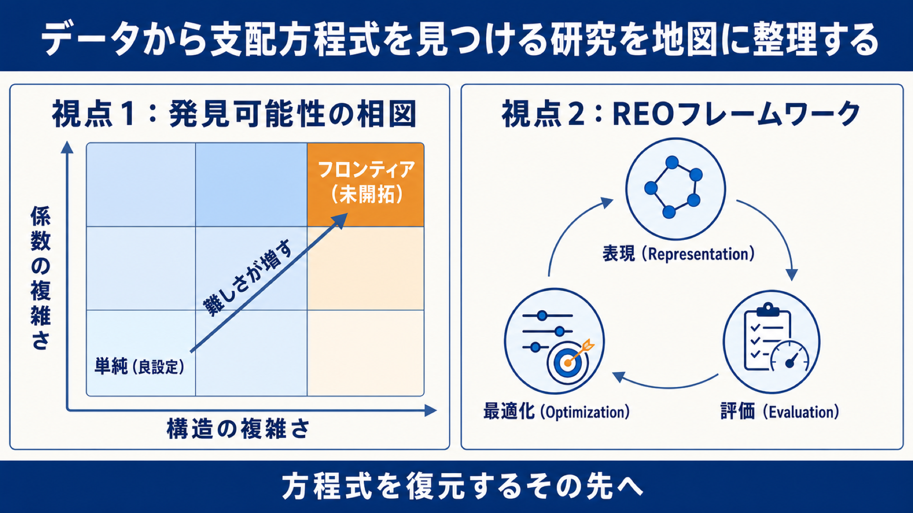

# データから支配方程式を見つける研究を地図に整理する——「発見可能性の相図」と「REO」という2つの視点

## この論文のひとことまとめ

観測データから物理現象を支配する微分方程式を直接見つけ出す「データ駆動型の微分方程式発見（data-driven equation discovery）」は、近年さまざまな手法が一気に増えた一方で、分野全体を見渡す共通の視点を欠いていました。この論文は新しいアルゴリズムを提案するのではなく、分野を整理する総説（Review）として 2 つの視点を示します。1 つは、問題の難しさを「構造の複雑さ」と「係数の複雑さ」の 2 軸で位置づける「発見可能性の相図（phase diagram of discoverability）」。もう 1 つは、発見の過程を「表現・評価・最適化」の 3 要素に分解する「REO フレームワーク」です。そのうえで、応用例と「方程式を復元するその先」にある科学的概念の形成という課題を展望します。

## なぜこの研究が重要か

微分方程式は、物理現象を記述するための基本的な言葉です。流体の運動を表す Navier–Stokes 方程式、化学のパターン形成を表す Gray–Scott 方程式、天体の動きを表す重力 N 体方程式など、科学の発見はしばしば「正しい方程式を見つけること」と結びついてきました。

従来の科学では、こうした方程式を第一原理（first principles）、つまり基本法則からの理論的な導出によって組み立ててきました。しかしこのやり方は、対象の系が十分に単純なときにしかうまく働きません。気候のダイナミクスのように高次元で強い非線形性を持ち、複数のスケールが絡み合う現実の系では、人間の直観だけで支配方程式を書き下すのは困難です。

一方で現代の機械学習は、複雑な挙動を高い精度でフィットできます。ただし、入力と出力をつなぐ近似器として働くため、中身が見えにくく、解釈可能性に欠けるという弱点があります。

そこで登場したのが、データから解釈可能な支配則を直接取り出す「データ駆動型の微分方程式発見」です。この分野は AI ベースの手法とともに急速に拡大しましたが、論文の著者らは「研究を整理する明確な視点が欠けている」と指摘します。本研究は、その地図を描こうとする試みです。

## 背景：何が問題だったのか

データ駆動型の方程式発見には、歴史的な流れがあります。線形モデルや多項式展開のフィットから始まり、遺伝的アルゴリズムによる非線形系の同定、スパース回帰（特に SINDy）を経て、近年は偏微分方程式（PDE）の発見へと進んできました。

しかし、この発見問題は本質的に難しい性質を持ちます。論文では次のように整理されています。

- 微分方程式発見は、方程式の「形（form）」と「係数（parameters）」の両方を観測データから推定する逆問題であり、一般に強い不良設定（highly ill-posed）です。
- 異なる支配方程式が、有限時間の観測ではまったく区別できない軌道を生むことがあります。これは「観測の非一意性（non-uniqueness）」と呼ばれ、特にノイズや不完全な観測のもとで顕著になります。
- さらに、時間と空間の結合、ノイズを含むデータの微分、隠れた変数、境界の影響、系の状態の一部しか見えない部分観測（partial observability）など、単なる代数関係の発見よりも厄介な要素が絡みます。

これに加えて、著者らは既存のレビューの限界も挙げます。多くのレビューは手法を「アルゴリズムの系列」か「応用ドメイン」で分類してきました。しかしそれでは、「与えられたデータから実際にどの方程式が発見可能なのか」「何がその方程式を科学的に意味あるものにするのか」という、より深い問いが見えにくくなってしまう、というのが著者らの問題意識です。

## 提案手法：何をしたのか

繰り返しになりますが、この論文は新しいアルゴリズムではなく、分野を整理する 2 つの概念的な枠組みを提示します。

### 問題の書き方

まず出発点として、微分方程式を陰的な作用素の形 F(z, u, ∇u, ∇²u, …) = 0 で書きます。ここで z は時間 t と空間座標 s をまとめた独立変数、u はその点での系の状態です。式の中の ∇u・∇²u は、u の空間方向の 1 階・2 階の微分（勾配・ラプラシアン、つまり「u が空間的にどれだけ変化しているか」とその変化のさらなる変化）を表します。要するにこの式は、状態 u とその各種の微分のあいだに成り立つ関係を「＝0」という形でまとめて書いたものです。u が時間だけに依存すれば常微分方程式（ODE）、時間と空間の両方に依存すれば偏微分方程式（PDE）になります。

実際の多くの手法は、これを「進化形式（evolution form）」 ut = Σ θk Φk(u, ∇u, ∇²u, …) に書き換えます。左辺の ut は u の時間微分（∂u/∂t、つまり u が時間とともにどう変化するか）を表します。右辺の Σ θk Φk は、候補となる構造の部品（項）Φk に、それぞれの係数 θk を掛けて足し合わせたものです。言い換えれば「u の時間変化は、いくつかの候補項を係数つきで足し合わせたもので説明できる」と仮定する書き方です。この書き方をすると、難しさの主要な源が 2 つに見えてきます。すなわち、どんな項 {Φk} を候補に並べるかという「構造の複雑さ」と、その係数 {θk} がどれだけ複雑かという「係数の複雑さ」です。

### 視点1：発見可能性の相図

1 つ目の視点は、この 2 つの難しさを 2 軸にとった「相図（phase diagram）」です。著者らは既存の手法を、構造の複雑さ（横軸）と係数の複雑さ（縦軸）からなる概念的な 3×3 グリッドに配置しました。

- **横軸（構造の複雑さ）**: 事前に定義された項のライブラリを使う「閉形式（closed-form）」から、演算子と変数を自由に組み合わせて任意の構造を作れる「開形式（open-form）」へと複雑さが増していきます。
- **縦軸（係数の複雑さ）**: 定数の係数から始まり、空間・時間・確率的な実現にわたって変化する係数へ、さらには明示的な関数関係では書けない（inexpressible）係数へと複雑さが増します。

この相図のポイントは、領域ごとに推論のレジーム（取り組み方の性質）が質的に異なる、という点です。

- **左下（構造も係数も単純）**: 問題は well-posed（良設定）で、ライブラリベースのスパース回帰が有効に働きます。
- **複雑さが増すと**: 問題は ill-posed になり、より表現力のある表現、強い物理的な制約、強力な最適化が必要になります。
- **右上（開形式の構造 × 表現できないほど複雑な係数）**: ここが現在のフロンティアであり、著者らの知る限り未開拓（underexplored）で、今後の中心的な課題だと位置づけられています。

なお論文は、グリッドのセル内での相対位置が定量的な性能比較を意味するものではない、と明記しています。

構造の複雑さの段階は、おおまかに 3 つに分かれます。以下では各段階の代表的な手法名を挙げますが、これらは「どんな手法がどの段階に属するか」の例であり、個々の名前を覚える必要はありません。段階のイメージだけつかめれば十分です。

- **閉ライブラリ手法（closed-library）**: 状態変数とその微分の組み合わせや多項式などを、あらかじめ候補項の辞書として用意します。SINDy（sparse identification of nonlinear dynamical systems）や、その PDE 版である PDE-FIND が起点です。ノイズに弱い点ごとの微分を弱形式（weak form）で置き換える WeakSINDy、対称性や保存量・次元の整合性といった物理制約を課す constrained SINDy、自動微分つきのニューラルネットで微分の困難を回避する DeepMoD や PINN-SR などが派生しています。限界は明快で、真の項が事前のライブラリの外にあると、正しい方程式を見つけられません。
- **拡張可能ライブラリ手法（expandable library）**: 候補のライブラリを固定せず、動的に拡張します。進化アルゴリズムとスパース回帰を組み合わせた EPDE、PDE をゲノムとしてエンコードする DLGA-PDE などがあります。ただし、扱う部品が依然として有限で事前定義の関数断片であるため、関数空間の全体を張ることはできません。
- **開形式手法（open-form）**: 方程式を、演算子と変数の階層的な合成としてシンボリックに（記号として）組み立てます。表現できる空間は大きく広がりますが、最適なシンボリック構造を見つける問題は NP 困難（NP-hard）です。モンテカルロ木探索を使う SPL、深層シンボリック回帰の DSR、多様な方程式で訓練した transformer の ODEFormer、大規模言語モデル（LLM）を用いた LLM4ED や LLM-SR などが含まれます。論文は、強い非線形性を持つ「砕波直前の表面重力波」について、これまで報告されていなかった支配方程式を実験データから復元したと報告する EqGPT にも言及しています。

係数の複雑さの段階も、3 つに分かれます。

- **定数係数（constant）**: 最も単純で、線形なら最小二乗回帰、非線形なら Newton 型や勾配法で扱えます。多くの手法はここで止まりますが、現実の問題では係数が空間・時間・確率的に変動するため、適用範囲が限られます。
- **方程式で表現可能な係数（equation-expressible）**: 空間や時間で系統的に変化し、明示的な関数関係で書ける係数です。方程式が既知で係数だけを推定する古典的な逆問題とは違い、項と係数の関数形の両方を同時に同定しようとする点でより野心的です。grouped sparse regression や、明示的な閉形式を復元する Stepwise-DLGA などが該当します。
- **方程式で表現不能な係数（equation-inexpressible）**: 確率的で不規則な場（たとえば汚染物質拡散の透水係数や熱伝導率）です。Karhunen–Loève 展開（KLE）による乱数場で表されることが多く、従来のスパース回帰や区分的なフィットでは強い非線形性や空間的な不規則性に苦戦します。この設定に対応する数少ない手法として、空間カーネルのスパース回帰で強非線形の係数場を推定する HIN-PDE が挙げられています。

著者らはさらに、「構造（項）・係数・ノイズ」という分割そのものが、系本来の性質ではなく、現在のアルゴリズムの問題の立て方の帰結だと指摘します。たとえば、ある表現での「係数」は、制御変数やレジームを追加すると発見可能な構造関係に変わりうる（実効拡散率や Reynolds 数依存の閉包などがその例です）。「ノイズ」とされるものの一部も、測定誤差ではなく、いまの表現では復元できていない構造かもしれない、というのです。

### 視点2：REOフレームワーク

2 つ目の視点は、発見の目的を 3 つの基本的な問いに抽象化する「REO フレームワーク」です。REO は representation（表現）・evaluation（評価）・optimization（最適化）の頭文字で、特定の手法のワークフローではなく、発見タスクそのものの抽象的な分解です。

- **Representation（表現）**: 方程式の候補がなす空間を、計算で扱える形にどう表すか。表現が仮説空間を決めます。代表的な形式として、候補項を並べた「構造化行列（structured matrix）」、演算子を木やグラフで表す「シンボリック」、方程式を高次元ベクトルに写す「埋め込み（embedding）」、そして LLM 時代に台頭した、方程式をトークン列として扱う「系列（sequence）」があります。表現が柔軟になるほど最適化は難しくなる、という「no-free-lunch（ただ飯はない）」のトレードオフが本質的に存在します。
- **Optimization（最適化）**: 表現された仮説空間をどう効率よく探索するか。構造の単純さとデータ適合のバランスをとるスパース回帰、離散的で組合せ的な空間に強い遺伝的アルゴリズム（GA）、方程式の構成を逐次決定問題とみなす強化学習（RL）、微分可能な埋め込みに向く勾配法、そして LLM の登場で生まれた、重みではなくプロンプトを反復的に洗練するプロンプト最適化があります。
- **Evaluation（評価）**: 候補の方程式の良し悪しをどう判定するか。表現と最適化をつなぐインターフェースにあたります。著者らは評価の指標を、(1) データ適合精度（data-fitting accuracy）、(2) 数学的な簡潔さ（mathematical conciseness、Occam の剃刀と整合）、(3) 物理的整合性（physical consistency、次元の同次性など）の 3 次元に整理し、さらに第 4 の次元として「可解性（solvability）」を新たに提案しています。これは、発見された方程式が実際に解析的・数値的に解けるかという観点で、既存の文献では論じられていないと明記されています。データに合っていても、過度に複雑で硬い（stiff な）方程式は、意味のある解を生まないからです。

## 結果：何が分かったのか

総説のため新規の実験はありませんが、論文は既存研究の俯瞰と評価実務の現状を整理しています。出典のある主な内容は次のとおりです。

- **ベンチマークの現状**: ODE 発見では、細胞系を対象とする Gennemark & Wedelin の 40 問超のベンチマーク、Feynman の物理学講義から作った AI Feynman データセット（ただし多くは代数方程式で ODE は少数）、カオス系の dysts、252 個の力学系を含む Strogatz データセット、1〜4 次元の 63 個を含む ODEBench などがあります。LLM ベースのシンボリック発見を評価する LLM-SRBench は、4 つの科学ドメインにわたる 239 個の難問題（うち 68 問が ODE 問題）を、記憶による近道を最小化するよう設計しています。
- **PDE 発見の評価は未解決**: PDE 発見の厳密な評価は、まだ解決されていない課題です。現状は標準化された比較ではなく、個別の概念実証（proof-of-concept）に依存しています。Burgers 方程式や Kuramoto–Sivashinsky 方程式など、限られた正準 PDE で検証されることが多く、PDE 発見専用で広く採用された標準ベンチマークは現状存在しないと述べられています。汎用の PDE ベンチマーク（PDEArena、PDEBench など）が部分的に転用されているのが実情です。
- **標準化への提言**: 著者らは、実世界の多様な系を含む標準ベンチマークと標準評価プロトコルの必要性を訴えます。具体的には、ノイズロバスト性では摂動の分布（Gaussian / uniform）と注入の様式（加法的か乗法的か）、スパースデータではサンプリング方式（ランダムか Latin hypercube か）を標準化すべきだとします。LLM 関連手法では、データ漏洩を防ぐために非公開のテストセットが重要だとも述べています。
- **応用例の整理**: 応用を 4 つの繰り返し現れるパラダイムで整理しています。(1) ノイズや不完全なデータからの発見、(2) ミクロな法則とマクロな挙動の橋渡し、(3) 解釈可能な閉包モデル（closure model）の発見、(4) 新しい支配則の探索です。たとえば (4) では、粘性重力流について報告された方程式が、従来の理論導出モデルを短時間・長時間予測の両方のレジームで上回ったと記述されています。

## 意義と限界

著者らの中心的なメッセージは、「次の課題は単に方程式を復元することではない」という点にあります。方程式はデータに合うだけでは科学的に重要にはならず、系の理解の仕方を変えてはじめて意味を持つ、と述べます。論文はその例として、Laplacian がまず微分作用素として現れ、後に「局所的な差が空間の変化を駆動する」という概念へと育っていった歴史を挙げています。

今後の展望は 2 つのレベルで整理されています。

- **方法論レベル**: ノイズロバスト性、部分観測、スパースなサンプリング、高次元性、マルチスケールのモデリング、信頼できる評価プロトコルやベンチマークの設計が、残る技術的課題です。
- **概念形成のレベル**: (1) 次元制約・対称性・保存則・既知の構成形を最初から探索の足場にする「知識誘導型の発見（knowledge-guided discovery）」、(2) ブラックボックスの科学機械学習モデルを、低次元の方程式ベースの代理モデルへ圧縮する「メカニズム蒸留（mechanistic distillation）」、(3) 候補を提案し、狙ったデータを集めてモデルを改訂する反復を回す「閉ループ発見（closed-loop discovery）」の 3 方向です。閉ループ発見では、限定要因はデータの総量ではなく独立したレジームの数であり、次の観測は予測誤差を減らすためではなく、競合する方程式を見分けるために選ぶべきだと論じています。

論文全体を通して、AI が候補の方程式を提案し、人間がそれを解釈・検証して、ともに科学的理解を前進させる「人間と AI の協働ループ」が強調されています。

一方で、著者らは自分たちの議論の限界も明示しています。

- 既存のベンチマークや評価は、主に既知の方程式から生成した合成データに基づいており、実世界の発見の難しさを完全には反映していません。
- 表現の柔軟性が増すほど最適化が難しくなる no-free-lunch のトレードオフは、本質的に避けられません。
- 表現の違いがもたらす方程式空間の幾何や、競合方程式を分離する基準、理論に裏打ちされた探索原理についての研究はほとんどなく、より厳密な数学的基礎が不足しています。
- 本論文の応用レビューは網羅的なサーベイを意図しておらず、各分野の代表例の提示にとどまります。

## まとめ

この総説は、急拡大したデータ駆動型の微分方程式発見を、「構造の複雑さ × 係数の複雑さ」の相図と「表現・評価・最適化（REO）」という 2 つの問題志向の視点で地図化しました。そして、方程式を復元するだけでなく、それを使って理論を改訂し、メカニズムを蒸留し、新しい科学的概念を形作ることが次の目標だと展望します。個々のアルゴリズムの優劣ではなく、「何が発見可能で、何が科学的に意味あるものにするのか」という基本原理へ議論を引き上げようとする点に、この論文の狙いがあります。

## 用語集

- **支配微分方程式（governing differential equation）**: 系の時間的・空間的な発展を規定する微分方程式。本論文が発見の対象とするもの。
- **データ駆動型方程式発見（data-driven equation discovery）**: 観測やシミュレーションのデータから、方程式の形と係数を直接推定すること。
- **不良設定 / 非一意性（ill-posed / non-uniqueness）**: 観測上は区別できない異なる方程式が存在しうるという、発見問題の中心的な困難。
- **進化形式（evolution form）**: ut = Σ θk Φk(…) の形（ut は u の時間微分、Σ θk Φk は候補項 Φk に係数 θk を掛けて足し合わせたもの）。発見の問題を、項の選択と係数の推定に分解する定式化。
- **SINDy / PDE-FIND**: スパース回帰による方程式発見の代表手法と、その偏微分方程式（PDE）版。
- **閉形式 / 開形式（closed-form / open-form）**: 事前定義の有限な候補項を使うか、演算子と変数の合成で任意の構造を作れるか、という構造表現の違い。
- **REO フレームワーク**: 発見の過程を representation（表現）・evaluation（評価）・optimization（最適化）の 3 要素に抽象分解する、本論文の枠組み。
- **可解性（solvability）**: 発見された方程式が実際に解けるかという、本論文が新たに提案した第 4 の評価次元。
- **閉包モデル（closure model）**: 既知の枠組みに対し、未解決スケールや構成則の効果を補う追加の関係。例として RANS の Reynolds 応力。
- **メカニズム蒸留 / 閉ループ発見（mechanistic distillation / closed-loop discovery）**: ブラックボックスモデルが学んだ内容を解釈可能な方程式へ取り出すことと、提案・データ収集・改訂を反復する発見の進め方。

## 原論文

- Data-driven discovery of governing differential equations across physical systems（https://arxiv.org/abs/2606.09638）
