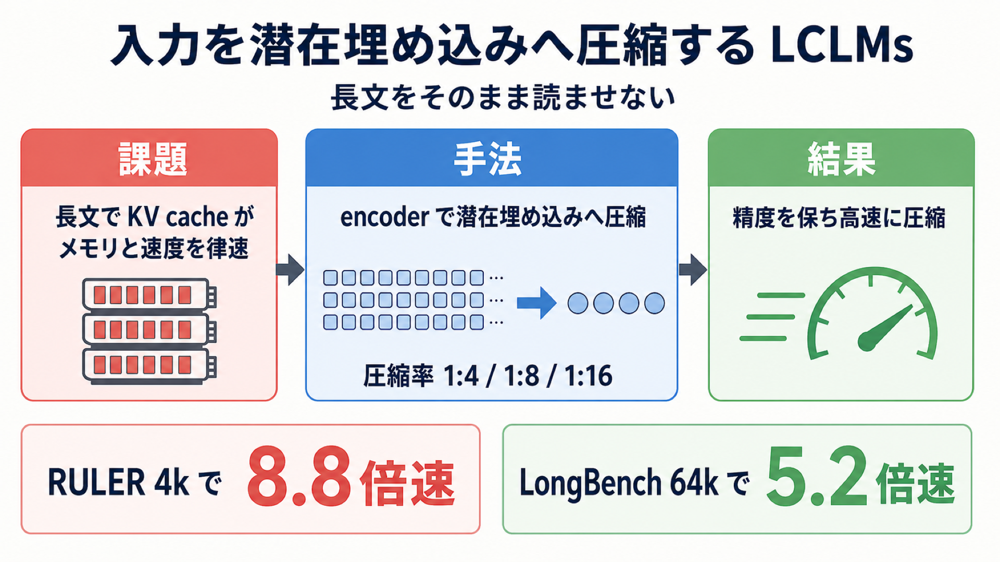

# 長文をそのまま読ませない――入力を「潜在埋め込み」へ圧縮する大規模言語モデル群 LCLMs

## この論文のひとことまとめ

大規模言語モデル（LLM）に長い文章を読ませると、メモリと処理時間が膨らんで実用上のボトルネックになります。この論文は、入力のトークン列を「短い潜在埋め込み列」へ end-to-end（端から端まで一気通貫）で圧縮するモデル群「Latent Context Language Models（LCLMs）」を、大規模な学習で構築しました。その結果、精度・圧縮速度・ピークメモリのトレードオフにおいて、従来主流だった KV cache の圧縮手法を上回るバランスを実現したと報告しています。

## なぜこの研究が重要か

ChatGPT のような LLM は、与えられた文章（コンテキスト）を手がかりに答えを作ります。近年は数百万トークンに及ぶ長大な入力を扱う用途が増えていますが、入力が長くなるほど推論はメモリと遅延（レイテンシ）で律速されます。

その主因が KV cache です。これは推論中にモデルが内部で保持する中間データで、コンテキストが長くなるほど線形に膨らみ、GPU のメモリを食いつぶします。長文を扱いたいのにメモリが足りない、という板挟みが起きるわけです。

さらに、入力がモデルの扱える上限に収まっていても、長文の中に散らばった情報をモデルが確実に拾えるとは限らないことが知られています。「長く読ませれば良い」という単純な話ではないのです。この研究は、入力そのものを賢く圧縮することでこの問題に正面から取り組みます。

## 背景：何が問題だったのか

長文のメモリ問題に対する従来のアプローチは、大きく分けて二つあります。

一つ目は **KV cache 圧縮（KV cache compression）** です。膨らんだ KV cache から重要でないエントリを捨てる（eviction）、あるいはコンパクトな cache を事前に学習する、といった手法群です。しかし論文は、これらに以下の限界があると整理しています。

- 多くの手法は、圧縮する前にまずフルのコンテキストを処理（prefill）する必要があり、元の処理を上回る追加の時間とメモリを要するものがある。
- クエリに依存する手法（例: SnapKV）は、対話のターンをまたいで再利用しにくい cache を作ってしまう。
- attention head（注意ヘッド。入力のどこに注目するかを担う内部ユニット）や層ごとに、cache を捨てる量をばらばらに変える手法（例: KVzip）には別の難しさがあります。近代的な推論エンジン（vLLM や SGLang）は、cache の長さが全体でそろっている前提で組まれているため、ヘッドや層ごとに長さが食い違うこうした手法は組み込みにくいのです。しかも捨てた位置は計算上「無視する」扱いにするだけで実際には場所を空けないため、メモリやスループット（単位時間あたりの処理量）の節約効果も得られにくくなります。
- 別系統の Cartridges（Eyuboglu et al. 2025）は、コーパスごとに固定サイズの KV cache を蒸留しますが、コーパスあたりの学習コストが大きく、8B モデルでは 8 台の H100 を使って約 30 分かかると報告されています。

二つ目は **encoder-decoder の soft-token 手法** です。長いトークン列を短い連続埋め込み列（soft token）に符号化し、元のコンテキストの代わりに LLM へ渡す方式です。原理的には魅力的で、圧縮を並列化できる、標準的な推論エンジンと相性が良い、デコーダ本来のコンテキスト長を超えて拡張できる、といった利点があります。ところが既存の soft-token 手法は、モデル本来の能力を大きく損なうか、特定ドメイン向けの学習に頼ってしまい、タスクをまたいで使い回せないという弱点を抱えていました。

そこで論文が掲げる根本の問いは、「モデル本来の能力を保ったまま、汎用かつタスクに依存しない圧縮器を学習できるか」というものです。

## 提案手法：何をしたのか

提案する LCLM は、次の三つの部品からなる encoder-decoder 構成です（Section 3）。

- **encoder（符号化器）**: 入力トークンのまとまりを soft token に写す。pooling（プーリング、複数の隠れ状態を 1 個に集約する演算）を備える。
- **adapter（アダプタ）**: encoder 側の次元を decoder 側の埋め込み次元へ射影する。
- **decoder（復号器）**: soft token を「潜在コンテキスト」として受け取り、通常の LLM と同じように文章を生成する。

仕組みはこうです。入力トークン列と圧縮率 N が与えられると、encoder は連続する N トークンのブロックごとに 1 個の潜在トークンへまとめます。実装上は、encoder が 1 回の処理で扱うトークン数（encoder window size W）で入力を区切り、各区間の隠れ状態を pooling で集約して潜在トークンを得ます。adapter がそれを decoder の次元へ射影し、decoder は元のトークンの代わりにこれを消費します。N=16 なら、16 トークンが 1 個の潜在トークンに圧縮されるイメージです。

### 多段の学習レシピ

LCLM の肝は、大規模かつ慎重に設計された学習手順にあります（Section 4）。学習データは 3 種類をキュレーションしています。

- **継続事前学習（continual pre-training）データ**: Common Crawl のテキスト、コード、科学・推論、長文、指示型データを混ぜた高品質データ。各系列を複数のセグメントに分け、圧縮セグメントと通常トークンのセグメントを交互に並べる「interleaved（インターリーブ）」形式を採用しています。損失（学習の誤差）は非圧縮トークンに対してだけ計算します。圧縮スパンを系列全体にばらまくことで、モデルが複数の位置で潜在コンテキストを参照できるよう学習させます。
- **SFT（教師あり微調整）データ**: 推論、長文の指示追従、一般的な指示追従・マルチターン会話の 3 成分。一部の completion は Qwen3-30B-A3B-Instruct-2507 と Qwen3-235B-A22B-Instruct-2507 で付け直しています。
- **補助 reconstruction（復元）データ**: 圧縮したテキストから元の内容を復元させる補助タスク。潜在表現に細かい情報を保たせる狙いがあります。プロンプトの過適合を抑えるため、ソースごとに 100 種類のテンプレートを使います。

学習は一気に全部を動かすのではなく、学習対象のパラメータを段階的に増やしていきます（Section 4.2）。

- **Stage 0**: adapter のウォームアップ（encoder と decoder は凍結し、adapter だけ更新）。
- **Stage 1**: encoder の学習（encoder を解凍、decoder は凍結）。
- **Stage 2**: end-to-end の継続事前学習（小さな学習率で decoder も解凍）。
- **Stage 3**: 教師あり微調整（SFT 混合で学習し、decoder の学習率を上げる）。

論文によれば、最初から全体を end-to-end で学習すると、学習初期に勾配が大きくなりモデルが劣化し、この多段レシピに劣ったとのことです。decoder を完全に凍結する案や、LoRA（少数のパラメータだけを追加学習する手法）のような省パラメータな変種も検討しましたが、全パラメータ学習に大きく及ばなかったため、最終的に end-to-end の全パラメータ学習に注力しています。

### アーキテクチャの探索

どの設計が良いかは、事前学習済みモデルの影響を排した「cleanroom（クリーンルーム）」設定で比べています。Qwen3-0.6B を基底にして全重みをランダム初期化し、各変種を 38B トークン・圧縮率 N=16 でゼロから学習し、事前学習の損失を比較しました（Section 5）。主な知見は次のとおりです。

- **pooling**: mean pooling（平均プーリング）はトークンベースの pooling より一貫して損失が低い。ただし concatenation（連結）とは経験的に区別がつかない。
- **符号化の粒度**: W を 16 から 256 へ増やすと大きく改善し、256 から 1024 への増加でさらに小幅改善。1024 を既定値に採用。
- **encoder の attention マスク**: causal masking（因果マスク）が bidirectional（双方向）より一貫して低い損失。
- **adapter**: 軽量な MLP 射影が attention ベースのものより低い損失かつ低計算。

主要な実験では、encoder に Qwen3-Embedding-0.6B、decoder に Qwen3-4B-Instruct-2507 を使い、主に 16× 圧縮を扱うため mean pooling を既定としています。

### エージェント向けの足場

論文は、LCLM をエージェント（自律的にツールを使う AI）に組み込む仕組みも示しています（Section 7）。入力を 512 トークンずつのチャンクに分けて各々を圧縮し、整数 ID を付けます。モデルには圧縮済みの系列全体と `EXPAND` という 1 つのツールが渡され、`EXPAND(i)` を呼ぶと該当セグメントの原文が非圧縮で返ります。普段は圧縮版で読み、必要な箇所だけ原文を「展開」する、という使い方です。

## 結果：何が分かったのか

評価は主に長文ベンチマークの RULER、LongBench、LongHealth で行い、細かい圧縮品質の分析には GSM8K も使っています（Section 6）。比較対象は KV cache 圧縮の代表手法（Expected Attention、Attention Matching、KVzip、FastKVzip、SnapKV）で、いずれも同じ decoder（Qwen3-4B-Instruct-2507）を土台にして公平に比べています。

圧縮の速さは time-to-first-token（TTFT、最初のトークンを生成できるまでの時間）で測り、ピークメモリと合わせて H200 GPU（メモリ 141GB）上で計測しています。

まず、モデル群そのものは 0.6B の encoder と 4B の decoder の組み合わせで、圧縮率 1:4、1:8、1:16 のそれぞれを 350B トークン超で継続事前学習しています。主な数値は以下のとおりです。

- 速度面では、RULER の 4k コンテキストで「8.8 倍速い」、LongBench の 64k コンテキストで「5.2 倍速い」と報告（Figure 1）。さらに RULER の 8k で 6.4 倍、16k で 4.7 倍、LongHealth の約 64k で 5.2 倍とされ、いずれも同等以上の精度を保ちつつ高速に圧縮できたとしています（Figure 5）。
- LCLM は RULER・LongBench・LongHealth で、圧縮時間と精度の新しいパレートフロンティア（どちらか一方を犠牲にせず両立できる境界）を引きました。KV cache 圧縮手法は圧縮時間が圧縮率にほとんど依存しないため、これらのプロット上ではほぼ垂直な線として現れます。
- メモリと時間のスケーリング（コンテキスト長 4K〜1M、Figure 4）では、LCLM が最速の圧縮時間を達成し、長いコンテキストで大幅に低いピーク GPU メモリを示しました。対する Attention Matching は 1M トークンでメモリ不足（OOM）に陥り、512K では数値的な不安定さで失敗。他の手法はすべて 512K と 1M で OOM になっています。
- 細かい粒度の圧縮（GSM8K でプロンプトとコンテキスト全体を圧縮、Figure 12）では、LCLM が全ての圧縮率で最高精度を達成し、特に高圧縮率での差が大きいと報告しています。
- エージェント設定（RULER の「干し草の山から針を探す」課題、Figure 6）では、`EXPAND` ツールを持つエージェントが 16× 圧縮した素の LCLM を大幅に上回り、一部設定では非圧縮コンテキストの性能に匹敵したとしています。

学習規模の感触として、16× 設定では Stage 0〜3 の合計トークンがそれぞれ 38.83B、77.65B、182.51B、51.05B、バッチサイズは 400 万トークン、系列長は 16384、最適化手法は AdamW（学習に広く使われる最適化手法）を用いています（Table 1）。

## 意義と限界

論文は、長文ベンチマーク・標準的な知識/指示追従タスク・エージェント設定にわたり、学習された圧縮が「強い文脈内能力（in-context 能力）を保ったまま大幅な効率向上をもたらす」ことを示したと結論づけています。LCLM は、入力を大規模に削減することで、大きく永続的な作業メモリを持つ長期間のエージェントの基盤になりうると位置づけています。

一方で、著者自身が次の限界・今後の課題を挙げています。

- 複数の粒度での圧縮や、情報密度に応じた容量の動的割り当てによる、品質と効率のトレードオフの一層の改善。
- 静的な入力コンテキストだけでなく、生成中の状態（長い思考過程、ツールの観測結果、エージェントが蓄積した作業履歴）への圧縮の拡張。
- encoder window を入力長より小さく取ると入力が複数の window に分割されるため、区間の境界をまたぐ情報が二つの処理に分かれてしまう。境界を重ねる変種も試したが損失は改善せず計算が増えたため、既定では重ねていない。
- 一部の KV cache 手法は、専用カーネル（未公開・未実装）なしには標準的な推論エンジンで実時間の高速化やメモリ削減に必ずしも結びつかない、という点も著者は注意喚起しています。

## まとめ

LCLMs は、長文をそのまま読ませる代わりに、入力を短い潜在埋め込みへ end-to-end で圧縮する大規模学習済みモデル群です。多段の学習レシピと丁寧なアーキテクチャ探索によって、モデル本来の能力を保ちつつ、精度・速度・メモリのバランスで従来の KV cache 圧縮を上回るフロンティアを示しました。長期間動くエージェントの「作業メモリ」を効率化する実用的な部品として期待されます。

## 用語集

- **KV cache**: 推論中にモデルが保持する key/value の中間データ。コンテキストが長いほど増え、長文推論のメモリ律速要因になる。
- **KV cache 圧縮（KV cache compression）**: 不要な cache を捨てたりコンパクトな cache を学習したりして、メモリ使用量を減らす手法群。
- **soft token**: 生の入力トークンを符号化した短い連続埋め込み。元コンテキストの代わりに LLM へ渡す。
- **LCLMs（Latent Context Language Models）**: 本論文が提案する、end-to-end で大規模学習した encoder-decoder 圧縮モデル群。
- **圧縮率 N**: 入力トークン数 ÷ 潜在トークン数。本論文では 1:4、1:8、1:16（= 4×、8×、16×）を扱う。
- **encoder window size W**: encoder が 1 回の処理で扱う入力トークン数。既定は 1024。
- **pooling**: encoder の隠れ状態を潜在トークンへ集約する演算。平均プーリングなどがある。
- **TTFT（time-to-first-token）**: 最初のトークンを生成できるまでの時間。本論文では「圧縮時間」の指標に用いる。
- **EXPAND ツール**: エージェントが圧縮済みセグメントを原文へ展開するためのツール。
- **interleaved 圧縮**: 系列全体に圧縮スパンを分散配置し、損失を非圧縮トークンだけで計算する継続事前学習のデータ形式。

## 原論文

- End-to-End Context Compression at Scale（https://arxiv.org/abs/2606.09659）
