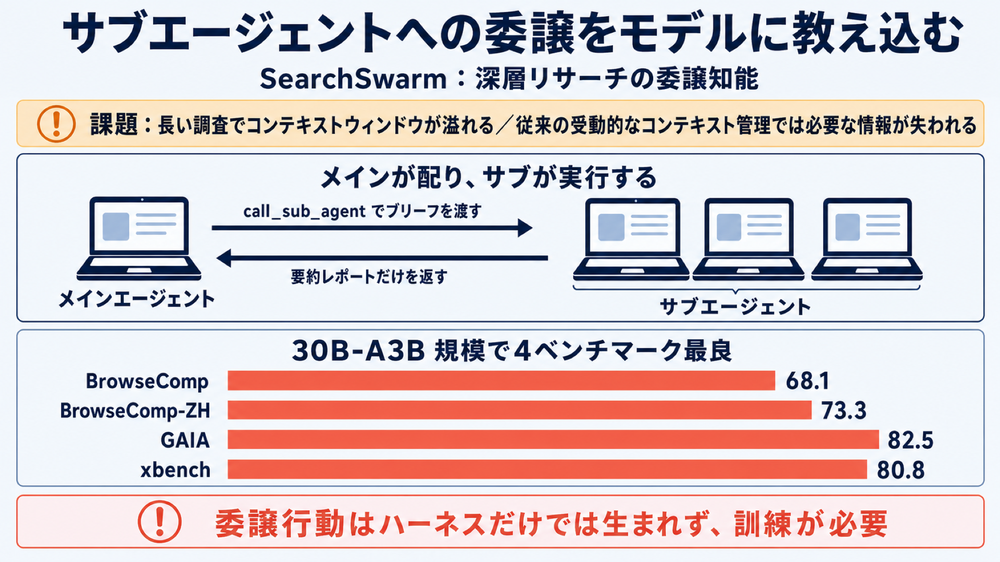

# サブエージェントへの「委譲」をモデルに教え込む：SearchSwarm の深層リサーチ手法

## この論文のひとことまとめ

長い手順を要する調査タスクを LLM（大規模言語モデル）に解かせるとき、限られたコンテキストウィンドウ（モデルが一度に扱えるテキスト量）が壁になります。この論文は、メインのエージェントがタスクを分解してサブエージェントに「委譲」し、要約された結果だけを受け取るという進め方に着目しました。著者らはこの委譲をうまく行う能力を「委譲知能（delegation intelligence）」と定義し、それを引き出す仕組み（ハーネス）と、その動作の記録をデータとしてモデルに学習させる方法を提案しています。得られたモデル SearchSwarm-30B-A3B は、複数の調査ベンチマークで同規模のモデルの中で最良の結果を達成しました。

## なぜこの研究が重要か

LLM をエージェントとして使い、Web 検索やページ閲覧を繰り返しながら答えを探す「深層リサーチ（deep research）」は、近年急速に注目を集めている使い方です。しかし、調査が長くなるほど、検索結果やページの内容がコンテキストにどんどん溜まっていきます。

コンテキストウィンドウには上限があるため、何らかの形で情報を整理し続けなければなりません。この「コンテキスト管理（context management）」をどう設計するかが、長い調査タスクの成否を分けます。

この論文は、コンテキスト管理を「委譲」という形で能動的に行い、しかもその能力をモデル自身に学習させる、という一貫したレシピを示した点で実用的な意味を持ちます。

## 背景：何が問題だったのか

従来のコンテキスト管理は、著者らの言葉では「受動的（passive）」でした。たとえば、履歴が一定の長さを超えてから要約する、ツールの出力を一部だけ残す、といった方法です。

これらは事前の計画を持たず、コンテキストの容量が尽きそうになってから慌てて圧縮したり、固定ルールで過去の情報を無差別に捨てたりします。必要な情報まで失われたり、無駄な情報を抱え続けたりしかねません。

一方で、メインのエージェントが「あらかじめ」タスクを分解し、小さなサブタスクをサブエージェントに割り振り、要約された結果だけを受け取る方式は、より「能動的（active）」で賢いコンテキスト管理だと著者らは位置づけます。

ただし、関連する既存研究はアーキテクチャや訓練アルゴリズムといった高レベルの話に焦点があり、仕組みの設計から訓練データの作り方、モデルの訓練までを通したレシピは提供されていませんでした。さらに、委譲の振る舞いを学ばせる訓練データは、自然な文章の中にはほとんど現れません（人が書いた文章に明示的なマルチエージェント協調はまず登場しないため）。そうしたデータをどう作りモデルに獲得させるかは、著者らの知る限りオープンソースの界隈ではほぼ未開拓だったといいます。

## 提案手法：何をしたのか

### 基本となる進め方：「メインが配り、サブが実行する」

この手法の中心は、「main-distributes, sub-executes（メインが配り、サブが実行する）」と呼ぶ進め方です。メインのエージェントが計画を立て、区切られたサブタスクをサブエージェントに委譲します。サブエージェントはそれぞれ独立したコンテキストで作業し、最後に凝縮したレポートを返します。メインはそのレポートだけを受け取り、統合していきます。

ここで重要なのは、サブエージェントが別のモデルや追加のモデルではなく、「新しい独立したコンテキストで呼び出された同じモデル」だという点です。サブに渡す指示も、サブが返すレポートも、どちらも固定ルールではなくモデル自身が生成します。

このため著者らは、本手法はマルチエージェントシステムではなく「単一エージェントのコンテキスト管理」の一形態だと主張します。これにより、従来のコンテキスト管理手法と同じ土俵で比較できる、というわけです。

エージェントの各ステップは、ReAct（Yao et al., 2022）という枠組みに沿って、Thought（思考）・Action（行動）・Observation（観測）の 3 要素で整理されます。委譲が起きるとき、メインはサブタスクの説明と関連する文脈をまとめた「brief（ブリーフ、指示書）」を渡します。サブエージェントはこの brief だけを手がかりに作業し、メインの履歴は見えません。完了すると report（レポート）を生成し、メインはそのレポートだけを観測します。

### サブエージェントが使うツール

サブエージェントは、検索エンジンに問い合わせる search、指定した URL のページ内容を取り出す visit、学術文献を探す google_scholar、コードを実行して数値計算やデータ処理を行う python、という標準ツールを持ちます。

そして、これらの上にメインだけが使える中核ツール `call_sub_agent`（サブエージェントを呼び出す委譲ツール）が加わります。サブエージェントは `call_sub_agent` を持たないため、委譲は 1 段階に限定されます。

### 委譲を引き出す「ハーネス」の 4 つの原則

著者らは、モデルを良い委譲行動へ導く仕組みを「ハーネス（harness）」と呼びます。ハーネスはツールセットと、メイン・サブ用のシステムプロンプトから成り、次の 4 原則で設計されています。

- **原則1 委譲の奨励**：メインのコンテキストは有限なので、生の検索・閲覧結果にトークンを使うと、計画・検証・統合に使える分が削られます。トークンを大量に消費するが認知的には浅い情報収集はサブに任せ、サブが自分のコンテキストで探索コストを払い、凝縮した結果だけを返します。サブタスクが十分に浅く、委譲の手間が節約分を上回る場合だけ、メインが自分で集めます。
- **原則2 包括的なブリーフィング**：brief はサブがコンテキストを受け取る唯一の経路です。単なる作業指示だけでは、サブが当てもなく検索したり、すでに分かっている事実を調べ直したりします。そこで「なぜこのサブタスクが全体の問いに重要か」「これまでに確立されたこと」「未解決の点」「試した／除外した方向」を含めるよう求めます。新しく加わる協力者に説明するイメージです。
- **原則3 メインが中核判断を保持**：全サブタスクを横断する完全な視野を持つのはメインだけです。サブには証拠集めと特定の仮説の検証に集中させ、どの仮説を追うか、いつ調査を終えるか、矛盾するレポートをどう裁定するか、といった方向性はすべてメインが独立に決めます。
- **原則4 引用に基づく報告**：メインはサブの途中の作業を見られないため、レポートに出典がないと、裏付けのある結論と hallucination（もっともらしい作り話）を区別できません。そこでサブのレポートには、重要な結論ごとに具体的な出典 URL のインライン引用を付けさせます。メインの最終回答にも引用を含め、出典から結論まで追跡できるようにします。

### 動作記録を学習データにする（教師あり微調整）

ハーネスは推論時の振る舞いを整えますが、著者らはさらにその振る舞いをモデルの重みに埋め込みます。手順はこうです。

まず、クエリ（質問）を既存のデータセットから集め、ハーネスのもとで深層リサーチを実行させます。このときの思考・ツール呼び出し・環境からの返答を含む完全な軌跡（trajectory、一連の作業記録）を訓練データとして記録します。

軌跡の収集には 2 つの構成を使い、両者を混ぜます。1 つは単一のモデルがメインとサブの両方を担い、両方の役割の軌跡を残す構成です。もう 1 つは、強いモデルをメイン、弱いモデルをサブにして、メインの軌跡だけを残す構成です。弱いサブの結果に対しては、メインがより慎重に分解し厳密に検証する軌跡が生まれる、というのが後者の狙いです。

コンテキスト長はメインが 128K トークン、サブが 64K トークンに設定されます。上限に近づくと即座に最終回答を出すよう促し、その「強制回答（forced-answer）」の軌跡も捨てずに残します。テスト時に同じ機構が働いたときにも良い回答を出せるよう学習させるためです。

データは厳しくフィルタリングされます。最終回答が正しいメイン軌跡だけを残し、サブ軌跡は対応するメイン軌跡が正しい場合だけ残します。同じツール呼び出しの繰り返しや、存在しない出典への引用、python から Web にアクセスしようとするツールの誤用など、望ましくない挙動を含むサンプルは除去します。

訓練では、環境からの返答（サブのレポートを含むツール結果）をマスクする「環境マスキング（environment masking）」を使い、モデル自身の出力だけで損失を計算します。これを base model（土台となる事前学習済みモデル）に適用し、微調整（SFT）します。

## 結果：何が分かったのか

ベースモデルには Tongyi DeepResearch-30B-A3B を使い、これを微調整しました（30B-A3B は総パラメータ 30B・活性 3B のスパース系を指す表記です）。評価には BrowseComp、BrowseComp-ZH、GAIA、xbench-DeepSearch-2505 という 4 つの調査ベンチマークを使っています。

得られた SearchSwarm の主要スコアは、BrowseComp 68.1、BrowseComp-ZH 73.3、GAIA 82.5、xbench-DeepSearch-2505 80.8 でした。著者らによれば、これら 4 つすべてで、同じ 30B-A3B 規模のオープンソース軽量モデルの中で最良です。

- **同規模の従来最良との比較**：MiroThinker-1.7-mini と比べ、BrowseComp 68.1 対 67.9、BrowseComp-ZH 73.3 対 72.3、GAIA 82.5 対 80.3 でいずれも上回りました。xbench でも 80.8 が LongSeeker の 78.0、Tongyi DeepResearch の 75.0 を上回ります。
- **ベースモデルからの改善**：コンテキスト管理なしの base model（BrowseComp 43.4）に対し、訓練後は BrowseComp で +24.7 ポイントの絶対改善が得られました。
- **大規模モデルとの競争力**：BrowseComp では DeepSeek V3.2（671B-A37B、67.6）に匹敵し、GPT-5.2-Thinking（65.8）を上回りました。GAIA（82.5）では GPT-5（76.4）と Seed-2.0-Pro（78.6）を上回り、Step-3.5-Flash（84.5）にのみ及びませんでした。10 倍を超える規模のモデルと張り合えるという主張です。

### 委譲行動はハーネスだけでは生まれない

興味深いのは、base の Tongyi DeepResearch にハーネスを適用しただけ（微調整なし）では、`call_sub_agent` を「一度も」呼ばず、ハーネスなしと同じ挙動だった点です。つまり、委譲する振る舞いはハーネス単独では自然発生せず、明示的な訓練が必要だと確認されました。

ハーネス自体の有効性は、別途アブレーション（要素を外した比較実験）でも示されています。BrowseComp の 200 問サブセットで DeepSeek V3.2 を 3 構成で比較したところ、元のフレームワーク 47.7、委譲ツールをスキーマ記述だけ追加した場合 50.0（+2.3）、フルハーネス 57.7（元フレームワーク比 +10.0）でした。フルハーネスではサブエージェント呼び出しの頻度も有意に増えています。

### 他のモデル・他の設定への汎化

この手法は特定のモデルや設定に縛られないことも示されています。同じデータで Qwen3-30B-A3B-Thinking-2507 を微調整すると、BrowseComp 200 問サブセットで 66.5、BrowseComp-ZH で 64.0 を達成しました。

また、`call_sub_agent` を無効にして単一エージェント（コンテキスト管理なしの 128K コンテキスト）として動かしても、BrowseComp 200 問サブセットと BrowseComp-ZH で 52.0／53.3 を達成し、Tongyi DeepResearch（43.5／46.5）を両方で上回りました。訓練データにはサブエージェントツールなしの軌跡が一切含まれていないにもかかわらず、です。

さらに、短答型のクエリだけで訓練したにもかかわらず、オープンエンド（自由記述型）の深層リサーチタスクにも汎化しました。ScholarQA-v2／HealthBench／ResearchQA／DeepResearchBench で評価すると、それぞれ 79.2／52.8／80.2／44.4、平均 64.2 でした。base の Tongyi DeepResearch（平均 50.0）に対し平均 +14.2 ポイントの改善です。オープンソースモデルの中では Dr.Tulu（平均 65.6）に次ぐ 2 位で、クローズドソースの OpenAI DeepResearch（64.9）にも迫りました。

### メインは「指揮者」として動く

モデルの挙動分析では、メインエージェントが主にオーケストレーター（指揮者）として動くことが分かりました。`call_sub_agent` がすべてのデータセットで最も使われるツールで、BrowseComp と BrowseComp-ZH では 70% を超えます。

メインが自分でツールを使う場合は検証志向です。たとえば GAIA では、メインの visit 使用率 26.4% が search 11.1% を大きく上回ります。これはサブのレポートにある引用 URL を辿って結論を確かめるためと説明されています。一方サブエージェントは search が支配的（46.5〜76.6%）でした。

## 意義と限界

この研究は、長い手順を要するエージェントタスク向けに「委譲知能」を訓練する一貫したレシピ、すなわちハーネスの設計・訓練データの合成・モデルの訓練を通して示した点に意義があります。得られた SearchSwarm-30B-A3B は同規模で 4 ベンチマークすべて最良であり、獲得した能力が単一エージェント設定やオープンエンドリサーチにも汎化することが確認されました。著者らはハーネス・モデル重み・訓練データをオープンソース化するとしています。

一方で、論文自身がいくつかの前提と限界を明示しています。

- 本研究は一貫して「予備的探索（preliminary exploration）」と位置づけられています。
- 委譲は 1 段階に限定されます（サブエージェントは `call_sub_agent` を持ちません）。
- リソース制約のため、HealthBench と ResearchQA は 200 問のサブセットで評価されています。
- 主結果は完全な BrowseComp を使う一方、比較対象のモデルは異なる問題集合（完全な 1266 問、または 200 問サブセット）で報告しており、比較の前提が完全には一致しない場合がある旨が脚注で明記されています。

## まとめ

SearchSwarm は、メインがサブタスクを委譲し要約結果だけを受け取るという能動的なコンテキスト管理を、ハーネスで引き出し、その軌跡を学習データとしてモデルに内在化させる手法です。委譲行動はハーネスだけでは生まれず明示的な訓練を要すること、そして獲得した能力が単一エージェント設定やオープンエンドタスクにも汎化することが示されました。

## 用語集

- **委譲知能（delegation intelligence）**：メインエージェントが複雑なタスクを分解し、いつ・何を委譲するかを判断し、返ってきた結果を進行中の作業に統合する能力。
- **main-distributes, sub-executes パラダイム**：メインがサブタスクを配り、サブが実行する委譲の進め方。
- **ハーネス（harness）**：ツールセットとメイン／サブ用のシステムプロンプトから成り、LLM を良い委譲行動へ導く仕組み。
- **call_sub_agent**：メインが brief を渡してサブエージェントを独立したコンテキストで起動する中核ツール。
- **brief（ブリーフ）**：サブエージェントに渡すサブタスク説明と関連文脈。サブがコンテキストを受け取る唯一の経路。
- **report（レポート）**：サブの作業全体を凝縮した要約。メインのコンテキストに戻される唯一の出力。
- **ReAct**：思考（Thought）と行動（Action）を交互に行うエージェントの枠組み（Yao et al., 2022）。
- **コンテキスト管理（context management）**：有限なコンテキストウィンドウに収めるため、情報を選んで残し凝縮する戦略。
- **環境マスキング（environment masking）**：教師あり微調整の損失計算で環境からの返答を除外し、モデル自身の出力だけで損失を取る手法。
- **強制回答（forced-answer）**：コンテキスト上限に近づいたとき即時に最終回答を出させる機構。その軌跡も訓練に残す。
- **30B-A3B**：モデル規模の表記。総パラメータ 30B・活性パラメータ 3B のスパース系を指す。

## 原論文

- SearchSwarm: Towards Delegation Intelligence in Agentic LLMs for Long-Horizon Deep Research（https://arxiv.org/abs/2606.09730）
