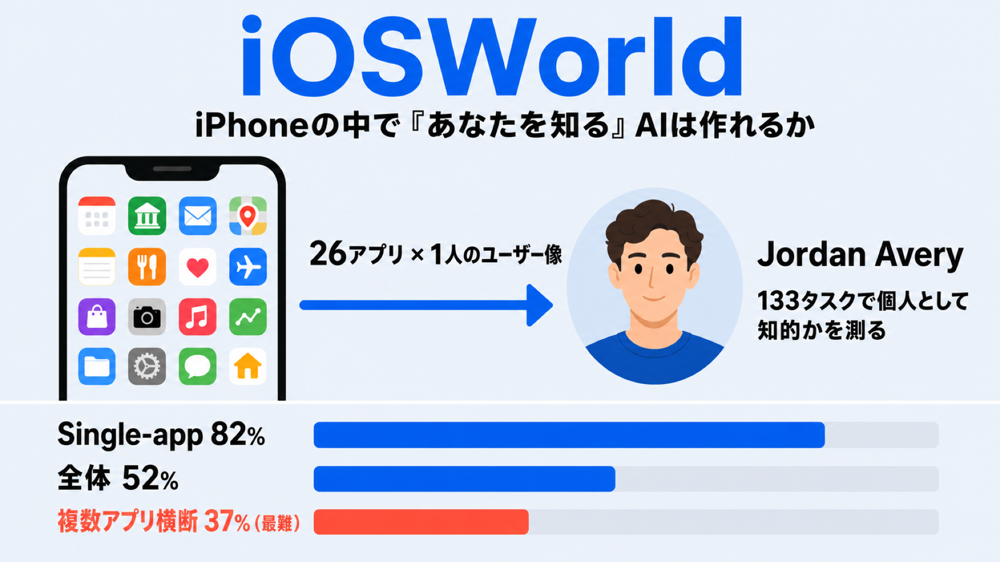

# iPhoneの中で「あなたを知る」AIは作れるか — 26アプリ横断ベンチマーク iOSWorld

## この論文のひとことまとめ

スマートフォンを自動で操作する AI エージェントを評価する新しいベンチマーク「iOSWorld」を提案した論文です。これまでのベンチマークが扱ってこなかったネイティブ iOS を対象とし、26 個の自作アプリに「Jordan Avery」という 1 人の架空ユーザー像を共有させ、アプリをまたいで個人データを推論できるかを 133 個のタスクで測ります。Claude や GPT-5.4 といった最新モデルを評価した結果、最良の設定でも全体の正答率は 52% にとどまり、複数アプリにまたがるタスクでは 37% まで落ち込みました。エージェントが「個人として知的（personally intelligent）」に振る舞えるかには、まだ大きな隔たりがあることを示しています。

## なぜこの研究が重要か

スマートフォンの操作を肩代わりしてくれる AI エージェントは、実用化が期待される分野です。ただ、本当に役立つには「設定画面のボタンを正しく押せる」だけでは足りません。論文はこう指摘します。「設定画面で正しいボタンをタップできても、所有者の最も一般的な通勤ルートを見つけられないエージェントは、有用な能力を示したとは言えない」（§1）。

つまり、私たちが日々スマートフォンに残している履歴・好み・人間関係といった「個人の文脈」を読み取って動けるかどうかが、実用性の分かれ目になります。ところが、これを測るための土台がこれまで存在しませんでした。本研究は、その評価基盤を初めて用意した点に意義があります。

## 背景：何が問題だったのか

既存のモバイルエージェント向けベンチマークには、2 つの空白がありました。

1 つ目は、対象プラットフォームの偏りです。これまでのベンチマークは Android・Web・デスクトップを対象にしており、ネイティブ iOS を扱う対話型のものが存在しませんでした。論文によれば、iOS は 25 億台を超えるアクティブデバイスがあり、米国のモバイル OS 利用の 58〜60% を占めるにもかかわらず、評価の対象外だったといいます（§1）。iOS は Android と UI の作り・画面遷移のパターン・アクセシビリティ基盤（画面要素を機械が読み取るための仕組み）が異なるため、Android 向けの知見をそのまま流用できません（§2.2）。

2 つ目は、評価の中身です。従来のベンチマークは、アプリに永続的なユーザーデータがなく、アプリ間のつながりも、実在ユーザーという概念もありませんでした。結果として、孤立したサンドボックス（隔離された箱庭）の中で指示どおり操作できるかを測るだけにとどまっていました。アプリにユーザー像を埋め込み、アプリ間に散らばった個人データへの推論を評価したものは、どのプラットフォームにもなかったのです（§2.2）。

なお本研究は、すでに研究が蓄積されている Web ブラウジング中心のタスクは対象外とし、ネイティブ iOS アプリと、そこに蓄えられた個人データに焦点を絞っています（§1）。

## 提案手法：何をしたのか

### 中心となる考え方：personally intelligent

論文の中核にあるのは **personally intelligent（個人として知的）** という概念です。これは、ユーザーの identity（人物像）・履歴・好みを、デバイス上に実在するデータとして推論する能力を指します。指示を箱庭の中でこなすだけの実行能力とは区別されます（§1）。

### 26 アプリと 1 人のユーザー像

iOSWorld は 26 個のアプリを自作し、すべてに単一のユーザー像「Jordan Avery」を共有させました。サンフランシスコ在住、Northstar Studio に勤務し、ハーフマラソンの練習中という 31 歳の人物です（§3.2）。

ポイントは、データがアプリをまたいで相互に参照される設計です。たとえば、フードデリバリーアプリ QuickBite で Chipotle に注文を入れると、銀行アプリ MyBank に請求が生まれ、メールアプリ Mail に領収書が届く、といった具合です（§3.2）。連絡先（Maya Patel ら）も複数アプリに横断して登場します。アプリは finance・messaging・travel・food など 10 のライフドメインにまたがり、Claude Code を補助として SwiftUI で開発したうえで人手で検証されています（§3.2）。

### エージェントはどう iOS を操作するか

評価環境は、部分観測マルコフ決定過程（POMDP、環境の状態が完全には見えない状況を数式で表す枠組み）として定式化されています（§3.1）。実際の動作としては、macOS 上で Appium と XCUITest というツールを使い、Xcode が管理する iPhone シミュレータを制御します。各タスクは、26 アプリすべてがインストール・データ投入済みの決まった初期状態から始まります（§3.1）。

エージェントが画面から受け取る情報（観測）には、2 つのモード（モダリティ）があります（§3.1）。

- **vision-only**: 各ステップでスクリーンショットだけを受け取る。
- **vision+XML**: スクリーンショットに加え、XCUITest 経由で取り出したアクセシビリティツリー（画面の各要素の種類・名前・値・座標などを構造化した木）を XML 形式で受け取る。最大 200 要素・深さ 15 階層に制限される。

ここで重要なのは、vision+XML は「特権アクセス（privileged access）」として扱われる点です。この XML を取り出すには Mac と Xcode が必要で、実際に配布されたエージェントは利用できません。そのため論文は、vision-only の数値が現実の運用能力を、vision+XML が特権ありの理論上限を表すものと位置づけています（§3.1、限界の節）。

操作（アクション）は、両モードで共通の tap・type・swipe・home・wait・stop の 6 種類が基本です。vision+XML ではこれに加え、要素の識別子を指定する正確な tap や、アプリの起動・終了、URL を開く操作が使えます（§3.1, Table 1）。最新の computer-use モデル（スクリーンショットを見て操作を生成するエージェント）は、1 層の変換レイヤを挟むことで iOS に適応させています（クリックを tap に、スクロールを向きを反転した swipe に変換するなど）（§3.1）。

### 3 種類の難易度でタスクを設計

133 個のタスクは、3 つの難易度に分かれています（§3.3, Table 2）。

- **Single-app（27 個）**: 1 つのアプリ内での基本的な操作。
- **Multi-app（60 個）**: 2〜8 個のアプリをまたいで情報を移す。
- **Memory and personalization（46 個）**: 明示されていない隠れたパターンを発見する必要がある。例として「最も一般的な通勤ルートは？」「最も頻繁に注文するレストランを見つけて再注文せよ」などがあります。

Memory and personalization のタスクでは、1 タスクあたり平均 4.4 個のアプリを使います（§3.3）。採点は、LLM-as-a-Judge という手法を使い、GPT-5.4-Mini が操作の軌跡（スクリーンショット・アクション・最終回答）を一通り見て、合格／不合格を返します（§3.1）。

## 結果：何が分かったのか

評価したのは、フロンティアモデル 5 つ（Claude Opus 4.6、Claude Sonnet 4.6、GPT-5.4、GPT-5.4 Mini、Gemini 3 Flash）と、オープンソースの Qwen3.5 35B-A3B の計 6 モデルです。それぞれを vision-only と vision+XML の両方で評価し、12 構成を比較しました。各タスクは 50 ステップを上限としています（§4.1）。

### 全体の正答率はまだ低い

最も良い vision+XML 構成でも、全体の正答率は 52% でした。内訳は single-app が 82%、memory が 54%、multi-app が 37% で、複数アプリにまたがる multi-app が最も難しいカテゴリです（Abstract, §4.2）。最高記録としては、Sonnet が single-app で 93% を達成しています（§4.2, Table 3）。一方、オープンソースの Qwen3.5 は全体 11% で最下位でした（§5）。

### 「特権アクセス」XML が効くモデル・効かないモデル

XML を追加すると、大きなモデルでは正答率が伸びました。全体スコアの改善幅は、Opus が 26%→52%（+25.6 ポイント）、Sonnet が 29%→47%（+18.0 ポイント）、GPT-5.4 が 20%→40%（+19.5 ポイント）です（Fig.8, §4.2）。Gemini だけは +0.8 ポイントとほぼ変化しませんでした。

XML が効く理由を分析すると、vision-only で失敗し vision+XML で成功した Opus の 26 タスクのうち、約 70% にホーム画面やアプリ切り替えの失敗が含まれていました。アプリを直接起動する操作（launch app）がそれを取り除いたのです。改善幅は memory カテゴリで最大で、Opus は 9%→54% に跳ね上がりました（§4.3）。

興味深いのは、小型モデルでは XML がむしろ逆効果になる点です。GPT-5.4 Mini は 26%→16% へ低下し（-10.5 ポイント）、vision-only で解けていた 35 タスクのうち 22 が XML 下で失敗しました。Qwen3.5 も 13%→11% へ下がりました。原因として論文は、GPT-5.4 Mini では 1 ステップあたり約 3,100 トークンの増加が、扱える文脈の予算を超えてしまったと説明しています（Fig.8, Fig.10, §4.3）。

### なぜ失敗するのか

フロンティアモデルの vision+XML での失敗 422 件を分類すると、最多は budget exhausted（50 ステップを使い切った）で 51%、次いで gave up（途中で諦めた）26%、premature stop（早すぎる完了報告）23% でした（Table 6, §4.3）。budget exhausted は multi-app（55%）と memory（52%）で特に多く、エージェントが長い手順をやり切れずに息切れする様子がうかがえます。Qwen3.5 では、失敗 119 件の約半分が同じ操作を 3 回以上繰り返すアクションループで、最大では 38 回連続で同じ swipe を続けた例もありました（§4.3, Fig.11）。

### 効率と、インターフェースの影響

ステップ効率では、Gemini 3 Flash が vision-only でタスク平均 21 ステップと最も効率的でした（Anthropic / OpenAI 系は 42〜45 ステップ）（§4.2, Table 3）。

また、失敗の多くがインターフェースに起因していることを示す結果もあります。Qwen3.5 にアプリ別の構造化された操作ツール（MCP、たとえば「食事を記録する」「送金する」といった型付きの操作）を与えると、正答率は 12.8%→24.8%（+12.0 ポイント）に改善しました（Appendix E, §4.3）。画面を読んで操作する難しさそのものが、性能を大きく押し下げていたわけです。

採点の信頼性についても検証されています。LLM による採点と人間の判断を Opus 4.6 の 128 軌跡で比較したところ、タスク単位で κ=0.77（一致率 89%）と高い一致を示しました（§4.3, Appendix J）。

## 意義と限界

iOSWorld の意義は、永続的なユーザー像を持つアプリ群を 26 個そろえ、ネイティブ iOS 上で「個人として知的」に振る舞えるかを初めて測れるようにした点にあります。環境とコードはオープンソースとして公開されており、新しいタスク・人物像・アプリを追加できます。論文は、モバイルエージェント研究の基盤を提供し、デプロイにおける個人最適化（personalization）重視への流れを後押しすると主張しています（§5）。

一方で、論文自身がいくつかの限界を認めています（Ethics Statement ほか）。

- すべてのデータは合成です。Jordan Avery は架空の人物で、実在ユーザーのデータは使っていません。
- iOSWorld は macOS と Xcode の iOS シミュレータを必要とし、Apple のハードウェアを持つ研究者に再現性が限られます。非 Mac 研究者向けには、EC2 で管理された Mac インスタンスを使う AWS-runner が公開されています。
- iOS が非公開（closed-source）であるため、vision+XML は配布済みエージェントには使えない開発者ツール（XCUITest）に依存します。よって vision-only の数値が現実の運用能力を、vision+XML は特権ありの上限を表します。
- 評価は単一の人物像（Jordan Avery）に限られ、複数の人物像での評価は今後の課題とされています。
- 自律的に動く電話エージェントには二重用途（dual-use）のリスク（監視・不正取引・ソーシャルエンジニアリング・データ流出）が伴います。論文は明示的なユーザー同意の仕組みと、取り消せない操作の確認を推奨しています。
- これらの結果は、実デバイスや実ユーザーデータへのデプロイ準備が整ったことを意味しないと明記されています。

ギャップを埋めるには、ループから抜け出す回復力の強化、操作と視覚のグラウンディング（画面と操作の正確な対応付け）の改善、そしてユーザー履歴を意識した計画立案が必要だと結論づけています（§5）。

## まとめ

iOSWorld は、26 アプリに 1 人のユーザー像を共有させたネイティブ iOS 向けの対話型ベンチマークで、エージェントが個人の文脈を読み取れるかを 133 タスクで測ります。最新モデルでも最良で全体 52%・複数アプリ横断で 37% にとどまり、失敗の半分は手順の途中での息切れ（50 ステップ使い切り）でした。スマートフォン上で本当に「あなたを知る」AI を作るには、まだ多くの課題が残っていることを示す研究です。

## 用語集

- **personally intelligent（個人として知的）**: ユーザーの人物像・履歴・好みを、デバイス上のデータとして推論するエージェントの能力。本論文の中心概念。
- **vision-only / vision+XML**: エージェントが画面から受け取る情報のモード。前者はスクリーンショットのみ、後者はアクセシビリティツリー（XML）を追加する。XML は配布済みエージェントには使えない「特権アクセス」扱い。
- **アクセシビリティツリー（accessibility tree）**: UI 要素の種類・名前・値・座標などを構造化した木。iOS では XCUITest 経由で取得する。
- **computer-use agent / CUA**: スクリーンショットを理解して操作を生成するエージェント。
- **LLM-as-a-Judge**: エージェントの操作の軌跡全体を、別の LLM（本論文では GPT-5.4-Mini）に合格／不合格で採点させる手法。
- **失敗モード（budget exhausted / gave up / premature stop）**: それぞれ、50 ステップを使い切った失敗／途中で諦めた失敗／早すぎる完了報告による失敗。
- **POMDP（部分観測マルコフ決定過程）**: 環境の状態が完全には観測できない状況を扱う数学的枠組み。本論文は評価環境をこれで定式化している。
- **MCP（per-app structured tools）**: アプリごとに型付きの操作を公開する構造化ツール層。Qwen3.5 の正答率を 12.8%→24.8% に改善した。

## 原論文

- iOSWorld: A Benchmark for Personally Intelligent Phone Agents（https://arxiv.org/abs/2606.09764）
