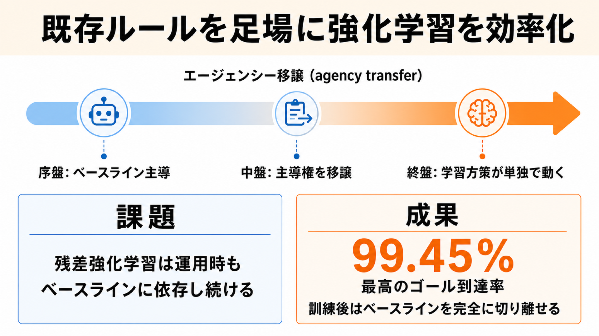

# 「動くけど最適ではない」既存ルールを足場にして強化学習を効率化する手法

## この論文のひとことまとめ

すでに手元にある「課題はこなせるが性能はいまひとつ」という既存のルールベース制御（ベースライン方策）を、強化学習（reinforcement learning, RL）の訓練に組み込む手法を提案した研究です。訓練の序盤はこの既存ルールに強く頼り、学習が進むにつれて少しずつ主導権（agency）を学習中のニューラルネットワークへ移していきます。訓練が終わるころには既存ルールを完全に切り離し、それ単独で動くニューラルネットワーク方策が残ります。しかもその方策は、元のベースラインを上回る性能と、訓練の最初から最後までを通じた高いゴール到達率を両立しました。

## なぜこの研究が重要か

強化学習をゼロから訓練するのは、想像以上に手間のかかる作業です。報酬の設計、環境のチューニング、ハイパーパラメータの調整、そして長時間の計算資源が必要で、熟練した技術者でも動くものができるまでに時間がかかります。

一方で、現実の多くの制御問題には「とりあえず動くもの」がすでに存在します。物流のヒューリスティックな経路探索、金融のルールベース戦略、安定性は保証するけれどエネルギー効率は悪いロボット制御器、ゲームのルールベース AI などです。これらは最適ではないものの、ゼロではありません。

この論文の発想は「その既存資産を捨てずに、強化学習の足場として使い倒す」というものです。ゼロから学ぶよりも効率よく、しかも最終的には元の既存ルールを上回る方策を得ることを狙います。

## 背景：何が問題だったのか

既存ルールを RL に活かそうとする発想自体は新しくありません。最も近い関連手法は**残差強化学習（residual RL）**と呼ばれるもので、この論文でも主要な比較対象として扱われています。

残差強化学習は、実際に実行するアクションを「ベースラインのアクション＋学習した補正（残差）」という足し算で作ります。考え方はシンプルですが、ここに弱点があります。足し算で構成している以上、訓練が終わって運用（デプロイ）する段階になっても、ベースラインを呼び出し続けなければなりません。つまり既存ルールへの依存が永遠に残るのです。

この論文が目指すのは、訓練中はベースラインの力を借りつつ、訓練後にはそれをきれいに切り離し、学習方策だけで自立して動ける状態にすることです。

## 提案手法：何をしたのか

手法の中心にあるのは**調停モジュール（arbitration module）**と呼ばれる仕組みです。各時刻で「ベースライン方策のアクション」と「学習方策のアクション」のどちらを実際に実行するかを判断します。

実行アクションは、2 つの方策の確率的な混ぜ合わせとしてサンプリングされます。混ざり具合は**混合係数（mixing coefficient）** αt という 0 から 1 の値で表され、これが「学習方策のアクションを採用する確率」にあたります。

### どちらのアクションを採るかの判断ルール

学習方策のアクションを採用する（αt = 1 とする）のは、次の 2 つの条件の **どちらか** が成り立つときです。

- **改善が確認できたとき**: 学習方策のアクションに対する critic（Q 関数。状態と行動から将来の期待報酬を見積もる補助モデル）の評価値が、そのエピソード内のこれまでの最高値を、一定のマージン ν 以上上回ったとき。
- **確率的にチャレンジするとき**: ある確率条件（時間とともに減衰する閾値を乱数が下回るかどうか）を満たしたとき。

どちらも満たさなければ、安全側に倒してベースラインのアクションにフォールバックします。

著者らはこの設計を、最適化手法の**焼きなまし法（simulated annealing）**になぞらえて説明しています。改善が見込めるアクションは確実に採用し、必ずしも改善が見込めないアクションも温度（ここでは時間で変化する確率）に応じて受け入れる、という「制御されたリスクテイク」です。

### 主導権を少しずつ移していく

この仕組みのカギは、判断ルールの中にあるスケジュールパラメータ prel と λ です。これらは「学習方策をどれだけ信頼するか」を表し、エピソードをまたいで少しずつ大きくしていきます。最終的に両方を 1 にすると、確率条件は常に成立するようになり、ベースラインがまったく関与しない純粋な強化学習と一致します。

その結果、訓練の流れは次のように変化します。

1. **序盤**: ほとんどのアクションをベースラインが生成する。学習方策はまだ未熟だが、ベースラインのおかげで最初からゴールに到達できる。
2. **中盤**: 学習方策が採用される割合が（平均的にほぼ直線的に）増えていく。
3. **終盤**: ある有限の遷移時間 Ttran を過ぎると、αt は常に 1 になる。以降ベースラインは一切呼ばれず、学習方策（単独のニューラルネットワーク）が自立して動く。

この「主導権を渡していく」過程が、論文タイトルにある **agency transfer（エージェンシー移譲）** です。

### 残差強化学習との違い

冒頭で触れた残差強化学習との対比を整理すると、違いは明快です。

- 残差強化学習は足し算で構成するため、運用時もベースラインに依存し続ける。
- 本手法は「どちらを実行するか」を切り替える（スイッチング）機構なので、訓練後にベースラインを完全に取り除ける。

また本手法は、土台となる強化学習アルゴリズム（**バックボーン**と呼ばれる。TD3・SAC・PPO・DDPG など標準的なものを使える）の critic や方策の更新部分には手を加えません。アクションの選び方だけを最小限変えるだけで済むのも特徴です。

## 結果：何が分かったのか

評価には 2 つの環境が使われました。

1. **汚染領域を避ける水中ドローン（AUV）のナビゲーション**: 汚染された領域を避けつつ目標地点に到達する課題。ベースラインは PD 制御器（proportional-derivative control。目標との誤差とその変化の速さからゴールへ向かう、古典的で単純な制御器）でゴールへ向かうものの、汚染領域は考慮しません。
2. **宝を集めるロボット**: 動く宝を回収しながらゴール領域に到達する課題。ベースラインはゴールへ直進するだけで、宝を取りに行きません。

いずれもバックボーンとして TD3 と SAC を使い、それぞれについて「素のバックボーン（vanilla）」「残差強化学習」「提案手法」を比較しました。全アルゴリズムを 300 万環境ステップ、10 個の独立した乱数シードで訓練しています。遷移時間 Ttran は 270 万ステップに設定され、270 万〜300 万ステップの区間は学習方策が完全に単独で動作します。

### ゴール到達率

提案手法は両環境で、比較対象すべての中で **最も高いゴール到達率** を達成しました。しかも訓練を開始した直後から高い到達率を示し、ベースラインを切り離した後（270 万ステップ以降、ベースラインの影響がちょうどゼロになる区間）も、単独で動く学習方策が最高の到達率を維持しました。

水中ドローン環境の最終段階（270 万〜300 万ステップ）の結果は次のとおりです（ゴール到達率は高いほど良く、回避スコア（Avoidance score）は汚染領域への侵入の大きさを表し低いほど良い、最良は 0）。

| 手法 | ゴール到達率(%) | 回避スコア |
|---|---|---|
| 提案手法（TD3 ベース） | 99.15±0.58 | 0.0100±0.0031 |
| 残差 TD3 | 95.60±3.75 | 0.0207±0.0132 |
| TD3 | 76.35±25.47 | 0.0150±0.0104 |
| 提案手法（SAC ベース） | 99.45±0.50 | 0.0052±0.0031 |
| 残差 SAC | 99.10±1.07 | 0.0115±0.0076 |
| SAC | 90.25±29.43 | 0.0065±0.0048 |
| ベースライン方策 | 100±0 | 0.54±0.18 |

ベースライン方策はゴール到達こそ完璧（100%）ですが、汚染領域への侵入を表す回避スコアが 0.54 と大きく、汚染を避けられていません。提案手法はゴール到達をほぼ保ちつつ、回避スコアを 2 桁小さく抑えています。

宝を集めるロボット環境の最終段階の結果は次のとおりです（Combined はゴール到達率と宝回収率の平均）。

| 手法 | ゴール到達率(%) | 宝回収率(%) | Combined |
|---|---|---|---|
| 提案手法（TD3 ベース） | 94.11±3.85 | 99.78±0.10 | 96.95±1.92 |
| 残差 TD3 | 76.15±6.01 | 99.27±0.76 | 87.71±2.92 |
| TD3 | 31.69±13.27 | 99.89±0.14 | 65.79±6.67 |
| 提案手法（SAC ベース） | 85.05±11.01 | 99.56±0.35 | 92.31±5.53 |
| 残差 SAC | 66.62±18.70 | 98.86±1.09 | 82.74±9.48 |
| SAC | 11.04±10.36 | 99.78±0.30 | 55.41±5.22 |
| ベースライン方策 | 100±0 | 17.30±37.84 | 58.65±18.92 |

ここでもベースライン方策はゴールには必ず到達しますが、宝はほとんど取れていません（回収率 17.30%）。提案手法は両方を高い水準でこなし、Combined スコアで他を引き離しています。

### 学習曲線とちょっとした注意点

エピソードごとのリターン（学習曲線）で見ても、提案手法は他手法より優れているか、最悪でも同等でした。

なお、訓練の終盤でゴール到達率がわずかに下がる現象も観察されています。これは想定どおりの挙動だと著者らは説明しています。終盤はベースラインの補正がほぼ消えるため、有限の長さのエピソード内で学習方策のミスを補いきれなくなるからです。

### 理論的な裏付け

論文は実験だけでなく理論解析も与えています。一定の仮定の下で、訓練中の合成方策がベースラインのゴール到達特性（**ε-improbable goal-reaching property**。任意の初期状態から確率 1 − ε 以上でゴールへ近づく性質）を受け継ぐことを示しました。さらにベースライン除去後の単独方策についても、ゴール到達確率の明示的な下界を導いています。ただし著者らは、これらを厳密な「保証」ではなく、訓練を通じて高いゴール到達率が観測される理由の理論的な解釈として位置づけています。

## 意義と限界

この手法の意義は、「すでに動くベースラインがある状況」で報酬整形やハイパーパラメータ調整の手間を大きく減らせる点にあります。学習方策がまだ未熟な訓練の最初から課題をこなせるため、ゼロから学ぶよりも効率的に、かつ最終的にベースラインを上回る方策を得られます。

一方で、論文は次の限界・留意点も率直に認めています。

- 理論解析の一部（合成方策の到達特性に関する定理）は「保証」ではなく解釈として提示されており、無限長エピソードを前提とした設定に基づいています。
- 訓練終盤にゴール到達率がわずかに低下します（有限の長さのエピソードに起因する効果）。ベースライン除去後は、ゴール到達確率が軌道分布のずれに応じて多少劣化しうることが理論的にも示されています。
- 評価環境は「ゴールが明確に定義でき、ベースライン方策を数式で書ける」よう意図的に選ばれています。複雑な歩行（Humanoid など）はベースラインを作ること自体が難しく、逆に振り子のように単純すぎる課題も除外されました。つまり、ベースラインを用意できない問題には直接は適用しづらいことを示唆します。

なお、実装と動作の比較動画は公開リポジトリ（https://github.com/aidagroup/calf-enhance）で参照できます。

## まとめ

この研究は、「動くけれど最適ではない既存ルール」を強化学習の足場として組み込み、訓練の進行とともに主導権を学習方策へ移していく手法を提案しました。残差強化学習と違って運用時にベースラインを切り離せる点が特徴で、2 つの制御環境でベースラインも残差手法も上回るゴール到達率を、訓練の最初から最後まで達成しました。動くベースラインが手元にあるなら、それを捨てずに活かすという実践的な選択肢を示した研究といえます。

## 用語集

- **ベースライン方策（baseline policy）**: 課題はこなせるが最適ではない、訓練に組み込む既存の制御ルール。
- **学習方策（learning policy）**: 訓練対象となるニューラルネットワークの方策。
- **調停モジュール（arbitration module）**: 各時刻にベースラインと学習方策のどちらのアクションを実行するか決める仕組み。
- **エージェンシー移譲（agency transfer）**: 訓練が進むにつれて、制御の主導権をベースラインから学習方策へ徐々に移すこと。
- **混合係数 αt（mixing coefficient）**: 学習方策のアクションを採用する度合いを表す 0〜1 の値。
- **critic（Q 関数 Qw）**: 状態と行動から将来の期待報酬を見積もる補助モデル。
- **残差強化学習（residual RL）**: ベースラインと学習した補正の足し算でアクションを作る関連手法。運用時もベースラインに依存し続ける。
- **バックボーン（backbone RL）**: 本手法の土台となる標準的な強化学習アルゴリズム（TD3・SAC・PPO・DDPG など）。
- **Ttran（遷移時間）**: 学習方策へ完全に主導権を移すまでのステップ数（実験では 270 万）。
- **ε-improbable goal-reaching property**: 任意の初期状態から確率 1 − ε 以上でゴール集合へ近づく方策の性質。

## 原論文

- An Agency-Transferring Model-Free Policy Enhancement Technique（https://arxiv.org/abs/2606.09825）
