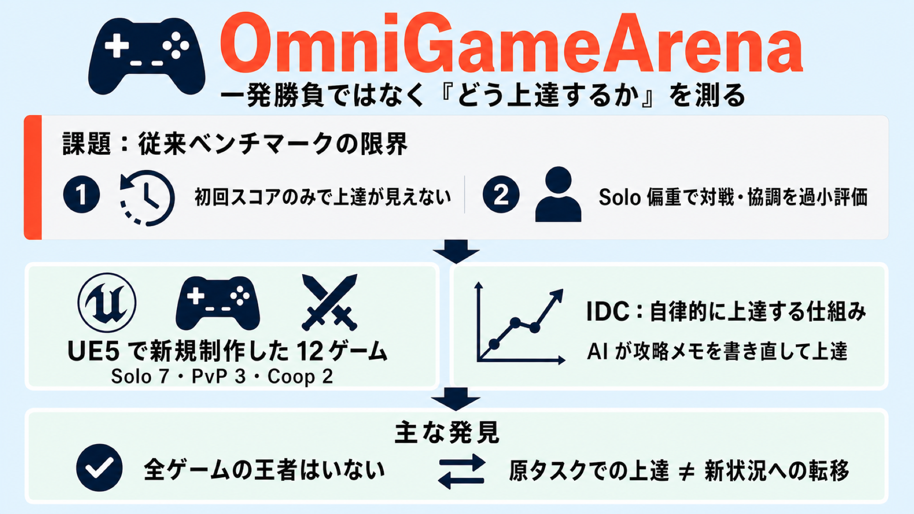

# ゲームで AI エージェントを試す新ベンチマーク OmniGameArena —— 一発勝負ではなく『どう上達するか』を測る

## この論文のひとことまとめ

ゲーム画面を見て操作する AI エージェント（画像と言葉を扱う Vision-Language Model、VLM）を評価するために、ゲームエンジン Unreal Engine 5（UE5）で新規に作った 12 本のリアルタイムゲームからなるベンチマーク「OmniGameArena」を提案した論文です。単独プレイだけでなく対戦と協調も含み、しかも「1 回プレイした初回スコア」ではなく「何度も挑戦してどう上達していくか」という軌跡を測る点が新しい特徴です。あわせて、AI 自身が過去のプレイを振り返って攻略メモ（スキル）を書き直し、自律的に上達していく仕組み「Improvement Dynamics Curve（IDC）」も導入しました。実験からは、どの最先端モデルも全ゲームで支配的ではないこと、そして「原タスクでの上達」と「学んだスキルが新しい状況へ通用するか（転移）」が必ずしも一致しないことが分かりました。

## なぜこの研究が重要か

基盤モデル（大規模な事前学習済みモデル）は、いまや「何を答えるか」だけでなく「どう行動するか」で評価される時代に入っています。ゲームはその行動能力を試すストレステストとして格好の題材です。リアルタイムで状況が変わり、画面を見て素早く判断し、操作で結果を出す必要があるからです。

しかし著者らは、既存のゲームベンチマークには 2 つの限界があると指摘します。1 つ目は、多くが「初回 1 回のスコア（first-attempt score）」しか報告せず、繰り返し遊ぶうちにエージェントがどう改善するかの軌跡が見えないこと。2 つ目は、単独プレイ（Solo）に偏っていて、対戦（PvP）や協調（Coop）といった設定が過小評価されていることです。対戦や協調では、相手を読む・役割を分担する・仲間のミスから立て直すといった、単独プレイとは別種の能力が問われます。

加えて、商用 VLM・公開されている VLM・ゲーム専用に作られた制御モデルといった異なる種類のエージェントを、同じ条件で比べる統一的な仕組みも欠けていました。この研究はこれらの課題に正面から取り組んでいます。

## 背景：何が問題だったのか

既存のゲームベンチマークの多くは、市販のゲームタイトルを再利用しています。これには見落としがちな落とし穴があります。事前学習データへの混入（pre-training contamination）です。

つまり、有名なゲームであればその攻略情報がインターネット上にあふれており、モデルが学習段階で「答え」を読んでしまっている可能性があるのです。これでは、モデルがその場で考えて行動したのか、覚えていた知識を思い出しただけなのかを区別できません。ベンチマークとしての信頼性が損なわれます。

そこで本研究は、評価のために独自のゲームをゼロから作るという方針を取りました。

## 提案手法：何をしたのか

提案は大きく 2 つです。新しいベンチマーク「OmniGameArena」と、自己改善の仕組み「IDC」です。

### OmniGameArena：UE5 で新規制作した 12 ゲーム

著者らは UE5 で 12 本のゲームを新たに作りました。内訳は、単独プレイ（Solo）7 本、対戦（PvP）3 本、協調（Coop）2 本です。たとえば Solo には障害物を走り抜ける ObstacleRun3D、波状の敵を生き延びる LastStand、的を撃つ MonsterShoot などがあります。各ゲームの進捗は 0 から 1 の連続値に正規化され、たとえば ObstacleRun ならスタートからゴールまでの到達割合、LastStand なら生存時間の割合でスコアが決まります。

このベンチマークの工夫は次のとおりです。

- **統一されたアクションインターフェース**：キーボード・マウス操作とゲームパッド操作を用意し、アダプタ（プロンプトをキー入力へ変換する仕組みなど）を介して、種類の異なるエージェントを同じリアルタイム環境につなげます。これにより、商用 VLM もゲーム専用モデルも同じ土俵で比較できます。
- **7 つの能力次元での採点**：各ゲームを、視覚認識（VP）、空間ナビゲーション（SN）、反応速度（RT）、記憶（MEM）、計画（PLN）、対戦（ADV）、協調（COOP）の 7 つの観点で 0〜3 点に分類し、どのゲームがどの能力を問うかを明示しています。
- **汚染回避（contamination avoidance）**：公開前に「ウェブ露出監査（web-exposure audit）」を行い、ゲーム名・タスク文・ルール記述・スコア条件をネット上から除外しました。素材の一部には UE5 のマーケットプレイス資産も使っていますが、組み合わせ・レベル形状・スクリプトの実行順・成功条件はすべて独自設計です。

### IDC：AI が自分で攻略メモを書き直して上達する仕組み

IDC（Improvement Dynamics Curve、改善ダイナミクス曲線）は、エージェントが複数ラウンドにわたって自律的に上達していく様子を「曲線」として測る仕組みです。構造は 2 層になっています。

1 層目は **1 エピソードごとのループ**です。エージェントはゲーム画面（RGB フレーム）を含む観測を受け取り、操作を返します。VLM には直近の観測と応答のペアを数件さかのぼって履歴として渡し、1 回の呼び出しで複数枚の画像をまとめて見せます。

2 層目は **振り返りの外側ループ**で、ここが本手法の核心です。次の 3 要素で動きます。

- **経験の獲得（experience acquisition）**：いまのスキル（攻略メモ）で K 回プレイし、平均スコアをそのラウンドのスコアとします。最初のラウンド（Round 0）はスキルを空にして基準値を測ります。
- **振り返り（reflection）**：「振り返り役（reflector）」と呼ばれる LLM が、新しいプレイ記録と過去の蓄積（メモと旧スキル）を読み、4 段階で作業します。記録を調べる Explore、失敗の原因を言語化する Diagnose、独立した判定役の LLM がマップの丸暗記や診断との矛盾を棄却する Validate、そして採用するスキルを確定する Distill です。
- **永続的な蓄積（persistent state）**：プレイヤーには見せない経験メモ（最大 2000 トークン）、現ラウンドのスキルプロンプト（最大 1200 トークン）、そして各ラウンドのスコアの列を保持します。

ここで重要なのは、モデルの重み（パラメータ）は一切更新しないことです。改善はあくまで自然言語で書かれたスキルプロンプトという「明示的な成果物」の上で起こります。著者らはこれを「ヒューリスティック学習（heuristic learning）」パラダイムの具体化と位置づけています。

さらに、スコアがそれまでの最高値を大きく下回ったとき（具体的には最高スコアの半分を割ったとき）に、最も良かったスキルへ巻き戻す「ベストスキル・ロールバック（best-skill rollback）」も備えています。下手に書き換えて性能が崩れるのを防ぐ安全装置です。

こうして R ラウンド繰り返して得られるスコアの列が、その（エージェント、ゲーム）の組に対する改善ダイナミクス曲線です。同じ最終スコアでも、早く上達するか後で伸びるか、なめらかに伸びるか振動するかで曲線の形は変わります。

## 結果：何が分かったのか

評価では 12 のエージェントを 3 種類に分けて比較しました。商用 VLM（Claude Opus 4.7 / 4.6、Claude Sonnet 4.6、GPT-5.5、GPT-5.4、Gemini 3.1 Pro、Gemini 3.1 Flash-Lite、Kimi K2.5）、公開されている VLM（Qwen3.5 の 2 種類）、そしてゲーム専用ポリシー（NitroGen、Open-P2P）です。各（エージェント、ゲーム）の組は 5 エピソードで評価しました。なお、以下の主な表は推論時間を無料扱いにして純粋な判断品質を測るモード（PDQ）での結果です。

主な知見は次のとおりです。

- **どの単一モデルも支配的ではない**：Solo の 7 ゲームでは、GPT-5.5 が 4 ゲームでトップに立つ一方、Claude Opus 4.6 は CueChase で大差勝ち（0.840 対 次点 0.580）、Gemini 3.1 Pro は MonsterShoot でトップ（0.710 対 次点 0.464）でした。首位はゲームごとに入れ替わります。
- **「新しい＝強い」ではない**：Claude Opus 4.6 が 7 ゲーム中 5 つで Opus 4.7 を上回り、GPT-5.4 が SceneEscape で GPT-5.5 を上回りました。能力の順位はタスク固有で、リリース順どおりに一直線には並びません。
- **公開 VLM とゲーム専用ポリシーは通用しなかった**：Qwen3.5 はどちらのチェックポイントも全ゲームで 0.15 未満にとどまり、複数ゲームでちょうど 0.00 でした。NitroGen と Open-P2P もほぼ全ゲームでほぼゼロに崩れました。
- **対戦には「非推移性」がある**：SkyDuel と CrystalGuard では Solo の順位どおりの明確な強弱関係が見られました。ところが MidlineClash では順位が一巡せず、Kimi K2.5 が Claude Opus 4.6 に対し 5 戦全勝（1.00）しました。Solo では Claude の方が強いにもかかわらず、です。じゃんけんのように相性が循環する現象です。
- **協調はまだ難しい**：Coop の 2 ゲームでは GPT-5.5 が両方でトップ、Gemini 3.1 Pro が僅差の 2 位でしたが、最強モデルでも SharedFloor で 0.368、HandoffRun で 0.184 にとどまりました。Qwen3.5 は両ゲームでちょうど 0.000 で、共有作業もハンドオフも 1 つも完了できませんでした。LLM 同士の協調は未解決の能力ギャップだと位置づけられています。

### IDC による上達と、その「転移」のずれ

IDC は LastStand（Solo）と SharedFloor（Coop）で実施しました。4 つのエージェント（Claude Opus 4.6 / 4.7、GPT-5.5、Gemini 3.1 Pro）が 10 ラウンド × 各 5 エピソードを実行しています。

- **どのモデルも基準ラウンドを上回るスキルを発見しました**。LastStand では最良ラウンドで生存率が +0.54〜+0.70（相対で +130%〜+437%）改善し、SharedFloor では 1 エピソードあたり 1〜4 件多くタスク（配達オーダー）を完了しました。
- **ピークは最終ラウンドではなく中盤に来る**のが典型でした。LastStand では 2 つの Opus モデルが最良ラウンドと最終ラウンドの間で 0.40〜0.52 を失う一方、GPT-5.5 と Gemini はほぼ利得を保持しました。この差が、前述のベストスキル・ロールバックの存在意義を裏づけています。
- **原タスクでの上達と、新しい状況への転移は一致しない**：学んだベストスキルを、未見の 3 つの変種（VAR1〜VAR3）に適用して通用するか（転移するか）を調べました。
  - SharedFloor では普遍的に転移しました。16 ケースすべてが正の利得（+6%〜+56%、1 エピソードあたりおよそ 1〜2 件のタスク追加完了に相当）です。これはスキルが空間の丸暗記ではなく、「仲間の位置と所持品を確認する」「重複はゴミ箱で捨てる」といった協調のコツを符号化していたためです。
  - 一方 LastStand では結果がばらつきました。GPT-5.5 は 3 変種すべてで正に転移する唯一のモデルでしたが、原タスクの利得は最小（+130%）でした。逆に Opus 4.7 は原タスクで +201% と大きく伸びたものの、全変種で負に転移しました。
  - つまり「原タスクでの上達が大きいこと」と「その学びが新しい状況へ通用すること」は必ずしも一致しません。この乖離が、変種実験の中心的な知見です。

なお付録では、推論にかかる遅延をゲーム時間に課金するモード（LCRT）での評価も報告されています。MonsterShoot のように素早い反応を要するゲームほど遅延に弱く、逆に LastStand のように最適手がほぼ静止しているゲームでは、一部モデルがむしろ改善しました。

## 意義と限界

この研究の意義は、ゲームエージェントの評価を「1 回の初回スコア」から「上達の軌跡」と「学んだスキルが未見の状況へ通用するか」へと拡張した点にあります。汚染回避も成果が出ており、スクリーンショットを見せたときの認識率 0.0%・メカニクス漏洩 50.0% は、既存ベンチマーク（いずれも 66.7〜100%）より大幅に低い値です。これは「その場で考えて行動する能力」を測れていることの裏づけになります。

著者らは限界も率直に述べています。

1. **IDC の範囲**：計算資源の制約から、IDC 実験は 2 環境（LastStand と SharedFloor）× 各 3 変種 × 4 エージェントにとどまります。ゲーム・変種・モデルの規模拡大は今後の課題です。
2. **単一スキル形式**：振り返り役は毎ラウンド丸ごと置き換える 1 つの有界なスキルプロンプトを保持するだけで、スキルを少しずつ積み上げていく成長型のライブラリではありません。
3. **プレイヤーと振り返り役が同一モデル**：各エージェントはプレイ役と振り返り役に同じモデルを使っています。弱いプレイヤーと強い振り返り役を組み合わせるような非対称構成が異なる結果を生むかは、まだ検証されていません。

## まとめ

OmniGameArena は、UE5 で新規制作した 12 ゲームと、AI が自分で攻略メモを書き直して上達する IDC を組み合わせた、ゲームエージェント向けの統一ベンチマークです。最先端モデルでも全ゲームを制覇できる単独の王者はおらず、何より「原タスクでうまくなること」と「学びが新しい状況に通用すること」は別物だという発見が、今後のエージェント研究にとって重要な示唆になります。

## 用語集

- **VLM（Vision-Language Model）**：画像と言語をともに扱う基盤モデル。本研究ではゲーム画面を見て操作を出力するエージェントとして評価される。
- **Solo / PvP / Coop**：それぞれ単独プレイ、対戦（player-vs-player）、協調（cooperative）の 3 つの相互作用形態。
- **IDC（Improvement Dynamics Curve）**：複数ラウンドの振り返りを通じたスコア推移を「曲線」として測る、自己改善の仕組みであり観測対象。
- **Reflector（振り返り役）**：プレイ記録を読み、ツールを使って自律的にスキルプロンプトを書き直す LLM。Explore / Diagnose / Validate / Distill の 4 段階で動く。
- **スキル（skill prompt）**：ゲーム固有の戦略を自然言語でまとめた有界なプロンプト（最大 1200 トークン）。重みを更新せずに行動を改善する手段。
- **Contamination（汚染）**：事前学習データへゲーム情報が混入し、モデルが「答え」を覚えてしまう問題。公開前のウェブ露出監査で回避する。
- **PDQ / LCRT**：2 つの時間計測モード。PDQ は推論時間を無料扱いし純粋な判断品質を測り、LCRT は推論の遅延をゲーム時間に課金する。
- **転移（transfer）／未見変種（held-out variant）**：学んだスキルが、訓練時とは異なる新しいタスク変種でも通用するか。各ゲームに 3 つの変種が用意されている。

## 原論文

- OmniGameArena: A Unified UE5 Benchmark for VLM Game Agents with Improvement Dynamics（https://arxiv.org/abs/2606.09826）
