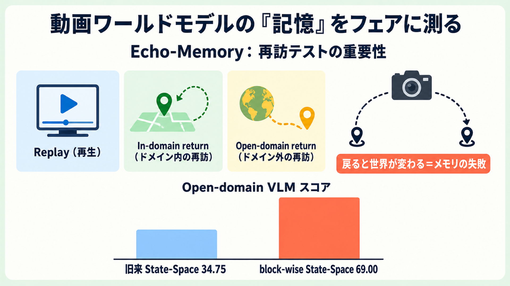

# 動画ワールドモデルの「記憶」をフェアに測る：Echo-Memory が示した再訪テストの重要性

## この論文のひとことまとめ

カメラ操作に応じて動画を生成し続ける「行動条件付きワールドモデル（action-conditioned world models）」では、カメラがいったん離れて元の場所に戻ったときに、同じ世界をきちんと保っていられるかが問われます。本研究 Echo-Memory は、生成器の本体や学習・評価の仕組みをすべて固定したうえで、過去をどう記憶するかという「メモリ機構」だけを差し替える統制実験を行いました。その結果、従来よく使われる再生（replay）系の指標だけではメモリの良し悪しを測れないこと、そして状態を構造的に持ち回る block-wise の再帰機構が「再訪（return）」の場面で最も強いことを示しています。

## なぜこの研究が重要か

最近の動画生成モデルは、最初の 1 枚の画像とテキスト、そして「カメラをどう動かすか」という行動の列を入力に、まるでゲーム世界の中を歩き回るように映像を作り続けられるようになってきました。こうしたモデルは action world model（行動条件付きワールドモデル）と呼ばれます。

ところが、この種のモデルには厄介な弱点があります。カメラがある場所から離れて、しばらく別の方向を映したあとに元の場所へ戻ってくると、いつの間にか世界が静かに変わってしまうのです。論文の著者らはこれを「メモリの失敗（memory failures）」と位置づけます。具体的には、戻ってきたらシーンが変わっている、目立っていた物体がもっともらしい別物にすり替わっている、生成のチャンク（区切り）境界でそれまでの文脈が消える、といった現象です。

問題は、どのメモリ設計が本当に効くのかを公平に比べる手段がなかったことです。これまでの研究では、メモリの工夫と、モデル本体・学習レシピ・与える文脈の量・サンプリング手法・評価方法の違いがすべて絡み合っていました。そのため「メモリ機構そのものの効果」だけを取り出して比較するのが難しかったのです。

## 背景：何が問題だったのか

著者らは、メモリ機構をフェアに比べることを妨げてきた落とし穴を整理しています。

- 生の文脈（過去のフレーム）を増やせばたいてい良くなりますが、それは単に手がかりが増えただけかもしれず、「賢いメモリ機構」とは限りません。
- 履歴を圧縮する手法は、トークン（計算の基本単位）のコストが演算の内部に隠れると効率的に見えますが、肝心の「どれだけ証拠を保持できたか」は測られていませんでした。
- 学習データと似た軌跡で評価すると、見慣れたテクスチャのおかげで、物体の同一性（object identity）が失われても局所的にそれらしく描き直せてしまい、メモリの実力を過大評価してしまいます。

つまり、いくつかの指標が良いからといって「記憶力がある」と判断するのは危険だ、というのが出発点です。

## 提案手法：何をしたのか

Echo-Memory は新しい生成モデルを提案するものではありません。「過去をどう表現するか」をきれいに切り分けて比べるための、統制された比較フレームワークです。

中核は、メモリを次の 4 つのファミリーに整理したことです。

- **Context**：過去の観測フレームを、そのまま追加の入力トークンとして与える方式。
- **Compression（圧縮）**：履歴を重み付けし直したり短く縮めたりして、コストを下げる方式。
- **Spatial（空間サマリ）**：時間方向に積み重なった履歴を、コンパクトな「シーンを表すトークン」に置き換える方式。
- **State-Space（状態空間再帰）**：再帰（recurrence）の仕組みで履歴を内部状態として暗黙的に持ち回る方式。

この 4 ファミリーを使うことで、メモリを capacity（容量）・compression（圧縮）・read-out（読み出し）・recurrence（再帰）という 4 つの軸に分解して比べられるようにしています。read-out とは、保存した証拠を生成器が戻ってきた時点で実際に使えるかという「読み出しのアクセスのしやすさ」のことで、保存（storage）とは区別される概念です。

公平な比較を支える主な工夫は次のとおりです。

- **共通の本体**：事前学習済みの動画向け diffusion-transformer（DiT）を全条件で共有します。DiT とは、動画を生成する拡散モデルを Transformer で構成したものです。学習には rectified-flow という生成手法を使います。これは、ノイズから生成物へ向かう変化の方向（velocity field）を一気に回帰で学習する単段の目的関数です。学習の監督は生成対象のフレームだけに当てます。
- **行動の表し方**：カメラの動きは、フレームごとの 12 次元の相対カメラ姿勢（回転 9 成分＋並進 3 成分）で表します。各セグメント先頭フレームを基準にした相対表現に統一しています。
- **文脈の与え方**：いま生成するセグメントに対し、過去の観測から K 個の文脈を渡します。先頭は必ず参照点となるアンカー観測で、残りは retriever（検索器）が履歴から選びます。確率 0.1 で取得フレームをわざと落とし、文脈が欠けた状態からの開始（cold-start）を模擬する正則化も入れています。
- **統一メモリインターフェース**：各設定は「保存タイプ・文脈長・圧縮ルール・読み出し経路・再帰構造」からなる小さな「メモリプロファイル」で指定します。両立しない組み合わせ（たとえば 2 種類の State-Space の同時使用）はプロファイルの段階で禁止します。

このように、本体・学習・サンプラー・評価を固定し、変える要素をメモリ表現だけに絞ったのが Echo-Memory の肝です。

## 結果：何が分かったのか

評価は「再生（replay）」「ドメイン内の再訪（in-domain return）」「ドメイン外の再訪（open-domain return）」の三分岐プロトコルで行います。replay はデータセットのカメラ軌跡をそのままなぞって画質（PSNR / SSIM / LPIPS。いずれも生成画像が正解にどれだけ近いかを測る画質指標）を測ります。in-domain return は正解データに裏打ちされた 180 度ループでの一貫性を測ります。open-domain return は、学習に使っていない編集済みの最初のフレームから始め、カメラをいったん 45 度横へ動かしてから元へ戻すプローブで、戻ってきた世界の意味的一貫性を測ります。open-domain の意味スコアは VLM（視覚言語モデル）を判定者として、物体の見た目・存在・視点・シーンを重み付けして採点します。

主要な実験データセットは Context-as-Memory データセットで、各サンプルは 81 フレーム・解像度 352×640。学習は 8 枚の A100-80G GPU で計 5,000 ステップ、文脈長 K は 1・5・20 を比較し、既定値は 5 です。

分かったことのうち重要なものを挙げます。

- **replay は健全性のシグナルにすぎず、最終的なメモリスコアにはならない。** replay の各指標で勝者がバラバラで、Spatial Memory は replay の PSNR が最良、長い生 Context は replay の SSIM / LPIPS が最良、そして block-wise の State-Space は open-domain の VLM スコアが最良でした。指標ごとに別のファミリーが勝つのです。

- **生の Context は強い容量ベースライン。** open-domain の VLM スコアは、文脈数 K=1 で 12.25、K=5 で 50.75、K=20 で 58.63 と伸びました。一方で replay 系の画質指標の改善はずっと小さいままでした。利得の大半は K=5 までに現れ、K=20 はわずかながら意味のある上乗せを与えます（利得は文脈量に対して頭打ち気味＝sublinear）。

- **block-wise の State-Space が open-domain の再訪で最強。** この方式は replay の PSNR こそ低い（9.59）ものの、open-domain の VLM スコアは 69.00 に達しました。これは旧来の hybrid な State-Space（34.75）からほぼ倍増です。replay が低いのに再訪が最強という事実が、「replay 単独ではメモリスコアとして不十分」という主張の裏付けになっています。block-wise State-Space は状態を DiT に構造的に統合し、カメラが見える手がかりを離れてもネットワークが状態を回避できないようにした再帰です。

- **保存と読み出しは別物。** Spatial Memory では、保存したトークンを生成器にあえて渡さない設定（inject-none）が replay 系で最良になりました。これは、replay の改善が「使えるメモリ」ではなく正則化の副産物でありうることを示します。専用の参照機構（cross-attention）で読み出すと open-domain の VLM スコアは 17.12 まで改善しますが、生 Context や block-wise State-Space には遠く及びません。

- **圧縮は単純な容量つまみではない。** 時間方向に縮める長さ圧縮（r=4）は open-domain で 43.25 と、重み付けのみ（22.38）を上回りました。しかし長さ圧縮と重み付けを組み合わせた hybrid 圧縮は 8.75・9.00 と最悪の失敗例になりました。圧縮を「交換可能なメモリ節約トリック」として扱うことへの反証です。

判定者（VLM）の妥当性も検証されています。基準の Qwen3-VL-30B-A3B（平均 19.6）に対し、Claude Opus 4.6・GPT-5.5・人間の採点はいずれも平均で数点以内、相関は 0.90 を超えました。判定者を替えてもメモリプロファイルの相対的な順位は保たれるということです。

著者らはこれらを 5 つの Finding にまとめています。要約すると、(1) open-domain return が最も識別力のあるストレステストである、(2) 空間サマリは効率的だがまだ意味記憶として信頼できない、(3) 圧縮は再訪に効く証拠を保持しなければならず単なるコスト削減ではない、(4) block-wise の再帰が現状最強の open-domain メモリで、暗黙的メモリは構造が重要、(5) 生 Context が容量ベースラインであり、コンパクトな手法は「K=20 の open-domain の利得をどれだけ保持できるか」で評価すべき、というものです。

## 意義と限界

この研究の意義は、メモリ機構を公平に比べる土台を作ったことにあります。本体・最適化・サンプラー・評価を固定したことで、「カメラ追従の上手さ」と「行動が残した世界を保持する力」を切り分けられるようになりました。さらに、replay・in-domain・open-domain を 1 つの数値に潰さず、別々の証拠として報告する三分岐プロトコルを提示しています。著者らは、将来の生成器ほど「もっともらしい代替物を作り出す（hallucinate）」のが上手くなるため、再訪に特化した意味チェックがないと質的な失敗を見落としやすくなる、と警告し、本プロトコルがその歯止め（guardrail）になると主張します。

一方で、論文が認める限界もあります。

- 単一データセットで学習しているため、姿勢のノイズが多い場合・カメラの統計が異なる場合・より大きな計算資源や多段階の学習を使った場合には、メカニズムの順位が変わりうる。
- open-domain のスコアは VLM 判定者に依存している。複数判定者でのチェックは有望だが、より広範な人間による較正があれば比較はさらに強固になる。
- 再訪の品質は、まだ学習中に安価に使えるシグナルにはなっておらず、モデル選択は不完全な代理指標に頼らざるを得ない。
- 報告された各設定は統制された比較行列の代表点であり、各メモリファミリーの最終的な実装ではない。

今後の方向として著者らは、メモリ設計を明示的に「再訪を意識した（revisit-aware）」ものにすること、たとえば物体レベルの保持を促す補助的な学習信号や、戻ってきた世界と元の世界を揃える対照学習などを挙げています。

## まとめ

Echo-Memory は、動画ワールドモデルのメモリ機構を統制実験でフェアに比較し、replay 指標だけではメモリの良し悪しを判断できないことを実証しました。鍵となる教訓は、評価を再生・再訪に分けて見ること、そして状態を構造的に保つ block-wise の再帰が再訪の場面で頭一つ抜けて強いことです。

## 用語集

- **action world model（行動条件付きワールドモデル）**：最初のフレーム・テキスト・カメラ行動列を受け取り、区切り単位で動画を生成し続けるモデル。再訪をまたいでジオメトリや物体の同一性を保つことが求められる。
- **memory failure（メモリの失敗）**：カメラが離れて戻ったときにシーンが変わる・物体がすり替わる・チャンク境界で文脈が消える失敗。一般的な生成失敗とは区別される。
- **4 つのメモリ軸**：capacity（容量）・compression（圧縮）・read-out（読み出し）・recurrence（再帰）。従来は混同されていた軸を Echo-Memory が分離した。
- **Replay / In-domain return / Open-domain return**：三分岐評価。Replay は正解軌跡をなぞった画質、In-domain return は正解に裏打ちされた 180 度ループの一貫性、Open-domain return は学習外の編集フレームと 45 度の離脱・復帰プローブでの意味的一貫性。
- **read-out（読み出し）**：保存したメモリの証拠を、戻ってきた時点で生成器が実際に使えるかというアクセスのしやすさ。保存（storage）とは区別される。
- **block-wise State-Space（SSM）**：状態を生成器（DiT）に構造的に統合し、ネットワークが状態を回避できないようにした再帰機構。本研究で open-domain return が最強だった。
- **VLM-as-judge**：視覚言語モデル（VLM）を判定者に使い、生成結果の意味的一貫性を採点する仕組み。本研究では Qwen3-VL-30B-A3B を基準に用いた。

## 原論文

- Echo-Memory: A Controlled Study of Memory in Action World Models（https://arxiv.org/abs/2606.09803）
