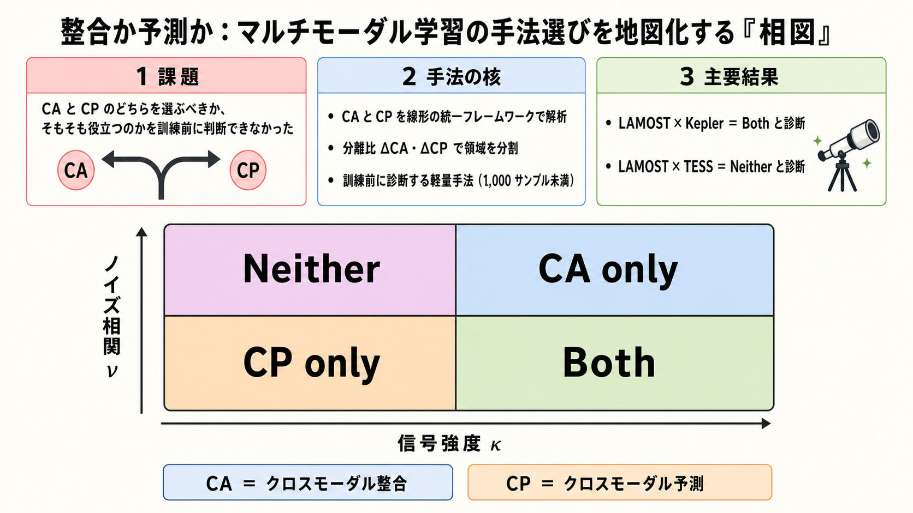

# 整合か予測か：マルチモーダル学習の手法選びを地図化する「相図」

## この論文のひとことまとめ

画像とキャプションのように、対になった異なる種類のデータ（モダリティ）から共通の構造を学ぶ「マルチモーダル表現学習」には、大きく分けて 2 つの流派があります。本研究は、この 2 つを線形モデルのもとで統一的に解析し、「どんな問題のときにどちらが成功し、どちらが失敗するか」、さらには「そもそもマルチモーダル学習が役立つのか」を一枚の地図（相図）として描き出しました。加えて、少量のラベル付きデータから、訓練を始める前に自分の問題がこの地図のどこに位置するかを診断する手法を提案し、合成データから実際の天体観測データまでで検証しています。

## なぜこの研究が重要か

マルチモーダル学習の代表的な 2 つの手法は、これまで別々に研究されてきました。そのため実務者は、経験的にうまくいった手法や、扱いやすいアーキテクチャを選んでいるだけで、「なぜこちらの手法が良いのか」を原理的に説明できていませんでした。

この問題はとくに、生物医学や天体物理のように、異なる計測機器で同じ対象を観測する科学分野で深刻です。標準的な手法を使っても、性能が「最も良い単一モダリティ」を下回ってしまうことがあり、その理由を診断する手立てがありませんでした。本研究は、手法選びを勘や経験ではなく、データの性質に基づいて事前に判断できる枠組みを与えます。

## 背景：何が問題だったのか

マルチモーダル表現学習とは、画像とキャプション、音声と動画、あるいは異なる望遠鏡による同じ天体の観測のように、対になった異モダリティの観測から、共有された潜在構造を抽出する技術です。

その二大パラダイムが次の 2 つです。

- **クロスモーダル整合（Cross-modal Alignment, CA）**: 対になったサンプルを共有の埋め込み空間に射影し、対応するペア同士を近づける手法。CLIP、ImageBind、VICReg が代表例です。
- **クロスモーダル予測（Cross-modal Prediction, CP）**: 情報を絞り込むボトルネックを通じて、一方のモダリティからもう一方を再構成する手法。マスク自己符号化器（masked autoencoder）や data2vec などが該当します。

この 2 つは通常それぞれ個別に研究されており、両者の相対的な強み・弱みや、どの問題にどちらが向くのかは、原理的には理解されていませんでした。既存の理論研究（Huang et al. (2021) や Lu (2023)）は「マルチモーダルが役立ちうる」ことを特定の仮定のもとで示しましたが、モダリティ固有のノイズや、タスクに無関係な構造（nuisance。以下では「無関係構造」と呼びます）、ランク不足といった現象は捉えていませんでした。本研究は「いつ機能し、いつ害になるか」、そして「CA か CP かという手法の選択そのものが重要であること」を特徴づけることを目指します。

## 提案手法：何をしたのか

### 2 つの手法を 1 つの線形の枠組みでとらえる

本研究はまず、線形エンコーダ（入力を一次変換で符号化する単純なモデル）のもとで、CA と CP の解を閉じた式で導きます。すると、CA は CCA と、CP は打ち切り型の低ランク回帰（RRR）と等価であることが出発点になります。CCA（正準相関分析）は、2 種類のデータの中から「最もよく対応し合う方向」を見つける古典的な手法です。RRR（低ランク回帰）は、一方のデータから他方を予測する際に、使う方向の数をあえて少数に絞り込む回帰の一種です。

両者の解は、2 つのモダリティの相関を表す行列を特異値分解（SVD）することで表現できます。SVD は、行列を「どの方向に」「どれだけ強く」効くかという成分に分解する操作です。CA は両モダリティを対称的にホワイトニングしてから共通方向へ射影するのに対し、CP は予測元（ソース）側だけにホワイトニングを施します。ここでホワイトニングとは、各成分の大きさを揃えてクセを取り除く前処理のことです。この処理が片側だけか両側かという非対称性が、後で出てくる「予測の方向」が重要になる理由につながります。

### 信号とノイズを分けて考える「スパイクモデル」

解析の土台として、各モダリティが「k 個の共有信号の座標」と「d−k 個のモダリティ固有な無関係構造（nuisance）の座標」に分解される、信号＋ノイズ型のモデル（スパイクモデル, spiked model）を置きます。ここでの無関係構造とは、タスクには関係しないものの、各モダリティに固有に存在する構造のことです。

本研究の特徴は、この無関係構造がモダリティ間で相関する度合い（クロスモーダルな無関係構造の相関）を明示的にモデルに組み込んだ点にあります。従来のスパイクモデル解析が見逃していたこの構造が、CP における予測元・予測先の非対称性や、後述する「どちらの手法も失敗する領域」といった現象を生み出します。

### 成功・失敗を分ける「分離比」

信号がノイズに対してどれだけ際立っているかを測る量として、**分離比（separation ratio）**を定義します。これは「信号の強さの最小値を、無関係構造の強さの最大値で割った値」で、CA 用の ∆CA と CP 用の ∆CP の 2 種類があります。この値が 1 を超えると、信号の部分空間を完全に回復できることが示されます（論文では命題 3.1 として与えられます）。

CA と CP は、失敗の仕方が相補的です。

- **CA の失敗**: CA の無関係構造の量は、0〜1 のクロスモーダル相関係数で決まります。無関係構造の分散には依存しません。ある無関係構造のモダリティ間相関が 1 に近づくと、信号の強さに関わらず信号方向が勝てなくなります。その結果、∆CA が 1 を下回ります。
- **CP の失敗**: CP の無関係構造の量は、予測先（ターゲット）側の無関係構造の分散に依存します。ターゲット側のこの分散が大きいと、ほどほどの相関でも回復が壊れます。予測元と予測先を入れ替えると、効いてくる分散も入れ替わります。そのため、「どちらの方向に予測するか」が重要になります。

### 4 つの領域に分ける「相図」

これらをまとめると、クロスモーダル信号の強さ κ（カッパ）と、正規化したノイズ相関 ν（ニュー）を 2 軸とする平面が、∆CA = 1 と ∆CP = 1 の境界によって 4 つの領域に分割されます。これが本研究の中心となる**相図（phase diagram）**です。

- **Both**: CA・CP のどちらも成功する領域。
- **CA only**: CA だけが成功する領域。
- **CP only**: CP だけが成功する領域。
- **Neither**: どちらも失敗する領域。

画像とキャプションのように視点間で支配的な構造を共有する「冗長（redundant）」なモダリティは、κ が大きく ν が小さいため、標準的な自己教師あり学習（SSL）の前提が成り立ちます。一方、多センサによる天体観測やマルチオミクスのように、各視点が構造的に異なる情報を与える「相補（complementary）」なモダリティは、ν が大きく有効な κ が小さくなり、両手法が同時に失敗する Neither 領域に押しやられます。

### 訓練前に自分の問題を診断する

最後に、少量のラベル付きサブサンプルから、訓練を始める前に自分のデータセットが相図のどこに位置するかを推定する軽量な診断手法を提案します（論文ではアルゴリズム 1 として与えられます）。推定した相関行列の特異成分を「信号」か「無関係構造」かに分類し、∆CA と ∆CP を直接推定します。潜在的なパラメータを逐一復元する必要はありません。成分の分類には、5 分割の Ridge 回帰で各成分の説明力を測り、その折れ線の「肘」を検出する方法を使います。ここで説明力は R²（決定係数）で測ります。R² は予測のあてはまりの良さを表す指標で、1 に近いほどよく当たっていることを意味します。実験では 1,000 サンプル未満で十分だったと報告しています。

この診断が信頼できるのは、各モダリティを先に単一モダリティのモデルで符号化し、その凍結した表現の上でクロスモーダルな目的を動かす「2 段階（two-stage）パイプライン」のときです。生データから一気に同時最適化する 1 段階（single-stage）の場合は信頼性が落ちます。

## 結果：何が分かったのか

理論を、合成データ、画像、そして実際の天体観測データで検証しています。非線形の実験では、CA の近似に VICReg、CP の近似に MSE による再構成を用いています（VICReg は非線形版 CCA である DeepCCA の一形式であることを根拠にしています）。

### 合成データと画像

- 合成スパイクデータでは、CP はノイズ相関 ν ≈ 0.15 で信号回復に失敗する一方、CA は ν ≈ 0.75 まで、ほぼ完璧な回復を維持しました。理論上も、∆CP は ∆CA より約 5 倍低いノイズ相関で回復の閾値（∆ = 1）を割り込みます。
- 画像データ（Stereo-dSprites と Stereo-3DShapes）では、CA は無関係構造が完全相関（ν = 1）のときに失敗し、CP は逆の挙動を示しました。CA と CP の優劣が入れ替わる地点は、両データセットで νmax ≈ 0.8 とよく一致しました。
- MS-COCO（実画像とキャプション）では、CP の非対称性がはっきり現れました。画像からテキストへ予測する CP は、ノイズが小さいとき CA を約 10 ポイント上回ります。しかし画像側のノイズが増えると、性能は単調に劣化しました。一方、テキストから画像へ予測する CP は、画像側の摂動の影響をほとんど受けず平坦でした。これは「∆CP は予測元側の量だけに依存する」という線形理論と一致します。CA は全体を通じて画像ノイズに鈍感でした。

### 実天体物理データ（最も鋭い検証）

同一の分光エンコーダ（LAMOST）を、品質の異なる 2 つの測光機器（Kepler と TESS）と組み合わせて検証しました。

- **LAMOST × Kepler は「Both」レジーム**（推定 ∆CA = 1.13, ∆CP = 2.22）と診断され、すべてのタスクで CA か CP の少なくとも一方が、最良の単一モダリティのベースラインに並ぶか上回りました。たとえば年齢（age）の推定では、LAMOST が弱いため CA が測光信号を捉え、LAMOST 単独より R² で +0.19 改善しました。
- **LAMOST × TESS は「Neither」レジーム**（推定 ∆CA, ∆CP ともに 1 未満）と診断され、どのタスクでも、どのクロスモーダル手法も LAMOST 単独を上回れませんでした。その差は seed による分散を大きく超えるものでした。
- **CP の方向の非対称性**も確認されました。表面重力（logg）や連星性（binarity）では、信号をより直接的に符号化している分光（LAMOST）から測光へ予測する向きが成功し、逆向きは失敗しました。一方、年齢では測光の自転周期がより直接的な手がかりを与えるため向きが逆転し、逆向きの予測（R² = 0.497）が順向きを上回りました。

### 「分散の罠」

CP は CA より低い再構成誤差（MSE）を達成しながら、「誤った部分空間」を回復してしまうことがあります。MSE という目的関数そのものは、信号と無関係構造を区別しないためです。本研究はこれを「分散の罠（variance trap）」と呼んでいます。

## 意義と限界

本研究の意義は、実務者がモデルの訓練に着手する前に、自分のマルチモーダル問題を診断し、正しい目的関数と予測方向を選べる枠組みを提供した点にあります。分離比 ∆CA・∆CP が問題を 4 つのレジームに分け、「どちらの手法が成功するか」だけでなく「そもそもクロスモーダル訓練が役立つか否か」までを決めることを示しました。

限界と今後の課題として、本研究は **Neither レジーム**を最も重要な未解決問題として提起しています。これは、各計測機器が構造的に異なる視点を与えるものの、CA・CP のどちらのパラダイムも共有信号を抽出できない領域で、相補的な科学モダリティが自然に置かれる場所です。ここから抜け出すには、ペアごとのクロス共分散を超えた目的関数（高次の構造、補助的な教師信号、モダリティ固有の事前分布など）が必要だろうと著者らは推測しています。

また、本研究の解析は線形のケースで厳密解を導き、それを非線形へ転移する形を取っています。回復レジームの推定は 2 段階パイプラインのときに最も直接的に成り立ち、1 段階の場合は信頼性が下がる点にも注意が必要です。

## まとめ

本研究は、マルチモーダル学習の二大手法である整合（CA）と予測（CP）を統一的な線形フレームワークで解析し、分離比を軸に問題を Both / CA only / CP only / Neither の 4 領域へ分ける相図を導きました。さらに、少量のラベルから訓練前に自分の問題を相図上に位置づける診断手法を提案し、合成データから実天体観測データまでで予測の妥当性を確認しています。

## 用語集

- **クロスモーダル整合（Cross-modal Alignment, CA）**: 対サンプルを共有埋め込み空間に射影し、対応ペアを近づける手法。線形では CCA と等価。代表例は CLIP、ImageBind、VICReg。
- **クロスモーダル予測（Cross-modal Prediction, CP）**: ボトルネックを通じて一方のモダリティから他方を再構成する手法。線形では打ち切り型低ランク回帰（RRR）と等価。
- **スパイクモデル（spiked model）**: 各モダリティを k 個の共有信号座標と d−k 個のモダリティ固有な無関係構造（nuisance）座標に分解する統計モデル。
- **無関係構造（nuisance）／クロスモーダルな無関係構造の相関**: タスクに無関係でモダリティ固有な構造（nuisance）と、それがモダリティ間で相関する度合い。CA・CP の失敗を分ける鍵。
- **分離比（separation ratio）∆CA, ∆CP**: 信号の強さの最小値を、無関係構造の強さの最大値で割った量。1 を超えると信号部分空間を完全回復できる。
- **相図（phase diagram）**: 信号強度 κ とノイズ相関 ν の平面を、Both / CA only / CP only / Neither の 4 領域に分ける図。境界は ∆CA = 1, ∆CP = 1。
- **冗長 / 相補モダリティ**: 冗長は視点間で支配的構造を共有（画像・キャプション等）、相補は各視点が構造的に異なる情報を与える（多センサ天体観測、マルチオミクス等）。後者が Neither 領域に対応。
- **VICReg**: 分散・不変・共分散の正則化を用いた自己教師あり学習手法。本論文では非線形 CA の近似として使用。
- **LAMOST / Kepler / TESS**: 天体物理実験のデータ源。LAMOST は地上分光、Kepler・TESS は宇宙からの測光。下流ターゲットは連星性・表面重力・年齢。

## 原論文

- When to Align, When to Predict: A Phase Diagram for Multimodal Learning（https://arxiv.org/abs/2606.11190）
