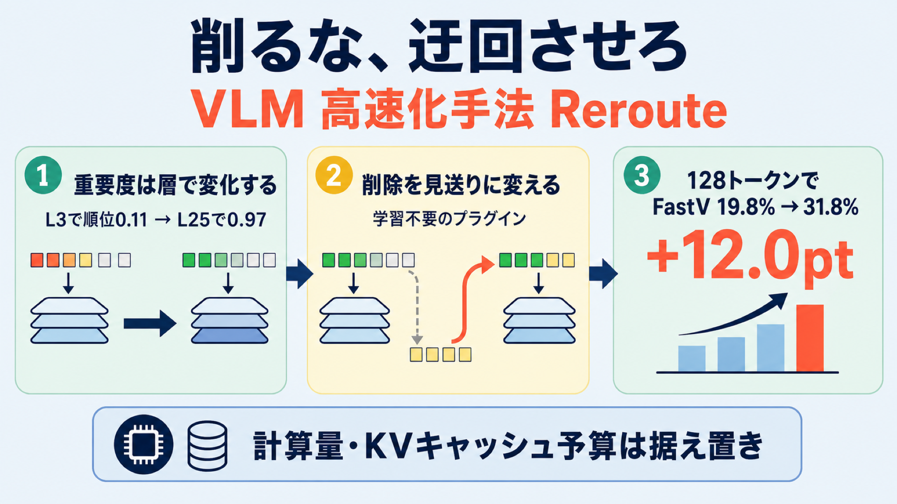

# 削るな、迂回させろ：視覚トークンを「消さずに見送る」VLM 高速化手法 Reroute

## この論文のひとことまとめ

画像を扱う AI（視覚言語モデル、VLM）を高速化するとき、これまでは画像由来の「視覚トークン」を重要度順に並べ、下位を**永久に削除**するのが定石でした。この論文は、削除する代わりに低スコアのトークンを「いったん見送る」だけにして、後の処理段階で再び選び直せるようにする手法 **Reroute** を提案します。計算量（TFLOPs）と KV キャッシュのメモリ予算は従来と同じに保ったまま、特に削減率が厳しい状況で、画像内の指示対象を特定する精度を改善しました。追加の学習を一切必要としない、既存手法に差し込めるプラグインである点が特徴です。

## なぜこの研究が重要か

VLM は画像を 1 枚あたり数百〜数千個の「視覚トークン」に変換してから言語モデルに入力します。トークンが多いほど推論は重くなります。アテンション計算はトークン数の二乗で、KV キャッシュ（過去トークンの情報を保持するメモリ）はトークン数に比例して増えるためです。

そこで広く使われてきたのが「視覚トークンの削減」です。重要そうなトークンだけ残して、残りを捨ててしまえば軽くなる、という発想です。しかしこの「捨てる」操作は元に戻せません。本当に必要なトークンを序盤で捨ててしまうと、取り返しがつかなくなります。

この論文は、その「不可逆な削除」こそが性能低下の原因だと指摘し、削除をやめて「見送り」に置き換えるだけで問題が和らぐことを示します。仕組みがシンプルで、学習不要のまま既存手法に上乗せできるため、実用面での意義が大きい研究です。

## 背景：何が問題だったのか

既存の視覚トークン削減手法は、表現は違っても共通して「rank-and-remove（順位付けして削除）」というレシピに従っています。各トークンにスコアを付けて並べ、上位の少数を残し、残りを不可逆に削除する、というものです。代表例には次のような手法があります。

- **FastV**: デコーダの早い層で 1 回だけ、テキストから視覚トークンへのアテンションを使って枝刈りする。
- **PDrop（PyramidDrop）**: 1 回ではなく、多段階の漸進的なスケジュールで少しずつ削っていく。
- **FEATHER / Nüwa**: 空間的な手がかりを保てるように、スコアの付け方を改良する。

これらはいずれも「あるトークンの重要度は、デコーダのどの深さで見てもだいたい同じ」という暗黙の前提に立っています。序盤で重要度が低ければ、後でも低いはずだ、という想定です。

ところが著者らの分析によれば、この前提は成り立ちません。視覚トークンの重要度は、層が深くなるにつれて変化するのです。論文の Figure 2 では、ある正解トークン（「緑のシャツの男性（man in green shirt）」の正解領域の中にあるトークン）のアテンションの順位（パーセンタイル）が、FastV が枝刈りする L3（第 3 層）では 0.11、PDrop が枝刈りする L8 では 0.25 と低く、両手法ともこのトークンを不可逆に削除してしまいます。しかし同じトークンは L25（第 25 層）では 0.97 まで上昇します。浅い層では注意がぼんやり広く散らばり、対象に関連する領域は中〜深層になって初めてくっきり現れるのです。

この「序盤で捨てたものは二度と戻らない」性質が、深刻な結果を招きます。論文の Figure 1 によれば、視覚トークンを 88.9% 削減した状況では、3 つのバックボーン（基盤モデル）にわたってグラウンディング（指示表現が指す対象の領域特定）が崩壊し、IoU（重なり度合いの指標）が 0.4 を下回りました。

## 提案手法：何をしたのか

中核のアイデアは、スコアを付けた後の「アクション」を変えることだけです。削除する代わりに、**回復可能な見送り（recoverable deferral）**にします。スコアの付け方、どの層でルーティングを行うか、各段階でどれだけ残すかという予算スケジュールは、既存の枝刈り手法のものをそのまま再利用します。新しい学習も追加パラメータも要りません。

仕組みは次のとおりです（論文の Figure 3）。デコーダをいくつかのステージに分割し、各ルーティング層で「テキスト→視覚アテンション」を順位の信号として使い、上位の一定割合のトークンを選びます。選ばれたトークンだけがアテンションと FFN（順伝播ネットワーク）の処理を通ります。ここまでは枝刈りと同じです。

違うのは、選ばれなかった「見送りトークン」の扱いです。枝刈りなら削除されますが、Reroute では削除しません。残差パス（処理をスキップして次へ渡す経路）を通って当該ステージを素通りし、次のルーティング判断のときに**全視覚トークンの集合に対して**改めて評価されます。つまり、L3 で見送られたトークンも、後でスコアが上がれば L15 で再び選ばれ得るのです。

枝刈りとの違いは、候補集合の遷移という観点で見るとたった 1 点に集約されます（論文の式 (2)）。

- **枝刈り**: 次のステージの候補を、今回選んだトークンだけに縮める。
- **Reroute**: 毎ステージ、候補を全トークン集合へ復元する。

この見方をすると、従来の枝刈りは「見送ったトークンの再入場確率を 0 に固定した退化ケース」と位置づけられます。Reroute はその確率を 0 でなくす、と言い換えられます。

効率の面では、各ステージでアテンションと FFN に入るのは選択されたトークンだけ（個数 K は保持率 r とトークン総数の積）です。そのため理論上の計算量と KV キャッシュの規模は、元にした枝刈りスケジュールと同じクラスに保たれます。なお実際のレイテンシ（実行速度）は、gather/scatter（選んだトークンを集めて並べ替え、また元の位置へ戻す処理）といった処理カーネル（GPU 上で動く演算ルーチン）や KV キャッシュの実装に依存します。

著者らは、この手法を Mixture-of-Depth（MoD）スタイルの条件付き計算を VLM の視覚トークン削減に**学習不要**で持ち込んだもの、と整理しています。MoD は通常は学習したルータを使いますが、Reroute は枝刈りがすでに計算しているテキスト→視覚アテンションのスコアをそのままルーティング信号に流用するため、追加学習が要らないのです。

## 結果：何が分かったのか

評価では、グラウンディングを RefCOCO / RefCOCO+ / RefCOCOg で Acc@0.5（IoU 0.5 でのバウンディングボックス精度）により測り、一般的な VQA（視覚質問応答）を GQA、TextVQA、MME、POPE、ScienceQA、MMBench、MMMU、SEED などで測りました。モデルは LLaVA-1.5-7B、Qwen2.5-VL-7B、Qwen3.5-9B-Hybrid を使い、各手法を「予算を一致させた」Reroute 変種と比較しています。

**グラウンディングの改善（LLaVA-1.5、HuggingFace 形式、Table 1(b)、平均 Ratio）**

- 192 トークン（66.7% 削減）: FastV 45.5% → FastV+Reroute 59.2%、PDrop 71.3% → PDrop+Reroute 82.3%。
- 128 トークン（77.8% 削減）: FastV は 19.8% → 31.8%（+12.0pt）、PDrop は 53.4% → 61.2%（+7.8pt）。
- 64 トークン（88.9% 削減）: 1 回しか枝刈りしない FastV は回復の余地がほぼなく、0.6% → 0.6% とほとんど改善しませんでした。一方、多段階で削る PDrop は 22.2% → 34.0% に改善しました。著者らはこの差を「多段の再入場機会こそが有効なルーティングのカギ」と解釈しています。

**より強いパイプラインへの上乗せ（LLaVA-1.5、オリジナル形式、Table 1(a)）**

近年の強力なベースライン Nüwa の上に Reroute を加えても、64 トークンで Nüwa 54.6% → Nüwa+Reroute 55.8% と改善が見られました。192 トークンではほぼ同等（Nüwa* 103.7% 対 Nüwa+Reroute* 103.0%）でした。

**一般 VQA の維持（LLaVA-1.5、Table 3）**

グラウンディングの改善が、他のタスクの犠牲の上に成り立っていないかも重要です。全予算（192/128/64）で Reroute は元手法と同等以上の平均 Ratio を保ちました。例えば 64 トークンで FastV 66.8% → FastV+Reroute 69.1%、PDrop 89.7% → PDrop+Reroute 91.7% です。

**他バックボーンへの転移**

- Qwen2.5-VL-7B（Table 2(a)）: 66.7% 削減で FastV 53.7% → 60.3%、PDrop 62.9% → 65.1%。77.8% 削減で PDrop 29.3% → 37.4%。88.9% 削減で PDrop 11.1% → 18.6%。削減率が厳しいほど改善幅が大きい傾向が見られました。
- Qwen3.5-9B-Hybrid（Table 2(b)）: 改善幅が最も大きく、66.7% 削減で FastV 31.1% → 77.5%、PDrop 40.0% → 77.7%。77.8% 削減で PDrop 25.8% → 59.7%、88.9% 削減で PDrop 19.3% → 37.4%。著者らはハイブリッド構成では系列レイアウト（トークンの並び）の保持が効いている可能性を指摘しています。

**効率（LLaVA-1.5、Table 4）**

64 トークン予算で、FastV+Reroute は TFLOPs と KV キャッシュを vanilla（フルモデル）比で 80% / 86% 削減、PDrop+Reroute は 77% / 83% 削減しました。Reroute による計算量のわずかな上乗せは、FastV に対する追加のルーティング段や、PDrop に対する予算一致スケジュールに由来します。

このほか ablation（要素ごとの寄与分析、Figure 5）では、ルーティング段を増やすほど概ね改善すること、2 番目のルーティング層は早〜中層に置くのが最良で、後段に挿入すると効果が薄れて単発 FastV に近づくことが示されています。また実装上の知見として、物理的に枝刈りする際は位置インデックスを詰め直さず元の視覚位置を保つ「keep-index」規約が有利であること（再採番すると精度が大きく劣化する）も報告されています。Reroute は見送りトークンを物理削除しないため、構成上もとの並びを自然に保ちます。

## 意義と限界

この研究の意義は、視覚トークン削減を「スコアリング後のアクションの選び方」という新しい軸で捉え直した点にあります。従来の枝刈りは「見送ったトークンが二度と戻らない特殊ケース」にすぎず、削除を見送りに変えるだけで、後段の層が必要とする視覚的証拠を捨てずに済みます。改善が最も大きく出るのは「削減率が厳しく」「グラウンディングを重視する」評価です。論文の要旨は「視覚トークン削減は、見送った証拠を後で回復できる選択肢を残すべきだ」というものです。

一方で、論文は次の限界も認めています。

- Reroute はアテンションスコアやルータの限界をそのまま引き継ぎます。順位付けが悪かったり予算が過度に厳しかったりすると、有用な証拠が複数ステージにわたって不活性のまま残ることがあります。
- 効率の向上は主に理論上のものです。実際の速度は、最適化された gather/scatter カーネルや KV キャッシュ管理の実装に左右されます。
- 対象はデコーダ側の削減です。エンコーダ側の圧縮、トークンのマージ、KV キャッシュの追い出しなどとは相補的ですが、それらとの組み合わせは網羅的には評価されていません。
- Qwen3.5 のようなハイブリッド構成では、ルーティングを softmax アテンションのブロックにのみ適用しています。線形アテンションの状態ダイナミクスとの相互作用は今後の課題です。

## まとめ

この論文は、VLM の視覚トークン削減における「削除」を「回復可能な見送り」へ置き換える学習不要の手法 Reroute を提案しました。計算量と KV キャッシュの予算を据え置いたまま、特に厳しい削減率でのグラウンディングを改善し、一般 VQA を保ちつつ複数のバックボーンへ転移できることを示しています。「重要度は層によって変わるのだから、序盤で捨てきってはいけない」という観察が、この手法の出発点です。

## 用語集

- **視覚トークン（visual token）**: 画像をエンコーダで変換して得られる、言語デコーダに入力されるトークン列。LLaVA-1.5 では標準で 1 枚あたり 576 個。
- **枝刈り（rank-and-remove / pruning）**: 視覚トークンをスコア順に並べ、上位だけ残して残りを不可逆に削除する従来パラダイム。
- **Reroute（回復可能なルーティング）**: 見送りトークンを削除せず残差パスで次段へ持ち越し、後段で再評価・再選択できるようにする本手法の中核。
- **グラウンディング（grounding）**: 自然言語表現が指す対象を、画像内のバウンディングボックスとして特定するタスク。RefCOCO 系で Acc@0.5（IoU 0.5）で評価する。
- **KV キャッシュ（KV-cache）**: デコーダ推論で過去トークンの Key / Value を保持するメモリ。視覚トークン数に比例して増える。
- **TFLOPs**: 計算量の指標。アテンションはトークン数の二乗で増える。
- **FastV / PDrop（PyramidDrop） / Nüwa**: 既存のデコーダ側視覚トークン枝刈り手法。FastV は早期層で 1 回、PDrop は多段階の漸進、Nüwa は空間的整合性を保つようスコア則を改良する。
- **Mixture-of-Depth（MoD）**: 各層で上位 k 個のトークンのみブロックを通し、残りは残差バイパスさせる条件付き計算手法。標準 MoD は学習ルータを使うが、Reroute は既存アテンションを流用して学習不要にする。
- **テキスト→視覚アテンション（text-to-vision attention）**: テキストトークンから視覚トークンへの注意。Reroute がルーティングの順位信号として流用する、既存の枝刈りスコア。
- **keep-index / re-index**: 物理枝刈り後に残ったトークンの位置インデックスを元のまま保つ（keep-index）か、詰め直す（re-index）か。keep-index がグラウンディングに有利。
- **gather/scatter カーネル（gather/scatter kernel）**: 選んだトークンをメモリ上で集めて並べ替え（gather）、処理後に元の位置へ書き戻す（scatter）GPU 上の演算ルーチン（カーネル）。実際の実行速度はこの実装の最適化度合いに左右される。

## 原論文

- Reroute, Don't Remove: Recoverable Visual Token Routing for Vision-Language Models（https://arxiv.org/abs/2606.12412）
