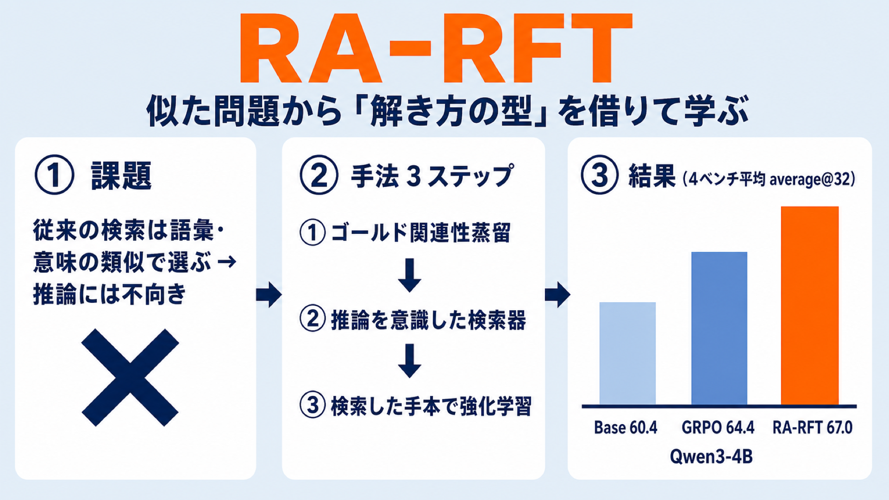

# 似た問題から「解き方の型」を借りて学ぶ — 検索を組み込んだ強化学習ファインチューニング「RA-RFT」

## この論文のひとことまとめ

大規模言語モデル（LLM）に難しい数学の問題を解かせて鍛えるとき、過去に解いた問題の「解き方の手本」を参照させると性能が上がります。ただし、見た目が似ているだけの問題を手本にしても役に立ちません。この論文は、見た目ではなく「解き方の構造が転用できるか」で手本を選ぶ検索の仕組みを作り、それを強化学習による訓練に組み込む手法 RA-RFT を提案しました。競技数学のベンチマークで、標準的な強化学習手法を一貫して上回ることを示しています。

## なぜこの研究が重要か

近年、LLM の推論能力を高める後段学習（事前学習のあとに行う追加の学習）として、強化学習が大きな成果を上げています。なかでも、答えが正しいかどうかという検証可能な信号だけを報酬にして方策を鍛える **RLVR（検証可能な報酬による強化学習、Reinforcement learning from verifiable rewards）** が有力です。

しかしこの方法には弱点があります。モデルは自分がすでに身につけた知識（パラメトリック知識）だけを頼りに問題を解こうとするため、事前学習で十分に学んでいない新しいタイプの推論が必要な問題に出会うと手詰まりになります。外から「問題の解き方」を引き込む仕組みを持っていないのです。

人間の熟練した問題解決者は、新しい問題に直面したとき、過去に解いた似た構造の問題を思い出して解法を流用します。この「アナロジー（類推）で考える」働きを LLM の訓練に持ち込めれば、モデルが自力では到達しにくい解法へ導けるかもしれません。本研究はそこに着目しています。

## 背景：何が問題だったのか

外部の知識を引き込んでモデルの出力を裏づける枠組みとして、**RAG（検索拡張生成、Retrieval-Augmented Generation）** が広く使われています。質問に関連する文書を検索して、モデルの入力に付け加える仕組みです。

ところが、従来の検索は「語彙が近い」「意味が近い」といった類似度で順位づけします。これは推論タスクには向いていません。意味的に似ている問題でも全く違う解法を要求することがありますし、逆に見た目が大きく異なる問題が同じ推論パターンを共有することもあるからです。そのため、推論モデルに検索結果を素朴に付け足しても、効果は限定的で不安定でした。

著者はこの問題を、心理学の **アナロジー的推論（analogical reasoning）** の観点からとらえ直します。熟練者は表面的な一致ではなく、根底にある推論構造が転用できるからこそ過去の問題を想起する、という考え方です。

論文の動機を表す例（Figure 1）が分かりやすいので紹介します。「x + 1/x = 5 のとき x³ + 1/x³ を求めよ」という訓練用の問題に対し、2 つの手本候補があります。

- **E1**: 見た目は似ているが、直接代入で解けてしまい推論としては無関係な問題。これを手本にするとモデルの解答品質はむしろ劣化し、報酬の信号にノイズが乗る。
- **E2**: 見た目は異なるが、同じ二項定理の戦略を共有する問題。これは転用可能な解法戦略を与え、解答品質と報酬を改善する。

求められているのは E2 を選べる検索だ、というのがこの研究の出発点です。

## 提案手法：何をしたのか

提案手法 **RA-RFT（検索拡張強化学習ファインチューニング、Retrieval-Augmented Reinforcement Fine-Tuning）** は、3 段階のパイプラインで構成されます。

中心にあるのは **推論関連性（reasoning relevance）** という考え方です。ある手本（候補となる推論トレース）でモデルを条件づけたとき、正解を出す確率がどれだけ上がるか、で手本の良し悪しを測ります。ただしこの確率を厳密に計算するのは難しいため、次のように近似します。

**1. ゴールド関連性蒸留（gold-relevance distillation）**

ジャッジ役のモデル（GPT-4o）を使い、「問題」と「候補の推論トレース（解き方の手順）」のペアごとに、その手本が対象問題に転用できる推論パターンを共有しているかを直接評価させます。結果は「関連あり（1）」「関連なし（0）」の二値ラベルになります。ジャッジが見るのは表層の類似ではなく、解法戦略・数学的構造・証明技法を共有しているかどうかです。

**2. 推論を意識した検索器の学習（reasoning-aware retriever training）**

上で作ったラベルを正解として、検索器（dense retriever）を **対照学習（InfoNCE / contrastive learning）** で訓練します。推論に本当に役立つトレースを、意味的に似ているだけで推論には無関係なトレースよりも上位にランクするよう学習させます。

**3. 検索した手本を使った強化学習ファインチューニング**

訓練が済んだ検索器を固定したまま、各訓練問題に対して上位 k 件の推論トレースを検索します。その手本で条件づけて複数の解答をサンプリングし、正誤に基づく報酬を計算して方策を更新します。実験では具体的な手法として **GRPO（グループ相対方策最適化、Group Relative Policy Optimization）** を用いています。

検索された手本は「推論の足場（reasoning scaffolding）」として働きます。難しい問題での実効的な成功率を上げることで、報酬関数や訓練カリキュラムを変えなくても報酬の信号を密にできる、というのが狙いです。

ここで一点、誤解しやすい性質を補足します。**RA-RFT は蒸留（distillation）の手法ではありません。** コーパスの手本トレースは、強化学習のロールアウト（試行）中に別の問題への文脈内の手本として使われるだけです。方策はあくまで自分自身の試行から得た検証可能な報酬のみで鍛えられ、手本の解答をそのまま真似させる損失（トークンレベルの教師あり損失）は一切使いません。

## 結果：何が分かったのか

評価には、競技数学の 4 つのベンチマーク（AIME 2024、AIME 2025、HMMT February 2025、BrUMO 2025）を使いました。指標は average@32 accuracy（1 問あたり 32 回サンプリングした平均正答率）です。対象モデルは Qwen3 ファミリの 2 サイズ、Qwen3-1.7B と Qwen3-4B です。

標準的な強化学習手法 GRPO と比べた主な結果は次の通りです。

- **AIME 2025 では、average@32 で Qwen3-1.7B が +7.1、Qwen3-4B が +2.8** の改善（GRPO 比）。
- 4 ベンチマーク全体の平均改善は **Qwen3-1.7B が +4.1、Qwen3-4B が +2.6**（GRPO 比）。
- 主要な数値（average@32、4 ベンチ平均 Avg.(all)）: Qwen3-4B は Base 60.4 / GRPO 64.4 / **RA-RFT 67.0**。Qwen3-1.7B は Base 39.6 / GRPO 43.3 / **RA-RFT 47.4**。

Qwen3-1.7B のベンチマーク別の改善（GRPO 比）は AIME24 が +4.7、AIME25 が +7.1、HMMT25 が +1.9、BrUMO25 が +2.6 でした。

学習の進み方にも特徴があります（Figure 3、Qwen3-1.7B）。RA-RFT は、学習の最初の時点では GRPO より低い精度から始まります。慣れない検索文脈に気を取られるためです。しかし学習が進むにつれて検索トレースを活用できるようになり、最終的には GRPO を大きく上回ります。最終精度が高いだけでなく、早い段階での学習も速いと報告されています。

いくつかのアブレーション（要素を取り除いて効果を確かめる実験）も興味深い結果を示しています。

- **強化学習だからこそ効く**: 教師あり微調整（SFT）に検索拡張を足しても効果はわずか（RA-SFT 40.5 vs SFT 39.7）でした。一方、強化学習に組み込むと大きく伸びます（RA-RFT 47.4 vs GRPO 43.3、いずれも Qwen3-1.7B の Avg.）。検索した手本の恩恵は、モデルに探索と外部証拠の選択的な取り込みを許す強化学習のもとで初めて引き出される、と著者は説明します。
- **検索器の質が効く**: ゴールド関連性で教師づけして検索器を訓練することが重要でした。採用した R-ModernColBERT（後期相互作用・多ベクトル検索）をファインチューンすると、検索の再現率（R@1）が 7.2 から 43.5 へ、下流の精度（Avg.）が 40.7 から 47.4 へ向上しました。なお、検索器がゴールドの手本を完全に取り出せなくても利得は大きく、RA-RFT は不完全な検索に対して頑健だと述べられています。
- **訓練時の共適応が鍵**: 検索を訓練には使わず推論時だけ足すと、むしろ GRPO 単体より低下しました（GRPO + 推論時検索 37.7 vs GRPO 43.3 vs RA-RFT 47.4）。利得は、訓練の段階でモデルと検索が一緒に適応することから来ていることが分かります。
- **最適化手法に依存しない**: GRPO 以外の強化学習手法でも改善が見られました（RLOO で +3.7、DAPO で +1.8、Qwen3-1.7B）。

## 意義と限界

本研究の核心は、「推論のための効果的な検索は、表層の類似ではなく推論の有用性に接地されなければならない」という主張です。話題としては無関係でも、構造的にアナロジー的な問題が転用可能な解法の足場を与え、モデルを正しい問題の捉え方へ導きます。著者は、推論を意識した検索は報酬設計や訓練カリキュラムの進歩とは別軸の、補完的な改善の方向だと位置づけています。

一方で、論文は次の限界を認めています。

- RA-RFT は、本体の方策とは別に検索器を必要とし、ゴールド関連性ラベルを作るための一回限りの GPT-4o によるジャッジ処理を追加します。標準的な RLVR に比べてラベリングのコストが増えます。著者はこれを許容できるトレードオフと見ています。前払いの予算は固定的で控えめであり、訓練済みの検索器はコーパスが同じなら別の訓練・別のベースモデルにも再利用できるためです。
- 検証は競技数学のベンチマークに限られています。アナロジー的推論の原理はドメインに依存しないため、コード生成や科学的問題解決といった他の推論集約的な分野へ拡張できる見込みはあるものの、それには適切な推論トレース付きのコーパスを構築する必要があり、今後の課題とされています。

## まとめ

RA-RFT は、見た目の類似ではなく「解き方の構造が転用できるか」で手本を検索し、その手本を強化学習の試行に注入してモデルに類推による推論を教える後段学習の枠組みです。競技数学の複数ベンチマークで標準的な強化学習手法を一貫して上回り、その効果が訓練時のモデルと検索の共適応に由来することを実験で示しました。

## 用語集

- **RA-RFT（検索拡張強化学習ファインチューニング）**: 本論文の提案手法。推論の有用性で接地した検索トレースを強化学習の試行に注入する 3 段階の後段学習フレームワーク。
- **RLVR（検証可能な報酬による強化学習）**: 答えの正誤という検証可能な報酬だけで方策を最適化する後段学習のパラダイム。
- **RAG（検索拡張生成）**: 外部から検索した内容で言語モデルの出力を裏づける仕組み。
- **GRPO（グループ相対方策最適化）**: 価値ネットワークの代わりにグループ正規化したアドバンテージを使う方策最適化。本論文の主要な比較対象であり、RA-RFT の既定の実装にも使われる。
- **推論関連性（reasoning relevance）**: ある手本で条件づけたとき、モデルが正解を出す確率をどれだけ高めるか。本論文が検索の目的に据える概念。
- **ゴールド関連性蒸留（gold-relevance distillation）**: ジャッジモデル（GPT-4o）で「問題と候補トレース」のペアの推論関連性を二値ラベル化する手続き。
- **推論トレース（reasoning trace）**: 教師モデルが生成した step-by-step の解き方。コーパスの各問題に付き、文脈内の手本として使われる。
- **対照学習（InfoNCE / contrastive learning）**: 推論に関連する手本を、意味的に似ているが無関係な手本より上位にランクするよう検索器を訓練する目的関数。
- **後期相互作用・多ベクトル検索（late-interaction / multi-vector retrieval）**: トークンごとの埋め込みで後期に相互作用を取る検索方式。構造的な推論の類似を捉えるのに単一ベクトル方式より適すると主張される。
- **average@32 accuracy**: 1 問あたり 32 回サンプリングした平均正答率という評価指標。

## 原論文

- Learning to Reason by Analogy via Retrieval-Augmented Reinforcement Fine-Tuning（https://arxiv.org/abs/2606.13680）
