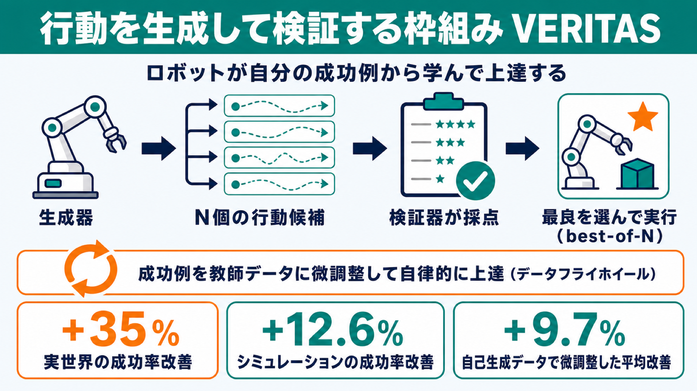

# ロボットが自分の成功例から学んで上達する：行動を「生成」して「検証」する枠組み VERITAS

## この論文のひとことまとめ

事前学習済みのロボット操作モデルに、複数の行動候補を「生成」させ、それを別の「検証器（verifier）」で採点して一番良いものを選ぶ、という枠組み **VERITAS** を提案した研究です。モデル自体を追加学習しなくても、推論時にこの選び方を挟むだけで成功率が上がります。さらに、こうして選び抜いた成功例を教師データとして使い、モデルを後から微調整することで、人間が新しいお手本を増やさなくてもロボットが自律的に上達していくことを示しました。シミュレーションと実機を合わせた評価で、その効果が確認されています。

## なぜこの研究が重要か

ロボットを賢く動かす「基盤モデル（robotic foundation models）」は、大量の操作デモンストレーションを学ぶことで高い能力を獲得します。しかしロボットのデータ集めは高コストで時間がかかり、しかも人間のお手本（デモンストレーション）を用意できる人の手が空いているかどうかに左右されます。最先端のモデルは人間の専門家が集めたデータに頼っており、その量は専門家の作業時間に比例してしか増えません。

ここで生まれる問いが「人間のお手本を増やさずに、ロボットの腕前をどう上げるか」です。本研究は、ロボット自身が現実世界を試行し、最小限の監督とコストで自分の経験から学ぶ仕組みを与える、というアプローチでこの問いに答えようとします。専門外の読者にとっても、「お手本に頼り続けるのではなく、ロボットが自分で上達する道を作る」という方向性は分かりやすい価値だと思います。

## 背景：何が問題だったのか

著者らは、言語モデルの分野で進んだ「推論時の計算を増やして賢くする」考え方からヒントを得ています。言語モデルでは、複数の答えを生成し、検証器（verifier）で最良のものを選ぶ「best-of-N」という手法が成果を上げてきました。同じように、ロボットも実際に体を動かす前に複数の行動候補を出し、それを検証できるのではないか、という発想です。

一方で、既存のアプローチにはそれぞれ限界がありました。

- 人間が途中で介入したり、行動をラベル付けし直したりする方式（human-in-the-loop など）は、結局人間の手間に依存するためスケールしにくい。
- 推論時に行動候補をサンプリングする既存手法の多くは、これを「一時的な性能ブースト」として扱い、検証のコストが高く、長期的にモデルそのものを良くすることにはつながりにくい。
- モデルの内部表現に追加の監督を与えて推論能力を組み込む手法は、学習時に高価なアノテーションを必要とし、すでにあるモデルの推論時改善には使えない。

加えて、お手本をまねる学習（模倣学習）には **共変量シフト（covariate shift／分布シフト）** という弱点があります。ロボットが専門家のたどった状況から少しでも外れると、急に性能が落ちてしまう問題です。本研究は、人間のラベラーを自動の検証器に置き換え、学習に使うデータをロボット自身の行動から得た「現在の方策に沿った（on-policy）」「運動学的に実現可能な（kinematically feasible）」ものに保つことで、この分布シフトをやわらげられると主張します。

## 提案手法：何をしたのか

中核は **生成器–検証器の枠組み（generator–verifier framework）** です。考え方はシンプルで、次の 2 つの役割を組み合わせます。

- **生成器（generator）**: 事前学習済みの汎用ロボット方策（generalist policy）。観測と言語指示を受け取り、行動の候補を生み出します。
- **検証器（verifier）**: 方策とは独立に、生成された行動候補を採点する別モジュール。学習・勾配計算を伴わない「勾配フリー（gradient-free）」な部品です。

仕組みを、いくつかのポイントに分けて見ていきます。

- **方策を「確率的な生成器」として扱う**：通常、ロボット方策はばらつきを抑えるために決まった行動を 1 つだけ出力しますが、本手法ではあえて確率的にサンプリングし、各時点で N 個の行動候補を作ります。これは、複数の動き方を表現できる **flow-matching / diffusion** という生成的な学習方式が、行動の多峰性（複数のもっともらしい選択肢）をサンプリングで引き出せることを活かしたものです。
- **行動チャンク（action chunking）**：方策は 1 ステップずつではなく、長さ H の行動系列をまとめて予測します。まとめて扱うことで検証のコストを系列全体にならして抑えられ、瞬間的な微小動作ではなく「その動きがどんな結果につながるか」を検証器に評価させられます。
- **検証器のインターフェース**：検証器は「観測・候補となる行動チャンク・指示」を受け取り、1 つのスコア（実数値）を返す関数として定義されます。推論時にしか働かず、方策の重みは更新しません。中身は VLM（視覚言語モデル）、幾何的な制約、学習済みの価値モデルなど、差し替え可能な部品（plug-and-play）として実装できます。
- **推論時ステアリング（inference-time steering）**：制御の流れは「候補を N 個生成する → 各候補を採点する → 最高スコアの候補を選ぶ → 実行する」という best-of-N の選択です。方策自体は固定なので、性能の向上は純粋に推論時の計算（候補を出して選ぶこと）から生まれます。
- **自律的な自己改善（データフライホイール／data flywheel）**：推論時ステアリングで成功した「検証済みの軌跡（verified rollouts）」をデータセットに記録し、それを教師データとして元の方策を **行動クローン（behavior cloning, BC）** で微調整します。データはロボット自身の行動から生まれるため本質的に on-policy かつ実現可能で、検証器が「専門家フィルタ」の役割を果たして高品質なデータだけを残します。

### 視覚検証器（visual verifier）の具体的な作り

検証器の一例として、本研究は画像を使った **視覚検証器** を設計しました。高価な 3 次元アノテーションを使わずに、言葉による指示を幾何的な制約へ落とし込む工夫がされています。手順は 2 段階です。

1. **軌跡の生成（Trace Generation）**：タスク開始時に、最先端の VLM（Gemini 2.5）が最初の観測と指示から、ロボットの手先がたどるべき理想の軌道を、画像上の経由点（ピクセル空間の waypoints）として提案します。この軌跡（visual trace）はエピソード中ずっと固定されます。
2. **幾何スコアリング（Geometric Scoring）**：各行動候補から得られる手先の位置を画像平面に投影し、VLM が描いた理想軌跡にどれだけ近いか（負のユークリッド距離）でスコアを付けます。

VLM による軌跡生成はエピソード開始時に一度だけ実行され、制御ループの中では走りません。ループ内の幾何的な検証の負荷はごくわずか（1 ミリ秒未満）です。

なお検証器には 3 種類が用意されています。(1) 画像上の絶対的な経由点を使う **VERITAS**、(2) 物体を追跡して参照点を動的に決める相対的な経由点方式の **VLM-Constraints**、(3) 「接近 → 整列 → 把持 …」と段階を踏む有限状態機械の **Heuristic（ヒューリスティック）** です。

実装面では、基盤方策として **π0** という VLA（Vision-Language-Action：視覚・言語・行動を扱うモデル）の一例を用いています。

## 結果：何が分かったのか

研究上の問いは大きく 3 つです。(1) 推論時ステアリングは成功率を上げるか、(2) 自己生成した検証済みデータでの学習はモデルを良くするか、(3) その自律収集データは人間の専門家データと比べてどうか。

評価は、シミュレーション環境 SIMPLER（SimplerEnv）の 4 タスク（Carrot on Plate, Spoon on Towel, Eggplant in Basket, Stack Blocks）と、実機プラットフォーム DROID の両方で行われました。

**推論時ステアリングの効果（モデルの微調整なし）**

- シミュレーションの 4 タスクすべてで、推論時ステアリングは基盤方策に対して成功率を一貫して改善しました。単純なヒューリスティック検証器でも改善が見られ、生成器–検証器という考え方の利点は特定の検証器の作り方に依存しないことが示されました。
- シミュレーションと実世界を合わせ、3 種類の方策・計 1160 評価エピソードにわたり、検証器による誘導は成功率をシミュレーションで平均 12.6%、実世界のデプロイで平均 35% 改善しました。
- 実世界での例（各タスク 50 試行）として、π0-DROID では「Put the carrot on the plate」が素の方策 0% から VERITAS で 44% へ、「Put the tape into the wooden box」が 0% から 58% へ向上しました。π0.5-DROID では「Pick up the mouse and place it into the green bowl」が 0% から 46%、「Insert the marker into the mug」が 0% から 60% へ向上しています。
- 行動プリミティブを素朴に組み合わせる既存手法（PIVOT）は成功に至らず、強い行動の事前分布（action prior）を持つ学習済み方策が有効に働きました。良い行動の事前分布が重要であることを示唆しています。

**自己生成データでの微調整による改善**

- シミュレーションで最も性能が上がる検証器を選び、656 件の検証済みロールアウトを集めて微調整したところ、4 タスクすべてで基盤方策を一貫して上回りました。
- VERITAS による微調整は、シミュレーションの計 960 エピソードにわたり、基盤の π0-Bridge 方策に対して平均成功率を 9.7% 改善しました（論文の Abstract や導入では平均 10% と概数で記載されています）。
- 最も難しい Stack Blocks タスクで最大の改善が見られ、成功率は 31.3% から 59.2%（+27.9%）へと上がりました。
- 推論時ステアリングは、基盤方策にとって難しいタスクほど大きな改善をもたらす傾向がありました。方策が不確実なときほど多様な候補が生まれ、検証器がより良い候補を選ぶ余地が広がるためと説明されています。逆に、もともと得意なタスクでは候補の多様性が低く、改善の余地は小さくなります。

**自律収集データ vs 人間の専門家データ**

- 実世界で 20／30／50／100 軌跡のデータセットを用意し、検証器がキュレーションした自律データと人間専門家のテレオペデータで微調整して、各方策を 20 回の実機試行で評価しました。
- 4 タスクすべてで、検証器がキュレーションしたデータは人間専門家のデモと同等のデータ効率を示しました。具体例として「Carrot on plate」では 50 件の自律デモが同数の人間デモを上回り（0.70 対 0.65）、Figure 7 のキャプションでは「Pick up mouse」で 50 件の自律デモが人間を上回ると記載されています（0.65 対 0.60）。「Insert marker」ではどのデータ量でも差は 5 パーセントポイント以内で、100 デモでは「Carrot on plate」で両方のデータ源が同じ成功率に収束しました。

**主なハイパーパラメータの傾向**

- 開放ループの実行地平線（一度に何ステップ実行するか）は、π0-DROID では最大 10 ステップまで検証性能が大きくは劣化せず、実世界評価ではデフォルト 8 ステップを使用しています。
- 行動の候補数 N は増やすほどおおむね性能が上がりますが、N=8 を超えると飽和しました。実験では N=5、制御周波数 15Hz が使われています。

## 意義と限界

意義として著者らは、自律的に集めた検証済みデータが、人間が集めた専門家データとデータ効率の点で同等だった点を最も注目すべき発見として挙げています。これは、ロボットがデプロイ（実運用）で得た経験を、持続的な能力向上へと変換していく、スケーラブルな自己改善の道筋を示すものです。推論時の計算を「一時的なブースト」で終わらせず、後段の学習を通じて方策の重みへと蒸留（distill：得られた知識を別の形に移し込むこと）し、20〜100 軌跡程度の経験で一貫した改善につなげられることを示しました。

一方で、論文は次の限界を率直に認めています。

1. これは推論時の計算量をタスク性能と引き換えにする枠組みであり、候補を繰り返しサンプリングするため、レイテンシ（応答速度）が重要な用途では計算コストが高くつき得ます。
2. 現在の検証器は、タスク開始時に一度生成した「静的な視覚軌跡」に依存します。動きの少ない（準静的な）操作には十分ですが、実行中にシーンが急に変わるような高動的環境では苦戦する可能性があります。
3. 検証器は、あくまで方策が提案した候補の中から最良を選ぶことしかできません。そのため、事前学習で身についた探索の事前分布（exploration prior）に根本的に縛られます。方策の事前学習を良くすれば、検証の仕組みもさらに改善すると期待されています。

今後の課題として、検証器の判断を価値関数へ蒸留して高速な推論を実現することや、生成器と検証器を同時に最適化して探索のサンプル効率を上げることが挙げられています。

## まとめ

VERITAS は、ロボット方策を「行動の生成器」、別モジュールを「検証器」とみなし、複数候補から最良を選ぶ推論時ステアリングで追加学習なしに性能を上げる枠組みです。さらに、選び抜いた成功軌跡を教師データに使ってモデルを微調整することで、人間のお手本を増やさずにロボットが自律的に上達できることを、シミュレーションと実機の両方で示しました。

## 用語集

- **生成器–検証器の枠組み（generator–verifier framework）**: 方策を行動候補の生成器、別モジュールを評価する検証器として組み合わせる本論文の中核構造。
- **推論時ステアリング（inference-time steering）**: 追加学習をせず、推論時に複数候補を生成・検証して最良を選び、性能を上げる仕組み。
- **best-of-N 選択**: N 個の候補から検証器スコアが最大のものを選ぶ方式。
- **行動チャンク（action chunking）**: 1 ステップずつではなく、長さ H の行動系列をまとめて予測する手法。
- **視覚検証器（visual verifier）**: VLM が生成した画像上の経由点（軌跡）に対し、候補行動の投影軌道がどれだけ近いかをスコアにする検証器。
- **勾配フリー（gradient-free）**: 学習・勾配計算を伴わず、推論時にのみ作用する性質。
- **データフライホイール（data flywheel）**: 検証済みの成功軌跡を訓練データとして再利用し、方策を改善し続ける循環。
- **共変量シフト（covariate shift／分布シフト）**: 模倣学習で、学習者が専門家のたどった状況から外れて性能が劣化する問題。
- **行動クローン（behavior cloning, BC）**: 観測から行動への対応を学ぶ教師あり模倣学習。
- **VLA（Vision-Language-Action）モデル**: 視覚・言語・行動を扱うモデル。本研究の基盤方策 π0 / π0.5 が該当する。
- **蒸留（distill）**: あるモデルや仕組みで得られた知識・判断を、別のモデルや形（ここでは方策の重みや価値関数）へ移し込むこと。

## 原論文

- Visual Verification Enables Inference-time Steering and Autonomous Policy Improvement（https://arxiv.org/abs/2606.18247）
