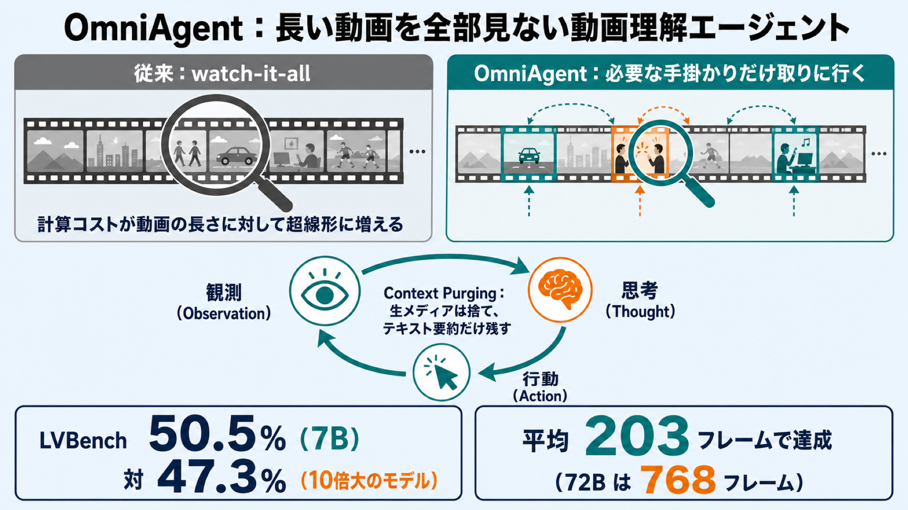

# 長い動画を「全部見る」のをやめる — 必要な手掛かりだけ自分で取りに行く AI エージェント「OmniAgent」

## この論文のひとことまとめ

長い動画について質問に答える AI は、これまで動画の全フレームを一律に処理する「とにかく全部見る（watch-it-all）」やり方が主流でした。この論文は、その受け身の処理をやめ、質問に答えるために必要な映像・音声の手掛かりだけを自分で能動的に取りに行く、反復的な推論プロセスとして動画理解を定式化します。提案する単一モデルのエージェント「OmniAgent」は 7B（70 億パラメータ）規模ながら、10 倍大きいモデルを長尺動画ベンチマーク LVBench で上回りました（50.5% 対 47.3%）。

## なぜこの研究が重要か

動画は時間方向にも空間方向にもデータ量が大きく、特に長い動画では「全部を均等に処理する」やり方が現実的でなくなります。論文によると、計算コストは動画の長さに対して超線形（super-linear、長さ以上の勢いで増える）にスケールするため、受け身の end-to-end（入力から出力まで一気通貫）処理は長尺動画では計算的に扱いきれなくなります。

一方、人間が長い動画から何かを探すときは、全編を等しく注視したりはしません。質問に関係しそうな箇所にあたりをつけ、そこだけを詳しく見ます。この「必要なところだけ能動的に見る」発想を AI に持ち込めれば、動画が長くなっても計算量が際限なく増えるのを避けられます。本研究はそれを単一モデルで実現しようとする試みです。

## 背景：何が問題だったのか

既存の動画理解モデルは「watch-it-all」パラダイムを採り、質問の難しさに関わらずフレームを一律に処理します。そのため計算コストが動画の長さとともに膨らみ続けます。

これに対し、能動的に処理しようとする「エージェント的」手法も提案されてきましたが、論文は大きく 2 系統に分けて、それぞれの限界を指摘します。

- **(1) LLM をコントローラにして専用ツールを呼ぶ系統**：大規模言語モデル（LLM）が司令塔となり、画像用・音声用などモダリティ（情報の種類）ごとの専用モジュールを呼び出します。しかし中間モジュールへの依存が情報のボトルネックを生み、推論と知覚の間で勾配の流れ（gradient flow、学習信号の伝わり方）が断ち切られてしまいます。
- **(2)「thinking with images」系統**：思考の連鎖（chain-of-thought）の中に、時間方向の切り出しや空間方向のズームを組み込みます。ただし依然として「半受動的（semi-passive）」であり、「どこを見るか」を決めるために動画全体の事前スキャン（global pre-scan）や密な視覚バッファを必要とします。結局、推論の複雑さを動画の長さから切り離せていません。

論文は、これらが動画を「静的な情報の入れ物」や「大きな 1 枚の画像」のように扱い、動画が本来持つ逐次的（sequential、時間に沿って進む）性質を無視していると述べます。だから時間単位の長さを持つ動画にはスケールしない、というわけです。

## 提案手法：何をしたのか

提案手法 **OmniAgent** は、著者らの主張では、知覚・推論・行動を単一モデル内に統合した、オムニモーダル（音声・映像など複数の情報種別を扱う）動画タスク向けの初の end-to-end なネイティブ・エージェント的フレームワークです。「ネイティブ」とは、外部ツールやモジュールではなく、行動する当のモデル自身が知覚も推論も行うという意味です。

### 動画探索を「逐次的な意思決定」として定式化する

OmniAgent は音声・映像の探索を **POMDP（Partially Observable Markov Decision Process、部分観測マルコフ決定過程）** として定式化します。これは、環境の状態を一部しか観測できない状況での逐次的な意思決定を扱う枠組みです。動画全体は一度に見えず、行動を起こして少しずつ手掛かりを集める、という構図にぴたりと当てはまります。

中核となるのが **Observation-Thought-Action（OTA、観測・思考・行動）サイクル** です。モデルは次の 3 つを繰り返します。

- **Observation（観測, O）**：取得した高次元の生メディア（フレームや音声）を、構造化されたテキスト要約に蒸留します。生のピクセルを捨てる前に、後の推論に必要な視覚・聴覚の詳細を明示的に書き留める、情報密度の高い記録です。
- **Thought（思考, T）**：知覚と行動を橋渡しする内部推論です。これまで集めた記憶と、質問が求めている情報との「ギャップ」を見極め、次に何をすべきかの根拠を導きます。
- **Action（行動, A）**：記号的なオペレータの集合から次の手を選びます。具体的には、区間からフレームを一様に取得する `a_frames`、音声セグメントを抜き出す `a_audio`、音声同期付きの連続動画セグメントを取る `a_clip`、そして最終回答を出力してサイクルを終える `a_answer` です。

### メディアは捨て、要約だけ残す

このサイクルの肝が **Context Purging（コンテキストの破棄）** です。行動によって新しい生メディアが返ってくると、直前の生メディアは作業中のコンテキストから捨てられ、蒸留されたテキスト要約だけが記憶に残ります。生メディア（捨てられる一時的な percept）と、保持されるテキスト記憶を厳密に分けるわけです。

この工夫により、モデルが抱えるメディアの負荷が、動画の長さや繰り返しの回数によらず一定に保たれます。環境側は生メディアの抽出（フレーム取得・音声抽出・クリップ取得）だけを担い、意味の理解や推論はすべてモデル自身がネイティブに行います。外部モジュールに頼らないのがポイントです。

### 2 段階で学習する

OmniAgent は 2 段階で訓練されます。

1. **Agentic SFT（教師ありファインチューニング）**：長い手順を踏むエージェント推論の事前経験がないモデルを、いきなり強化学習にかけると方策が崩壊（policy collapse）するおそれがあります。そこでまず教師あり学習で能動的知覚の土台を作ります。論文では 3 種類のタスク（選択式 QA・数値推論・時間的グラウンディング）にわたる 58K（5 万 8 千）件の軌跡を、5 つのデータセットの訓練分割から構築しました。教師モデルに多数の候補軌跡を生成させ、品質管理を経て使います。範囲外の時刻を指定するなど誤った行動からの自己修正（self-correction）の軌跡も含め、教師の言う通りに真似るだけの偏りを防いでいます。

   品質管理は 2 段構えです。まず **Outcome Verification（結果の検証）** で、選択式・数値は完全一致、時間的グラウンディングは IoU（Intersection over Union、予測した時間区間と正解区間がどれだけ重なっているかの割合）が 0.5 以上、といった閾値で正解性を選別します。次に **Rationality Audit（合理性の監査）** で、GPT-4o に推論の筋が通っているかを 5 段階で採点させ、最低スコア 3/5 を課します。これにより、記録した記憶に裏付けられないまま「まぐれ当たり」した軌跡を除外します。

2. **Agentic RL（強化学習）**：検証可能な報酬（verifiable reward）を使い、教師あり学習で得た範囲を超えて性能を伸ばします。報酬は、選択式・数値なら正解かどうか、時間的グラウンディングなら IoU、サイズ推定なら MRA（Mean Relative Accuracy、予測がどれだけ正解に近いかを段階的な許容閾値にわたって測る指標）を使います。

### マルチターン特有の落とし穴をどう解くか — TAURA

強化学習で標準的に使われる **GRPO（Group Relative Policy Optimization）** をそのままマルチターン（何ターンも続く）のエージェント推論に当てはめると、問題が起きます。GRPO は軌跡全体に対する単一のスコア（アドバンテージ）を、すべてのターンに一律に配ってしまうのです。論文はこれを **Advantage Homogenization（アドバンテージの均質化）** と呼びます。結果、その後の展開を左右する決定的な「分岐（fork）」ターンと、どうでもいい些末なターンが同じ扱いになってしまいます。

著者らの分析では、決定的な分岐ターンの 79.2% は、軌跡全体の平均より明らかに高い平均トークンエントロピー（出力の不確実さの度合い）を示したとされています。つまり「迷いの大きいターンほど重要な分岐になりやすい」という関係です。

そこで提案するのが **TAURA（Turn-aware Adaptive Uncertainty Rescaled Advantage）** です。各ターンの平均トークンエントロピーを連続的な重みとして使い、軌跡全体のアドバンテージをターンごとに再スケール（重み付け）します。重みは平均すると 1 になるよう正規化されるため、全体の勾配の大きさは保ったまま、不確実さの高い「発見的な瞬間」に学習の更新を集中させられます。

この再スケールは符号付きで効きます。正解だった軌跡では、不確実さの高いターンほどプラスの評価を増幅します。逆に間違った軌跡では、不確実さの高いターンほど大きなマイナスのペナルティを与えます。こうして「混乱した推測」は罰し、「有効な探りの一手」は強化する、というわけです。

## 結果：何が分かったのか

ベースとなるモデルは Qwen2.5-Omni-7B です。評価は 3 カテゴリ・計 10 個のベンチマークで行われました（動画理解、音声・映像、時間的グラウンディング）。

主な結果は次のとおりです。数値はいずれも論文の報告に基づきます。

- **オープンソースモデルの中で、10 ベンチマークすべてにおいて直接のベースライン（Qwen2.5-Omni）を改善し、最高性能（SoTA）を達成した**と主張されています。
- **長尺動画ベンチマーク LVBench で 50.5%**。ベースラインの 43.0% を 7.5 ポイント上回り、10 倍規模の Qwen2.5-VL-72B（47.3%）やエージェント的ベースライン Zoom-Zero-7B（45.7%）も上回りました。
- **MLVU で 71.1%**（ベースライン比 +5.9）、**VideoMME（字幕なし）の Overall で 67.8%**（+3.0）、うち Long で 59.6%（+4.8）。**VSI-Bench で 48.4%**（+12.9）、**Minerva で 41.4%**（+8.0）。
- 音声・映像系では DailyOmni 64.8%（+4.7）、WorldSense 47.2%（+1.8）、OmniVideoBench 37.1%（+7.8）。
- 時間的グラウンディング（Temporal IoU）では LongVALE 39.1%（+33.4）、VUE-TR の Vision+Audio で 36.5%（+33.0）、Vision で 46.1%（+38.1）と大きく伸び、VUE-TR では GPT-4o や Gemini-2.5-Pro といった商用モデルも上回ったとされています。

効率の面でも示唆的な結果が出ています。OmniAgent-7B は平均 203 フレームで LVBench 50.5% を達成したのに対し、Qwen2.5-VL-72B は 768 フレームで 47.3% でした。約 73% 少ないフレームで、より高い精度を出した計算になります。

さらに、推論時に使う計算（ここではターン数）を増やすほど性能が上がる **Test-time scaling（推論時スケーリング）** も確認されました。VideoMME-Long で最大ターン数の上限を 6 から 52 に広げると、精度が 53.4% から 59.6% へ単調に改善します。興味深いのは、上限を 52 にしても実際の平均ターン数は約 11.7 で頭打ちになる点です。モデルはやみくもにターンを増やさず、必要な情報量に応じて推論の深さを自分で調整していることになります。

アブレーション（要素を 1 つずつ外して効果を測る検証）では、各工程の役割がはっきり出ています。通常の静的な QA への教師あり学習だけでは、超長尺の LVBench でかえって性能が下がりました（43.0 → 41.6）。選ぶ仕組みを持たず、情報過多に陥るためと説明されています。一方、Agentic SFT を経て、さらに通常の GRPO ではなく TAURA で強化学習すると、知覚・推論の双方で一貫した改善が得られました。

動画長による分析も示唆的です。動画の長さが約 4 倍（およそ 30 分から 130 分）に伸びても、推論ターン数は 8.5 から 12.5 へとわずかに増えるだけでした。1 時間あたりのサンプリング密度はむしろ 16.9 から 5.7 へ急減します。それでも精度は安定しており（120〜140 分で 50.8%）、計算コストが動画の長さではなくタスクの複雑さで決まることを裏付けています。

## 意義と限界

この研究の中心的な洞察は、知覚を「網羅的な前処理」ではなく「反復的・質問駆動の情報蒸留」として扱うことです。これにより、推論の複雑さを動画の長さではなくタスクの難しさで決められるようになります。論文は、教師あり学習で能動的知覚の土台を作り、TAURA を用いた強化学習で磨くことで、外部の知覚モジュールに頼らずとも、単一のマルチモーダルモデルの中にネイティブなエージェント能力を出現させられると結論づけています。

意義としては、7B のエージェントが 10 倍大きい受け身のモデルを、はるかに少ないフレーム消費で上回ったこと、そして推論ステップを増やすほど性能が伸びる前向きな推論時スケーリングを示したことが挙げられます。明示的な OTA サイクルは解釈可能な推論の軌跡を残すため、ブラックボックス的な動画推論に対する透明な代替にもなります。

限界として論文が認めているのは、逐次的な対話ループが遅延（latency）のオーバーヘッドを生む点です。今後の課題として、この制約に対処するための並列化探索（parallelized exploration）の検討が挙げられています。

## まとめ

OmniAgent は、長い動画を「全部見る」のをやめ、質問に必要な手掛かりだけを自分で取りに行く能動的知覚を、単一モデルの中に統合したフレームワークです。生メディアを捨ててテキスト要約だけ残す設計と、マルチターン強化学習向けの TAURA により、7B 規模で 10 倍大きいモデルを少ないフレームで上回りました。

## 用語集

- **オムニモーダル（omni-modal）**：音声・映像など複数の情報種別をまとめて扱うこと。
- **watch-it-all パラダイム**：質問の難しさによらず動画の全フレームを一律に処理する受け身のやり方。
- **POMDP（部分観測マルコフ決定過程）**：環境の状態を一部しか観測できない状況での逐次的意思決定の枠組み。
- **Observation-Thought-Action（OTA）サイクル**：観測・思考・行動の 3 つ組を繰り返す、本手法の中核となる推論ループ。
- **Context Purging（コンテキストの破棄）**：行動のたびに直前の生メディアを捨て、テキスト要約だけ残してメディア負荷を一定に保つ機構。
- **ネイティブ能動的知覚（Native Active Perception）**：外部ツールではなく、行動する当のモデル自身が知覚を担う能動的な情報取得の考え方。
- **Agentic SFT / RL**：能動的知覚を教師あり学習で立ち上げ（SFT）、検証可能な報酬を使う強化学習（RL）で磨く 2 段階の最適化。
- **GRPO（Group Relative Policy Optimization）**：同じ質問から複数の軌跡をサンプリングし、報酬をグループ内で正規化してアドバンテージを得る強化学習手法。
- **Advantage Homogenization（アドバンテージの均質化）**：単一のスコアを全ターンに一律配分し、重要ターンと些末ターンが混同される問題。
- **TAURA（Turn-aware Adaptive Uncertainty Rescaled Advantage）**：各ターンの平均トークンエントロピーを重みに、アドバンテージをターン単位で再スケールする手法。
- **Test-time scaling（推論時スケーリング）**：推論時の計算（ここではターン数）を増やすほど性能が向上する性質。
- **時間的グラウンディング（Temporal Grounding）**：動画中で問われたイベントが起きる時間区間を特定するタスク。評価には Temporal IoU を用いる。
- **IoU（Intersection over Union）**：予測した時間区間と正解区間の時間的な重なりの割合。重なりが大きいほど 1 に近づく。
- **MRA（Mean Relative Accuracy、平均相対精度）**：サイズ推定などで、予測がどれだけ正解に近いかを段階的な許容閾値（0.5〜0.95）にわたって測る定量的な忠実度の指標。

## 原論文

- Native Active Perception as Reasoning for Omni-Modal Understanding（https://arxiv.org/abs/2606.19341）
