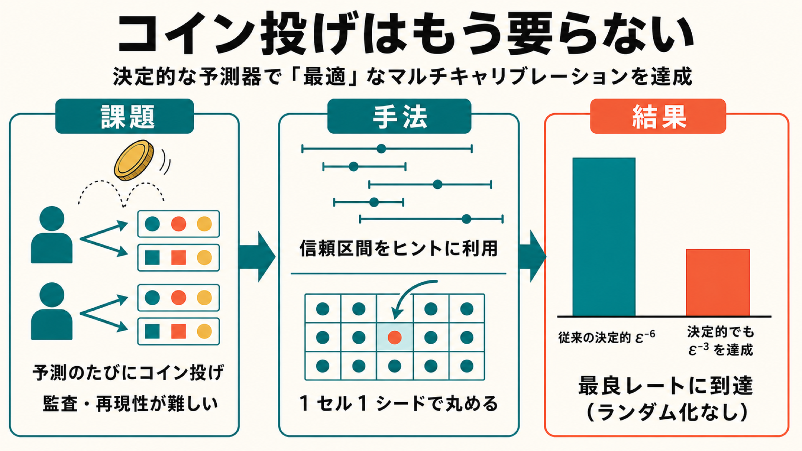

# 予測時のコイン投げはもう要らない — 決定的な予測器で「最適」なマルチキャリブレーションを達成する

## この論文のひとことまとめ

機械学習の予測器が「公平でかつ自分の確信度に正直」であるための条件として、マルチキャリブレーション（multicalibration）という性質が知られています。これまでこの性質を最小限のデータ量で満たすには、予測のたびに内部でコインを投げる「ランダム化された予測器」が必要だと考えられていました。本論文は、コイン投げを使わない**決定的（deterministic）な予測器**でも、まったく同じ最良のデータ効率を達成できることを理論的に証明しました。さらにこの結果は omniprediction や panprediction といった関連する目標にも広がり、複数の先行研究が残していた未解決問題を一度に解決しています。

## なぜこの研究が重要か

機械学習の予測を、採用・融資・医療といった重要な意思決定に使う場面が増えています。そこでは「予測の数値が信頼できるか」が問われます。たとえば「この人の返済確率は 70%」と出すなら、そう予測した人々の中で実際におよそ 70% が返済する、という整合性が欲しいわけです。これを保証するのがキャリブレーション（calibration）であり、特定のグループに偏らないよう強めたものがマルチキャリブレーションです。

ここで一つ気になる点があります。最良のデータ効率でこの性質を満たす既存手法は、予測のたびに内部で乱数（コイン投げ）を使っていました。すると、まったく同じ属性を持つ 2 人に対して、コインの目が違うだけで異なる予測が返ることがあり得ます。これは監査（auditing）のしにくさや結果の再現性の悪さにつながり、「信頼できる機械学習（trustworthy ML）」という理念とそぐいません。本論文は「そもそも乱数は本当に必要なのか」という素朴で本質的な問いに、明確な答えを与えます。

## 背景：何が問題だったのか

まず用語を整理します。

- **キャリブレーション（calibration）**: 予測器がある値を予測したとき、その値が実際の結果の期待値（条件付き平均）と一致する性質です（Dawid 1982）。
- **マルチキャリブレーション（multicalibration）**: これを全体だけでなく、あらかじめ決めたグループ関数の集合 G に含まれる各グループ g ごとに、文脈を重み付けし直したうえでも同時に成り立つよう強めた概念です（Hebert-Johnson et al. 2018）。本論文が扱う誤差の指標は「ECE マルチキャリブレーション誤差」で、グループ g にわたる重み付き ECE（expected calibration error、予測値ごとの偏りの大きさを足し合わせた標準的指標）の最大値として定義されます。

問題の核心は、必要なデータ量（サンプル複雑度、sample complexity）にありました。バッチ設定で誤差 ε のマルチキャリブレーションを達成するのに必要な最良のサンプル数は、ほぼ ε⁻³ に比例する（記法では eΘ(ε⁻³)、eΘ は 1/ε などの対数因子を隠す表記）ことが Collina et al. [2026c] により確立されていました。しかしこの最良レートを達成する既知アルゴリズムは、オンライン学習をバッチ設定に変換する「online-to-batch 還元」を経由しており、その出力は**ランダム化された予測器**でした。

一方で、コイン投げを使わない決定的な手法も存在しましたが、データ効率は大きく劣っていました。従来の決定的手法を本論文の指標に翻訳すると、必要なサンプル数はおよそ ε⁻⁶（Haghtalab et al. [2023] の翻訳）で、最良のランダム化レート ε⁻³ には遠く及びません。「最良のレートを達成するにはランダム化が必須なのか」は、Collina et al. [2026c] が明示的に、複数の先行研究が暗黙に問うていた未解決問題でした。

同じ構図は関連する目標にも見られました。omniprediction（多様な下流の損失関数に対し、後処理だけでベンチマークと競合できる単一予測器を学ぶ目標）でも、Okoroafor et al. [2025] の最良レート手法はランダム化予測器を出力し、決定的にできるかを明示的に問うていました。さらに Balakrishnan et al. [2026] は、omniprediction をサブグループにも広げた panprediction について同じギャップ（決定的だと ε⁻³、ランダム化だと ε⁻²）を示し、同様の問いを投げかけていました。

## 提案手法：何をしたのか

本論文の中核は、「最良レートのランダム化予測器を、出力の質が落ちないように決定的予測器へ丸める（rounding によって derandomize する）」という枠組みです。

### つまずきの石は「原子（atom）」

なぜ単純にはコイン投げを取り除けないのか。鍵は **原子（atom）** と呼ばれる、特定の文脈 x に大きな確率の質量が集中している点です。

- 文脈の分布が連続で、どの文脈にもわずかな確率しか置かれていなければ、テスト時のコイン投げを訓練時にあらかじめ固定してしまっても、観測上の差は生じません。つまり derandomization は問題なく成功します。
- ところが、特定の文脈に大きな質量がある原子では話が変わります。論文の「2 点障害（two-point obstruction）」という例では、誤差ゼロのランダム化予測器を素朴にサポート内の値へ丸めると、どんな決定的予測器を作っても誤差が少なくとも 1/6 になってしまいます。

### 素朴な「ハードな二分」が破綻する理由

「質量が大きい原子（重い原子）と小さい原子（軽い原子）に閾値 τ で二分し、別々に処理する」という素朴な方法（hard split）を考えます。しかしこれはうまくいきません。軽い原子の丸めノイズを抑えるための閾値と、重い原子の条件付き平均を直接推定できる閾値の間にギャップが生じ、ちょうど「丸めるには大きすぎ、平均を推定するには小さすぎる」質量帯ができてしまいます。この帯を両立させようとすると、目標レートよりもはるかに多いサンプル数が必要になってしまいます（論文 Figure 1）。

### 解法：信頼区間を「ヒント」として滑らかに使う

本手法はハードな二分の代わりに、各文脈の条件付き平均についての統計情報を **信頼区間（confidence interval）** という「ヒント」として滑らかに利用します。訓練データから各文脈の出現回数を記録し、よく出てくる文脈には狭い区間を、めったに出てこない文脈には自明な区間 [0,1] を割り当てます。情報量に応じて扱いを連続的に変えることで、先ほどのギャップを回避します。

これを実現するため、論文は新しいオンライン学習の部品を導入します。

- **区間ヒント付きのオンラインマルチキャリブレーション**: 各文脈とともに「条件付き平均を含む区間 Ix と、その近くの許容グリッド値の集合 Λx」を受け取るオンラインアルゴリズムです。ヒントが正しい（valid）限り、どんな敵対的な入力に対しても最良レートでマルチキャリブレーションを達成し、許容された値だけを予測します（Lemma 3.2）。
- **online-to-batch 還元**: このオンラインアルゴリズムと、データから計算した信頼区間を、標準的な martingale ベースの online-to-batch 還元（Gupta et al. 2022）で組み合わせます。これにより、各文脈での予測のばらつきがその点の質量に反比例して滑らかに小さくなるランダム化予測器が得られます。
- **有限な丸めセル（rounding cell）の構築**: 文脈空間が連続でも有限回の derandomization を可能にするため、専用のサンプルを辞書式順序（lexicographic order）で並べ、隣り合うサンプル点が誘導する「セル」に空間を分割します。交換可能性（exchangeability）の議論で、2 つの新しい点が同じセルに入りにくいことを保証します。
- **1 セル 1 シードによる丸め**: 各丸めセルに対して 1 つの共有ランダムシードを引き、そのセル内のすべての文脈をその共通の抽選で丸めます。これによりランダム化予測器が決定的な関数に変わります（Lemma 6.2）。汎用の有限テスト丸め命題（Proposition 6.1）により、この同じ derandomization の一手がマルチキャリブレーションにも次節の OI にも共通して使えます。

学習器はサンプルを独立な 3 つに分けて使います。信頼区間の学習用、online-to-batch 用、丸めセルの定義用です。また、オンラインアルゴリズムは表面上は指数的に大きい空間上の重み付けとして書かれますが、その分布が予測値ごとに積へ分解できることを示し、暗黙的に多項式時間で実装できることも示しています（Theorem 7.1, Appendix B）。

## 結果：何が分かったのか

本論文は理論研究であり、数値実験やベンチマーク評価は行っていません。主結果は定理として与えられます。以下は原論文に記載された主張です。

- **決定的マルチキャリブレーション（主結果, Theorem 7.1）**: 提案アルゴリズムは決定的予測器を出力し、サンプル数 n ≲ (1/ε + log(|G|+1)) · log((1/ε + …)/ε) / ε² で、確率 2/3 以上で誤差 ε 以下のマルチキャリブレーションを達成します。グループ集合のサイズが多項式有界（|G| ≤ ε⁻κ、κ は任意の固定正数）なら、これは eO(ε⁻³) となり、最良レート（Collina et al. [2026c]）に対数因子まで一致します。これがランダム化なしで最良レートに到達した、という本論文の核心的な成果です。
- **多項式時間**: 多項式有界のグループ域では、訓練・評価ともに 1/ε と次元 d の多項式時間で実行できます（Theorem 7.1）。
- **無限のグループクラスへの拡張（Corollary 7.2）**: グループクラスが無限でも、その被覆（cover）の濃度 N を用いた同様のサンプル数で達成できます。
- **決定的な outcome indistinguishability（OI, Theorem 8.2）**: マルチキャリブレーションと同じ derandomization の枠組みを、より一般的な「結果識別不能性（outcome indistinguishability）」に拡張します。有限のテスト族に対し、決定的予測器が誤差 ε 以下の OI を達成し、テスト族が多項式有界なら eO(ε⁻²) となります。
- **決定的 omniprediction（Theorem 8.7 / Corollary 8.8 / 8.10 / 8.11）**: OI の結果から omniprediction の決定的版が導かれます。損失クラス・仮説クラスがともに有限なら eO((log|L| + log|H| + log(1/ε))/ε²)、疑似次元（pseudo-dimension、実数値関数クラスの複雑度の尺度）p をもつクラスなら合計 eO((p + log(1/ε))/ε²) のサンプルで決定的 omnipredictor を出力します。後者はランダム化のオフラインレート（Okoroafor et al. [2025]）に対数因子まで一致します。従来の決定的 omniprediction のレートが約 ε⁻¹⁰（log 因子付き、Gopalan et al. [2023a]）だったことと比べると、大幅な改善です。
- **panprediction（Appendix E）**: OI への拡張は Balakrishnan et al. [2026] の panprediction にも適用でき、最適 panprediction が決定的予測器で達成可能か、という彼らの問いも解決します。
- **訓練時ランダム性の除去（Appendix F）**: 本文の出力は常に決定的関数ですが、訓練の過程では乱数を使います。Appendix F では、この残りのランダム性も取り除けて、サンプル数の悪化は対数因子だけにとどまることを示しています。

## 意義と限界

**意義**: 本論文は「予測時のランダム化は、最良のデータ効率を達成するマルチキャリブレーション・omniprediction・panprediction、より一般には outcome indistinguishability のいずれにも必須ではない」と結論づけます。これにより Collina et al. [2026c]・Okoroafor et al. [2025]・Balakrishnan et al. [2026] が提起していた複数の未解決問題が一挙に解決されました。実務的には、コイン投げを取り除くことで監査・再現性・下流の意思決定が容易になり、マルチキャリブレーションを「信頼できる機械学習」の要件として整合させられます。さらに、単一の derandomization の手が有限テスト族一般に適用できる汎用性も持ちます。

**位置づけ**: proper loss（適切な損失）という特殊なケースでは、Gibbs and Tibshirani [2026] が既に直接の決定的最適結果を与えていましたが、それは proper loss の構造に依存し一般には拡張しません。本論文の OI 定理は、より広い損失由来の auditor クラスに対する derandomization の経路を与えます。なお、複数分布での学習における derandomization は一般に計算的に困難になり得ます（Larsen et al. [2024]）が、本設定では全テストが単一の同時分布・単一の条件付き平均関数のもとで評価されるため、その困難さの障害は存在せず、中心的な課題は統計的・分布的（原子の上でランダム性を固定する影響の制御）であると論文は整理しています。

**限界・前提**: 文脈空間は有限次元（X ⊆ [0,1]^d で d < ∞）を仮定します。結果はラベルの分布について agnostic（特定の分布を仮定しない）です。グループ・制約・ベンチマークの族は、簡略なレート表示では多項式有界の濃度 |G| ≤ ε⁻κ を仮定しています。また omniprediction の結果は、有限の auditor クラス（または有限被覆・近似基底で表現される無限クラス）に依拠します。

## まとめ

本論文は、マルチキャリブレーションをはじめとする一連の予測保証において、最良のデータ効率を得るために予測時のランダム化が必須だという従来の前提を覆しました。原子の扱いを信頼区間ヒントと「1 セル 1 シード」の丸めで滑らかに解決することで、決定的予測器でも最良レートに到達でき、その手法が omniprediction や panprediction にも横展開できることを示しています。

## 用語集

- **キャリブレーション（calibration）**: 予測値で条件付けたとき、その値が結果の期待値（条件付き平均）と一致する性質。
- **マルチキャリブレーション（multicalibration）**: calibration を、グループ関数集合 G の各 g による文脈の再重み付け後にも同時に成り立つよう強めた概念。
- **ECE（expected calibration error）**: 予測値ごとの条件付き偏りの大きさを総和した miscalibration の標準的な定量指標。
- **決定的予測器 / ランダム化予測器**: 決定的予測器は文脈を 1 つのグリッド値に写す関数。ランダム化予測器は各文脈にグリッド値上の確率分布を割り当てる。
- **サンプル複雑度（sample complexity）/ 最小最大最適レート**: 目標誤差 ε を達成するのに必要なサンプル数と、その最良値。マルチキャリブレーションでは ほぼ ε⁻³。
- **原子（atom）**: 文脈の周辺分布が正の質量を置く文脈。derandomization の本質的な障害となる。
- **omniprediction（オムニ予測）**: 多様な下流損失に対し、後処理だけでベンチマーククラスと競合できる単一予測器を学ぶ目標。
- **panprediction**: omniprediction を下流損失とサブグループにわたって同時保証するよう一般化した概念。
- **outcome indistinguishability（OI, 結果識別不能性）**: テストが文脈・その予測値・1 つの結果を見て、本物の結果と予測器が誘導する結果を区別できない、という設定。
- **online-to-batch 還元**: オンライン学習の後悔保証を、i.i.d. バッチ設定の母集団保証へ変換する martingale ベースの還元。
- **疑似次元（pseudo-dimension）**: 実数値関数クラスの複雑度を測る尺度。被覆数を通じてサンプル複雑度に効く。

## 原論文

- Optimal Deterministic Multicalibration and Omniprediction（https://arxiv.org/abs/2606.20557）
