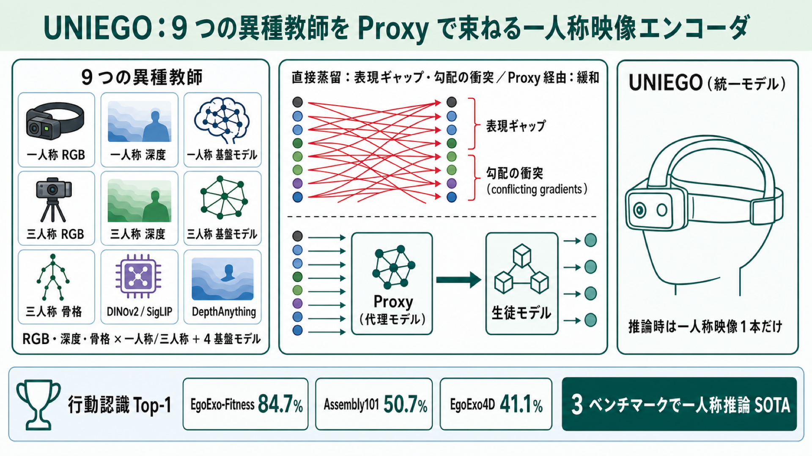

# 「代理モデル」を仲介役に、9 つの異種教師から一人称映像エンコーダを育てる — UNIEGO

## この論文のひとことまとめ

ウェアラブルカメラで撮った一人称視点（egocentric）の映像だけで動く、統一的な映像エンコーダ **UNIEGO** を提案した研究です。RGB・深度・骨格という 3 種類のモダリティ、一人称と三人称という 2 つの視点、4 つの大規模基盤モデルにまたがる、合計 9 つの「教師」モデルから知識を学びます。その際、教師から直接学ぶのではなく「Proxy（代理モデル）」という仲介役を挟む点が肝で、3 つのベンチマーク・3 つのタスクで最高性能を達成しました。推論時にはウェアラブルカメラの映像 1 本だけあれば動きます。

## なぜこの研究が重要か

GoPro のようなウェアラブルカメラで撮った一人称映像は、装着者が「いま何をしているか」を捉える上で有望なデータですが、扱いが難しいことで知られています。カメラの視野が狭く、自分の身体や手元がしばしば隠れてしまう（自己遮蔽、self-occlusion）ためです。

一方で世の中には、深度（奥行き）や骨格（人体の関節構造）といった、人の動きの幾何を捉える別種の情報源や、DINOv2 や SigLIP のような大規模な基盤モデル（foundation model）が存在します。これらは一人称映像理解には通常活かされていません。著者らは「これら多様な情報をすべて取り込みつつ、本番では一人称映像だけで動く統一表現」を作れれば、より強い一人称映像理解が実現できると考えました。本研究はその統合のやり方を示すものです。

## 背景：何が問題だったのか

多様な情報源から 1 つのモデルを育てる自然な枠組みが、**知識蒸留（knowledge distillation）**です。優れた「教師」モデルの知識を、展開しやすい「生徒」モデルに移す手法で、複数の教師を使う場合は**マルチ教師蒸留（multi-teacher distillation）**と呼ばれます。

ところが、一人称設定でこれを素直にやると 2 つの壁にぶつかると著者らは指摘します。

- **表現ギャップ（representational gap）**: 教師どうしが本質的に異質です。たとえば骨格ベースのモデルはグラフ構造を扱い、通常の映像エンコーダとは仕組みが噛み合いません。三人称（exocentric）の RGB 教師は、まったく別の視点からシーンの幾何を捉えています。これらの特徴空間を、一人称の生徒が直接すり合わせるのは困難です。
- **勾配の衝突（conflicting gradients）**: 互換性のない特徴空間を 1 つの生徒に同時に調停させると、学習の更新方向（勾配）どうしがぶつかり、最適化がうまく進みません。著者らは「1 段階の蒸留でモダリティ・視点のギャップを埋めつつ多様な事前知識を吸収させる」ことを、解の定まりにくい不良設定（ill-posed）な目的だと述べています。

既存のマルチ教師蒸留の多くは、似た性質の教師を 1 つの生徒に蒸留しており、この一人称特有の構造的な難しさを回避してきました。

## 提案手法：何をしたのか

UNIEGO の中核は、**階層的マルチ教師蒸留フレームワーク（hierarchical multi-teacher distillation framework）**です。異質な教師から生徒へ直接知識を流すのではなく、教師ごとに用意した **Proxy（代理モデル）**を仲介役として挟みます。学習は 2 つのレベルに分かれます。

### Level-I：Proxy 学習（教師の言葉を共通言語に翻訳する）

まず教師ごとに 1 つずつ Proxy モデルを用意し、各教師から独立に蒸留して学習します。

- すべての Proxy は、生徒（UNIEGO）と同じ一人称向けのアーキテクチャを共有します（パラメータは別々）。
- これにより、バラバラだった教師の知識が、生徒と互換性のある「均質な一人称の表現空間」へ翻訳されます。たとえるなら、言語の異なる 9 人の先生の話を、生徒が分かる共通言語に通訳する段階です。
- 一部の教師（基盤モデル）は行動ラベルの予測（logits）を出さず特徴埋め込みしか出さないため、この段は一貫して特徴レベルの蒸留を採用します。学習した Proxy は視点ごとに、一人称由来の集合と三人称由来の集合に分けて整理されます。

### Level-II：Selective Proxy Distillation（信頼できる仲介役だけから学ぶ）

次に、これらの Proxy 群から統一モデル UNIEGO を組み上げます。ここに 2 つの工夫があります。

- **Proxy Merging（プロキシ統合による初期化）**: 統一モデルを Proxy 群のパラメータの「最適な加重和」で初期化します。重み係数は、訓練データ上の行動分類の損失（予測の誤りの大きさ）が最小になるよう解いて決めます。著者らは、ある仮定（損失が局所的になめらかであること）の下で、この統合初期化が平均的にどの個別 Proxy よりも良い初期値になることを理論的に示しています（Proposition 1）。これにより、学習が安定して未知データにも対応しやすい、条件の良い出発点にモデルを置けると主張しています。
- **Proxy Selection（プロキシ選択）**: すべての Proxy から一律に蒸留するのではなく、サンプルごとに信頼できる Proxy だけを選びます。基準は「正解フィルタ付きの small-loss 基準」です。すなわち、その Proxy が行動クラスを正しく予測した場合のみ候補とし、候補の中から損失の小さい（＝高確信度の）上位 k 個を選びます。正しく予測した Proxy が 1 つもなければ、そのサンプルの蒸留は丸ごとスキップします。誤った監督を取り込まないための仕組みです。

統一モデルは、選ばれた Proxy から特徴レベルと logit（出力前のスコア）レベルの両方で蒸留し、同時に行動分類の損失も学びます。特徴レベルでは特徴ベクトルの向きの近さを測る**コサイン距離（cosine distance）**で、logit レベルでは予測確率分布どうしの近さを測る**KL ダイバージェンス（KL divergence）**で、Proxy に近づくよう学習します。

**推論時には、UNIEGO に一人称映像を入力するだけ**です。教師ネットワークも、三人称の映像も、Proxy も、本番ではいっさい不要になります。

## 結果：何が分かったのか

著者らは、公開されている 3 つの ego-exo データセット（EgoExo-Fitness、Assembly101、EgoExo4D）で評価しました。以下の結果はいずれも、一人称映像のみを入力した推論時のものです。

**行動認識（Top-1 精度）**では、UNIEGO がそれぞれ 84.7%、50.7%、41.1% を記録しました。素のバックボーンである TimeSformer（80.3%、47.6%、39.9%）を、各データセットで +4.4%、+3.1%、+1.2% 上回ります。最も強い蒸留ベースラインだった π-ViT に対しても、EgoExo-Fitness で +4.6%、Assembly101 で +2.9% の改善を示し、3 ベンチマークすべてで一人称推論下の最高性能（SOTA）を達成したと報告しています。

**動画検索**では、たとえば EgoExo-Fitness で、素朴なマルチ教師蒸留が mAP を +0.012 しか上げられなかったのに対し、提案手法（Selective Proxy Distillation）は +0.057 と大きく改善しました。

**時間的行動セグメンテーション**（Assembly101）でも UNIEGO は全指標で最良でした。注目すべきは、素朴なマルチ教師蒸留がスクラッチ学習（一人称のみ）より全指標で**劣化**した点で、異質な教師を直接蒸留すると細かい時間表現が乱れてしまうことが示されています。これは仲介役を挟むアプローチの必要性を裏づける結果です。

そのほか、22M パラメータの小型モデル（UniFormer-S）など複数のバックボーンで効果が出ること（特定のエンコーダに依存しないこと）、各構成要素を順に足すと精度が積み上がること（アブレーション）も確認されています。著者らはさらに、CKA という表現類似度の指標で Proxy 群の表現が教師どうしより揃っていること（表現ギャップの緩和）と、勾配が衝突する割合が選択的蒸留によって下がること（勾配衝突の緩和）を、定量的に検証しています。

## 意義と限界

UNIEGO が示したのは、視点・モダリティ・基盤モデルにまたがる多様な知識を、Proxy という仲介役を介して 1 つの一人称モデルへ統合できるということです。教師から直接蒸留するより豊かで識別力の高い表現が得られ、本番では一人称カメラ 1 つで動きます。22M の小型モデルでも有効である点は、リソースの限られた環境への展開という観点でも意味があります。

一方で著者らは限界も明示しています。現在の Proxy 選択は small-loss 基準というヒューリスティック（経験則）に基づいており、効果的ではあるものの Proxy 群の潜在能力を使い切れていません。入力と訓練の状態に応じて Proxy の信頼度を動的に重み付けする「学習された選択機構」があれば、より適応的な監督が得られるはずだと述べています。ただしその適応的な選択戦略の設計は容易ではなく、今後の有望な課題として残されています。

## まとめ

UNIEGO は、9 つの異質な教師の知識を Proxy で「共通言語」に翻訳し、信頼できる Proxy だけを選んで一人称映像エンコーダへ統合する手法です。素朴なマルチ教師蒸留が抱える表現ギャップと勾配衝突を緩和し、3 タスク・3 ベンチマークで一人称推論の最高性能を達成しました。本番に必要なのはウェアラブルカメラの映像 1 本だけです。

## 用語集

- **egocentric / exocentric（一人称 / 三人称）視点**: egocentric はウェアラブルカメラによる装着者視点の映像、exocentric は外部の固定カメラからの三人称視点。両方を含むデータセットを「ego-exo」と呼ぶ。
- **知識蒸留 / マルチ教師蒸留（knowledge distillation / multi-teacher distillation）**: 大きな「教師」モデルの知識を展開しやすい「生徒」モデルに移す枠組み。複数教師に拡張したものがマルチ教師蒸留。
- **表現ギャップ（representational gap）**: 異質な教師（アーキテクチャ・視点・モダリティが異なる）の特徴空間が互いに非互換で、生徒が直接すり合わせられないこと。
- **勾配の衝突（conflicting gradients）**: 複数の監督信号からの更新方向（勾配）が主タスクの勾配と逆向きになり、最適化を妨げる現象。
- **Proxy（代理モデル）**: 生徒と同じアーキテクチャを持ち一人称映像で動く中間モデル。各教師の知識を生徒互換の均質な空間へ翻訳する仲介役。
- **Selective Proxy Distillation（SPD）**: サンプルごとに「正しく・確信を持って」予測した Proxy だけから蒸留し、誤った監督を抑える選択的蒸留の仕組み。
- **Proxy Merging（プロキシ統合初期化）**: 統一モデルを Proxy パラメータの最適な加重和で初期化し、平坦で条件の良い損失地形に置く手法。
- **基盤モデル（foundation model）**: 大規模に事前学習されたモデル。本研究の教師には DINOv2、SigLIP、DepthAnything などが含まれる。
- **CKA（Centered Kernel Alignment）**: 2 つのニューラル表現どうしの類似度を測る指標。本研究では表現ギャップの定量化に使用。
- **コサイン距離（cosine distance）**: 2 つの特徴ベクトルの「向き」がどれだけ近いかを測る尺度。本研究では特徴レベルの蒸留に使用。
- **KL ダイバージェンス（KL divergence）**: 2 つの確率分布がどれだけ離れているかを測る尺度。本研究では予測確率の近さをそろえる logit レベルの蒸留に使用。

## 原論文

- UNIEGO: Proxies as Mediators for Unified Egocentric Video Representation Learning（https://arxiv.org/abs/2606.20559）
