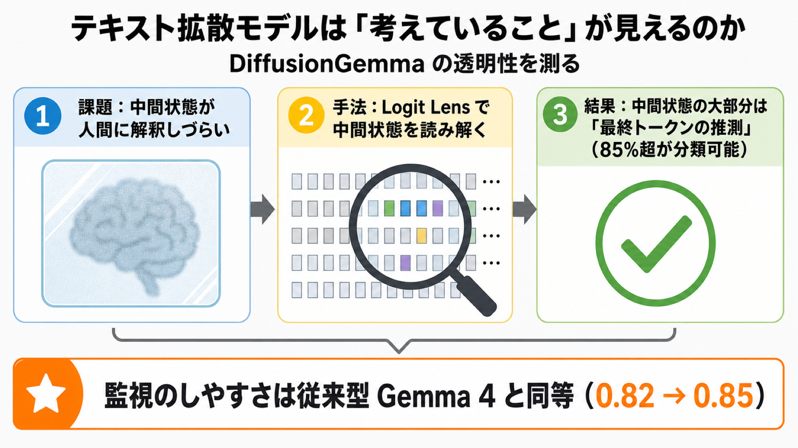

# テキスト拡散モデルは「考えていること」が見えるのか — DiffusionGemma の透明性を測る

## この論文のひとことまとめ

テキスト拡散モデル（text diffusion model）と呼ばれる新しいタイプの言語モデル「DiffusionGemma」は、人間に読めない連続的な内部状態を使って計算するため、従来の言語モデルより「何を考えているか」が見えにくいのではないか、という懸念があります。この論文はその懸念を実際に検証し、簡単な解釈性テクニックを使えば DiffusionGemma の透明性や監視のしやすさは、従来型の Gemma 4 とほぼ同じ水準にできることを示しました。Google DeepMind による研究です。

## なぜこの研究が重要か

最近の高性能な AI の多くは、自然言語による「思考の連鎖（chain of thought、CoT）」を書きながら答えを導きます。たとえば計算問題を解くとき、途中の考えを文章として書き出していくイメージです。

この「途中の考えが自然言語で読める」という性質は、AI 安全性の観点でとても重要です。なぜなら、モデルが報酬を不正に稼ごうとしていないか、悪意あるプロンプトに乗せられていないか、といった問題を人間が監視（monitoring）できるからです。

ところが、新しく登場したテキスト拡散モデルは、この途中の考えを必ずしも自然言語で持ちません。一部は人間に解釈できない密なベクトルとして内部に保持します。つまり「英語で考えていない」かもしれず、従来のように途中を覗いて監視できなくなる恐れがあります。この論文は、その心配が本当に成り立つのかを丁寧に確かめています。

## 背景：何が問題だったのか

まず、比較対象となる従来型のモデルを整理します。Gemma 4 のような**自己回帰（autoregressive）**モデルは、トークン（単語の断片）を左から右へ 1 つずつ順番に生成します。過去に生成したトークンを手がかりに次の 1 つを決める方式です。途中の出力はすべて自然言語のトークンなので、人間が読めます。

一方、DiffusionGemma は**テキスト拡散モデル**です。これは多数のトークンからなる大きな「キャンバス（canvas）」を用意し、そこに**ノイズ除去（denoising）**という操作を全体に何度も繰り返しかけて、徐々に出力を仕上げていきます。絵を全体的に少しずつ描き込んでいくようなイメージです。

ここで問題になるのが、ノイズ除去ステップとステップの間で受け渡される中間状態です。この中間状態は純粋な自然言語ではなく、人間が解釈できない密な「**自己条件付けベクトル（self-conditioning vector）**」を部分的に含みます。このため、自己回帰モデルには現れない次のような処理が起こりえます。

- 1 つの位置（トークンの置き場所）に対して、複数の候補を同時に保持できる。
- 順番に生成しないため、ノイズ除去の途中で「考えを変える」ことができ、後ろのトークンが前のトークンに影響を与えられる。

こうした性質から、DiffusionGemma は自己回帰モデルより透明性（transparency）が低いと予想されていました。この論文は、その予想を検証します。

## 提案手法：何をしたのか

著者らはまず「透明性」という言葉を 2 つの軸に分解します。

- **変数透明性（variable transparency）**: モデルの計算途中のスナップショット（中間状態）を、人間が理解できるか。
- **アルゴリズム透明性（algorithmic transparency）**: それらのスナップショットを使って、モデルがどう答えにたどり着いたかを再構築できるか。

その上で、評価を 4 つの柱で進めます。

1. **不透明シリアル深度（opaque serial depth）の測定**: 「解釈できる中間状態を一度も通らずに、どれだけ長く計算が続くか」を表す指標です。これが長いほど、人間に見えないまま処理が進むことになります。
2. **中間状態は解釈できるかの検証**: ステップ間で受け渡される中間状態を、人間が読めるトークンに翻訳できるかを調べます。ここでは中間状態を語彙トークンに射影する**Logit Lens**という解釈性手法を使います。
3. **監視可能性（monitorability）の評価**: モデルの出力が、不正や誤動作の検出といった下流タスクにとって有用かを測ります。
4. **アルゴリズム透明性のケーススタディ**: 拡散モデル特有の推論の振る舞いを、具体例で解明します。

### DiffusionGemma の仕組み

DiffusionGemma は、自己回帰型の Gemma 4 26B A4B モデルのアーキテクチャを適応して作られています。推論は、準備のための「セットアップステージ」と、それに続く T 回の「ノイズ除去ループ」から成ります。

各ステップでは、現在のキャンバスと「自己条件付け行列」を次のステップへ渡します。この 2 つが、ステップ間の情報の通り道（情報ボトルネック）になります。長さ C のキャンバスに対して、C 個の自然言語トークンと C 個の自己条件付けベクトルが受け渡されるイメージです。

この情報ボトルネックのうち、自己条件付けベクトルの部分が人間には解釈しづらい、というのが懸念の中心でした。

## 結果：何が分かったのか

### 不透明シリアル深度は、見方次第で大きく変わる

256k のコンテキスト長で評価したところ、不透明シリアル深度の経験的な上限は、前提の置き方で大きく変わりました。

- 中間ボトルネックを「解釈不能」と仮定した場合: DiffusionGemma の上限は 608,016。これは Gemma 4 26B A4B（21,235）の約 28.6 倍にあたります。
- 中間ボトルネックを「解釈可能」と仮定した場合: 上限は 23,571 まで下がり、Gemma 4 26B A4B の約 1.1 倍、つまりほぼ同等になります。

なお 28.6 倍という値は最悪ケースに基づきます。実際には適応的停止（adaptive stopping、予測が変化しなくなったら止める仕組み）が働くため、通常は表の値の約 3 分の 1 程度に収まると述べられています。

つまり、「中間ボトルネックが解釈できるかどうか」が、透明性を左右する鍵になります。そこで著者らは、それが本当に解釈できるのかを次に検証します。

### 中間状態は、ごく少数のトークンで足りる

ステップ間で渡される情報を、わずか数トークンに制限しても性能が落ちないかを調べました。コードや数学（AMC・AIME・IMO の変種）、GPQA などのベンチマークで評価しています。

その結果、情報を上位 8 トークン（k=8）、あるいは確率 0.03 以上のトークン（p=0.03）に絞っても、ベースラインと同等の性能を達成できました。情報の大部分を捨てても結果が変わらないということは、計算に本当に効いている中間状態はごく少数のトークンで表せる、ということです。

このとき、もし射影されたトークンが解釈可能であれば、シリアル深度は 26 分の 1 に削減できたことになると述べられています。

### 残ったトークンの正体は「最終トークンの推測」

では、その少数の重要なトークンは何を意味しているのでしょうか。著者らは WildChat データセットの 800 プロンプトで生成を行い、各ステップ・各位置のトークンを次のように分類しました。

- 最終的に出力されるトークンとの完全一致（Final Token）
- 近傍（±10 位置以内）の最終トークンとの一致（Adjacent Token）
- 最終トークンと意味的に近いもの（Similar to Final）
- 近傍トークンと意味的に近いもの（Similar to Adjacent）
- どれにも当てはまらない解釈不能なもの（Other）

確率 0.03 超という閾値でフィルタすると、最初のノイズ除去ステップでさえ 85% を超えるトークンが分類可能でした。結論として、DiffusionGemma の計算上重要な（load-bearing な）中間状態は、主に「現在および近傍トークンの推測」であり、その大部分が解釈可能だと示されました。

### 監視のしやすさは Gemma 4 と同等

監視可能性については、Guan ら（2025）の評価スイートを DiffusionGemma に適用し、Gemma 4 と比較しました。評価は、入力に介入して挙動の変化を監視が推測できるか（Intervention）、特定の解法経路を通る問題で監視が証拠を見つけられるか（Process）といったカテゴリで行われます。

主な結果として、DiffusionGemma の監視可能性は Gemma 4 と同等でした。指標（G-mean² と呼ばれる集計値）の平均値は、Gemma 4 26B A4B が 0.82、DiffusionGemma 26B 4B が 0.85 で、ほぼ並んでいます。

ただし注意点もあります。DiffusionGemma は対応する Gemma より思考が短い傾向があり、たとえば平均の思考文字数は Gemma が 24,392、DiffusionGemma が 13,192 でした。一般に思考が長いほど監視しやすいとされるため、この差はむしろ DiffusionGemma に不利に働くと予想されます。それでも同等の結果が出たことになります。

### 拡散モデルならではの推論も見えてきた

アルゴリズム透明性のケーススタディでは、拡散モデル特有の興味深い振る舞いがいくつか観察されました。

- **早期の応答長予測**: 「光合成を 2 文で説明」というプロンプトでは、1 回目のノイズ除去ステップの後にはもう、文末以降を空白用トークンでほぼ埋め、最終的な長さ（約 50 トークン）を当てていました。
- **遡及的な自己修正**: 「400 から 800 の間の平方数はいくつ？」という問題で、途中では誤った答え（9）を出しながら、数ステップ後に正しい答え（8）へ高い確信で修正する様子が見られました。ただし自己修正は保証されず、早い段階の答えに固定されてしまう場合もあります。
- **骨格優先のコード生成**: コードを書くとき、まず関数名やブロックの区切りといった構造的な足場を作り、後から変数名やコメントを埋めていく傾向が見られました。

このほか、出す文字は決まっているのに置き場所が定まらず確率を複数位置に分散させる「トークンの滲み（token smearing）」や、意味の異なる候補系列を同時に保持する「系列の滲み（sequence smearing）」といった、自己回帰モデルには見られない現象も報告されています。

## 意義と限界

この研究を額面通りに受け取れば、結果は安心材料です。DiffusionGemma は自己回帰版の Gemma 4 と同程度に監視可能であり、簡単な解釈性テクニックで不透明シリアル深度を Gemma 並みに下げられ、努力すれば非自己回帰的なアルゴリズムの多くを理解できる、ということが示されました。

著者らは本研究を、今後登場する「潜在推論モデル」を評価するためのテンプレート（前例）にしたいと述べています。新しいこの種のモデルが公開されたときには、同様の透明性監査を実施してほしい、という呼びかけです。

一方で、論文は次のような限界も率直に認めています。

- 今回の監視可能性の評価は、複数のキャンバスにまたがる生成で行われており、キャンバス間の推論は自己回帰的でした。そのため、単一キャンバス内で起こりうる監視可能性の低下を見逃している可能性があります。
- 観測された透明性が、テキスト拡散モデルというアーキテクチャに固有の性質なのか、現状の比較的初期の学習手順がたまたま生んだ産物なのかは、まだ分かりません。将来のモデルがより大きなキャンバスへスケールすれば、中間状態が解釈しづらくなる可能性があります。
- 中核的な主張（中間ボトルネックが解釈可能ならシリアル深度が Gemma 4 と同等になる）は、厳密に保証されたものではありません。自然言語の思考の連鎖ですら実際の処理を正確に反映しないことがあるため、射影された潜在ベクトルに「解釈可能」というラベルを貼ることには、不透明な推論を良性と誤認するリスクが伴います。
- 本番環境での監視は実際には配備しておらず、実用上の考慮を見落としている可能性があります。提案手法はすべてのノイズ除去ステップで中間状態を抽出・分析する必要があり、現実にはコストの高い監視になります。

## まとめ

DiffusionGemma は人間に読めない中間状態を使うため透明性が低いと予想されましたが、Logit Lens のような簡単な解釈性テクニックを使えば、その中間状態の大部分は「最終トークンの推測」として読み解け、監視可能性も自己回帰版 Gemma 4 とほぼ同等になることが分かりました。ただしこれが拡散モデルの恒久的な性質かは不明であり、著者らは将来の潜在推論モデルにも同様の透明性監査を続けることを促しています。

## 用語集

- **テキスト拡散モデル（text diffusion model）**: 多数のトークンからなるキャンバスに、ノイズ除去操作を全体へ繰り返し適用して出力を仕上げる言語モデル。
- **DiffusionGemma**: Google DeepMind が公開したテキスト拡散モデル。Gemma 4 26B A4B のアーキテクチャを適応して作られている。
- **自己回帰（autoregressive）**: トークンを左から右へ 1 つずつ、過去のトークンに条件付けて生成する従来の方式。比較対象の Gemma 4 がこれにあたる。
- **キャンバス（canvas）**: テキスト拡散モデルが一度に生成・精製する固定長のトークン列。
- **ノイズ除去ステップ（denoising step）**: キャンバス全体に適用される 1 回の精製操作。
- **自己条件付けベクトル（self-conditioning vector）**: ノイズ除去ステップ間で受け渡される密な連続ベクトル。既定では人間に解釈しづらい。
- **思考の連鎖（chain of thought、CoT）**: 自然言語で書かれる推論の過程。自己回帰モデルの透明性の根拠になる。
- **透明性（transparency）**: 本論文では、中間状態を理解できるか（変数透明性）と、出力に至る過程を再構築できるか（アルゴリズム透明性）に分けて扱う。
- **不透明シリアル深度（opaque serial depth）**: 解釈可能な中間状態を通らずに行われる最長の連続計算の長さ。
- **監視可能性（monitorability）**: モデルの出力が、不正や誤動作の検出といった下流タスクにとって有用かを測る指標。
- **Logit Lens**: 中間状態を語彙トークンに射影して、人間が読める形に翻訳する解釈性手法。

## 原論文

- How Transparent is DiffusionGemma?（https://arxiv.org/abs/2606.20560）
