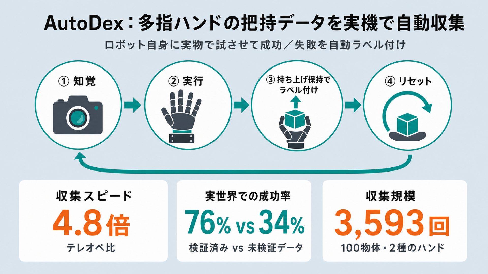

# ロボットに「持てるか持てないか」を自分で試させる：多指ハンドの把持データを実機で自動収集する AutoDex

## この論文のひとことまとめ

AutoDex は、人間のような多指ロボットハンドで物体を「持ち上げられるか」を実機で自動的に試し、成功／失敗のラベルを付けてデータベース化するシステムです。生成された把持の候補をロボットが人手の介入なしに実行・検証し、知覚から実行・ラベル付け・次の試行への準備まで一連のサイクルを自走させます。Allegro と Inspire という 2 種類のハンドで 100 個の物体にわたり 3,593 回の試行を集め、人が遠隔操作する方式に比べて 4.8 倍の収集スピードを達成しました。さらに、実機で検証済みのデータから取り出した把持は実世界での成功率が 76% と、未検証のデータ（34%）を大きく上回りました。

## なぜこの研究が重要か

ロボットが指の多いハンド（多指ハンド）で物をしっかり持つには、「この持ち方なら本当に持てる」という物理的な裏付けのあるデータが大量に必要です。ところが、その裏付けを得る作業がこれまでのボトルネックでした。

人がロボットを遠隔操作して持ち方を教える方法（テレオペレーション）は確実ですが、遅く、操作する人が疲れると頭打ちになります。一方、シミュレーションで持ち方を大量に作る方法は安くて速いものの、画面上で「持てそう」に見えても実物では滑り落ちる、という食い違いが起きます。

AutoDex は、この「速さ」と「物理的な確からしさ」の両立を、ロボット自身に実物で試させることで実現しようとした研究です。人手を一切挟まずに収集ループを回す点が要であり、ロボットの学習に使えるデータをスケールさせる現実的な道筋を示しています。

## 背景：何が問題だったのか

平行に開閉する 2 本指のグリッパと違い、多指ハンドはハンドの形（関節の状態）が高次元で、複数の指が同時に物に触れます。そのため、姿勢・摩擦・指の柔らかさ（コンプライアンス）・力のかかり方のわずかな誤差が、成功か滑落かを分けます。幾何的に「ぶつからずに届く」だけでは、実際の接触下で失敗しうるのです。だからこそデータには、成功例だけでなく失敗例も、本当の物理的な結果をラベルとして含めるべきだと著者らは指摘します。

既存の収集方法は、規模と物理的な妥当性のあいだでトレードオフを抱えていました。

- **人手によるテレオペレーション**：実際の接触結果は得られますが、遅く、疲労で頭打ちになり、操作者の癖（バイアス）も入ります。
- **シミュレーションや最適化による合成**：安価に大量生成できますが、候補が妥当かどうかはシミュレータの接触モデル次第です。指のパッドの変形や機構のがたつき（バックラッシュ）、微小な滑りなどを忠実には再現できません。条件をランダムにばらつかせる手法（domain randomization）でも、モデル化されていない効果には対処できません。

自然な解決策は「合成で候補を作り、モデルで実行可能性をチェックし、実機で検証する」を組み合わせることです。ただし実機検証は、知覚・実行・ラベル付け・リセット（次の試行への物体の置き直し）まで含む収集ループ全体が人手なしで回って初めてスケールします。どこか一箇所でも手作業が残れば、テレオペと同じボトルネックが戻ってきます。つまり本当の課題は、把持を生成すること自体ではなく、端から端まで自律したデータ収集なのです。

加えて、既存の自律収集は主に 2 本指グリッパ向けでした。多指ハンドは行動の自由度が高く、探索が非効率です。さらにハンド自身が物体を隠してしまうため、成功の判定も難しくなります。リセットも「落とせば勝手に安定する」では済みません。候補は物体の安定姿勢ごとに索引付けされているため、姿勢を作り直す必要があるからです。

## 提案手法：何をしたのか

中核アイデアはシンプルです。生成された把持候補を実機で**持ち上げて一定時間保持する（lift-and-hold、持ち上げ保持）**ことで成功／失敗を自動でラベル付けし、知覚 → 実行 → ラベル付け → リセットの全サイクルを人手なしで回します。システムは 4 つの要素から成ります。

### 1. 把持候補の生成

物体のモデルとシーンの仕様を入力すると、物体を基準にした手首の姿勢（wrist pose）とハンドの形の組み合わせ、つまり把持候補（grasp candidate）の集合が出てきます。この生成器が担うのは「幾何的・運動学的に実行できそうな候補」を出すところまでで、実際の接触下での安定性は保証しません。実装では既存の把持合成器 BODex を採用しています。シーンの制約は wall（壁）・shelf（棚）・box（箱）という 3 つの平面プリミティブで表し、一般的なテーブル上の状況をカバーしつつ、ハンドが届かない完全密閉は除外します。候補は物体の安定姿勢ごとにまとめられます。

### 2. AutoDex ワークセル（収集用の作業空間）

6 自由度の xArm に交換可能な多指ハンドを取り付け、1.5×1.5×2.5 m の照明付きキャプチャセル内に **20 台の RGB カメラ**を同期配置します。各カメラは 30 FPS・2048×1536 解像度で、サブミリ秒のハードウェアトリガで同期します。カメラを密に置くのは、実行中にハンドが物体を隠しても、別の視点から姿勢を推定できる冗長性を確保するためです。カメラの内部パラメータは ChArUco ボード（較正用の市松模様パネル）で事前較正し、セッションごとの配置は COLMAP（多数の写真からカメラ位置を復元するソフト）と hand-eye 較正（カメラとアームの位置関係合わせ）で復元します。ハンドは 16 自由度の Allegro Hand か、6 自由度の Inspire Hand を使います。

安全のための仕掛けとして、**学習型の残差トルクモニタ**を備えます。アーム標準の衝突検出は、持っている物体が外力のように見えたりハンド装着で先端の慣性が変わったりして誤検出するため使いません。代わりに、何にも触れていないときの関節トルクを小さなニューラルネット（MLP）で予測し、実測トルクとの差（残差）を見ます。差がしきい値を超え続けたら「予期せぬ接触」とみなし、テーブル付近を降りるときなど接触の危ない区間だけでこの監視を有効化して、検出時はハンドを持ち上げながらホーム姿勢へ戻します。

### 3. 自律データ収集ループ

各試行のはじめに、多視点の観測から物体の 6D 姿勢（3 次元の位置と向き）を推定し、いまの安定姿勢を特定して、各候補をロボットの座標系に変換します。IK（逆運動学）の解がない候補や、テーブル・物体とぶつかる候補を除いて、実行可能な候補の集合を作ります。

未試行の候補を選んで衝突を避ける軌道を計画し、ハンドを大きく開いた状態で接近 → 把持直前の姿勢 → 把持 → 持ち上げて一定時間保持、と進めます。ラベル付けは、録画した多視点の映像から後処理で自動的に行います。物体の 6D 姿勢を追跡し、持ち上げ保持の基準――**3 秒の保持のあいだ初期の高さより 5 cm 以上高いままなら成功、そうでなければ失敗**――を適用します。

各試行の記録（実行計画・多視点録画・追跡した姿勢・カメラ較正・タイミング・シーン情報・成功／失敗ラベル）を保存し、その候補を「試行済み」と記録します（同じ候補を二重に評価しないための状態管理）。いまの姿勢で試せる候補が残っていればすぐ次へ、なければリセットして別の安定姿勢へ移ります。

### 4. リセット（Stable Reorient Placement）

いまの姿勢の候補が尽きると、まだ候補が残る別の安定姿勢を選んで物体を置き直します。著者らの手法は **Stable Reorient Placement** と呼ばれ、物体を持ち上げて再配向した後、解放する前に目標の姿勢でテーブルへ「置く」点が特徴です。これにより「落として勝手に安定するのを待つ」という受け身の安定化への依存をなくします。

皿やトレイのような平たい物体では、持ち上げ側と置き側の制約を同時に満たすとハンドの入る空間が足りなくなることがあります。そこで、目標姿勢の高さ h だけ上から解放してよいとする height-relaxed placement を導入し、解放後に指へ触れずに降ろせるよう仮想の支柱（virtual support pillars）を衝突計算上に置きます。h=0 から試し、衝突のない置き直しが見つからなければ h を増やします。

### データベースの活用：実環境での把持

収集した「実行済み・物理ラベル付き」の把持はデータベース化されます。実環境で使うときは、4 台の較正済み RGB カメラで対象物体の 6D 姿勢と周囲の障害物の形を推定し、データベースから成功した把持を取り出して座標系を合わせ、衝突しない軌道が存在する最初の把持を実行します。ポリシーの追加学習や追加の実機試行なしに、収集済みデータをそのまま現場で使える設計です。

## 結果：何が分かったのか

評価は 4 つの観点で行われました。(1) テレオペとのスループット比較、(2) 物理検証がデータベースの品質に与える効果、(3) 自律リセットの役割、(4) カメラ密度が姿勢推定の信頼性に与える効果です。評価には 100 物体のデータベースから代表 20 物体のサブセットを使い、成功判定は前述の「5 cm 持ち上げ・3 秒保持」を用います。

- **収集スピード**：AutoDex は 500 試行を 10.3 時間で集めました。同じワークセルでのテレオペは同数に 49.4 時間を要し、実効スループットで **4.8 倍**の改善です。ロボット自体の動作時間は両者でほぼ同じですが、テレオペでは人の監督が必要で、疲労や終業による稼働していない時間が積み重なります。スループット向上は 1 回 1 回を速くしたからではなく、人の待ち時間をなくし無人で連続収集できるようになったためです（実際、1 試行あたりの平均ループは 48.2 秒で、その約半分はロボットの物理的な動作が占めます）。

- **物理検証の効果**：AutoDex で検証済みのデータベースから取り出した把持は実世界の成功率 **76%**、実世界の検証をしていないデータベース（モデルでふるい分けただけ、model-screened）の把持は **34%** でした。20 物体・515 試行を、テーブル上・壁際・雑然とした環境（cluttered）の 3 シーンで評価しています。改善は素材・シーン・重量のどのカテゴリでも一貫しており、特に雑然とした環境で差が最大でした。そこでは未検証データの把持が実接触下で頻繁に失敗する一方、検証済みデータは 80〜90% の成功を保ちました。

- **リセット戦略の比較**：比較対象は、真上に持ち上げて落とすだけの Naive Drop と、ハンド内で再配向してテーブル上方で解放する Reorient + Passive Release です。著者らの Stable Reorient Placement は、解放前に目標姿勢でテーブルへ置きます。リセットの難しさは「落としたときに目標姿勢へ自然に至る確率（受動遷移確率）」で測れますが、著者手法はこの確率がほぼ 0、つまり受け身の戦略では実質たどり着けない姿勢でも高い成功率を保ちました。さらに Reorient + Passive Release は 5.3% の試行で物体を作業領域の外へ弾き出し人手の復旧が必要でしたが、著者手法ではそうした失敗はありませんでした。

- **カメラ密度と姿勢の信頼性**：20 台での精緻化姿勢を基準に、ランダムに選んだ k 台で再推定した姿勢との誤差（mean ADD-S）を測りました。誤差は k=2 の 14.3 mm から k=16 の 0.5 mm へと減り、最も改善が大きいのは k=2 から k=4 のあいだでした。k=2 で誤差が大きいのは、模様の乏しい物体や薄い物体での大きな推定失敗が原因で、k=8 でほぼ解消します。物体表面のカバー率は約 8 台で頭打ちになります。

## 意義と限界

この研究の意義は、生成した把持候補を実世界で実行・ラベル付けする端から端まで自動のシステムを提案したこと、成功と失敗の両方・同期した多視点観測・ロボットの状態軌道を含む大規模な実世界把持試行データベースを構築したこと、そして収集ループ全体をシステムとして評価したことの 3 点にあります。著者らは、幾何的・衝突的な実行可能性だけでは信頼できる多指把持データベースには不十分で、物理検証が滑り・柔らかさ・多指ゆえの不安定さで失敗する把持を取り除き、品質を大きく高めると結論づけています。

一方で、論文は次の限界を認めています。

- 固定したアームとハンドの構成での安定把持を対象としており、両手の協調、移動しながらの操作、指で転がして持ち直す動作（finger-rolling regrasp）、道具の使用や受け渡しのような機能的把持は対象外です。
- 上流の生成器の盲点をそのまま引き継ぐため、接触中に指を動かす必要のある把持は見逃しうります。
- 密な多視点の知覚は姿勢の信頼性を高めますが、最高スループットの設定はやはり多数のカメラを備えたワークセルに依存します。

## まとめ

AutoDex は、多指ハンドの把持データを「ロボット自身に実物で試させて」自動収集するシステムです。実世界での検証によって、シミュレーションだけでは見抜けない失敗をふるい落とし、収集を高速化しながらも実環境でよく転移する高品質なデータベースを得られることを示しました。

## 用語集

- **多指把持（dexterous grasping）**：指の多いハンドによる把持。2 本指グリッパと違い、高次元の形と複数同時の接触を伴う。
- **持ち上げ保持（lift-and-hold）**：成功判定の基準。物体を 5 cm 持ち上げ 3 秒保持できれば成功とする。
- **把持候補（grasp candidate）**：物体を基準にした手首の姿勢とハンドの形の組み合わせ。本研究では BODex が生成する。
- **BODex**：二段階最適化による多指把持の合成器。本研究の候補生成器として採用。
- **model-screened database**：実世界検証なしで、シミュレーション上の弱い摂動による簡易チェックだけで選別した候補データベース。比較のベースライン。
- **AutoDex-validated database**：自律収集中に実行され、持ち上げ保持テストを通った候補だけを残したデータベース。
- **残差トルクモニタ（residual-torque monitor）**：自由空間でのトルク予測と実測の差から予期せぬ接触を検出する、学習型の衝突検出。
- **Stable Reorient Placement**：著者のリセット手法。解放前に目標姿勢でテーブルへ物体を置き、受け身の安定化への依存をなくす。
- **受動遷移確率 P(P_j|P_i)**：物体をある姿勢から落としたとき別の姿勢へ至る確率。リセットの難しさの指標。
- **6D 姿勢**：物体の 3 次元の位置と向き（回転）を合わせた表現。
- **ADD-S**：物体姿勢推定の誤差指標。本研究ではカメラ台数による姿勢の差の評価に使う。
- **Allegro Hand（16 自由度）／ Inspire Hand（6 自由度）**：本研究で用いた交換可能な多指ハンド。

## 原論文

- AutoDex: An Automated Real-World System for Dexterous Grasping Data Collection（https://arxiv.org/abs/2606.23689）
