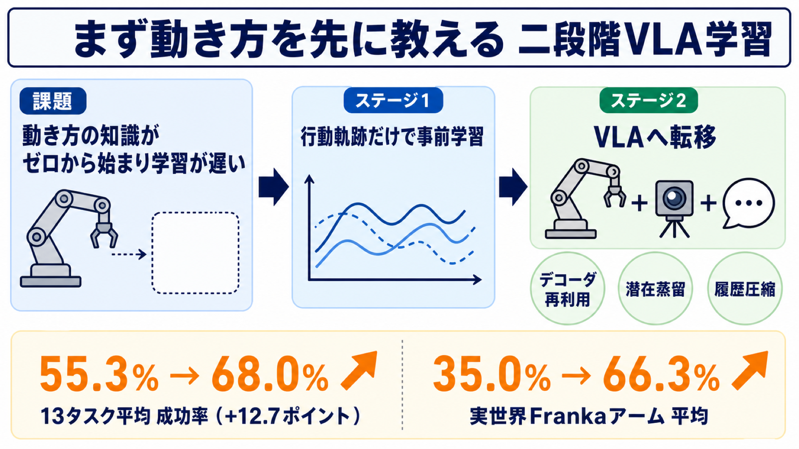

# ロボットに「まず動き方」を先に教える — 見る前に行動の事前知識を仕込む二段階VLA学習

## この論文のひとことまとめ

ロボット操作の AI である VLA（Vision-Language-Action）モデルは、カメラ映像と言語指示から「次にどう動くか」を予測します。本研究は、その「動きを生み出す部分」を、視覚も言語も使わず**行動の軌跡だけ**で先に事前学習し、「動き方の事前知識（action prior）」を仕込んでから本体の学習に転移する二段階の枠組みを提案しました。これにより学習の収束が速くなり成功率も上がり、特にデータが乏しい実世界タスクで大きな改善が得られました（Abstract）。

## なぜこの研究が重要か

近年のロボット操作 AI は、画像と文章を理解できる強力な基盤モデル（VLM）に「行動を出力する部分」を後付けする作りが主流です。VLM 側は大量のデータで鍛えられているため、視覚や言語の知識は豊富に持っています。しかし行動を出力する部分は、物理的な「動き方」をほぼゼロから学び始めなければなりません。

人間に例えると、本や写真で世界をよく知っているのに、手足の動かし方をまったく知らない状態に近いと言えます。本研究は、この「動き方の知識が最初から欠けている」ことが学習を遅らせる構造的なボトルネックだと指摘し、動き方だけを先に教えるという素直な解決策で、学習効率と成功率の両方を底上げできることを示した点に意義があります。

## 背景：何が問題だったのか

多くの VLA モデルは、基盤となる VLM に行動モジュールを後付けし、全体をまとめて一括で最適化します。この作りでは VLM 由来の視覚・言語の知識は引き継げますが、行動モジュールには明示的な「動きの事前知識（motion prior）」がありません（Abstract / I章）。

そのため学習の初期段階で、ロボットは二つの難しい課題を同時に解かされます。一つは「時間とともに行動がどう変化するか」という行動のダイナミクスを発見すること。もう一つは「見たもの・指示・制御」を対応づけるクロスモーダルな整合です（Abstract）。

さらに困るのは勾配（学習の更新信号）の問題です。行動を出力する部分が未学習のままだと、そこから基盤モデルへ逆向きに伝わる学習信号が不安定で構造の悪いものになり、土台のモデルにまで干渉して収束を遅らせます（I章 / III章）。この問題は、形態の異なる複数のロボットを一つのモデルで扱う **cross-embodiment（クロス・エンボディメント）** の設定では、ロボットごとに動きの分布がばらばらになるため、いっそう深刻になります（Abstract）。

関連する既存手法もいくつかありますが、本研究とは狙いが異なります（II章）。たとえば映像のフレーム間変化から行動らしき表現を学ぶ手法（LAPA・IGOR・Moto など）は、「画像がどう変化したか」を捉えがちで、ロボットの運動分布そのものを直接モデル化しません。本研究は視覚も言語も使わず、行動軌跡そのものから物理的な運動の統計を切り出す点が新しいとされています（II-C章）。

## 提案手法：何をしたのか

中核にあるのは「方策（policy）はまず動き方を学び、その後で見て行動することを学ぶべき」という発想です（Fig. 1）。これを二段階の学習として実装します。

### ステージ1：行動の事前知識を学ぶ（行動だけ、視覚・言語なし）

まず、軽量な行動モジュール（エンコーダ・デコーダ構成）を、視覚や言語のトークンをいっさい処理せず、**条件のない行動軌跡だけ**から学習します（III-B / III-C章）。ここで言う「行動の事前知識（action prior）」は、二つの能力として定義されています（III-B章）。

- **分布のモデル化（Distribution Modeling）**：連続的な行動の分布をうまく当てはめる能力。
- **構造の抽象化（Structural Abstraction）**：時間的にひとまとまりの行動列（action chunk）を、意味のあるコンパクトな潜在表現に圧縮する能力。

仕組みとしては、ロボット自身の身体状態（固有受容状態）と行動を交互に並べた系列を入力にし、エンコーダがそれを一つの潜在ベクトルに要約します。デコーダ側は **flow matching（フロー・マッチング）** という生成手法を使い、その潜在ベクトルを手がかりに元の行動列を復元するように学習します。フロー・マッチングは、ガウス雑音と正解行動の間を線形に補間した経路を作り、その経路上の「速度場」を予測することで、連続的で多峰な（答えが一つに定まらない）行動分布を扱える手法です（III-C章）。

### ステージ2：行動の事前知識を活かして VLA を学習する

ステージ1で得た事前知識を、三つの方法で本体の VLA 学習に転移します（I章 / III-D / III-E章）。

1. **デコーダの再利用**：ステージ1で学んだデコーダを、VLA の行動出力部の初期値としてそのまま使います（III-D章）。
2. **初期段階の潜在蒸留（latent distillation）**：正解の行動軌跡からステージ1のエンコーダが取り出す潜在表現を「教師」とし、VLM が予測する潜在表現をそれに近づけます。これにより VLM を、ステージ1で得た「動きを意識した潜在空間」へ誘導します。ただしこの制約は学習が進むにつれて徐々に緩め（重みを単調に減衰させ）、ある時点から先は通常の end-to-end 最適化に切り替えます。初期だけ誘導し、後半は自由にさせるという戦略です（III-D章）。
3. **履歴の圧縮（history compression）**：学習済みのエンコーダを「履歴の圧縮器」として再利用します。過去の状態・行動の系列を**たった1つの潜在トークン**に圧縮して VLM へ入力します。生の数値の軌跡をそのまま渡すのではなく、行動の事前知識で構造化した運動情報を1トークンで注入するため、計算の追加コストはわずかです（III-E章）。

## 結果：何が分かったのか

評価は cross-embodiment 設定で、3 つのベンチマークにまたがる計 13 タスクで行われました。具体的にはシミュレーションの LIBERO、ヒューマノイド GR1 を使う RoboCasa、そして実機の Franka アームです。すべてのモデルを混合データで同時に学習し、環境ごとの追加調整なしで評価しています（IV-A章）。

主な結果は次のとおりです。

- **13 タスク平均の成功率**：行動事前知識なしが 55.3% だったのに対し、行動・状態の事前知識を加えると 64.9%（+9.6 ポイント）、さらに履歴トークンを加えたフルモデルで 68.0%（+12.7 ポイント）まで向上しました。比較対象の GR00T は 48.6%、π0.5 は 53.8% でした（Table III）。
- **実世界 Franka アームの平均**：事前知識なし相当が 35.0% のところ、行動事前知識で 61.3%、履歴を有効化すると 66.3% に達しました（IV-B章）。データが乏しい実世界タスクほど効果が大きく出ています。
- **特にデータの少ない実世界タスク**：たとえば「コーラを掴む」は 5% → 35%、「カップを積む」は 25% → 75% へと、行動事前知識の付加で大きく改善しました。さらに履歴を加えると、それぞれ 50%、80% まで上がっています（Table III / IV-B章）。
- **学習の立ち上がりの速さ**：ステージ2の最初の 3,000 ステップで、行動事前知識を使うと初期の予測損失が約 8 分の 1（およそ 7.1 → 0.9）に、勾配の大きさが約 16 分の 1（およそ 1,400 → 90）に下がりました。検証用の誤差（MAE）が 0.1 に達するまでのステップ数も、事前知識なしの約 2,100 ステップに対し、事前知識ありでは約 700 ステップで済みました（Fig. 5）。

比較対象の π0.5 については興味深い挙動も報告されています。シミュレーションでは競争力を保つものの、実機では崩れてしまい、「カップを積む」タスクは全試行で失敗（最初のカップを十分に持ち上げられず2個目に衝突）、「コーラを掴む」では目標姿勢には到達するものの掴む動作を出さない、という失敗が観察されました（IV-B / IV-C章）。

学習コストの面でも、ステージ1の追加学習は 8 枚の H200 GPU で約 2 時間と軽量で、後続の VLA 学習（約 20 時間）に対しておよそ 10% の実時間増にとどまります（IV-D章）。

## 意義と限界

この研究の意義は、VLA 学習の遅さの一因を「行動の事前知識が最初から欠けていること」という構造的なボトルネックとして特定し、それを軽量な前処理で補えると示した点にあります（I章）。実際、ステージ1のデータを増やすほどより強い事前知識が得られ、それが下流の VLA 性能に直接転移することも確認されています。論文の検証では、ステージ1のデータを約 4 倍に増やすと、ステージ1の 2 時間のコストを実時間に含めても、最終的に事前知識なしの手法を追い越せたと報告されています（IV-F章）。

限界として、著者自身が「ステージ1で使ったデータの規模はまだ控えめである」と述べています。そのうえで、より広く多様な行動データ（行動だけからなるロボットデータセット）で事前学習すれば、さらに強い事前知識を後続の VLA 学習へ転移できる、という方向性を示唆しています。これは断定ではなく今後の展望として提示されています（IV-F章）。

## まとめ

本研究は、ロボット操作 AI に「見て行動する」よりも先に「動き方」を教えるという二段階の発想を、行動軌跡だけで学ぶ事前学習として具体化しました。学習済みの行動知識をデコーダの再利用・潜在蒸留・履歴圧縮という3つの経路で本体に転移することで、収束が速まり成功率が上がり、とりわけデータの乏しい実世界タスクで大きな効果が得られています。

## 用語集

- **VLA（Vision-Language-Action model）**：視覚観測と言語指示を条件に、未来の行動列を予測するロボット操作向けの行動生成モデル。
- **VLM（Vision-Language Model）**：VLA の土台となる基盤視覚言語モデル。豊富な意味的知識を持つ。
- **action prior（行動事前知識）**：視覚・言語に依存せず行動軌跡だけから学ぶ「動き方の事前知識」。分布のモデル化と構造の抽象化という2つの能力で定義される。
- **cross-embodiment（クロス・エンボディメント）**：行動空間・状態空間・運動分布が異なる複数のロボット形態を、一つの方策で扱う設定。
- **action chunk**：連続する複数ステップの行動列。
- **flow matching（フロー・マッチング）**：連続的で多峰な行動分布を扱う生成手法。雑音と正解行動の間を補間する経路上の速度場を予測する。
- **latent distillation（潜在蒸留）**：ステージ1エンコーダの潜在表現を教師とし、VLM の予測表現をそれに近づける蒸留。学習初期だけ強く効かせ、徐々に緩める。
- **history compression（履歴圧縮）**：学習済みエンコーダで過去の状態・行動履歴を1トークンに圧縮し、VLM に低コストで時間的文脈を与える機構。
- **固有受容状態（proprioceptive state）**：ロボット自身の身体構成（手先の姿勢や関節角度など）を表す状態。

## 原論文

- Learning Action Priors for Cross-embodiment Robot Manipulation（https://arxiv.org/abs/2606.26095）
