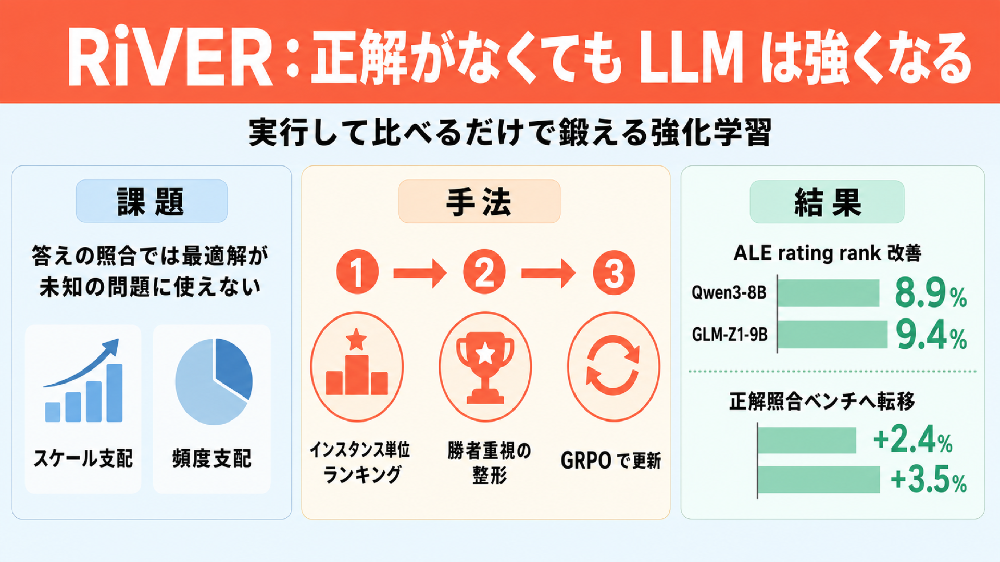

# 正解がなくても LLM は強くなる — 「実行して比べる」だけで鍛える強化学習フレームワーク RiVER

## この論文のひとことまとめ

大規模言語モデル（LLM）を強化学習で鍛えるとき、これまでは「正解と一致したかどうか」で報酬を与えるのが主流でした。この論文は、正解（ground-truth solution）がそもそも存在しない／未知の最適化タスクでも、候補を実際に実行してスコアで比べるだけで LLM を訓練できる枠組み **RiVER（Ranking-induced VERifiable framework）** を提案します。正解を一切使わずスコアベースのタスクだけで訓練したにもかかわらず、正解照合型のコーディングベンチマーク（LiveCodeBench, USACO）にも性能が転移することを示しました。

## なぜこの研究が重要か

近年の LLM の推論能力向上を支えてきたのが、RLVR（Reinforcement Learning with Verifiable Rewards）と呼ばれる強化学習の枠組みです。これは「検証可能な報酬」、つまり機械的に正誤を判定できる信号でモデルを最適化するアプローチです。

ただしその支配的な形は「答えの照合（answer matching）」に強く結びついています。モデルの出力が決められた正解と一致したときだけ報酬を与える、いわば二値（binary）の正誤判定です。この方式は、単一の正解が決まっている問題には有効ですが、そうでない問題には使いにくいという弱点があります。

世の中には、答えが一つに決まらない問題が数多くあります。アルゴリズム設計・最適化・計画立案などがその例で、実行可能な解が無数にあり、それぞれ品質が異なり、最適解は未知だったり計算困難（NP-hard）だったりします。こうしたタスクで LLM をどう鍛えるかは、応用範囲を広げるうえで重要な課題でした。

## 背景：何が問題だったのか

著者らが注目したのは、答えが一つに決まらないタスクも「広い意味では検証可能」だという点です。候補となる解を実際に実行し、エラーなく動くか（実行可能性）を確認し、目的関数のスコアで互いに**比較**できるからです。正解と照合しなくても、「どちらがより良いか」は判定できます。

では、この目的スコアをそのまま強化学習の報酬に使えばよいかというと、話は単純ではありません。著者らは、連続値のスコアを素朴に報酬として使うと生じる 2 つの問題を特定しました。

- **スケール支配（scale dominance）**: 問題インスタンスごとにスコアの数値の大きさがそろっていません。インスタンスのサイズ、グラフ構造、重みのスケール、外れ値などで値が大きく変わります。生のスコアを横断的に集計すると、たまたま数値レンジの大きいインスタンスが報酬信号を独占してしまいます。
- **頻度支配（frequency dominance）**: モデルが生成する候補群（ロールアウト）には、同じありふれた解法のわずかな変種が何度も含まれがちです。サンプル単位で報酬（credit）を割り当てると、何度も出てくる平凡な解のほうが、稀にしか見つからない強い解よりも大きな勾配（学習の力）を集めてしまいます。

この 2 つを放置したまま生スコアで訓練すると、最適化向けのスコアは上がっても、汎用的なコーディング能力には結びつかない、というのが既存手法の限界でした。

## 提案手法：何をしたのか

RiVER は、正解なしで実行可能な最適化タスクから LLM を訓練するフレームワークです。土台には、価値モデルを使わず群（グループ）内サンプルの相対的な報酬から優劣を推定する強化学習アルゴリズム **GRPO（Group Relative Policy Optimization）** を用い、その報酬部分だけを「順位に基づく・勝者重視」の報酬に置き換えます。

### 訓練タスクの組み立て方

各訓練タスクは、問題プロンプト、決定的な評価器、そして隠れたテストインスタンスの集合からなります。モデルは推論を含む応答を生成し、最後に完全な実行可能プログラムを出力します。このプログラムを各インスタンスで実行し、

- クラッシュ・タイムアウト・制約違反・不正な形式なら「無効（invalid）」
- 正しく動けばその目的スコア

を得ます。スコアは「大きいほど良い（larger-is-better）」に統一し、最小化問題は値の符号を反転させて扱います。

一つのプロンプトに対して複数の候補応答（論文では群サイズ G 個）をサンプルし、すべて同じ隠れインスタンスで実行します。ここで重要なのは、教師信号が「参照解と一致するか」ではなく「同じインスタンス上で、他の候補プログラムより良い出力を出せるか」である点です。正解を持たず、候補同士の相対比較だけで学習が進みます。

### 順位に基づく勝者重視の報酬

RiVER の中核は、報酬を次の 3 段階で組み立てるところにあります。

1. **インスタンス単位ランキング（instance-wise ranking）**: 隠れインスタンスごとに、候補を目的スコアで順位付けします。無効な候補は別扱いで最低の報酬とします。同点の候補には中央順位（average-tie ranking / midrank）を割り当て、同じ解を重複して過大評価しないようにします。順位付けを各インスタンス内で行うため、インスタンスごとのスコアの大きさの違いに影響されません（順位はスコアの単調変換に対して不変）。これがスケール支配への対処になります。
2. **勝者重視の整形（winner-heavy shaping）**: その上で報酬を整形します。無効な解には -1、最良の妥当な解には 1、それ以外の妥当な非勝者には -0.5〜0.5 の範囲に収まる段階的なフィードバックを与えます。最良の候補とその他のあいだに明確な差（マージン）を作りつつ、勝者ではない解にも含まれる有益な情報を捨てずに残します。
3. **集約と GRPO 更新（aggregation and GRPO update）**: 整形した報酬を隠れインスタンスにわたって平均し、それを GRPO のサンプル単位の advantage（優位度）として用います。GRPO のクリップ目的や KL 正則化はそのままで、報酬だけを差し替えます。平均した報酬はもともと有界なので、追加の標準化は行いません。

著者らは、こうして得られる RiVER の報酬が次の 3 つの性質を持つと整理しています。正解を必要としない（ground-truth-free）、同一インスタンス内でのみ順位付けするためスケールに不変（scale-invariant）、そして勝者を重視しつつも二値ではない（最良候補には分離した報酬、妥当な非勝者には段階的フィードバック）という点です。

## 結果：何が分かったのか

著者らは、AtCoder Heuristic Contest（AHC）というスコアベースのヒューリスティックコンテストの問題で訓練を行いました。評価用の ALE-Bench と重複しないよう選んだ 12 タスクを使い、各候補プログラムを 10 個の隠れテストインスタンスで評価しています。バックボーンには Qwen3-8B と GLM-Z1-9B-0414 という 2 つのオープンソースの推論モデルを用いました。

評価は 2 種類で行われます。一つは正解のない最適化タスクのベンチ ALE-Bench（指標は Rating と、人間参加者中のパーセンタイル順位 Rank %。Rank % は低いほど良い）。もう一つは、厳密なテストケースの正誤で判定する正解照合型のベンチ LiveCodeBench（v5/v6）と USACO です。すべて 3 回の独立実行の平均 Pass@1 で報告されています。

主な結果は次のとおりです。

- **最適化ベンチでの改善**: RiVER は ALE の rating rank を Qwen3-8B で 8.9%、GLM-Z1-9B-0414 で 9.4% 改善しました。絶対点で見ると、ALE Rating は Qwen3-8B で 845 から 987（+142 点）、GLM-Z1-9B-0414 で 805 から 962（+157 点）に向上しています。
- **正解照合ベンチへの転移**: 正解を一切使わずスコアベースのタスクだけで訓練したにもかかわらず、LiveCodeBench と USACO で平均して Qwen3-8B で +2.4%、GLM-Z1-9B-0414 で +3.5% の絶対改善が得られました。
- **ベースラインとの対比**: 生の実行スコアで訓練したベースライン（Raw-GRPO など）は ALE Rating を上げるものの、正解照合ベンチには転移しませんでした。特に強い Qwen3-8B では、これらのベンチで一貫した改善が見られず、横ばいか低下にとどまりました。
- **網羅的な優位**: RiVER は、Qwen3-8B バックボーンで 5 つの評価指標すべてを改善した唯一の手法でした。生スコア系やインスタンス単位ランキングだけの他のベースラインは、少なくとも 1 つの正解照合ベンチで性能が下がっています。

難易度別に見ると、RiVER の利得は medium・hard の問題で最も大きくなりました。たとえば LiveCodeBench v5 では、Qwen3-8B で medium が +5.0%、hard が +1.4%、GLM-Z1-9B では +7.0%・+5.7% の改善です。easy はベースモデルがすでに 93% を超えているため、変動は小さくなっています。

著者らはアブレーション（要素を取り除く検証）も行い、勝者重視の整形（winner-anchored shaping）を加えると、順位に均等間隔の報酬を割り当てるだけの Rank-uniform に比べ、ALE が Qwen3-8B で +27 点、GLM-Z1-9B で +31 点さらに向上し、LiveCodeBench と USACO を平均 2.4% 改善することを確認しています。

## 意義と限界

この研究の意義は、「検証可能性」の捉え方を広げた点にあります。厳密な答え照合だけでなく、候補解を実行可能性でチェックし目的値で比較できる広いクラスの環境を、有効な訓練環境として使えると示しました。最適化問題は評価対象としてだけでなく、一般的な推論・コーディング能力を伸ばすための訓練環境にもなる、というわけです。

著者らはなぜスコアベースのタスクが有用なのかについても考察しています。単に数値フィードバックが多いからではなく、モデルが生成したサンプル同士のあいだに、より豊かな相対的な区別を生み出せるからだと論じます。これを **Group-relative feedback resolution（GFR、群相対フィードバック解像度）** という量で定式化し、解像度が高いほど、群内のサンプルがすべて同じフィードバック値につぶれてしまう「フィードバック衝突（feedback collision）」が起きにくくなることを示しました。二値の検証器は、ポリシーが弱いときも強いときも解像度が限られ、群内の相対情報に乏しいというわけです。

一方で著者らは限界も明示しています。フィードバックの解像度が高いだけでは報酬信号として信頼できません。アブレーションの結果は、濃いスコアフィードバックが最適化志向の rating を一貫して上げる一方、正解照合ベンチへの転移は同じ程度には及ばないことを示しており、**豊かさ（richness）は校正（calibration）と組み合わせる必要がある**と述べています。RiVER は、インスタンス単位の順位付けと勝者重視の整形によってこの校正を与えている、という位置づけです。

そのうえで、正解なしの RLVR 環境を作る実用的な基準として、「検証可能であり、かつモデルのサンプルを複数のフィードバックレベルに分離できること」を挙げています。スコアベースの最適化タスクはこの基準を自然に満たすとしています。

## まとめ

RiVER は、正解や最適解が得られない設定でも、候補を実行してスコアで比べるだけで LLM を強化学習で鍛えられることを示したフレームワークです。鍵となるのは、スケールに左右されない順位付けと、勝者を際立たせつつ非勝者の情報も残す報酬設計でした。最適化タスクだけで訓練しても正解照合型のコーディングベンチに性能が転移したことは、答え照合を超えた「相対的・実行可能・正解なし」の検証が、LLM のスケーラブルな強化学習の有望な方向であることを示唆しています。

## 用語集

- **RLVR（Reinforcement Learning with Verifiable Rewards）**: 機械的に正誤を判定できる信号でモデル出力を最適化する強化学習の枠組み。本論文は、その支配的形態が「答えの照合」に依存する点を限界として指摘します。
- **ground-truth-free（正解なし）**: 参照プログラム・正解出力・認定された最適解を使わない設定。RiVER の中核となる前提です。
- **score-based optimization tasks（スコアベース最適化タスク）**: 単一の正解ではなく、実行して目的関数で品質を比較できる開放的な最適化タスク。AHC などが該当します。
- **GRPO（Group Relative Policy Optimization）**: 価値モデルを使わず、群内サンプルの相対報酬から優位度を推定する強化学習アルゴリズム。RiVER はこの上に独自の報酬を載せます。
- **scale dominance（スケール支配）**: インスタンスごとにスコアの数値スケールがそろわず、レンジの大きいインスタンスが報酬信号を独占してしまう現象。
- **frequency dominance（頻度支配）**: 何度もサンプルされる平凡な解が、稀だがより強い解より大きな学習の力を集めてしまう不整合。
- **instance-wise ranking（インスタンス単位ランキング）**: 隠れインスタンスごとに候補を目的スコアで順位付けする操作。スコアの大きさに影響されません。
- **winner-heavy shaping（勝者重視の整形）**: 最良候補に分離した報酬を与え、妥当な非勝者には有界な段階的フィードバックを与える報酬の整形。
- **ALE-Bench**: AHC 問題から構築された、正解のない最適化志向のアルゴリズムタスクのベンチ。Rating と Rank %（パーセンタイル、低いほど良い）で評価します。
- **LiveCodeBench（v5/v6）・USACO**: 厳密なテストケースの正誤で判定する正解照合型のコーディングベンチ。Pass@1 で評価します。
- **Group-relative feedback resolution（GFR）**: モデルのサンプル群がフィードバック値でどれだけ区別されるかを測る量。

## 原論文

- Reinforcement Learning without Ground-Truth Solutions can Improve LLMs（https://arxiv.org/abs/2606.27369）
