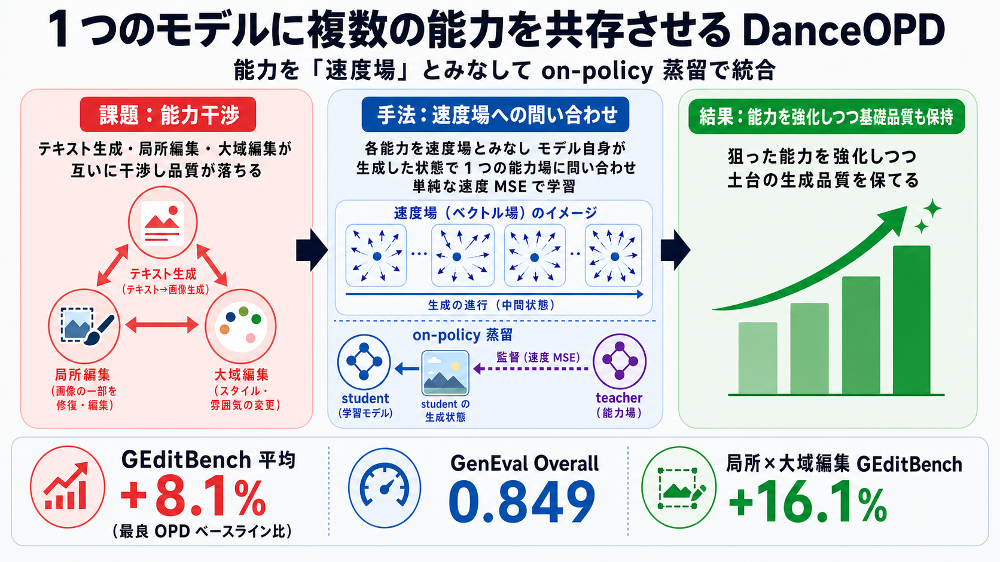

# 1 つの画像生成モデルに複数の能力を共存させる — 能力を「速度場」とみなして蒸留する DanceOPD

## この論文のひとことまとめ

1 つの画像生成モデルに、テキストからの画像生成・局所的な画像編集・大域的な画像編集といった、本来は互いに干渉しがちな複数の能力をまとめて持たせる手法 DanceOPD を提案した論文です。各能力を「速度場（velocity field）」という共通の形で捉え直し、学習中のモデル自身が生成した状態を教師が監督する on-policy 蒸留（on-policy distillation）で統合します。狙った能力を強化しつつ、土台となる基礎的な生成品質も保てることを示しました。

## なぜこの研究が重要か

近年の画像生成モデルは品質が大きく向上し、1 つのデプロイ済みモデルに対して複数の役割を同時にこなしてほしいという要求が強まっています。たとえば「文章から絵を描く」「画像の一部だけを直す」「画像全体の雰囲気や色を変える」といった操作を、別々のモデルに分けずに 1 つで担いたいというニーズです。

しかし、これらの能力は素朴にまとめると互いに足を引っ張り合います。論文ではこれを能力干渉（capability interference）と呼びます。編集の能力を鍛えると文章からの生成品質が落ちたり、局所編集と大域編集が「保存」と「変換」という正反対の方向に引っ張り合ったりするのです。この研究は、こうした能力同士の衝突を避けながら 1 つのモデルに能力を共存させる、実用的な道筋を示そうとしています。

## 背景：何が問題だったのか

画像生成の主流の一つに flow matching と呼ばれる枠組みがあります。これは画像の生成を、ノイズから完成画像へ向かう連続的な「流れ」として捉える考え方です。この枠組みの上で、1 つのモデルに次の 3 種類の能力を同時に求めたいという場面が増えています。

- テキストからの画像生成（text-to-image、T2I）: 文章を入力に、見栄えの良い画像を自由に描く。
- 局所編集（local editing）: 元画像をできるだけ保ったまま、一部だけを精密に変更する。
- 大域編集（global editing）: スタイル・色・レイアウトなど、画像全体の見た目をあえて大きく変える。

これらは要求の方向性が異なります。T2I は自由な見栄えとプロンプト追従を重視し、局所編集は「保存」を重視し、大域編集は「変換」を重視します。そのため素朴に同時に最適化すると、能力固有の教師信号が薄まり（capability dilution、能力希釈）、複数の目標を同時に学ぶときに勾配が衝突する（gradient conflict、勾配衝突）といった問題が起きます。

論文は既存のやり方の限界を次のように整理しています。

- データを混ぜて一緒に学習する方法は、能力ごとの教師信号を希釈し、勾配衝突を招きます。
- 複数モデルの重みを混ぜ合わせる方法（weight merge）やアダプタの合成は、妥協的な中間解になりがちです。
- 推論時にスコアを合成する方法は、合成がデプロイ済みモデルの外側で行われ、モデル本体には取り込まれません。

## 提案手法：何をしたのか

### 能力を「速度場」とみなす視点

DanceOPD の出発点は、各能力を「速度場（velocity field）」として捉え直すことです。速度場とは、生成の途中状態ごとに「次にどちらへどれだけ進むべきか」を示す矢印の場のようなものです。凍結した（学習で固定した）各能力モデル、たとえば T2I モデルや編集モデルを、共通の生成状態空間の上に張られた速度場とみなします。

この視点に立つと、能力を組み合わせる問題は「どの場を、どこで、どう参照するか」という問い合わせ（field-query）の問題に整理できます。具体的には、次の 3 つの選択に帰着します。

1. どの能力の場から教師信号を取るか。
2. 状態空間のどこで場に問い合わせるか。
3. モデルの生成軌道のどの状態を教師付けに使うか。

この捉え方は on-policy distillation（OPD、on-policy 蒸留）と自然に噛み合います。OPD とは、あらかじめ用意した固定の軌道ではなく、いま学習中のモデル（student）が実際に生成した状態を教師（teacher）が監督する蒸留のやり方です。

### 3 つの課題と、それぞれへの対策

論文は、上記の問い合わせから生じる 3 つの落とし穴を特定し、それぞれに 1 対 1 で対策を用意しています。

- 課題 1: target-field ambiguity（目標場の曖昧性）。複数の場を 1 サンプルの中で線形に混ぜると、どの能力にも対応しない中途半端な監督方向が生まれ、各能力の個性が失われます。
  - 対策: Hard-Routed Sample-Wise Field Matching。各サンプルをちょうど 1 つの能力場へ「ハードに」振り分け、その能力の個性を保ちます。振り分け確率は調整せず、既定では有効な能力に一様に割り当てます（2 つを組み合わせる場合は 1:1）。

- 課題 2: state-distribution mismatch（状態分布の不一致）。データ上の状態や教師の軌道など、モデルが生成時には実際には通らない状態で場を評価すると、本番で訪れる状態に対する監督が足りなくなり、学習と推論の間にずれが生じます。
  - 対策: On-Policy Field Querying。振り分けた場を、学習中のモデル自身が生成した状態で問い合わせ、モデルが実際に訪れる状態に監督を合わせます。このとき stop-gradient（勾配を切り離す操作）を使い、生成の手続き全体ではなく、その場での速度予測だけを微分します。

- 課題 3: trajectory-query correlation（軌道クエリ相関）。同じ生成軌道の複数の状態から密に目標を取ると、それらは同じプロンプト・同じノイズ・同じ経路の履歴を共有しているため、よく似た監督信号を重複して数えてしまい、勾配に偏りが生じます。
  - 対策: Semantic-Side Single Query。1 サンプルにつき、ノイズの少ない（low-noise、low-t）側の問い合わせを 1 つだけ使います。ノイズの少ない状態は完成画像に近く、スタイル・美的特徴・局所属性・タスク固有の編集情報が集中しているため、能力固有の情報を効率よく取り出せます。

### 学習の目的と適用範囲

学習の目的関数は、問い合わせた状態に対する単純な速度の二乗誤差（velocity MSE）です。決定論的な速度場に対する自然な回帰の形であり、凝った損失を持ち込みません。

さらに、推論時にだけ効く操作として知られる classifier-free guidance（CFG）も、guidance 付きの速度場とみなすことで、同じ MSE の目的でモデル内部に取り込めます。1 回の学習ステップは、(A) 1 つの能力場へ振り分け、(B) モデル自身の軌道のノイズの少ない側の状態で問い合わせ、(C) その場での速度を MSE で合わせる、という手順にまとまります。

## 結果：何が分かったのか

評価では、主に Z-Image というモデルを能力場を統合する土台（student）として使い、一部の設定では SD3.5-M を使っています。次の 4 つの設定が検証されました。

- (A) T2I と編集の組み合わせ
- (B) 局所編集と大域編集の組み合わせ
- (C) realism（写実性）の場の吸収（土台の T2I 能力の保存付き）
- (D) CFG の吸収

評価指標には、一般的な T2I 能力に GenEval、一般的な編集能力に GEditBench（GEditBench-EN）を用いています。比較対象は、ジョイント学習・重みマージ・オフポリシー蒸留・DiffusionOPD・Flow-OPD です。

主な結果は次の通りです。

- (A) T2I と編集の組み合わせでは、DanceOPD は GEditBench の平均を、最良の再現 OPD ベースラインより 8.1%、編集元より 8.5% 改善しました。GenEval overall は T2I 元より 2.0%、最強の合成ベースラインより 1.6% 改善しています。このとき DanceOPD の GEdit 平均は 5.347、GenEval Overall は 0.849 でした。
- (B) 局所編集と大域編集の組み合わせでは、GEditBench の平均を最良の競合合成ベースラインより 16.1%、局所編集元より 7.9% 改善しました。GenEval overall は最強の合成ベースラインより 2.5% 改善しています。このとき DanceOPD の GEdit 平均は 5.498、GenEval Overall は 0.848 でした。
- (C) realism の吸収では、realism の報酬をオフポリシー蒸留より 9.9% 改善し、student と teacher の報酬の差の 85.3% を埋めました。同時に T2I のスコアは土台より 7.6% 向上し、オフポリシー蒸留とは 0.1% 以内で一致しています。
- (D) CFG の吸収では、吸収した guidance（強さ α）と推論時の guidance（強さ β）が独立ではなく、実効的な強さがおよそ αβ になるため、外部 CFG の既定の流儀で評価すると効かせすぎになり得ます。最良の合成は GEditBench の平均を、学習時のみの吸収より 7.6%、評価時のみの CFG より 1.4% 改善しました。

設計選択の妥当性も多角的に検証されています。検証項目ごとに整理すると次の通りです。

- ルーティング: 各サンプルを 1 つの場へ振り分けるハードルーティングは、全教師を平均する soft mixing に対し MSE で平均 15.2% 改善しました。
- 問い合わせの位置: ノイズの少ない（完成画像に近い）状態で問い合わせると、ノイズが中程度の状態・ノイズの多い状態で問い合わせる場合に対して、GEditBench の平均をそれぞれ 23.7% / 19.5% 改善しました。
- 問い合わせの数: 1 サンプルにつき 1 回だけ問い合わせる既定は、1 サンプルあたり 2 / 4 / 8 / 16 回と密に問い合わせる変種に対して、GEditBench の平均をそれぞれ 16.6% / 7.9% / 10.2% / 12.2% 改善しました。
- 目的関数: 単純な速度 MSE が最良で、時刻で重み付けした MSE や DMD-EMA との混成、consistency matching などより安定して上回りました。
- 初期化: 最も関連する能力が強いチェックポイントから始めるのが最良でした。

## 意義と限界

DanceOPD は、各能力を共通の生成状態空間上の速度場とみなし、能力の組み合わせを「場への問い合わせ」の問題として定式化しました。3 つの落とし穴（目標場の曖昧性・状態分布の不一致・軌道クエリ相関）に対し、1 場へのハードな振り分け・モデル自身が訪れる状態での問い合わせ・ノイズの少ない側の 1 問い合わせで対応し、単純な速度 MSE で学習します。ジョイント学習・パラメータのマージ・外部でのスコア合成に頼らずに能力場を組み合わせ・吸収できる点が特徴です。著者らは、この on-policy generative field distillation が、複数能力を持つ視覚生成をスケールさせる実用的な道筋になると述べています。

一方で、論文は次の限界も認めています。

- 共有される場の前提（Shared Field Support）: 凍結した各能力モデルが、共通の生成状態空間の上で互換性のある速度場を提供できることを前提とします。本実験では同じ系統のバックボーン・潜在表現・スケジューラの流儀・速度の表し方から構築しているため成立していますが、この前提が崩れる場合には適用が難しくなります。なお著者らは、この種の要件は DanceOPD に固有のものではなく、他の OPD 系手法も互換な表現を必要とすると補足しています。
- 事前定義された振り分け（Predefined Routing）: 能力のまとまりをあらかじめ決め、サンプル単位でハードに振り分けます。タスクの境界が曖昧な場合や、1 つのプロンプトが複数の能力を同時に求める場合には、この前提が弱まります。自然な発展として、モデルの挙動や編集の成功度合いに応じて振り分けを決める verifier や報酬モデルの導入が挙げられています。

## まとめ

DanceOPD は、画像生成の複数能力を「速度場」という共通の言葉で捉え直し、モデル自身が生成した状態で 1 つの能力場に問い合わせて単純な MSE で学習することで、能力同士の干渉を避けながら統合する手法です。実験では、狙った能力を強化しつつ土台の生成品質を保てることが、複数の設定と豊富なアブレーションで示されました。

## 用語集

- **flow matching / 速度場（velocity field）**: 画像生成を、状態ごとに「次に進む向きと量」を与える速度場の学習として捉える枠組み。各能力モデルを共通状態空間上の速度の監督源として扱える。
- **on-policy distillation（OPD、on-policy 蒸留）**: 固定の軌道ではなく、学習中のモデルが実際に生成した状態を教師が監督する蒸留の方式。学習時と推論時の状態のずれに対処する。
- **能力合成（capability composition）**: 1 つのデプロイ済みモデルが、強化したい能力（target）を伸ばしつつ、保つべき基礎能力（anchor）を保存すること。
- **能力干渉 / 能力希釈（capability interference / capability dilution）**: 能力同士が衝突して品質が落ちる現象、およびジョイント学習が監督信号を平均化して薄めてしまう現象。
- **hard routing と soft mixing**: 各サンプルを 1 つの場へ振り分けるのが hard routing、全教師の場を 1 つの目標に平均するのが soft mixing。後者はサンプルごとの能力の個性を失う。
- **stop-gradient**: 問い合わせ状態を勾配計算から切り離す操作。生成の手続き全体ではなく、その場の速度予測だけを微分させる。
- **low-noise（low-t）クエリ**: 軌道のノイズの少ない（完成画像に近い）側での問い合わせ。スタイルや編集情報が集中し、能力固有の監督を与えやすい。
- **classifier-free guidance（CFG）の吸収**: 推論時にだけ効く guidance を速度場とみなしてモデル内部に取り込む設定。吸収側 α と推論側 β が乗算的（αβ）に効く点が評価上の注意点。
- **GenEval / GEditBench(-EN)**: それぞれ一般的な text-to-image 生成能力・画像編集能力を測る評価ベンチマーク。

## 原論文

- DanceOPD: On-Policy Generative Field Distillation（https://arxiv.org/abs/2606.27377）
