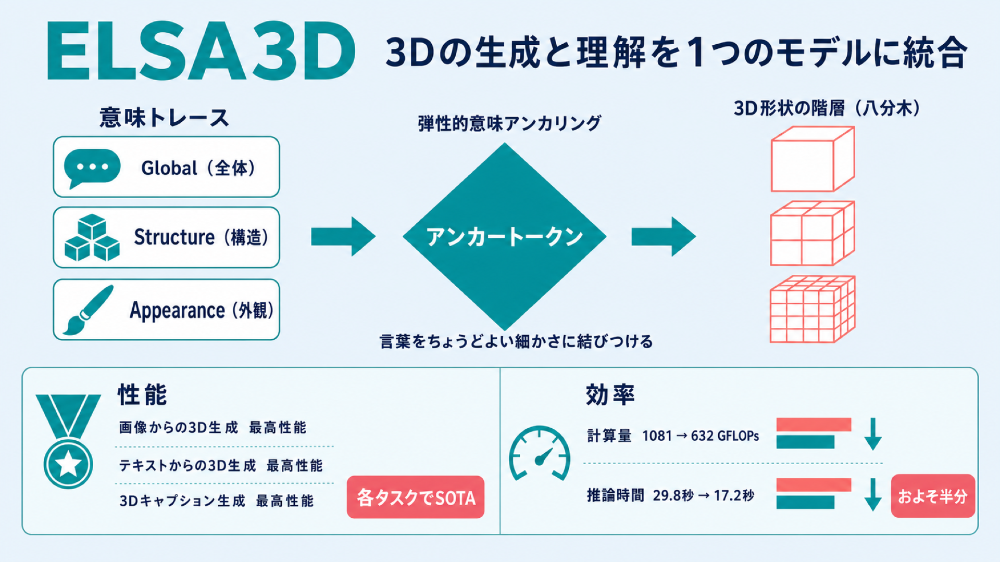

# 言葉と形をちょうどよい細かさで結びつける ― 3Dの生成と理解を1つのモデルにまとめた ELSA3D

## この論文のひとことまとめ

ELSA3D は、3D の形を「作る（生成）」ことと、3D を「言葉で説明したり推論したりする（理解）」ことを、1 つのモデルで扱う統合 3D モデルです。核となるのは「弾性的意味アンカリング（elastic semantic anchoring）」という仕組みで、言葉の手掛かりを、それにふさわしい細かさ（抽象度）の 3D 形状の部分だけと結びつけます。画像からの 3D 生成・テキストからの 3D 生成・3D のキャプション生成のいずれでも最高性能を達成しつつ、この弾性的な仕組みを使わない版に比べて計算量（FLOPs）と推論時間をおよそ半分に減らしています。

## なぜこの研究が重要か

3D コンテンツを扱う AI には、大きく分けて 2 つの役割があります。1 つは、画像や文章から立体形状を作り出す「生成」。もう 1 つは、与えられた 3D 形状を言葉で説明したり、その構造について推論したりする「理解」です。これまでは、この 2 つを別々のモデルで扱うのが一般的でした。

これらを 1 つのバックボーン（土台となるモデル）にまとめられれば、生成と理解が同じ内部表現を共有し、互いに支え合えるようになります。たとえば「言葉で 3D を作れる力」が「3D を言葉で説明する力」を底上げする、といった相乗効果が期待できます。ELSA3D はこの統合を、単に 2 つの機能を同居させるのではなく、言葉と形の対応のとり方そのものを設計し直すことで実現しようとした研究です。

## 背景：何が問題だったのか

3D の生成と理解を 1 つにまとめること自体は魅力的ですが、モデルには強いマルチモーダル推論の力が求められます。大まかな全体構造と細かい局所ディテールのバランスをとること、あいまいな言葉を具体的な幾何学的な決定に翻訳すること、そして意味と形の細かいすり合わせが必要な場所に計算資源をうまく配分することが必要になるからです。

既存の手法では、言葉と 3D の結びつきが「暗黙的（implicit）」なままにとどまっていました。従来は、テキストのトークン（言葉を区切った最小単位）と 3D のトークンを 1 本の長い列につなげ、対応関係の発見を自己注意機構（self-attention、列の中の要素どうしがどれだけ関係するかを自動で計算する仕組み）に丸投げしていました。その結果、大まかな構造の手掛かりと細かい幾何の詳細が、区別されないまま 1 つの表現につぶれてしまいます。

近年の 3D 研究は、形状の表現をさまざまな細かさ（マルチスケール）で持てるように進化してきました。しかし、それを使って推論する仕組みの側がついてきていません。つまり足りないのは、より強い階層的な 3D 表現そのものではなく、言葉の推論と形の推論を一緒に構造化し、両者を「構造化された相互作用（structured interaction）」で結びつける統合設計だ、というのが著者らの見立てです。

もう少し具体的に言うと、2 つの極端なやり方のどちらもうまくいきません。テキストのプロンプトを 3D のトークンへ直接対応づけようとすると、言葉は正確な形・位置関係・材質の手掛かりを省くため（本質的に情報が足りない、under-specified な状態）、雰囲気は合っていても構造やテクスチャがちぐはぐな形状ができてしまいます。逆に、すべてのテキストトークンをすべての 3D トークンにくまなく結びつけると、計算が無駄なうえ、対応する形を持たないトークンが多く、意味的にもノイズになります。

## 提案手法：何をしたのか

ELSA3D は「弾性的意味アンカリング」によって、この言葉と形のミスマッチに対処します。中核となる要素は 3 つです。

### 1. 意味と形をどう表すか

**形の表現**には、マルチスケールの八分木（octree、オクツリー：空間を再帰的に 8 分割していく木構造）を使います。各 3D オブジェクトを、そろえた（canonical 化した）128×128×128 のボクセルグリッド（立方体状に区切ったマス目）から作ります。単位立方体を再帰的に分割し、あらかじめ決めた最大の深さまで進みます。安定した全体の骨組みを保つため、最初の 3 レベルはすべてのマスを残し、それより深い部分は表面の形とぶつかる領域だけを追加する「疎（まばら）な」構造にします。

この八分木は「octree VQ-VAE」というトークナイザで離散的なトークンに変換します。各ノードは、そこをさらに細かく分割するかを示す 1 ビットの構造ビット（structural bit）と、局所的な形をエンコードするコンテンツトークン（content token）で表されます。量子化（ベクトルを決められた語彙のどれかに割り当てる処理）にはスケールごとに別々のコードブック（語彙表）を使い、各語彙がその細かさに特化した形の部品を担えるようにします。さらに、量子化で失われる位置情報を補うため、各トークンに位置埋め込みと、スケール（細かさ）を後から取り出せるようにする固定ベクトルの「スケールタグ（scale tag）」を付けます。ノードは各深さの中で空間的な近さを保つ順番（Morton 順、Z-order）で並べられます。

**意味（言葉）の表現**は、言葉の手掛かりを 3 つの側面に整理した「意味トレース（semantic trace）」として持ちます。3 つとは、カテゴリや全体のシルエット・向きを表す Global、質量分布・比率・部品構成を表す Structure、材質・色・テクスチャ・局所的なディテールを表す Appearance です。これにより、抽象度の異なる手掛かりを明示的に分けて扱え、形の推論をアンカー（固定）する言葉側の足場になります。

### 2. アンカートークン（Anchor Tokens）

すべての言葉とすべての 3D を密に結びつけるのは高コストで多くが不要なので、必要な場所だけ言葉と形をつなぐ「疎なインターフェース」としてアンカートークンを導入します。

アンカーは、選ばれた 1 つの意味トークンと、それが振り分けられた（routing された）スケールから取ってきた幾何学的な手掛かりを融合した単位です。入力ごと、そして transformer のブロックごとに動的に作られます。仕組みはこうです。各ブロックで、ルーター（後述）が各意味トークンに対して「アンカーにするか」「どのスケールを見るか」を決めます。選ばれたトークンは、自分を問い合わせ（query）として、選ばれたスケールの 3D トークンを参照先（key/value）としてクロスアテンション（cross-attention、別の系列の情報を参照する注意機構）を行い、幾何学的な手掛かりを集めて融合します。何個アンカーができるかは入力や層ごとに変わります。

集めた融合信号は、その場かぎりの「作業スペース」として使われ、メインの系列に「書き戻し（write-back）」されます。メイン系列の各トークンが現在のアンカー集合を参照し、言葉と形の両方が混ざった信号を吸収します。このとき、注入の強さは学習で調整されるゲートで制御され、学習の初めはほとんど効かないように設定されているため、アンカーは学習が進むにつれて徐々に影響力を持つようになります。ブロックの更新が終わるとアンカーは捨てられ、元の系列だけが次の層へ進みます。アンカーの数はメイン系列より圧倒的に少ないため、書き戻しにかかるコストは無視できる程度です。

### 3. 動的ルーティングと弾性的な推論

各 transformer ブロックには、軽量な「3 つのヘッドを持つルーター」が付いています。ルーターは 3 種類の判断を同時に行います。

- **ゲーティングヘッド（実行するか / スキップするか）**: ブロックを実行する確率を計算し、しきい値（全実験で 0.5）以上なら実行、そうでなければスキップします。スキップされたブロックでは、アンカーの構築も書き戻しも省かれます。
- **幅ヘッド（MLP の幅）**: 実行するブロックの計算容量を、4 段階（1/4・1/2・3/4・1）から選びます。もっとも確率の高い段を選び、必要な分のチャネルだけを使います。
- **アンカールーティングヘッド（どのトークンをどのスケールに割り当てるか）**: トークンごとに、アンカーにするかどうかと、どのスケールを見るかの分布を予測します。しきい値以上のトークンだけが選ばれ、まずスケールを決めてからその中で参照することで、粗いところから細かいところへ（coarse-to-fine）と探索が進むよう促します。

このように、ブロックを実行するか・MLP の幅・どのトークンをアンカーにするか・どのスケールを見るかを、1 つのルーティングの仕組みでまとめて制御します。これによって、計算量と、言葉と形の結びつけ方の両方を「弾性的（elastic、必要に応じて伸び縮みする）」に調整できます。なお、実行のスキップや幅の選択のような離散的な判断の勾配を学習時に流すために、Straight-Through Estimator（STE、離散判定でも勾配を通すための推定法）を使っています。

**学習は 2 段階**で行います。まず形のトークナイザ（scale-aware octree VQ-VAE）を 3D データで学習し、離散的なマルチスケール幾何トークンを得ます。次にトークナイザを凍結し、意味トークン・構造ビット・3D コンテンツコードを交互に並べた系列の上で、統合された自己回帰モデル（次のトークンを順に予測するモデル）を学習します。このとき、ルーターの「どれだけ深く・広く計算するか」「どれだけアンカーを疎にするか」の判断を形づくる補助的な予算ロス（budget loss）を併用します。

## 結果：何が分かったのか

評価は、画像を条件とした 3D 生成、テキストを条件とした 3D 生成、3D オブジェクトのキャプション生成、一般的な対話推論の 4 つの能力について行われました。学習には公開の 3D-Alpaca データセットや Trellis-500K から選んだ 3D アセットを使い、一般的な言語能力を保つために UltraChat も加えています。評価には、学習セットと重複しない Toys4K のアセットと 200 枚の実写画像を使いました。

最強の統合ベースラインと比べたときの主な改善幅は次のとおりです。

- **画像からの 3D 生成**: CLIP スコアで +2.74、FD で -2.03 の改善（CLIP は入力との一致度、FD は生成品質の指標で、FD は小さいほど良い）。7 つの指標のうち 5 つで最良、残り 2 つで 2 番目でした。視覚的な復元品質の指標（PSNR・LPIPS）では SparseFlex がわずかに上回りますが、SparseFlex は画像からの復元に特化した手法であるのに対し、ELSA3D は画像・テキスト・言語の統合能力を保っている点が異なります。
- **テキストからの 3D 生成**: CLIP で +1.35、FD で -4.05 の改善で、比較した 4 指標すべてで最良でした。別の手法 Trellis に対しては CLIP で +9.58 と大きく上回っています。
- **3D キャプション生成**: 文の意味的な近さを測る Sentence-BERT で +3.56 の改善など、比較した 5 指標すべてで新たな最高性能を達成しました。

**効率**の面でも効果が確認されています。疎なアンカールーティングは、言葉と形を密に融合させるやり方を品質で上回りつつ、計算量を 1081 GFLOPs から 632 GFLOPs へ、推論時間を 29.8 秒から 17.2 秒へと減らしました。

仕組みの各部分の効果を確かめる検証（アブレーション）も行われています。アンカーをまったく使わない場合は全タスクで品質が落ち、平らな系列上の暗黙的な自己注意だけでは言葉と形の対応づけに不十分でした。直接クロスアテンションで密に結びつける方法は品質を回復しますが、計算量 1081 GFLOPs・29.8 秒と重くなります。ELSA3D は 632 GFLOPs・17.2 秒で、生成とキャプション生成の両方でもっとも良い品質を得ました。また、スケールをランダムに割り当てると最も弱く、粗いスケールだけ・細かいスケールだけに押し込んでも劣ることから、カテゴリ情報は粗い形、部品や外観の手掛かりは細かいスケール、というふうに適切な細かさを選ぶことが重要だと分かります。付録にあるフル計算のモデルは一部の生成指標をわずかに上回りますが、そちらは 1284 GFLOPs・34.6 秒を要します。ELSA3D はほぼフル計算に近い品質を保ったまま、計算量とレイテンシをおよそ半分に抑えています。

さらに、対象物をはっきり名指しせず、遠回しな手掛かりで説明するプロンプト（たとえば「開閉できる木製の女性像」＝マトリョーシカ、「月を表す焼き菓子」など）に対しても、ELSA3D は意図された物体を正しく同定し、見て分かるシルエットを持つ形状を生成できました。比較手法の CoRe3D は、しばしば参照された概念の粗い一般的な形しか捉えられませんでした。

## 意義と限界

ELSA3D は、言葉と形の相互作用を「疎（sparse）・適応的（adaptive）・スケール認識的（scale-aware）」にした統合 3D 理解・生成モデルです。選ばれた言葉の手掛かりを、マルチスケールの 3D 階層のちょうどよいレベルへ振り分け、融合した手掛かりを共有表現へ書き戻します。この設計により、画像からの 3D 生成・テキストからの 3D 生成・遠回しな手掛かりからの生成・3D キャプション生成のいずれでも、強力な 3D ベースラインや統合ベースラインを一貫して上回りました。

意義としては、「生成の学習が理解も強くする」という統合 3D モデルへの期待を、意味の手掛かりをスケール固有の形の手掛かりへ振り分ける設計で裏づけた点が挙げられます。キャプション生成の意味的な指標が大きく伸びたことが、それを示唆しています。また、形の詳細度を整理する「階層」と、各アンカーがどのスケールを見るかを決める「ルーティング」を結びつけた点で、階層を形の整理に、ルーティングを計算削減に主に使ってきた従来研究と差別化されます。

限界については、本文（1〜11 ページ）に独立した「限界（Limitations）」の節は見当たりませんでした。学習・実装・ルーターの正則化などの詳細は付録に委ねられており、本文からは限界の明示的な記述を確認できませんでした。また、効率に関する数値の一部は付録の表に依拠しています。

## まとめ

ELSA3D は、言葉の手掛かりを 3D 形状の「ちょうどよい細かさ」の部分にだけ結びつけるアンカートークンと、計算量まで含めて必要な分だけ働かせる弾性的なルーターによって、3D の生成と理解を 1 つのモデルにまとめました。生成・キャプション生成の各タスクで最高性能を達成しつつ、計算量と推論時間をおよそ半分に抑えた点が、この研究の要点です。

## 用語集

- **統合 3D モデル（unified 3D model）**: 3D の生成と理解（言葉での説明・推論）を、単一のバックボーンで扱うモデル。
- **弾性的意味アンカリング（elastic semantic anchoring）**: 言葉の推論と形の推論を、対応する抽象度（細かさ）のスケールに沿って一緒に構造化する ELSA3D の中核枠組み。計算量と、意味と形の結びつけを同時に制御する。
- **八分木（octree）／ octree VQ-VAE**: 空間を再帰的に 8 分割していく木構造で 3D 形状を表し、各トークンにスケールタグを付けてスケールごとの語彙で量子化するトークナイザ。
- **意味トレース（semantic trace）**: 言葉の手掛かりを Global（全体）・Structure（構造）・Appearance（外観）の 3 側面に整理した言葉側の足場。
- **アンカートークン（anchor token）**: 選ばれた意味トークンと、振り分け先スケールの幾何学的な手掛かりを融合した、その場かぎりの言葉と形の融合単位。動的に作られ、融合信号をメイン系列に書き戻す。
- **自己注意機構（self-attention）／クロスアテンション（cross-attention）**: 前者は同じ系列内の要素どうしの関係を計算する仕組み、後者は別の系列の情報を参照する仕組み。
- **FLOPs / レイテンシ**: それぞれ計算量の総量と、推論にかかる時間。効率の指標として使われる。
- **CLIP / FD / Sentence-BERT**: 評価指標。CLIP は入力との一致度、FD は生成品質（小さいほど良い）、Sentence-BERT は生成した文の意味的な近さを測る。

## 原論文

- ELSA3D: Elastic Semantic Anchoring for Unified 3D Understanding and Generation（https://arxiv.org/abs/2607.06565）
