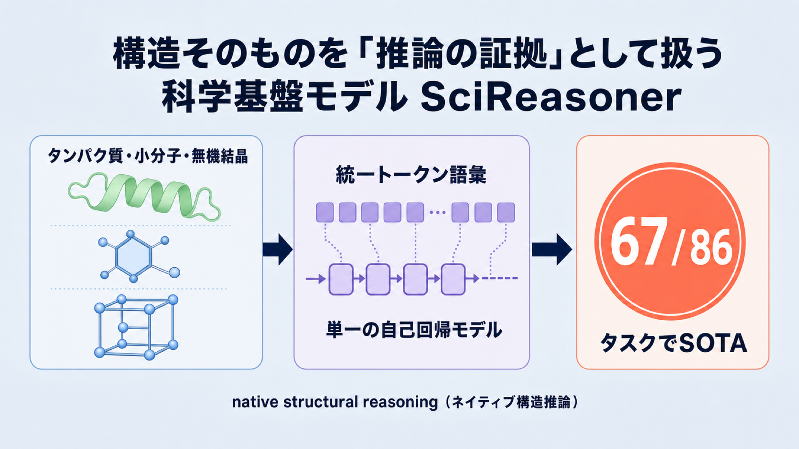

# タンパク質・分子・結晶の「構造そのもの」を推論の証拠として扱う科学基盤モデル SciReasoner

## この論文のひとことまとめ

この論文は、科学基盤モデル **SciReasoner** を提案しています。中心にあるのは、タンパク質・小分子・無機結晶という 3 種類の科学的な「構造」を、テキストの添え物ではなく参照できる証拠として扱うという発想です。具体的には、これらの構造を統一トークン語彙に変換し、1 つの自己回帰モデル（次の単語を順番に予測していくタイプのモデル）の中で構造と言葉を交互に織り交ぜて推論させます。予測の精度と、その予測を構造に照らして検証できる説明可能性の両立を目指した点が特徴です。86 個のベンチマークのうち 67 タスクで最高性能（SOTA）を達成したと報告されています。研究の狙いは、答えを当てるだけでなく「なぜその答えなのか」を構造の証拠に基づいて示せるモデルを作ることにあります。

## なぜこの研究が重要か

物質がどんな機能・反応性・物性を持つかは、その空間的・化学的・周期的な「かたち（構造）」から生まれます。これを構造と性質の関係（structure–property relationship）と呼び、生物学・化学・材料科学に共通する基盤的な考え方です。

つまり「なぜこの性質になるのか」を機械に説明させるには、立体化学・結合・対称性・エネルギー・周期秩序といった科学的原理を通して構造の証拠を読み解く必要があります。これは AI にとって、構造をどう表現するか（representation）と、その証拠にもとづいてどう推論するか（reasoning）という 2 つが絡み合った難題です。この 2 つを同時に扱えるモデルは、創薬・材料設計・タンパク質機能予測など幅広い応用の土台になり得ます。

## 背景：何が問題だったのか

論文によれば、既存の科学 AI は「構造をそのまま表現すること」と「証拠にひもづいた推論」を切り離してしまっている、という共通の弱点を抱えています。大きく 3 種類に整理されています。

- **大規模言語モデル（LLM）**：タンパク質・分子・結晶を主に文字列や記述テキストとして扱います。そのため構造の立体的な組織が文字列に押し込められ、説明が物理的な証拠ではなく言葉の連想に頼りがちになります。
- **エージェント型システム**：検索・ツール使用・ワークフロー連携で能力を広げますが、土台となる基盤モデルの構造理解力そのものに縛られます。
- **ドメイン特化モデル**：分子グラフ・タンパク質構造・結晶格子を直接エンコードして高い精度を出しますが、スコアやラベルを出力する予測器であり、判断の途中でどんな証拠を使ったかを外に見せてくれません。

その結果、多次元の科学的構造を「そのまま」表現しつつ、その構造に照らして後から検証できる推論の道すじ（推論トレース）を生成する、という新しいやり方が欠けている、というのが論文の問題意識です。

## 提案手法：何をしたのか

論文はこの課題に対し、**native structural reasoning（ネイティブ構造推論）** というパラダイムを提唱し、それを SciReasoner として実装しました。中心にあるのは、構造トークンを言葉に付随する補助的な説明ではなく、推論の軌跡の中で「組み合わせ・引用・検証できる、参照可能な証拠単位（addressable evidence units）」として扱うという発想です。

仕組みは次のような要素から成り立っています。

- **構造対応語彙（structure-aware vocabulary）**：座標・トポロジー（つながり方）・周期的な結合を離散化し、局所的な形状・立体化学・タンパク質の残基レベルの構造モチーフ・結晶の格子対称性や結合パターンといったドメイン固有の情報を保った専用トークンに変換します。
- **オフライン構造エンコーダ**：入力の構造をあらかじめドメイン別のエンコーダで圧縮してからモデルに渡します。タンパク質の 3D 構造には **Foldseek**（3Di トークン。アミノ酸配列と 1 対 1 に対応します）、結晶には **SLICES**、3D 分子構造には **ConfSeq** を用います。構造トークンは `<protein_structure>` などのタグで囲まれます。
- **分割されないトークン設計**：一般的なサブワード分割（BPE など、単語を細かい断片に切る方式）は、分子グラフやモチーフを恣意的に断片化して科学的な意味を壊してしまいます。SciReasoner の構造対応語彙はそれ以上分割できない単位なので、この問題を避けられます。分子入力での平均トークン圧縮率は 10.7（Qwen のトークナイザ比。Qwen はオープンな大規模言語モデル）と報告されています。構造トークンは自然言語の埋め込みとは別の専用埋め込みテーブルを持ちます。
- **バックボーン**：土台の言語モデルは **Qwen3-14B** の重みで初期化されています。

学習は 2 段階に分かれます。まず **継続事前学習（continued pretraining）** を 3 ステージで行い、新しい構造トークンを基本的な形状・化学的意味に固定しつつ（もとの言語能力を壊さないように）、全パラメータのマルチモーダル学習と、QA 形式データの比率を高めた仕上げ学習を進めます。

次に **事後学習（post-training）** として、著者が self-bootstrapped native structural reasoning と呼ぶ枠組みで、強化学習（RL）によって構造語彙の意味を思考連鎖（Chain-of-Thought、答えに至る途中の考えを言葉で書き出す方式）に接続します。ここは 2 つのステップから成ります。

- **ドメイン内構造証拠グラウンディング（intra-domain structural evidence grounding）**：タンパク質・分子・材料それぞれで、構造トークンを推論の証拠として使うタスク特化のエキスパートを訓練します。
- **ドメイン横断推論統合（cross-domain reasoning consolidation）**：各エキスパートが生成した推論トレースを集めて 1 つの SciReasoner に統合します。標準的な手法で起きやすい「軌跡崩壊（trajectory collapse。推論の道すじが縮退してしまう現象）」を抑えると主張されています。

配列・構造・テキストを同時につなぐ「お手本の推論軌跡」がほとんど存在しないという分野の壁に対しては、簡単な下書きトレースで最初のきっかけ（コールドスタート）だけを与え、以降はエキスパート自身が高品質なトレースを生成していく形で回避しています。対応するモダリティは、タンパク質・DNA・RNA・小分子・無機結晶に加え、科学 QA・物性予測・生成/設計タスクに及びます。

## 結果：何が分かったのか

論文は幅広いベンチマークで評価しており、総合では **86 ベンチマーク中 67 タスクで SOTA を達成**したと報告しています。専門家モデルのベースラインがある 26 ベンチマークでは、それらの専門家モデルに一致または上回ったとされています。主な結果は次のとおりです。

- **タンパク質機能予測**：遺伝子オントロジー（Gene Ontology, GO）の Cellular Component で、配列類似性による転移が弱い低ホモロジー／オーファン様（既知の似た配列がほとんど無く、配列の類似から機能を推測しにくいタンパク質）の設定において、指標 Fmax を 0.42 から 0.55 へ改善しました。DeepFRI-GO 全体の Fmax は 0.59（3 側面の平均）で、専門家モデル SaProt の 0.52 を上回っています。参考までに、汎用 LLM の DeepSeek-V4-Pro は 0.35、GPT-5.5 は 0.31 でした。細胞内局在の予測では Accuracy 0.88（ESM2 の 0.84 を上回る）です。
- **RNA**：アイソフォームの R2（決定係数。1 に近いほど予測の当てはまりが良い）を 0.59 から 0.86 へ、RNA-タンパク質相互作用の MCC（−1〜1 の相関指標。1 に近いほど良い）を 0.74 から 0.81 へ改善しました。
- **逆合成（retrosynthesis）**：目標分子を市販の前駆体へさかのぼって切り分ける経路設計のタスクで、単一ステップの精度を 0.63 から 0.72 へ改善しました。USPTO-50K の Exact Match 0.72 は、従来最良のテンプレート不要手法 RSGPT（0.63）を 0.09 上回ります（参考として Opus-4.7 の 5-shot は 0.48）。思考連鎖は analysis（解析）→ disconnection（結合の切断）→ verification（検証）→ feasibility（実現可能性）の 4 段構成をとります。
- **バーチャルスクリーニング（DUD-E、102 ターゲット）**：ドッキングやスコアリング関数、タスク特化のファインチューニングを使わずに、AUC は従来最良の 0.76 に並び、上位 5.0% の濃縮率（EF）を 7.12 から 7.70 へ改善しました。
- **材料物性**：生成エネルギーの予測は R2 = 0.895、バンドギャップは R2 = 0.785 でした。CGCNN を 10 タスク全てで上回り、多くの数値物性で LLM-Prop も上回っています。
- **開放型の言語タスク**：生物医学 QA で BertScore（生成文と参照文の意味的な近さを測る指標。1 に近いほど良い）0.85、タンパク質の一般機能記述で ROUGE-L（生成文と参照文の語句の重なりを測る指標。1 に近いほど良い）0.77 を報告しています。

構造入力が本当に効いているかを確かめるアブレーション（構造トークンを取り除く実験）では、性能が一貫して低下し、特にタンパク質タスクで顕著でした。構造がないと、配列モチーフや組成に頼った推論に後退してしまうと説明されています。極端な例として、QMOF のポア径予測では、構造なしだと約 1 桁過大に見積もる（予測 11.10694 に対し正解 1.27075）一方、構造トークンを使うと正解に近い 1.14197 を予測できたとしています。

推論の「質」についても検証されています。GPT-5.5 を審判役にした評価（LLM-as-judge）では、SciReasoner の総合スコアが 8.33 で、コールドスタート版の 7.77、DeepSeek-V4-Pro の 6.96 を上回りました。さらに事後学習を進めるにつれ、まず 1 回で正解に至る割合（pass@1）が段階的に上がり（例：逆合成では 0.41→0.49→0.72）、10 回試したときとの差が縮まる、つまり最初の回答の信頼性が高まる傾向が示されています。

加えて、二重盲検の専門家評価（信頼できる N=1776 ケースの判定）では、SciReasoner が DeepSeek-V4-Pro に対し 98% のケースで同等以上（73% が強く好ましい、21% が好ましい、4% が同等）と評価され、5 軸平均で 8.7/10 対 4.3/10 だったと報告されています。ただし、この人間評価は試験的（pilot）なもので、論文の脚注に「より多くの人間判定を収集中」と明記されている点には注意が必要です。

## 意義と限界

論文は、構造と性質の関係は、科学的な対象を単なるテキスト文字列・低次元の記述子・ブラックボックスの入力として扱うだけでは十分に扱えない、と結論づけています。SciReasoner は構造を「推論の一次対象」として統一語彙に離散化し、言語による指示と一緒に 1 つの自己回帰モデルへ統合することで、残基・分子フラグメント・配座の手がかり・結晶記述子を、推論の途中で参照できる証拠単位として機能させました。

意義としては、単一の自己回帰基盤モデルが主要な科学モダリティをまたいで配列・構造・自然言語の推論を統一し、専門家レベルの精度と説明可能性を両立できることを示した点が挙げられます。効果は、表面的な類似だけでは足りない領域、たとえば低ホモロジーのタンパク質、多様な反応族の逆合成、結晶の安定性や電子物性の予測でこそ強い、とされています。著者らは「4 つの科学モダリティすべてで配列・構造・自然言語の推論を単一の自己回帰軌跡として可能にした初の基盤モデルである」と主張しています。

限界・留意点として、論文本文に明示されている範囲では次の点が挙げられます。まず、上で触れたとおり人間の専門家評価は試験的な段階で、判定を追加収集中であることが脚注に記されています。また、タンパク質の Molecular Function は既に性能が飽和域にあり、SciReasoner の 0.66 は SaProt の 0.67 と同等で改善余地が小さいとされています。逆合成の推論品質も事後学習の前からすでに高い分布にあり、審判評価の改善幅が他タスクより小さいのは、飽和が遅いためで手法の失敗ではない、と著者は説明しています。なお、Discussion に独立した「限界」の節は明示されておらず、これらは本文中の該当記述からの抽出です。

## まとめ

SciReasoner は、タンパク質・分子・結晶といった科学的構造を専用トークンに離散化し、言葉と交互に織り交ぜて推論する単一の自己回帰基盤モデルです。構造を「推論の証拠」として正面から扱うことで、86 ベンチマーク中 67 タスクで SOTA を達成しつつ、なぜその答えなのかを構造に照らして示せる説明可能性の両立を狙った点が要点です。

## 用語集

- **構造–性質関係（structure–property relationship）**：物質の空間的・化学的・周期的な組織から機能・反応性・物性が生じるという、生物学・化学・材料科学に共通する基盤概念。
- **native structural reasoning（ネイティブ構造推論）**：構造トークンを言葉への付随記述ではなく、推論の軌跡内で組み合わせ・引用・検証できる「参照可能な証拠単位」として扱うパラダイム。
- **構造対応語彙（structure-aware vocabulary）**：座標・トポロジー・周期結合を離散化し、ドメイン固有の構造情報を保った専用トークン語彙。自然言語の埋め込みとは別の埋め込みテーブルを持つ。
- **Foldseek / 3Di トークン**：タンパク質の 3D 構造を残基レベルの局所構造トークンに変換する手法。アミノ酸配列と 1 対 1 に対応する。
- **SLICES / ConfSeq**：それぞれ結晶構造、3D 分子配座をトークン列に変換するエンコーダ。
- **Gene Ontology（GO）/ Fmax**：タンパク質の機能アノテーション体系（MF=分子機能、BP=生物学的過程、CC=細胞内成分）と、その予測の標準指標。
- **逆合成（retrosynthesis）**：目標分子を市販の前駆体へ再帰的に切り分けていく有機合成の経路設計。
- **DUD-E / 5.0% EF（enrichment factor）**：バーチャルスクリーニングのベンチマークと、上位 5% における活性化合物の濃縮率指標。
- **pass@1 / pass@10**：1 サンプル／10 サンプルでの正解到達率。差が縮むほど、最初の回答の信頼性が高いことを示す。
- **軌跡崩壊（trajectory collapse）**：標準的なアライメントで推論の道すじが縮退してしまう現象。

## 原論文

- Accurate, Interdisciplinary and Transparent Structure-property Understanding with Deep Native Structural Reasoning（https://arxiv.org/abs/2607.07708）
