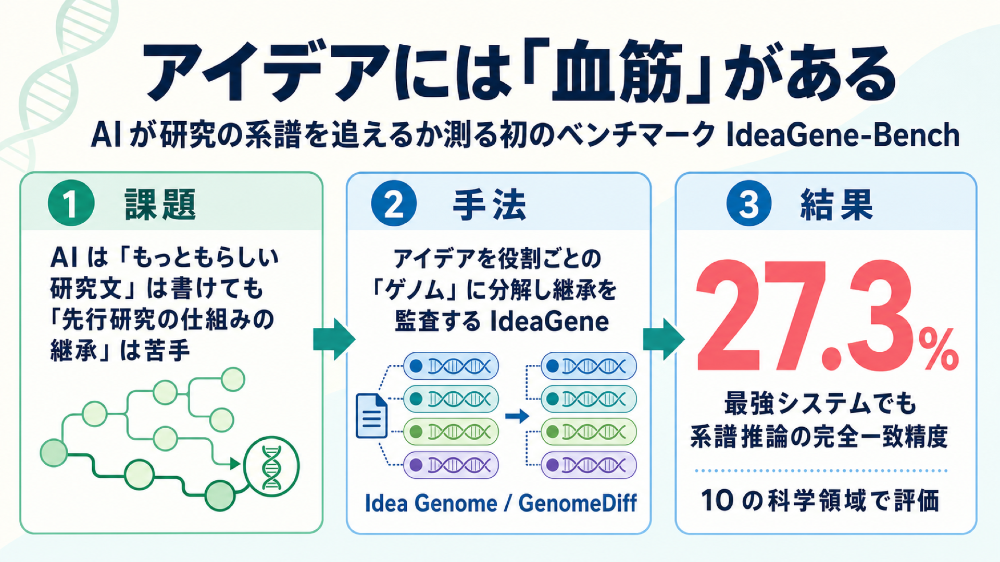

# アイデアには『血筋』がある ― AI が研究の系譜を追えるかを測る初のベンチマーク IdeaGene-Bench

## この論文のひとことまとめ

科学のアイデアは「白紙」から生まれるのではなく、生物のゲノム（遺伝情報）のように、先行研究の中核的な仕組みを受け継ぎ、欠点を修復し、組み換えながら進化していきます。この論文は、そうした「アイデアの血筋（系譜）」を AI が正しく追えるかを測る、初めてのベンチマーク **IdeaGene-Bench（IG-Bench）** を提案しました。評価してみると、最も強いシステムでも系譜推論の完全一致精度はわずか 27.3% にとどまりました。今の AI は「もっともらしい研究文」は書けても、「先行研究の仕組みを筋道立てて受け継ぐ」ことはまだできていない、という弱点を浮き彫りにしています。

## なぜこの研究が重要か

近年、論文の検索から仮説づくり、実験、論文執筆までを自動でこなす「AI 研究者（AI Scientist）」のようなシステムが登場しています。しかし、その良し悪しを測るこれまでの評価は、検索の質・事実の正しさ・文章の流暢さ・新規性といった側面に偏っていました。

一方で、本当に難しい問いは別のところにあります。「ある提案が『先行研究のこの方向を延長したものだ』と主張するとき、正しい仕組みを受け継ぎ、正しい欠点を直し、根拠とする系譜と食い違っていないか」という問いです。この観点はこれまでほとんど検証されてきませんでした。

もし AI が「それらしい文章」を書けるだけで、研究の血筋を正しく追えないのであれば、生成された提案は表面的に新しく見えても、科学の積み重ねとしては筋が通っていないことになります。この研究は、その落とし穴を測る物差しを与えるものです。

## 背景：何が問題だったのか

著者らは、科学の進歩は「話題が近いこと（topical proximity）」とは別物だと指摘します。同じ課題を扱っていても互いに継承関係がないこともあれば、文章の上では遠く見えても同じ中核の仕組みを引き継いでいることもあるからです。

論文では、物体検出という同じ分野の例が挙げられています。

- **YOLOv2** は前身の **YOLO** が持つ「一段階で検出する仕組み」をそのまま受け継ぎ、アンカーボックスやバッチ正規化などで部分的に改良しました。血筋がはっきり見える継承です。
- 一方 **DETR** も物体検出を扱いますが、従来のパイプラインを「集合予測」と Transformer に置き換えており、扱う課題は共有するものの、駆動する仕組み自体は継承していません。

タイトルや要約、引用のつながり、埋め込みベクトルといった手がかりは、この 2 つを混同しがちです。正しい論文を検索できても、「どの親の仕組みを受け継いだか」「どの欠点を直したか」を取り違えてしまいます。そこで著者らは、論文よりも細かい粒度で、アイデアの継承を後から検証（監査）できる表現が必要だと主張します。

著者らはこの目標となる能力を **科学的系譜能力（scientific lineage competence）** と呼びます。噛み砕けば「アイデアの血筋を読み解く力」で、論文を継承の単位に抽象化し、どの要素が生き残り・変異し・消えるかを論文をまたいで追い、その遷移の理由を説明し、提案が本当に系譜として整合しているかを検証し、最後に既存の系譜へ妥当な子孫として差し込める提案を生み出す、という一連の能力を指します。

## 提案手法：何をしたのか

論文の核となるのが **IdeaGene** というフレームワークです。これは生物学の理論を主張するものではなく、アイデアを比較するときの「粒度」と「証拠のルール」を固定するための、あくまで操作上の枠組みだと明言されています。おもに 3 つの部品からなります。

### 1. Idea Genome（アイデアゲノム）

系譜を評価するための最小の「監査可能な単位」です。論文や提案を、次の 6 種類の役割を持った小さなアイデアの集まりとして表現します。

- **niche（ニッチ）**: 取り組む問題の環境
- **mechanism（メカニズム）**: 継承しうる手法や設計の中核
- **observation（観察）**: 動機づけとなる経験的なパターン
- **limitation（限界）**: 欠陥やボトルネック
- **delta（デルタ）**: 先行研究に対する修復・設計変更
- **claim（主張）**: 達成したと述べる成果

それぞれの要素は、原論文のどの節・段落・図・式が根拠かを指し示す「証拠ポインタ」を必ず持ちます。裏付けのない背景知識や、注釈者の推測は使えません。

### 2. Genome Extraction（ゲノム抽出）

論文や提案を、上の Idea Genome へ変換する作業です。一般的な要約よりも狭く、「役割が明確」「原論文の具体的な証拠に裏付けられている」「単独で継承・変異できる小ささ」「系譜の判断に効く要素だけを抜き出す」という条件を満たすものだけを抽出します。

### 3. GenomeDiff（ゲノム差分）

先行論文と後続論文の Idea Genome を役割ごとに突き合わせ、後続がどう変化したかを記録します。先行側の各要素を **継承（Inherited）／変異（Mutated）／消失（Lost）** に、後続側にしかない要素を **新規（Novel）／外部から輸入（External）** に分類し、変化の主な原動力（transition driver）とその根拠も一緒に残します。

ここで著者らが強調するのが「系譜」と「たまたま同じ場所にいること（co-location）」の区別です。周辺の課題やベンチマーク、データセットの慣習を共有していても、それだけでは継承とは言えません。**駆動する仕組みそのものを受け継いでいるか（driver inheritance）** が、系譜かどうかの決め手になります。

### 6 つの進化的ダイナミクス

GenomeDiff のパターンは、6 つのカテゴリに分類されます。前半の 4 つ（下記のうち speciation まで）が「系譜あり」、後半 2 つが「系譜なし」です。

- **Mutation（変異・系譜あり）**: 駆動機構を受け継ぎつつ局所的に変える。例: YOLO → YOLOv2
- **Adaptive Radiation（適応放散・系譜あり）**: 仕組みは保ったまま新しい課題や領域へ移る。例: Transformer → ViT
- **Hybridization（交雑・系譜あり）**: 2 つ以上の異なる系譜から仕組みを取り込む。例: CLIP 系の視覚エンコーダ＋指示学習した LLM → LLaVA
- **Speciation（種分化・系譜あり）**: 近い問題環境ながら、駆動機構が新しいものに置き換わる。例: Faster R-CNN → DETR
- **Niche Competition（ニッチ競合・系譜なし）**: 同じ問題環境だが駆動機構の継承はない。例: Faster R-CNN と YOLO
- **Isolation（隔離・系譜なし）**: 環境も駆動機構も共有しない。例: BERT と YOLO

### 2 種類の評価タスク

このフレームワークの上に、IG-Bench は 2 つの評価を用意します。

- **IG-Exam（理解を測るクローズド型）**: 42 種類のタスク・1,029 問。採点は「exact match（完全一致）」で、必要な項目がすべて同時に正しくないと不正解になる厳しい方式です。能力は 4 段階に分かれ、T1 ゲノムの抽象化、T2 継承のたどり、T3 進化的な推論、T4 系譜の検証、と後になるほど難しくなります。
- **IG-Arena（生成を測るオープン型）**: AI に実際に研究提案を書かせ、その提案が既存の系譜へ「妥当な子孫」として差し込めるかを評価します。主要指標が **Population-Evolution Score（PES）** で、ダーウィンの自然選択の 3 条件になぞらえた 3 つの軸 ― 正しい親の仕組みを受け継いでいるか（Heredity・遺伝）、意味のある新規性があるか（Variation・変異）、集団の中で競争的に成立しうるか（Selection・選択）― を各 0〜100 点で採点し、その平均をとります。採点は 3 体のモデル審査員が行います。

IG-Arena では、提案を書かせる際に与える情報を 3 段階に変えて比べます。領域とフロンティアの問いだけを渡す **Question**、順不同の論文要約を渡す **Library**、そして Idea Genome と GenomeDiff の証拠付きで順序立てた系譜を渡す **Lineage** です。系譜という構造化した情報が、生成の質にどう効くかを切り分けられる仕掛けです。

## 結果：何が分かったのか

評価対象は 14 の「LLM ベースの科学者」です。素の大規模言語モデル（LLM）8 種、検索を重視する研究エージェント 2 種、そして Codex や Claude Code のワークフローで LLM を包んだ軽量な足場（CLI harness）4 種が含まれます。ベンチマーク全体は、自然言語処理・コンピュータビジョン・マルチモーダル学習に加え、生物・化学・物理・材料・医学・数学を含む **10 の科学領域**にわたり、**1,961 本の系譜トレース、1,085 個の Idea Genome、920 件の GenomeDiff** で構成されます。品質は分野横断の **50 名の大学院生**が検証し、ダイナミクスのラベルは裁定前で 84.7% が一致しました。

主な結果は次の通りです。

- **系譜推論はやはり難しい**: IG-Exam の完全一致精度は、最強の素の LLM である GPT-5.5 で **23.1%**、最も高かった Claude Code（GPT-5.5）の足場でも **27.3%** にとどまりました。誤りは単純な取りこぼしではなく、「親論文は当てられるのにダイナミクスのラベルを間違える」「中核の仕組みは推測できるのにその運命を誤分類する」といった、一貫性の失敗が目立ちました。
- **難しさは段階的に増す**: 能力軸ごとの最良値を見ると、T1 ゲノム抽象化 34.4% → T2 継承のたどり 37.9% → T3 進化的推論 25.3% → T4 系譜検証 17.4% と、生成に最も近い T4 が最難関でした。
- **ツールの足場は検索を助けるが一貫性は助けない**: CLI harness は T2（継承のたどり）を大きく改善（GPT-5.5 の 25.7% から Claude Code の 37.9% へ）しましたが、T3 では差が縮まり、T4 ではほぼ消えました。検索重視の研究エージェント単体では、系譜推論の力はほとんど足されませんでした。
- **系譜情報はシステムを「ふるい分ける」**: IG-Arena で Question から Lineage へ情報を増やしたときの PES 向上は、システムによって大きく違いました。もともと強い GPT-5.5 は +2.3 だけ、弱いシステムでは +6.9 と、中央値では **+4.4** でした。系譜という構造を使いこなせるシステムとそうでないシステムを分ける、診断的な効果です。
- **向上の正体は「正しい親への接地」**: PES の向上は、Variation（新規性）や Selection（成立性）ではなく、ほとんど Heredity（正しい親の仕組みの継承）で説明できました。新規性が増えたからではなく、正しい親の仕組みに根を張れたことが効いていたのです。
- **流暢さと整合性は必ずしも一致しない**: 補助指標として使ったペア対戦の ELO 順位は、PES 順位と部分的にずれました（順位相関 ρ=0.82）。流暢だが系譜としては筋の通らない提案が、粗いが接地の良い提案に対戦で勝つことがあるためで、著者らは PES を主要指標としています。

これらから著者らは、今のシステムは「系譜として整合しているか」よりも先に「役に立ちそうに聞こえること」を過剰に生産してしまう、と結論づけています。

## 意義と限界

この研究の意義は、自動研究の評価軸を「もっともらしい研究文を書けるか」から「継承した仕組みを特定・検証し、提案を先行研究の整合的な子孫にできるか」へと組み替えた点にあります。IdeaGene のフレームワークは、その判断を後から検証できる、精密な「表現の層」を与えます。

著者らは、自動研究システムには「より良い検索」だけでなく、提案の系譜的な整合性をチェックする **構成的検証モジュール（compositional verification module）** が必要だと主張します。IG-Bench は、将来のシステムが「論文検索＋もっともらしい文生成」から「科学的系譜の検証・拡張」へ進めているかを測る基盤になります。

限界として、著者らは 6 つの進化的ダイナミクスが「網羅的な科学発展の理論」ではなく、あくまで一貫した評価のための操作的なカテゴリだと断っています。現実の系譜は、1 つの後続論文の中に複数の遷移パターンが混在することもありますが、IG-Bench は注釈と評価の一貫性のため、主要な原動力を 1 つに割り当てています。

## まとめ

科学のアイデアを「継承し進化するゲノム」として扱い、その血筋を AI が追えるかを測る初のベンチマーク IG-Bench が提案されました。最強のシステムでも系譜推論の完全一致精度は 27.3% にとどまり、今の AI は「それらしい文章」は書けても「筋の通った継承」はまだ苦手だという構造的な弱点が明らかになりました。今後の自動研究システムには、検索力に加えて系譜の整合性を検証する仕組みが求められます。

## 用語集

- **科学的系譜能力（scientific lineage competence）**: 研究の背後にある仕組みレベルの継承構造を、特定・検証・拡張する能力。本記事では「アイデアの血筋を読み解く力」と噛み砕いています。
- **Idea Genome（アイデアゲノム）**: 系譜評価の最小単位。役割（niche／mechanism／observation／limitation／delta／claim）・内容・証拠ポインタ・制約からなる、型付きのアイデアの部品。
- **GenomeDiff**: 先行論文と後続論文の Idea Genome を突き合わせ、継承・変異・消失・新規・外部輸入と、その原動力を記録した差分。
- **駆動継承（driver inheritance）**: 駆動する仕組みそのものを受け継ぐこと。系譜かどうかを分ける決め手。設定だけを共有し駆動継承がなければ、単なる「共在（co-location）」にとどまる。
- **6 つの進化的ダイナミクス**: mutation・adaptive radiation・hybridization・speciation（系譜あり）と、niche competition・isolation（系譜なし）。
- **IG-Exam / IG-Arena**: 前者は完全一致で採点する系譜「理解」のテスト、後者は PES で採点する系譜に接地した「生成」のテスト。
- **PES（Population-Evolution Score）**: Heredity（遺伝）・Variation（変異）・Selection（選択）の平均で、提案が系譜集団に整合的な子孫として差し込めるかを測る主要指標。
- **完全一致（exact match）**: 必要な項目がすべて同時に正しくなければ不正解とする厳しい採点方式。一貫性の欠如をあぶり出す。
- **構成的検証モジュール（compositional verification module）**: 生成した提案が親の仕組みや欠点との対応を保っているかを、後から筋道立てて確かめる仕組み。

## 原論文

- Ideas Have Genomes: Benchmarking Scientific Lineage Reasoning and Lineage-Grounded Idea Generation（https://arxiv.org/abs/2607.08758）
