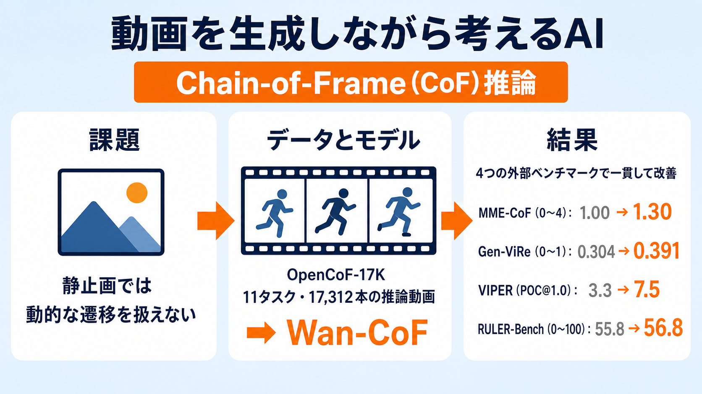

# 動画を「生成しながら考える」AI ― 1万7千本の推論動画で鍛えた Wan-CoF

## この論文のひとことまとめ

動画生成モデルが「連続するフレームのつながり」を通じて推論する能力を、Chain-of-Frame（CoF）推論と呼びます。この論文は、その CoF 推論を鍛えるために 11 種類のタスク・17,312 本の推論動画からなるデータセット OpenCoF-17K を構築しました。そのデータで既存の動画生成モデル Wan2.2-I2V-A14B をファインチューニングした Wan-CoF が、外部の 4 つの動画推論ベンチマークでベースラインを一貫して上回ることを示しています。さらに、推論の中間状態を明示的に保持する 2 種類の補助トークンも探索しました。

## なぜこの研究が重要か

近年の大規模言語モデル（LLM）やマルチモーダルモデル（LMM）では、「推論する力」の強化が中心的なテーマになっています。その主流は Chain-of-Thought（CoT、思考の連鎖）と呼ばれる、テキストの中間ステップをたどって答えに近づく方法です。視覚的な問題に応用する場合も、静止画のような「静的な視覚観測」に頼るのが一般的でした。

しかし、静止画ベースの推論では、物が動く・変化するといった「動的な遷移」や、それが何段階も積み重なる過程を根本的には扱いきれません。ここで注目されているのが、動画生成モデルによる別の道です。動画は時間的に連なるフレームを次々に生み出します。その発展の過程そのものを推論とみなすのが Chain-of-Frame（CoF）推論です。動画モデルには物理や因果関係の初歩的な理解が芽生えているとされ、「生成しながら考える」ための土台になり得ると期待されています。

ただし、その潜在力はまだ十分に引き出されていません。この論文は、CoF 推論を実際に強化する具体的な方法とデータを示した点に価値があります。

## 背景：何が問題だったのか

推論を必要とするタスクでは、いまの動画生成モデルはまだ苦戦しています。論文によれば、長期にわたる時間的な一貫性、物理的・空間的な整合性、論理のつながりのいずれにも課題が残ります。見た目がどれだけリアルでも、それが信頼できる推論を保証するわけではない、と指摘されています。

これまでの関連研究（MME-CoF、RULER-Bench、Gen-ViRe、VIPER など）は、主に「性能を測るベンチマークを整える」ことに力を注いできました。推論能力を能動的に強化しようとする研究は乏しかったのです。迷路解きなどの先行研究もありましたが、論文は次の 2 つの限界を挙げています。

- 訓練や評価が特定の領域に閉じていたり、独自に用意したデータと密接に結びついていたりして、まったく別の外部ベンチマークへ本当に汎化するのかが検証されていない。
- 関心がデータの量を増やすことや推論の戦略に向いており、推論のために設計された動画モデル内部のアーキテクチャがほとんど調べられていない。

## 提案手法：何をしたのか

この研究は OpenCoF というフレームワークを提案します。大きく「データ中心のアプローチ」と「アーキテクチャの探索」の 2 段構えです。

### (1) データセット OpenCoF-17K

11 種類のタスクファミリーにまたがる 17,312 本の推論動画データセットです。各データは「初期条件の画像＋テキストによる指示」を「目標となる推論動画」とペアにした形をとります。つまり、最初の状態を与えると、正しい推論の過程を映した動画が出てくる、という対応関係を学ぶための素材です。

すべての動画は 480p 解像度・15 fps・81 フレームの長さに統一されています。プロンプト（指示文）の平均の長さは 53.2 語です。データは 4 つの相補的な作り方（キュレーションパイプライン）で構築されました。

- **インスタンスベースレンダリング（instance-based rendering）**: パズルや盤面など、すでに構造化されたデータからコードで決まった動画を描き出します。例として、チェックメイトの一手を実行する Chess、4×4 の数独を段階的に解く Sudoku があります。
- **専門家ガイドレンダリング（expert-guided rendering）**: 人間の知識や LLM が生成した概念、画像生成モデル（T2I）の出力で構造を用意してから描画します。補助線を引く 2D geometry や、点をつなぐ Dot-to-dot が該当します。
- **手続き的シーン合成（procedural scene synthesis）**: ランダムな初期値から、物理エンジンやグラフィックスの仕組みでゼロから合成します。タングラム、2D の展開図から立方体を折りたたむ Cube folding、3D のブロック回転、斜面や曲面上のボールの軌道を予測する Physics motion などです。
- **外部動画の再利用（external video repurposing）**: 既存データセットの良質なデモを標準化して再利用します。迷路（Maze）、VBVR（多様なサブタスクを集めた外部データセット由来）、ロボット操作（Embodied manipulation）が含まれます。

従来のデータセットが主に手続き的シーン合成の 1 つのやり方に依存していたのに対し、複数の作り方を組み合わせている点が差別化になっています。タスク別の本数は、Chess 1,000 本、Sudoku 1,000 本、2D geometry 1,162 本、Dot-to-dot 1,000 本、タングラム 800 本、Cube folding 800 本、3D ブロック回転 800 本、Physics motion 1,000 本、Maze 1,000 本、Embodied manipulation 1,000 本、VBVR（30 サブタスク）7,750 本で、合計 17,312 本です。

### (2) Wan-CoF ― データだけで鍛える

Wan-CoF は、汎用の事前学習済み I2V（画像から動画を生成する）モデルである Wan2.2-I2V-A14B を、OpenCoF-17K の上で LoRA を使ってファインチューニングしたモデルです。LoRA（Low-Rank Adaptation）は、少数の追加パラメータだけで大きなモデルを効率よく調整する手法です。

ここでの狙いは、推論のための特別な技術を一切加えず、多様な時間的な教師データだけで CoF のふるまいを引き出せるかを検証することです。実装面では、LoRA を拡散トランスフォーマー（DiT）のデノイザー（ノイズ除去を担う部分）だけに適用し（テキストエンコーダと、画像を圧縮・復元する部品である VAE は凍結）、rank=32 で 2 エポック訓練しています。

### (3) 2 種類の Reasoning Token ― アーキテクチャの探索

DiT ベースの動画生成器では、推論の途中経過が視覚やテキストの内部表現にぼんやりと埋もれています。そこで、中間の推論状態を明示的に置いておく「場所」を与えるため、動く層の異なる 2 種類の学習可能なトークンを探索しました。

- **Visual Reasoning Tokens（vt、視覚推論トークン）**: DiT の視覚的な内部表現（潜在空間）に付け加えるトークンです。自己注意（self-attention）を通じて視覚トークンと双方向にやり取りし、全体の文脈をまとめて配り直すことで、空間に接地した低レベルの手がかりを捉えます。このトークンを加えた変種を Wan-CoFvt と呼びます。
- **Textual Reasoning Tokens（tt、テキスト推論トークン）**: テキスト条件の列に付け加えるトークンです。クロス注意（cross-attention）は、映像側が「問い合わせる側」、テキスト側が「参照される側」として結びつく仕組みで、tt はこの参照される側にだけ置かれます。映像のどの位置・どの時点から参照されても内容が変わらないため、すべての空間・時間にわたって共有される、プロンプトに依存しない高レベルの意味的な事前情報として働きます。この変種を Wan-CoFtt と呼びます。

どちらも同じ Wan2.2-I2V-A14B を土台に、LoRA で別々にファインチューニングされます。トークン数は vt・tt ともに 16 に設定し、これらの変種は 5 エポック訓練しています。

## 結果：何が分かったのか

評価には、OpenCoF-17K 自身の 11 タスクよりも広い推論カテゴリをカバーする 4 つの外部ベンチマーク（MME-CoF、Gen-ViRe、VIPER、RULER-Bench）を使いました。いずれも公式の判定モデルに従って採点します。比較対象には、クローズドソース（Kling、Seedance、Veo、Sora-2 など）とオープンソース（HunyuanVideo など）が含まれます。

主要な数値は次の通りです。いずれもベースラインは元の Wan2.2-I2V-A14B です。

- **MME-CoF（0〜4 のスケール）**: Wan-CoF の総合スコアは 1.30 で、ベースライン 1.00 から +0.30。6 つの観点すべてで改善しました。参考として Sora-2 は 1.80、Seedance-1.0-Pro は 1.48 です。
- **Gen-ViRe（0〜1 のスケール）**: Wan-CoF の平均は 0.391 で、ベースライン 0.304 から +0.087。参考として Sora-2 は 0.560 です。
- **VIPER（POC@1.0）**: Wan-CoF の総合は 7.5 で、ベースライン 3.3 から +4.2。参考として Sora-2 は 23.3 です。
- **RULER-Bench（0〜100 のスケール、画像から動画のケースに限定）**: Wan-CoF の総合平均は 56.8 で、ベースライン 55.8 から +1.0 です。

論文は、4 つのベンチマークすべてでヘッドラインの指標が押し上げられたと述べています。特に、向上が大きかったのは見た目の忠実度だけでなく、時間的一貫性・物理・空間・論理といった推論寄りの下位項目に集中していました。これは、訓練がフレーム単位の推論を実際に強化していることを示唆します。またオープンソースの競合を上回り、クローズドソースの最先端との差を縮めた、と位置づけています。

分布外（訓練とは分布が異なるデータ）への転移も確認されました。カテゴリ別の伸びが OpenCoF-17K の教師データの種類とよく対応しており（例: Physics motion の訓練 → VIPER の Physics 項目が向上）、特定の訓練領域に過学習したのではなく、転移可能な CoF 推論スキルを育てられたことを示唆します。

Reasoning Token については、vt・tt の両変種が全ベンチマークのヘッドライン指標で Wan-CoF をさらに上回りました。興味深いことに、下位項目では設計に沿って役割が分かれました。vt は「持続的なグローバルな計画」が必要な項目に、tt は「プロンプトに依存しないテキストの事前情報」が効く項目に、それぞれ強みを示しました。注意の分析でも、vt は対象付近に局所的な注意のバンドを作り、tt はより広いタスク関連領域に拡散する、といった違いが観察されています。なお、トークン数を 16 から 32 に倍増しても一様な改善は得られず、パラメータもほぼ倍増するため、16 をデフォルトに採用しています。

## 意義と限界

この研究は、より強い動画推論には 2 つの要素がともに必要だと示唆しています。1 つは「広範な時間的教師信号」（多様な推論動画データ）、もう 1 つは「中間の推論状態を組織化する明示的な機構」（Reasoning Token）です。加えて、外部ベンチマークへ転移する汎化可能な推論スキルを育てられること、そしてデータセット・モデル・コードをオープンソース化して研究を後押しすることも意義として挙げられています。

限界として論文が明示しているのは、vt と tt を別々に調べており、両者を効果的に組み合わせる方法が今後の課題として残されている点です。

## まとめ

この論文は、11 タスク・17,312 本の推論動画データセット OpenCoF-17K を構築し、それでファインチューニングした Wan-CoF が 4 つの外部ベンチマークで一貫してベースラインを上回ることを示しました。さらに、推論の中間状態を保持する 2 種類の Reasoning Token を探索し、それぞれが異なる役割で推論を後押しすることを分析した研究です。

## 用語集

- **Chain-of-Frame（CoF）推論**: 時間的に連なるフレームの発展を通じて推論が展開する過程。動画生成モデルに特有の推論経路で、テキストや静止画に依存する従来の Chain-of-Thought と対比される。
- **Chain-of-Thought（CoT）**: LLM などで用いられる、テキストの中間推論ステップをたどる推論。視覚版は静的な視覚観測に依存する。
- **I2V（Image-to-Video）**: 初期画像から動画を生成するタスク・モデル。本研究の土台 Wan2.2-I2V-A14B が該当する。
- **DiT（Diffusion Transformer）**: 拡散モデルを Transformer で構成したアーキテクチャ。高解像度でスケーラブルな生成を可能にする。
- **LoRA（Low-Rank Adaptation）**: 少数の追加パラメータで大きなモデルを効率よくファインチューニングする手法。本研究では rank=32 で DiT のデノイザーのみに適用。
- **Visual Reasoning Tokens（vt）**: DiT の視覚潜在列に付け加える学習可能トークン。自己注意で双方向にやり取りし、空間に接地した低レベルの手がかりを捉える。
- **Textual Reasoning Tokens（tt）**: テキスト条件列に付け加える学習可能トークン。クロス注意の key/value 側にだけ入り、プロンプト非依存の高レベルな事前情報として働く。
- **POC@1.0**: VIPER ベンチマークの評価指標。論文は VIPER の公式プロトコルに従うとのみ記し、指標の内部定義は明示していない。

## 原論文

- OpenCoF: Learning to Reason Through Video Generation（https://arxiv.org/abs/2607.08763）
