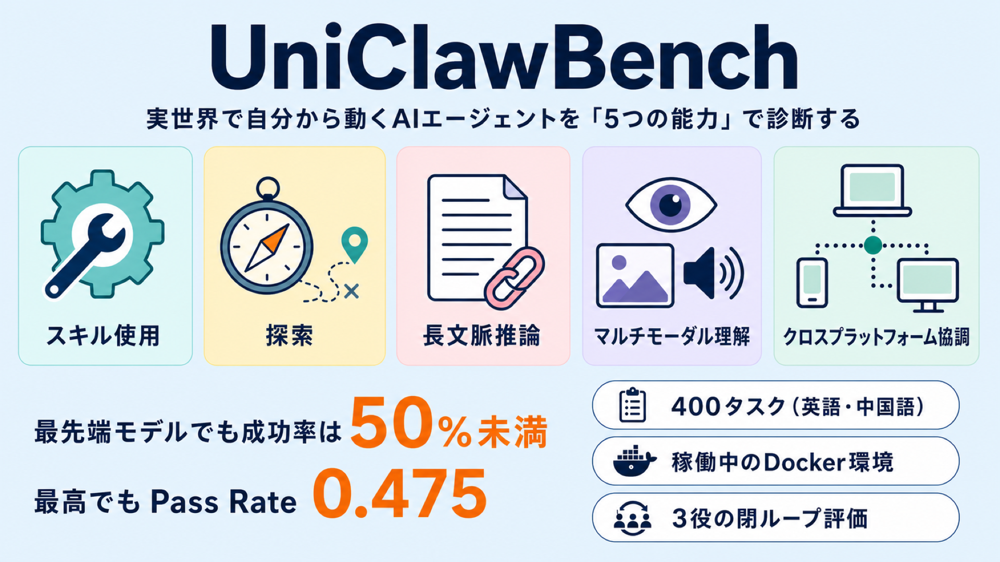

# 実世界で自分から動くAIエージェントを「5つの能力」で診断する ― ベンチマーク UniClawBench

## この論文のひとことまとめ

ブラウザやターミナルなど、身の回りのツールを自分で操作して仕事をこなす「能動的エージェント（proactive agents）」を評価するための新しいベンチマーク UniClawBench を提案した研究です。従来の評価が「オフィス」「リサーチ」といった応用シーン別だったのに対し、この研究は「どの能力が欠けると失敗するのか」を突き止める 5 つの能力軸でタスクを分類します。稼働中の Docker 環境の中で、英語・中国語あわせて 400 のタスクを、ユーザーとの何度ものやり取りを含む「閉ループ」で採点します。最先端モデルでも成功率は 50% に届かず、現行エージェントの弱点が具体的に浮かび上がりました。

## なぜこの研究が重要か

大規模言語モデル（LLM）は、質問に答えるだけのアシスタントから、ブラウザを開いてページを操作したり、ターミナルでコマンドを打ったりと、自分で道具を使う「エージェント」へと進化してきました。中でも注目されているのが、24 時間そばに居て自ら仕事を進める「デジタルな同僚」のような能動的エージェントです。

しかし、こうしたエージェントが本当に使いものになるのかを正しく測るのは簡単ではありません。従来の評価方法には、後述する構造的な弱点がいくつもあり、「なぜ失敗したのか」を切り分けられないという問題がありました。エージェントを実務に投入する前に、その強みと弱みを能力ごとに診断できる物差しが求められています。UniClawBench は、その物差しを提供しようとする試みです。

## 背景：何が問題だったのか

論文は、既存のエージェント評価には 3 つの構造的な限界があると指摘します。

- **実世界の複雑さを捉えられない**：多くのベンチマークは、自前でコピーした Web サイト（例：WebArena）や、仮想マシン内に保存したキャッシュページ（例：OSWorld）に頼っています。そのため、こうした模擬環境（サンドボックス）での性能と、本物の環境での実力との間に大きなギャップが生じます。
- **一発勝負の評価が主流**：多くは 1 ターンで評価を終えます。実際のユーザーは何度もフィードバックを返しながらエージェントと協力するのに、その閉ループ的なやり取りが無視されています。
- **失敗の原因を特定できない**：タスクを「オフィス」「リサーチ」のような応用シーン単位で分類しているため、失敗したときにボトルネックが視覚の認識なのか、長い文脈の推論なのか、ツールの使い方なのかを切り分けられません。

さらに、実世界かつ閉ループの評価を実現しようとすると、2 つの根本的な難しさに突き当たります。1 つは、安定した正解が存在しないこと。たとえば Amazon の商品ページの価格は今日 199 ドル、明日 179 ドルと変動するため、あらかじめ記録した正解はすぐに古くなってしまいます。もう 1 つは、ユーザーとのやり取りを忠実に再現しつつ、評価の信頼性を保つこと。ユーザー役を演じるプログラムが正解や採点基準を知ってしまうと、評価対象のエージェントに答えや採点ルールを漏らしてしまう恐れがあります。

## 提案手法：何をしたのか

### タスクを「能力」で分類する

UniClawBench の中心にあるのは、タスクを「その能力が欠けると完遂できない、主要なボトルネックとなる能力」1 つに割り当てるという発想です（能力駆動型分類、capability-driven taxonomy）。能力軸は次の 5 つです。

1. **スキル使用（Skill Usage）**：タスク固有のツールや API を選び、調べ、操作する能力。搭乗券のスキャンを文字認識（OCR）で読む、CSV を照合する、SQLite に問い合わせる、Git や Docker を監査する、といった作業が該当します。
2. **探索（Exploration）**：不完全でノイズが多く、ときに誤誘導的な情報のもとで、答えのないオープンな調査を行う能力。文書化されていない Web API の仕組みを解き明かす、インフラ設定を監査する、といった作業です。
3. **長文脈推論（Long-Context Reasoning）**：異なるソース・長い文書・長い対話履歴をまたいで証拠を統合し、維持する能力。難しさは単一の文書が長いことではなく、制約を保ち続け、矛盾を解消し、全体として辻褄の合う統合を行う点にあります。
4. **マルチモーダル理解（Multimodal Understanding）**：画像・動画・音声から情報を抽出・解釈・生成する能力。最終的な答えの正しさが、文字以外のコンテンツから得た証拠に依存する場合にのみこのカテゴリに割り当てられます。
5. **クロスプラットフォーム協調（Cross-Platform Coordination）**：異なるアプリやインターフェースの間で、状態を保ち・移し・副作用を検証する能力。PDF を読んで Zotero にレコードを作り、BibTeX として書き出し、Obsidian にノートを作ってスクリーンショットを保存する、といった複数アプリを横断するワークフローが例です。

### タスクの構成

全部で 400 の実世界タスクがあり、英語と中国語の 2 言語で構成されます。5 つの能力カテゴリそれぞれに英語 40・中国語 40 の計 80 タスクを用意しています。すべて手作業で作られており、単なる「問いと答え」のペアではなく、ユーザー指示・タスク固有のコンテキスト・入力ファイルや Web リソース・ツールやサービス・スキル・期待される出力・隠された採点用の参照までを含む「タスクパッケージ」として設計されています。

これらはすべて、実ソフト・稼働中のブラウザ・ローカルファイルシステムを備えた Docker コンテナの中で実行されます。前述のとおり、あらかじめ記録した正解は変動に弱いため、この研究はそれを廃止し、各タスクに細かく段階的な「完了チェックポイント（completion checkpoints）」を設けて採点します。

### 3 つの役割による閉ループ評価

答えや採点基準を漏らさずに、ユーザーとのやり取りを忠実に再現するために、この研究は 3 つの役割による閉ループの仕組みを設計しました。

- **実行エージェント（Executor）**：評価される本人です。公開されたタスク指示と、許可されたタスクパッケージ（ファイル・ツール・サービス・実行環境）だけを受け取ります。
- **監督エージェント（Supervisor）**：隠れた役割です。実行の様子や成果物を観察し、タスク固有の隠された参照と採点基準（ルーブリック）に照らして評価します。合格（pass）・不合格（fail）・継続（continue）という構造化された状態とスコアを返します。
- **ユーザーシミュレータ（User Simulator）**：見える範囲の実行過程と成果物だけを見て、実際のエンドユーザーのように自然な言葉でフィードバックを返します。

ここで鍵となるのが「情報ファイアウォール（information firewall）」という隔離の仕組みです。監督エージェントは正確な採点基準を知っていますが、ユーザーシミュレータには「合格・不合格・回復可能」といった粗い進捗シグナルだけを渡します。ユーザーシミュレータは隠された参照や監督の根拠にはアクセスできません。さらに、フィードバックを整える処理（feedback rewriter）が、実行エージェントに届く前に内容をサニタイズ（無害化）します。こうして、答えの漏洩を防ぎながら現実的なやり取りを再現します。

評価の実体は、ホスト側が監督し、コンテナ側でエージェントが動く構成です。タスクごとに新しい Docker 環境で実行エージェントを起動します。各ターンのあと、見える範囲の実行過程（対話記録・ツール使用記録・実行環境の状態・成果物）を集め、隠された監督エージェントにタスク固有の評価参照とともに渡します。監督はチェックポイント方式で採点し、合格・不合格・継続のいずれかを返します。このループは、タスクが合格になるか、回復不能な失敗に至るか、フォローアップの予算を超えるか、タイムアウトするまで続きます。

## 結果：何が分かったのか

### 評価パイプラインは信頼できるか

まず、この自動評価が人間の判断とどれだけ一致するかが確認されました。完了した実行記録から 50 件を無作為に取り出し、専門家 3 名が独立に合否とスコアを付けたところ、自動の合否判定は人間の多数決と 92.0% 一致しました。チェックポイント方式の平均スコアは、人間の平均スコアと強い相関を示しました（ピアソン相関 r=0.71、スピアマン相関 ρ=0.68）。

### モデル間の比較

同じ OpenClaw というフレームワークのもとで 10 個のモデルを比較した結果（全体の Pass Rate / Average Score）は次のとおりです。Pass Rate（PR）は最終的に合格に達したタスクの割合、Average Score（AS）は監督エージェントによるチェックポイント方式の平均スコアです。

| モデル | Pass Rate | Average Score |
| --- | --- | --- |
| Claude Opus-4.8 | 0.475 | 0.702 |
| Claude Sonnet-4.6 | 0.455 | 0.763 |
| GPT-5.4 | 0.407 | 0.774 |
| Kimi-2.6 | 0.362 | 0.709 |
| Gemini-3.1-Pro | 0.325 | 0.727 |
| Qwen-3.5-Plus | 0.318 | 0.731 |
| Gemini-3.0-Flash | 0.282 | 0.698 |
| GPT-5.4-Mini | 0.215 | 0.616 |
| Gemini-3.1-Flash-Lite | 0.155 | 0.543 |
| GPT-4.1 | 0.152 | 0.488 |

論文が指摘する主なポイントは次のとおりです。

- 先頭の閉ソースモデル（Claude Opus-4.8、GPT-5.4）が最も高い全体 Pass Rate を出しますが、絶対的な成功率はいずれも 50% 未満にとどまります。模擬環境での能力と、実世界での実行との間には依然として大きなギャップがあります。
- オープンソースモデルが急速に差を縮めています。Qwen-3.5-Plus や Kimi-2.6 は、Gemini-3.1-Pro などの閉ソースモデルと肩を並べる競争力を見せました。
- 全モデルに共通して「途中失敗（halfway failure）」という現象が見られました。中間の Average Score は高いのに、最終的な Pass Rate が低いという顕著なギャップです。部分的には前進できても、長い実行の連鎖の途中で回復不能な誤りを犯してしまうのです。
- 能力別に見ると、スキル使用と探索では比較的良好でした。一方、長文脈推論・マルチモーダル理解・クロスプラットフォーム協調は依然としてかなり困難です。長い実行過程の記憶を保つこと、文字以外の証拠に基づくこと、複数アプリ間で協調することが求められるためです。

### フレームワーク間の比較

同じモデルでも、どの「フレームワーク」（実行の流れをどう組み立てるかの設計）で動かすかによって成績が変わります。代表 3 モデルを 3 つのフレームワークで評価した結果（全体の Pass Rate / Average Score）は次のとおりです。

| モデル | OpenClaw | EDICT | Nanobot |
| --- | --- | --- | --- |
| GPT-5.4 | 0.407 / 0.774 | 0.338 / 0.744 | 0.290 / 0.640 |
| Claude Opus-4.8 | 0.475 / 0.702 | 0.415 / 0.687 | 0.385 / 0.587 |
| Kimi-2.6 | 0.362 / 0.709 | 0.320 / 0.695 | 0.278 / 0.573 |

- OpenClaw が、テストしたすべてのモデルで一貫して最高の Pass Rate を記録しました。集中型・単一エージェントの構成で情報の損失が最小になり、元のタスク制約・途中のツール実行の証拠・閉ループのユーザーフィードバックが 1 本の実行過程の中に保たれるためだと説明されています。
- EDICT は「Average Score は高いのに Pass Rate が低い」というパターンが目立ちました。これはマルチエージェント編成に内在する「協調摩擦（coordination friction）」を露呈しています。中央のオーケストレータが下位のサブエージェントを実時間で監督できず、状態更新の失敗やハンドオフ時のコンテキスト欠落でパイプラインが停滞するのです。
- Nanobot は超軽量な構造で、トークン使用が高度に最適化されています（例：GPT-5.4 で平均入力 0.57M トークン、OpenClaw の 1.15M と対照的）。ただし効率と性能はトレードオフの関係にあり、簡素なコンテキスト管理では細かい推論や長い証拠テキストの生成が難しく、厳格な評価が求める完全な成果を出しきれずに全体の Pass Rate が低くなりました。

### 多ターンのやり取りは効くのか

ユーザーからのフォローアップを重ねるほど成績が伸びることも確認されました。監督サイクルを 1 → 2 → 3 と進めると、Pass Rate は 23.8% → 29.5% → 31.7% と一貫して向上し、累積最大スコアの平均も 0.565 → 0.652 → 0.679 と上がりました。多ターンのユーザーフィードバックが、誤りを動的に立て直すうえで欠かせないことを示しています。

## 意義と限界

この研究は、静的な模擬環境を超えて、エージェント評価を 5 つの基盤能力 × 400 の 2 言語実世界タスクへと分解しました。採点基準を漏らさずに多ターンの人間とエージェントの協力を忠実に捉える、3 役の閉ループ（実行エージェント・隠れた監督エージェント・ユーザーシミュレータ）を提案した点が特徴です。主要な発見として、現行のエージェントは長期記憶（long-horizon memory）とクロスプラットフォーム協調に苦戦し、フレームワークの設計がしばしば本質的なモデル能力のボトルネックになることが明らかになりました。

一方で、論文は自らの限界も認めています。第 1 に、手作業で構築した 400 タスクという比較的小規模なセットであること。第 2 に、ライブ環境で実行するため不安定になる可能性があること。第 3 に、LLM ベースの評価が潜在的なバイアスを持ち込みうること。これらの制約はあるものの、UniClawBench はエージェントの失敗の根本原因を正確に特定し、より信頼できる能動的アシスタントへの道を拓くと位置づけられています。

## まとめ

UniClawBench は、実世界のツールを操作する能動的エージェントを、失敗の原因を切り分けられる「5 つの能力軸」で診断する初の能力駆動型ベンチマークです。稼働中の Docker 環境で多ターンの閉ループ評価を行い、採点基準の漏洩を防ぐ 3 役の仕組みを備えます。最先端モデルでも成功率は 50% に届かず、長文脈・マルチモーダル・クロスプラットフォームの弱点と、フレームワーク設計の影響の大きさが浮き彫りになりました。

## 用語集

- **能動的エージェント（proactive agent）**：反応的なエージェントと異なり、自ら行動を起こして目標を自律的に追う AI。永続的なメモリ・再利用可能なスキル・ローカルツールへのアクセスを活かす常駐アシスタント。
- **能力駆動型分類（capability-driven taxonomy）**：タスクを応用シーンではなく「主要なボトルネックとなる能力」で分類する枠組み。失敗の根本原因を特定しやすくする。
- **3 役閉ループ評価（three-role closed-loop evaluation）**：実行エージェント（評価対象）・監督エージェント（隠れた評価者）・ユーザーシミュレータ（ユーザー役）の 3 役による多ターン評価戦略。
- **情報ファイアウォール（information firewall）**：監督からユーザーシミュレータへ粗い進捗シグナルだけを通し、隠された採点基準や正解の漏洩を防ぐ隔離の仕組み。
- **完了チェックポイント（completion checkpoints）**：あらかじめ記録した正解の代わりに、各タスクを細かく段階的な達成条件へ分解した採点基準。
- **Pass Rate（PR）**：最終的に合格状態へ達したタスクの割合（タスク単位の指標）。
- **Average Score（AS）**：監督エージェントによるチェックポイント方式の平均スコア（ステップ単位で集約した指標）。
- **途中失敗（halfway failure）**：中間の Average Score は高いのに最終の Pass Rate が低い、長い実行の途中で起きる回復不能な失敗現象。
- **協調摩擦（coordination friction）**：マルチエージェント編成で、状態更新の失敗やハンドオフ時のコンテキスト欠落によりパイプラインが停滞する現象。

## 原論文

- UniClawBench: A Universal Benchmark for Proactive Agents on Real-World Tasks（https://arxiv.org/abs/2607.08768）
