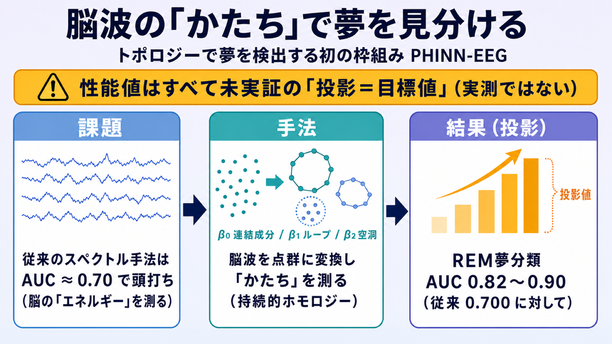

# 脳波の「かたち」で夢を見分ける — トポロジーで夢検出に挑む PHINN-EEG（性能値はすべて未実証の「投影」）

## この論文のひとことまとめ

脳波（EEG）から「その人が夢を見ていたか否か」を検出する既存手法は、周波数帯ごとのパワー（スペクトル）に頼っていて、識別性能が AUC ≈ 0.70 で頭打ちになっています。この論文は、脳波を時系列の点群に変換し、その「かたち（トポロジー）」を持続的ホモロジー（persistent homology）という数学の道具で捉える初のフレームワーク PHINN-EEG を提案します。ただし本論文でもっとも注意すべき点は、示されている性能値（AUC = 0.82〜0.90 など）が**実験で測定した結果ではなく、既存研究に基づく事前の「投影（projection）」＝目標値である**ことです。実データでの検証はこれからの「すぐ次の一手」だと、著者自身が繰り返し明記しています。

## なぜこの研究が重要か

夢は、脳の電気記録の中では「稀にしか現れない構造的なイベント」です。DREAM データベース（Wong et al., 2025, Nature Communications）によると、目覚めた直後に夢を報告する割合は、REM 睡眠からの覚醒で 84.3%、NREM 睡眠からの覚醒で 62.6% に上り、睡眠段階と有意な関連があります。

こうした「夢を見ていたかどうか」を脳波だけから当てられれば、睡眠研究やウェアラブルな脳インターフェース（BCI）への応用が開けます。しかし現在の計算的手法は、脳波の「エネルギーがどれだけあるか」を測ることに終始しており、それが性能の壁になっている、というのが著者らの問題意識です。この論文は、測る対象そのものを「エネルギー」から「幾何的なかたち」へ切り替えることを提案します。

## 背景：何が問題だったのか

既存の夢検出は、夢の検出を「スペクトルのエネルギー問題」として扱ってきました。具体的には、6 つの周波数帯のパワースペクトル密度（PSD, power spectral density）と、時系列の統計的特徴量セット（catch22）を抽出し、機械学習で分類します。この方式（Wong ベンチマーク）は、REM 睡眠の夢検出で AUC ≈ 0.700、NREM 睡眠で AUC = 0.586 に到達しています。

ここで AUC（AUROC）は二値分類（夢あり／なし）の識別性能を表す指標で、0.5 が当てずっぽう、1.0 が完璧を意味します。つまり REM でも 0.70 程度というのは、実用にはまだ物足りない水準です。

著者らは、この 0.70 という上限（ceiling）には根本的な理由があると主張します。スペクトル手法は脳活動が「どれだけあるか（energy）」を測れますが、「どんな幾何的なかたち（shape）をしているか」は測れません。統合情報理論（IIT）やグローバルワークスペース理論（GWT）といった意識の理論は、夢を見ている状態が質的に異なるネットワーク統合構造を持つと予測します。もしそうなら、活動量ではなく「かたち」を測る道具が必要になる、というわけです。

なお、トポロジーを脳波に応用する研究（TDA-EEG）自体は既にあり、睡眠段階の分類や「瞑想 vs 安静」の分類でトポロジー特徴の優位が示されています。しかし、**睡眠段階の中でさらに夢内容を見分ける**という課題にトポロジーを適用した例はこれまで一度もなく、DREAM データベースにトポロジー手法が使われたこともありません。

## 提案手法：何をしたのか

中核のアイデアは、目覚める直前の多チャンネル脳波を「点群」に変換し、その点群の位相的なかたちの時間変化を特徴量にする、というものです。

主な構成要素を順に見ていきます。

- **Takens 遅延埋め込み（Takens delay embedding）**：1 本の時系列信号を、時間をずらした座標 (x_t, x_{t+τ}, …) の点群に展開し、背後にある力学系の「アトラクタ」のかたちを再構成する古典的な手法です。埋め込み次元 d は十分条件 d ≥ 2D+1（D はアトラクタの次元）を採用し、候補 d ∈ {5, 7, 10, 15} を事前登録したうえで、既定の代表値を d = 7 としています（訓練データのみを使った入れ子交差検証で選択）。多チャンネルは各チャンネルの遅延ベクトルを連結して点群を作りますが、これは数学的保証のある構成ではなく「新しいヒューリスティック（経験的な工夫）」だと明記されています。
- **持続的ホモロジーと Betti 曲線（Betti Curves）**：点群にスケール ε を少しずつ大きくしながら、連結成分（β0）・ループ（β1）・空洞（β2）の数がどう生まれ消えるかを追う手法です。この Betti 数を時間 t の関数として捉えたものを、著者らは「Dynamic Betti Curves（動的ベッチ曲線）」β0(t)・β1(t)・β2(t) と呼びます。構成には Vietoris–Rips フィルトレーションという標準的な方法を使います。
- **Geometric Dream Hypothesis（幾何的な夢仮説）**：オイラー標数 χ(t) = β0(t) − β1(t) + β2(t) を定義し、「夢を見ている状態は持続的なループ（β1 > 0）を示し、夢のない状態は単純なかたちへ崩れる」という仮説を立てます。ただし著者は、NREM の同期的な脳波もループを生みうるため、この予測は前提ではなく「検証すべき対象」だと慎重に位置づけています。特定の位相的特徴と夢内容（例：ループ＝悪夢）を結びつける解釈は「投機的（speculative）」だと明記されています。
- **PHINN-EEG パイプライン**：前処理（バンドパスフィルタ・ノッチフィルタ・正規化）→ 遅延埋め込み（5 秒窓、80% オーバーラップ）→ Vietoris–Rips フィルトレーション（H0/H1/H2 まで計算）→ 特徴ベクトル化、という流れで、1 エポックあたり約 340 次元の特徴を作ります。
- **分類モデル**：トポロジー特徴（約 340 次元）に勾配ブースティング（XGBoost）を組み合わせたモデルを主役に、比較用に従来のスペクトル特徴を使うモデルや、CNN と双方向 LSTM を融合した時系列モデルも用意します。
- **生成モデル**：トポロジーを条件として脳波信号を合成する部分もあります。rectified flow（ノイズからデータへ「まっすぐな経路」で写像を学習する生成モデル）を多チャンネル脳波に適応させ、約 340 次元のトポロジー条件ベクトルで生成を条件づけます。ただし持続的ホモロジーの計算は微分できないため、トポロジー特徴は事前計算しておき、学習の損失には使わず「生成が条件をどれだけ忠実に守れたか」を測る指標として使います。

## 結果：何が分かったのか

ここが本論文でもっとも重要な注意点です。**以下に挙げる性能数値は、すべて「実験で測定した結果」ではなく、公表済みの TDA-EEG ベンチマークに基づく「前向きの投影（prospective projections）＝目標値」です。** DREAM データベース上での実証は「すぐ次の一手（immediate next step）」であり、本論文には実データで測った結果は含まれていません。この点は Abstract・第 5.4 節・結論で繰り返し強調されています。

その前提のもとで、著者が掲げる投影値は次の通りです。

- **REM 睡眠の夢分類：AUC = 0.82〜0.90（従来の catch22 の 0.700 に対して）**。ただし著者はこれを「弱くしか根拠づけられていない事前分布（weakly-grounded prior）」と明言しています。根拠が、睡眠段階分類や「瞑想 vs 安静」分類という、いずれも「段階内の稀イベント検出とは別のタスク」からの転用だからです。
- **より控えめな「段階内分散に基づく妥当範囲」：AUC = 0.58〜0.69**。これは効果量 Cohen's d ≈ 0.3〜0.5 を仮定して導いた値で、上の 0.82〜0.90 とは「緊張関係にある（in tension）」と著者自身が認めています。どちらか一方を選んで解消するのではなく、両方を拘束力のない参考値として併記しています。
- **NREM 睡眠の夢分類：AUC = 0.72〜0.78（従来の PSD の 0.586 に対して）**。
- **アブレーション（要素の寄与検証）**：従来のスペクトル特徴モデルは、次元を揃えたトポロジー特徴モデルに対して AUC で 6〜12 ポイント低下する見込み。
- **生成モデル**：トポロジー条件づけによって、シナリオ被覆率（SCR, Scenario Coverage Rate）が 60〜70%（ランダムなベースラインの 3〜5% に対して）に達することを目標としています（Abstract では SCR > 30% と記載）。

比較の土台となる既存ベンチマーク（こちらは他研究による実測値）としては、Wong の PSD/catch22 が AUC = 0.586（NREM）/ 0.700（REM）、トポロジー特徴による睡眠段階分類（Baronetzky）が 98.16%（統計特徴の 91.77% に対して）などが挙げられています。

評価の設計面では、データセット単位で 1 つを取り除いて汎化を測る交差検証（LODO, leave-one-dataset-out）と、被験者単位でのグループ分割（同じ人のデータが学習と評価に混ざる「リーク」を防ぐため）を採用しています。使うデータは DREAM データベースの公開サブセットから 1,462 の覚醒エポックです。

なお、リアルタイム性についても訂正が入っています。1 サブウィンドウの遅延は 300 ミリ秒未満を見込みますが、1 エポック（約 26 サブウィンドウ）全体では数秒かかるため「エポック内リアルタイムは成立しない」とし、ストリーミング処理でのみリアルタイム性を主張しています。

## 意義と限界

この研究の意義は、夢検出を「脳活動がどれだけあるか」から「脳活動がどんなかたちをしているか」へと視点を移す、パラダイムシフトを提案した点にあります。検証されれば、スペクトルエネルギーから位相空間の幾何へという転換となり、ウェアラブル BCI での夢モニタリングにもつながりうる、と位置づけられています。ただし著者は、**これらの意義はすべて上述の実証を前提としており、まだ確立されていない（not yet established）**と明記しています。

論文が自ら認める主な限界は次の通りです。

1. **性能値がすべて投影である点そのもの**：実測ではなく目標値であり、実証はまだ行われていません。これが最大の留保点です。
2. **多チャンネル連結埋め込みの正当性**：各チャンネルの遅延ベクトルを連結する構成は数学的保証がなく、先行例のない新しいヒューリスティックです。見かけ上のループ（アーティファクト）と本物の統合構造を区別するには、追加の対照実験が必要とされています。
3. **ボリューム伝導（volume conduction）**：頭皮上の少数の電極（約 6〜18 チャンネル）では、脳内の電気が広がって混ざる影響を十分に補正できず、全サブセットで未解決の構造的な限界だとしています。
4. **リファレンスの異種性**：電極の基準の取り方（単極 vs 双極）がデータセット間で混在しており、位相空間のかたちを直接比較できません。そのため主要な評価は基準を揃えた範囲に限定されています。
5. **窓長・自己相関のアーティファクト**：5 秒窓は低い周波数帯（デルタ波）に対して短く、80% のオーバーラップが疑似的なトポロジーを生みうるため、感度分析で経験的に緩和しています。
6. **Betti 遷移パターンは探索的仮説**：夢状態のかたちの分類として提示されるパターンは、意識の理論に動機づけられた事前仮説であり、検証済みの「地図」ではありません。
7. **参考文献の誤引用と再検証**：旧稿では複数の重要文献が誤ったタイトル・著者・掲載先で引用されており、正しい書誌情報で再検証したと明記されています。投影は主に検証済みの Baronetzky に接地させています。

倫理面では、夢のモニタリングが「認知的プライバシー」に関わる問題だとして、撤回可能なインフォームドコンセントや、機微な健康情報としての扱いを推奨しています。コード・学習済み重み・特徴抽出ユーティリティは公開予定とされています。

## まとめ

PHINN-EEG は、夢検出を「エネルギー」ではなく脳波の「かたち（トポロジー）」で捉える初のフレームワークとして構想されました。提案は理論的に興味深いものの、示された性能値はすべて既存研究からの「投影＝目標値」であり、実データでの検証はこれからです。設計の丁寧さと同じくらい、著者が自らの限界を率直に開示している点が印象的な論文です。

## 用語集

- **持続的ホモロジー（persistent homology）**：点群にスケールを徐々に大きくしながら、連結成分・ループ・空洞といった位相的特徴の「誕生と消滅」を追い、データの「かたち」を多スケールで定量化する手法。
- **Betti 数 / Dynamic Betti Curves**：β0 = 連結成分の数、β1 = 独立なループの数、β2 = 空洞の数。これらを時間 t の関数として捉えたものが Dynamic Betti Curves。
- **Takens 遅延埋め込み（Takens delay embedding）**：1 本の時系列を時間遅れ座標の点群に展開し、背後の力学系アトラクタのかたちを再構成する古典的手法。
- **Vietoris–Rips フィルトレーション**：点群から距離 ε 以下の点集合を単体とみなして複体を構成し、ε を増やしながら位相を追う、持続的ホモロジーの標準的な構成法。
- **AUC（AUROC）**：ROC 曲線下の面積。二値分類の識別性能指標で、0.5 が偶然、1.0 が完全。
- **PSD / catch22**：PSD はパワースペクトル密度（周波数帯ごとのパワー）、catch22 は時系列の 22 個の正準特徴量セット。従来の夢検出のスペクトル系ベースライン。
- **rectified flow / flow matching**：ノイズからデータへ「まっすぐな最適輸送経路」で写像を学習する生成モデルの枠組み。推論が速い。
- **LODO（leave-one-dataset-out）**：データセット単位で 1 つを取り除いて交差検証し、研究室間・電極構成間の汎化を測る評価法。
- **SCR（Scenario Coverage Rate）/ FED（Fréchet EEG Distance）**：生成した脳波の評価指標。SCR は多様なシナリオをどれだけ被覆できたか、FED は生成分布と実分布の距離（画像の FID の脳波版）。
- **DREAM データベース**：Wong et al.（2025, Nature Communications）による大規模オープンアクセスの EEG 夢研究資源。20 研究・263 参加者・3,191 覚醒を含む。

## 原論文

- PHINN-EEG: Topological Time-Series Analysis of Dream-State EEG -- Dynamic Betti Curves for Dream Content Classification and Topology-Conditioned Neural Signal Synthesis（https://arxiv.org/abs/2607.09662）
