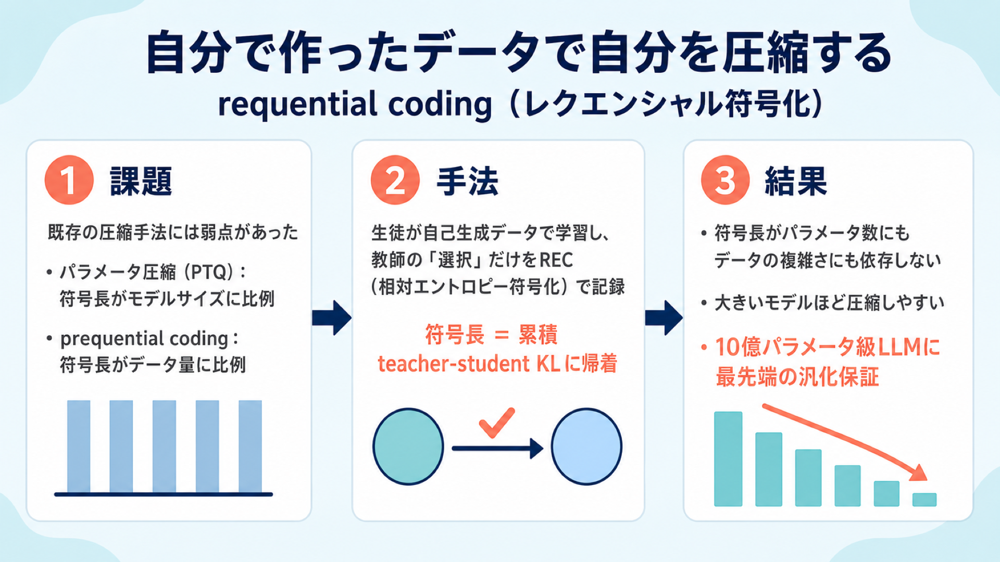

# 自分で作ったデータで自分を圧縮する：モデル圧縮の限界に挑む「requential coding」

## この論文のひとことまとめ

ニューラルネットワークをどこまで小さく表現できるかは、そのモデルがどれだけ「本質」を学んだかの指標になります。この論文は、生徒モデルが自分で生成したデータを使って学習し、教師モデルが「どのサンプルを使うか」を選んだ情報だけを記録する、requential coding（レクエンシャル符号化）という新しい圧縮手法を提案しました。この工夫により、符号の長さがパラメータ数にもデータの複雑さにも依存しなくなり、既存手法より桁違いに短い符号を実現します。さらにこの強い圧縮を汎化の理論保証に差し込むことで、10 億パラメータ級の大規模言語モデル（LLM）に対して最先端の汎化保証を与えました。

## なぜこの研究が重要か

「圧縮できることは、理解していることの証」という考え方があります。あるデータを短く言い表せるということは、その背後にある規則性を見つけ出せているということだからです。ニューラルネットワークも同じで、訓練データを短い符号で表現できるモデルは、汎化を可能にする規則性を発見していると考えられます。

ところが困ったことに、深層ネットワークはパラメータ数が示すよりもずっと単純な関数を学習していることが多いのに、その単純さを実際に短い符号として取り出すのが非常に難しいのです。モデルは軽いはずなのに、その軽さを証明する方法がない、という状況でした。

この研究は、その「単純さ」を実際に測る新しいものさしを提案します。そして単に測れるだけでなく、モデルが大きくなるほど圧縮しやすくなるという現象を明らかにし、現代の大規模化路線がなぜうまくいくのかに理論的な裏づけを与えます。

## 背景：何が問題だったのか

これまでのモデル圧縮手法には、大きく 2 つの流れがありました。どちらにも弱点があります。

**1 つ目はパラメータを直接圧縮する手法**です。量子化（quantization）や枝刈り（pruning）などがこれにあたり、学習し終わったパラメータの値そのものを短く表現します。特に、訓練後にパラメータの精度を落とす訓練後量子化（post-training quantization、PTQ）は、LLM において最先端の圧縮性能を持ち、Hessian にもとづく適応的な戦略で性能低下を抑えつつ 1 パラメータあたり 4 ビット以下にまで到達します。しかしこの方式は、符号の長さがモデルサイズに比例して増えてしまい、パラメータが実際にどれだけの情報を蓄えているかには鈍感です。

**2 つ目は prequential coding（プリクエンシャル符号化）**です。これはパラメータではなく「訓練の過程そのもの」を圧縮します。データを少しずつ提示しながらモデルを逐次学習させ、その訓練の履歴を符号化するため、パラメータ数への依存を回避できます。しかし別の問題を抱えています。モデルがどれだけ学習したかに関わらず、「厳密なデータ系列」をそのまま符号化してしまうため、データが複雑（エントロピーが高い）だと符号がどんどん大きくなります。符号の長さはデータセットのサイズに比例して増え続けてしまうのです。

この点を式で見ると分かりやすくなります。prequential 符号長の期待値は、次の 2 つの項に分解できます（論文の式 (1)）。

- **データエントロピーの項**：データ源そのものが持つ、減らしようのない複雑さ
- **近似誤差の項**：モデルの予測が真の分布からどれだけずれているか

第 1 項は、モデルが学習を止めた後も線形に累積し続けます。データが本質的に持つランダムさの分まで、律儀に支払い続けてしまうのです。理想的な符号は、このどちらの項も全額払うべきではありません。ここに改善の余地がありました。

## 提案手法：何をしたのか

この論文の中核アイデアは驚くほどシンプルです。prequential coding をたった一点だけ変更します。**生徒モデルを、既存のデータセットではなく「自分自身が生成したデータ」で訓練する**のです。そして符号に記録するのは、より強い教師モデルが「自己生成サンプルのうちどれを訓練に使うか」を決めた分の情報だけにします。

仕組みを順を追って見てみましょう。

- 各ステップで、符号化される生徒モデルが自分自身の分布から候補サンプルを複数生成します。生成には既知のシードを持つ疑似乱数生成器（PRNG）を使うので、後から同じサンプルを再現できます。
- 教師モデルが、決められた受理ルールに従って候補の中から 1 つを選びます。受理されたサンプルが、あたかも教師の分布から直接引いてきたサンプルのように振る舞うよう工夫されています。
- この「どのサンプルを選んだか」というインデックスを、相対エントロピー符号化（relative entropy coding、REC）という技術で符号化します。このインデックスは、おおよそ「教師と生徒の分布の隔たり（teacher-student KL ダイバージェンス）」に相当するビット数で表せます。
- 生成された符号にこの選択情報を追記し、選ばれたサンプルで生徒を訓練して次のステップに進みます。

ここで巧妙なのは、教師モデル自体は送信する必要がないという点です。教師は実データで訓練しながら自由に成長してよく、生徒は記録された選択情報（メッセージ）だけからすべてを復元できます。

別の見方をすると、この手法は「教師のサンプルを効率よく伝える蒸留（distillation）」だと理解できます。ふつうの蒸留では教師の予測（ロジット）を生徒に教え込みますが、ここでは教師のサンプルだけを使う hard distillation（ハード蒸留）にあたります。

### なぜこれで符号が短くなるのか

鍵は相対エントロピー符号化（REC）です。REC は「特定のサンプルそのものを送る」という重い作業を、「周辺分布が教師と一致するような、何らかのランダムなサンプルを送る」という軽い作業に置き換えます。この置き換えによって、必要なビット数を大幅に節約できます。もし教師と生徒の分布が一致していれば、わずか定数ビットで済みます。

こうして requential coding の符号長は、対数項や定数項を除けば、実質的に「累積した teacher-student KL」に帰着します。データエントロピーの項が消え、生徒が教師にどれだけ近づいたかだけがコストになる、というわけです。バッチが大きい（言語モデルではおおむね 100 万トークン以上）場合、対数項や定数項は無視できるほど小さくなります。

### 教師をどう選ぶか

教師の選び方には、ちょうどよいバランスが必要です。生徒に近すぎると教師である意味が薄れますが、離れすぎると符号コストがかさみます。逆に生徒より先行しすぎると、生徒を無理に引っ張ることになります。基本方針は、教師を実データで訓練し、生徒と同じアーキテクチャ・ハイパーパラメータを共有させることです。加えて、論文は 2 つの改良を提案しています。

1. **Teacher smoothing（教師の平滑化）**：教師のチェックポイントの指数移動平均（EMA）から合成データを生成し、教師の軌跡に含まれるノイズを減らします。
2. **Iso-loss projection（等損失射影）**：定期的に教師を現在の生徒にリセットし、生徒を止めたまま教師だけを実データで少し訓練して、リセット前の損失まで回復させます。これは教師を「生徒と同じ性能を保ちながら、より小さい KL を持つ地点」へ近づける操作で、以降の符号を短くします。

### 計算コストはどのくらいか

科学的な用途では、実際にデータを伝送する必要はなく、符号の長さを評価できれば十分です。そのため論文は、REC を「教師から直接サンプリングする等価な確率過程」に置き換えて評価します。教師が生徒と同じアーキテクチャで実データ訓練する場合、評価に必要なのは通常訓練の約 2 倍のメモリと約 2.33 倍の計算量です。もし教師のチェックポイントがすでに手元にあれば、追加の計算は 0.33 倍で済みます。

## 結果：何が分かったのか

論文は GPT-2 系の Transformer を使い、OpenWebText（テキスト）、CIFAR-5M（画像）、FineWeb（テキスト）という 3 つのデータセットで実験しました。主な発見は次のとおりです。

**圧縮性能が既存手法を大きく上回る**：各データセットで 1 億パラメータのモデルを 20 億トークン訓練したところ、requential coding は「損失 対 圧縮後モデルサイズ」のパレートフロンティア（性能とサイズのバランスの最前線）を支配し、他手法を引き離しました。1 トークンあたりのコストは、prequential coding と比べて 1〜2 桁も小さくなりました。requential 符号は「1 パラメータあたり 4 ビット」の基準よりずっと左（＝より小さい）で止まる一方、prequential 符号は FP32（32 ビット浮動小数点）のパラメータサイズさえ超えてしまい、圧縮器としては意味をなしませんでした。

**大きいモデルほど圧縮しやすい**：これは直感に反する重要な発見です。損失を一定に固定したとき、モデルが大きいほど「より少ないビット」に圧縮できました。モデルサイズが 2 桁増えても、同じ損失に達するのに必要な requential 符号長はむしろ縮んでいきます。符号長は、量子化で到達可能な「1 パラメータあたり 1 ビット」という下限をも大きく下回りました。

**アンサンブルも圧縮しやすい**：FineWeb で 1・2・4・8 個のメンバーからなるアンサンブルを試したところ、メンバーが多いほど分散が減って教師を忠実に追え、同じ符号予算でより低い損失に到達しました。単一モデルの最終損失に達するのに必要な圧縮サイズは、総パラメータ数が増えても縮んでいきました。

**スケールとともに汎化保証がタイトになる**：認証された圧縮モデルサイズを PAC-Bayes 汎化限界（圧縮の長さから汎化性能の上界を導く理論）に差し込むと、requential にもとづく限界はモデルを大きくするほど改善しました。計算最適（compute-optimal、Chinchilla スケーリングとも呼ばれ、トークン数とパラメータ数を一定比で増やす領域）では、従来の最先端であるロスレス 4 ビット PTQ の限界を上回りました。さらに、1 パラメータあたりの符号長はモデルサイズに対してべき乗則で減衰しました。このべき乗則が続くなら、認証される汎化ギャップはスケールとともに消えていくことになります。参考までに、OpenWebText では固定データ設定でモデルが 170 万から 2 億 4700 万パラメータへ増える間に、requential 限界は 1.51 から 1.38 nats へ低下しました。

**過学習も予測できる**：同じ限界を多エポック（同じデータを何周もする）領域に当てはめると、訓練損失とテスト損失が徐々に乖離していく様子を予測できました。最良の限界はおよそ 1 エポックで得られる、という結果です。

**データに含まれる「学べる情報量」を測れる**：requential の圧縮モデルサイズは、データセットを「モデルが学習可能な構造の量」でランクづけできました。一様ランダム列や単純な反復列はほとんど構造を持たず、画像はそれなりに、テキストが最も多くの構造を持つ、という順に並びました。prequential 符号はデータのエントロピーで水増しされてしまい、ランダム列・画像・テキストで似たような無意味な推定になってしまうのとは対照的です。

## 意義と限界

この研究の意義は、単に圧縮率を上げたことにとどまりません。自己生成データから作った訓練プロセスを符号化することで、符号長がパラメータ数にもデータエントロピーにも依存しなくなり、しかもその優位性がモデルスケールとともに拡大します。これは、既存の圧縮手法では見えなかった学習現象を理解するための強力な道具になります。特に、計算最適なスケーリングは訓練損失を下げるだけでなく、パラメータ数に対して符号長が緩やかにしか増えない「ますます圧縮しやすいモデル」を生み出すことが分かりました。もしこれが成り立たなければ、現代のスケーリング路線は減らしようのない汎化ギャップに突き当たっていたかもしれません。

一方で、論文は次の限界も率直に認めています。

- requential coding は生徒に対してはロスレスな符号を与えますが、教師に対してはそうではありません。
- 符号長を評価するには、教師と生徒の訓練を実際に走らせる必要があります。量子化のように、訓練済みパラメータへ直接適用することはできません。
- 現段階では、あくまで「圧縮後モデルサイズを評価する」道具であり、「モデルを実際に伝送する」道具ではありません。REC のエンコーダは KL ダイバージェンスに対して指数的に計算量が増えるためです。
- 訓練の途中で失われる情報（早い段階で学習して後で忘れる情報）を符号から除ける可能性はありますが、現状の符号長は訓練ステップとともに増える一方で、減ることはありません。忘却された情報を活かして符号を短くできるかは、重要な未解決問題として残されています。

## まとめ

requential coding は、「生徒が自分で作ったデータで学び、教師の選択だけを記録する」という一点の工夫で、モデル圧縮の限界を大きく押し広げました。符号長がパラメータ数にもデータの複雑さにも依存しなくなり、しかもモデルが大きいほど効きが強くなります。これにより、10 億パラメータ級の LLM にも最先端の汎化保証を与えられることが示されました。

## 用語集

- **requential coding（レクエンシャル符号化）**：本論文の造語。prequential coding の変種で、生徒が自己生成データで訓練し、教師の「選択」だけを REC で符号化する圧縮法。
- **prequential coding（プリクエンシャル符号化）**：データを逐次提示しながら逐次学習するモデルを使ってデータを符号化する既存手法。総符号長は訓練損失曲線の下の面積に相当する。
- **relative entropy coding（REC、相対エントロピー符号化）**：目標分布からのサンプルを、参照分布からの候補描画と選択的な受理によって、エントロピーより少ないビットで伝える圧縮の基本部品。
- **teacher-student KL**：教師分布と生徒分布のあいだの隔たり（カルバック・ライブラー・ダイバージェンス）。requential 符号長の主要項。
- **iso-loss projection（等損失射影）**：教師を生徒にリセットして損失を回復させ、同じ性能でより低い KL の教師を得て符号を短くする改良。
- **PAC-Bayes 限界**：圧縮された符号長と訓練事例数から、期待リスクの上界を与える汎化保証。
- **post-training quantization（PTQ、訓練後量子化）**：訓練済みパラメータの精度を落とす量子化。LLM で最先端の圧縮性能を持ち、本論文の比較基準（4 ビット PTQ）。
- **compute-optimal / Chinchilla 予算**：トークン数とパラメータ数を一定比（D = 20N）で増やす学習領域。
- **hard distillation（ハード蒸留）**：教師のロジットではなく、教師のサンプルだけを使う蒸留。

## 原論文

- Requential Coding: Pushing the Limits of Model Compression with Self-Generated Training Data（https://arxiv.org/abs/2607.11883）
