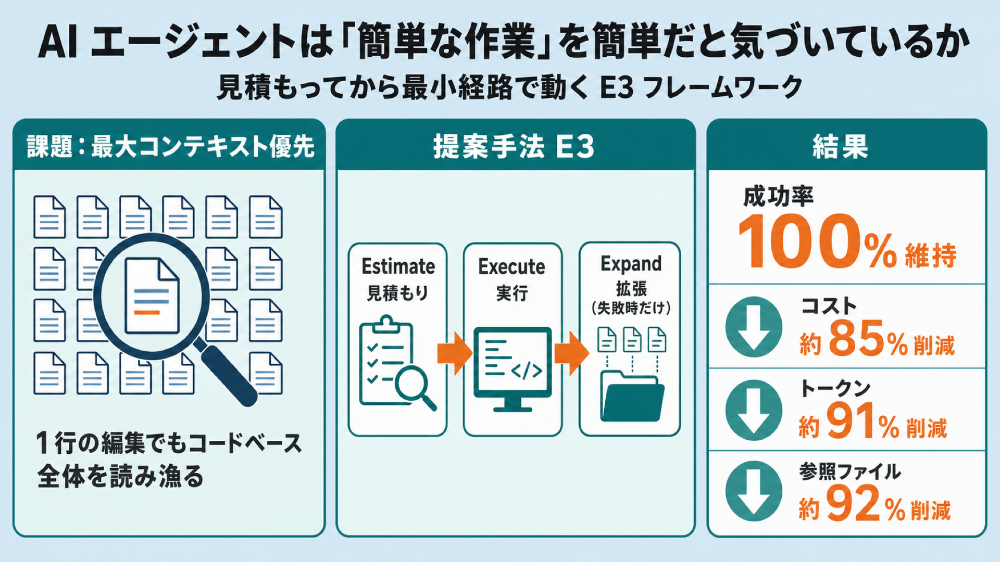

# AI エージェントは『簡単な作業』を簡単だと気づいているか — 見積もってから最小経路で動く E3 フレームワーク

## この論文のひとことまとめ

大規模言語モデル（LLM）を使ったエージェントは、ソフトウェア開発などの多段階作業を自動でこなせるようになりました。しかし著者らは、エージェントが「その作業にどれだけの手間が必要か」を事前に見積もれず、たった 1 行の書き換えでもコードベース全体を読み漁ってしまう問題に注目します。そこで、まず難易度を見積もり（Estimate）、最小限の経路で実行し（Execute）、検証に失敗したときだけ範囲を広げる（Expand）**E3** というフレームワークを提案しました。専用の決定論的ベンチマーク上で、最も強い比較手法と同じ 100% の成功率を保ったまま、コストを約 85%、消費トークンを約 91%、参照ファイル数を約 92% 削減したと報告しています。

## なぜこの研究が重要か

LLM エージェントは、コードの修正やデータ処理といった実務作業を自動化する存在になりつつあります。ただ、多くのエージェントは不確実な状況に直面すると「とりあえず情報を最大限に集めてから動く」保守的な方針を取りがちです。著者らはこれを **maximum-context-first（最大コンテキスト優先）** と呼びます。

この方針には副作用があります。すでに読んだファイルや依存関係を何度も読み直し、「1 行の編集」を「小規模なコードベース監査」に変えてしまうのです。作業は成功しても、時間・トークン・ツール呼び出しといったコストが必要以上に膨らみます。

エージェントを実務に投入するうえで、正しく動くことと同じくらい「無駄なく動くこと」は重要です。この論文は、その無駄がどこから来るのかを定義し、測り、減らす方法を示そうとしています。専門外の技術者にとっても、AI エージェントを実運用するときのコスト感覚に直結する話題です。

## 背景：何が問題だったのか

著者らは、身近な具体例で問題を説明します。ある個人サイトのホームページで、2 つ目のメールアイコンを 1 つ目と同じ書き方に置き換えたい、というだけの作業です。必要なアセット（画像素材）はすでにプロジェクト内にそろっており、実質的には「特定のキーワードを探して置き換える」だけの単純作業です。

ところが、優秀な最新エージェントでも、アイコンライブラリを読み直したり、サイトのディレクトリを走査し直したり、アーキテクチャや依存関係を再確認したりして、数分を費やしうるといいます。

著者らの主張は明快です。ここで足りていないのは知識でも検索能力でもありません。足りないのは、**「この作業はどれだけ難しいか」「本当に必要な情報は何か」「すでに見た情報のうち、今回の変更に関係ないものはどれか」「最短で信頼できる経路は何か」を素早く見極める能力**だ、というのです。

この能力を、論文は **task-aware execution-scope estimation（タスク認識型の実行スコープ見積もり）** と名付け、中核の欠けているピースとして位置づけます。

そのうえで、3 つの研究上の問いを立てます。

- **問い 1**: 作業が「本来要すべき」手間を定式化し、実際の手間がどれだけ乖離するかを測れるか。
- **問い 2**: 行動を起こす前に、必要な作業範囲を安く・信頼できる形で見積もり、最小の経路を選べるか。
- **問い 3**: 最小から始めて失敗したときだけ範囲を広げるやり方は、最初から最大限のコンテキストを集めるやり方より、成功を保ちつつコストを下げられるか。

なお、似た方向性の先行研究として、1 手ごとに「どれだけ考えるか」を選ぶ手法や、「直接推論するかエージェント実行するか」を振り分ける手法があります。著者らはこれらを既存メニューからの **routing（どう考えるか・どのエンジンを使うか）** と整理し、本研究は行動前に **何を理解すべきか（作業範囲そのもの）** を予測する点で異なると位置づけています。

## 提案手法：何をしたのか

### まず「本来の手間」を定義する

著者らは、成功に必要な条件を満たす中で最もコストの低い作業手順を **minimum-sufficient execution（最小十分実行）** と定義します。この最小コストが、そのタスクが「本来要すべき」手間の基準になります。実験環境では、この最適な手順を正解（オラクル）として明示的に構成できるため、基準値を実際に測定できます。

コストは、次の 4 つの要素を重み付けして合計したものとして表します。

- 実際にかかった時間（レイテンシ）
- 推論やコンテキストに使ったトークン数
- ツールの呼び出し回数
- コンテキストに丸ごと読み込んだ「異なるファイル」の数

無関係なファイルの読み込みこそが無駄の典型的な単位であるため、著者らはファイル数の重みを最も大きく設定しています。

そのうえで、無駄の度合いを測る指標として **ACRR（Agent Cognitive Redundancy Ratio、エージェント認知冗長比）** を導入します。これは「最小コストに対して、実際にどれだけ余計にコストを払ったか」の比率です。ACRR が 0 なら無駄ゼロの理想的なエージェント、ACRR が 4 なら必要コストの 5 倍（400% の冗長）を意味します。なお、この指標は成功した実行についてのみ定義されます。安く失敗しただけのエージェントは「効率が良い」とは言えないためです。

著者らは「比率という考え方自体が新しいとは主張しない」と述べ、価値は分母、つまりタスクごとに厳密な最小コストを与えられる点にあるとしています。

### E3：見積もって、実行して、必要なら広げる

提案手法 **E3（Estimate, Execute, Expand）** は、3 つの段階からなります。

- **Estimate（見積もり）**: 作業に着手する前に、指示文の言葉づかいと環境への安価な下調べから、タスクの状態を推定します。推定するのは、難易度・作業範囲（触れるファイルや箇所の数）・リスク・自分の確信度です。たとえば「index.html の中で……を置き換える」のように具体的なファイル名や引用された文字列があれば単一ファイルの編集と判断し、「コードベース全体をリファクタリングする」のような広域の手掛かりがあればリポジトリ規模の変更と判断します。どちらとも言えない場合は、目立つキーワードを 1 回だけ検索して出現箇所の数を数え、局所的か横断的かを見分けます。指示の言葉と実際の構造が食い違うときは確信度を下げ、後で範囲を広げる候補として印を付けておきます。この見積もりは**あえて完璧を目指しません**。局所的に見えて隠れた依存関係を持つタスクは過小に見積もられることがありますが、それは次の Expand 段で取り返す前提です。
- **Execute（実行）**: 見積もった作業範囲に応じて、最小限の経路で実行します。単純なら 1 箇所を特定して編集するだけ、少し広ければ検索結果を再利用して直接該当箇所を編集、さらに広ければ import（読み込み関係）をたどって、検索では見えない間接的な箇所まで到達します。検証にかける労力もリスクに応じて調整します。
- **Expand（拡張）**: 検証に失敗したときだけ、作業範囲を 1 段階だけ広げ、すでに得た検索結果を使い回して計画を立て直します。この拡張は最大回数が決まっており、範囲は段階的にしか広がりません。最悪の場合でも網羅的な探索へ緩やかに近づくだけで、通常のケースでは無駄が出ないように設計されています。

この設計の背後には、電力系統の解析で使われる考え方があります。方程式を数値的に解くとき、良い初期値（解の近くの見積もり）から始めると計算が速く安定して収束します。E3 の「まず良い見積もりから始める」という発想は、この工学的な直感からきています。

## 結果：何が分かったのか

### 決定論的ベンチマーク MSE-Bench での評価

著者らは、モデルの賢さと「無駄の多さ」を切り離して測るために、**MSE-Bench** という決定論的なベンチマークを新たに作りました。これは実際の LLM を呼び出さないオフライン環境で、すべての方針が同じ編集能力を持ちます。そのため、手法間の差は「どれだけコンテキストを集めるか」だけに現れ、完全に再現可能です。

ベンチマークは 121 タスクからなり、局所的な編集（Level 1）、複数箇所にまたがる編集（Level 2）、リポジトリ規模の編集（Level 3）の 3 段階に分かれます。Level 3 には、局所的な言い回しで間接的な依存関係を隠した「欺瞞的（deceptive）」なタスクが 18 個含まれます。先ほどの Gmail アイコンの例も Level 1 に含まれています。

比較対象は次のとおりです。最大コンテキスト優先（MCF）、固定的な手順を繰り返す Fixed ReAct、事前の難易度見積もりを持たないものの適応的に検索する強力なベースライン Adaptive Retrieval（AR）、提案手法 E3、そして最小コストを定義する正解の Oracle です。

121 タスク平均の主要な結果は次のようになりました。

| 手法 | 成功率 | コスト C | 参照ファイル数 | ACRR |
| --- | --- | --- | --- | --- |
| Max-Context-First | 100.0% | 122.85 | 8.46 | 12.90 |
| Fixed ReAct | 66.9% | 17.16 | 0.00 | 1.29 |
| Adaptive Retrieval | 100.0% | 22.08 | 1.99 | 1.21 |
| **E3（提案）** | **100.0%** | **18.55** | **0.66** | **0.55** |
| Oracle（最小） | 100.0% | 11.74 | 0.00 | 0.00 |

E3 は 100% の成功率を保ったまま、最大コンテキスト優先（MCF）と比べてレイテンシを約 59%、トークンを約 91%、参照ファイル数を約 92%、総合コストを約 85% 削減しました（要旨ではそれぞれ 85%・91%・92% と丸めて表記されています）。強力なベースラインの AR と比べても、同じ成功率で総合コストが約 16%、参照ファイル数が約 67% 少なく済んでいます。ただしツール呼び出し回数は AR より約 14% 多く、これは難しいタスクで範囲を広げるためです。

なお、Fixed ReAct は成功率が 66.9% にとどまります。これは間接的な箇所へ到達できず、Level 3 のタスクをすべて失敗するためで、上の数値は解けた 81 タスクのみで計算されています。

### 「簡単なタスクほど無駄が大きい」

興味深い発見として、最大コンテキスト優先の無駄（ACRR）は、最も簡単な Level 1 で最大の 22.06、Level 2 で 11.00、Level 3 で 5.42 でした。つまり、簡単な作業ほど相対的な無駄が大きくなります。一方 E3 は全段階でほぼ平坦に低く抑えられています。

ただし著者らは、この傾向が「部分的には機械的なもの」だと正直に注記しています。最大コンテキスト優先は常にリポジトリ全体を読むため実コストがほぼ一定で、分母である最小コストが段階とともに増えるので、比率は分母が最小の Level 1 で必然的に最大になる、という説明です。したがってこれは「発見された法則」ではなく、「固定オーバーヘッド本能の記述的なサイン」として提示されています。

なお Level 3 では、AR（0.42）のほうが E3（0.73）より無駄が少ないという結果も出ています。E3 は楽観的に小さく見積もって始めるため、欺瞞的なタスクでは余分な拡張のコストを払うからです。E3 の優位は Level 1・Level 2 に集中し、そこでは E3 は AR より 45%・43% 安く済んでいます。

### 各段階の役割を確かめる（アブレーション）

E3 の 2 つの段階がそれぞれ何を担っているかを、片方を外して確かめています。

- **Expand を外す**と、成功率が 100% から 85.1% に低下します。18 個の欺瞞的な Level 3 タスクをすべて落とすためです。つまり拡張は、楽観的な見積もりを安全にするセーフティネットの役割を果たしています。
- **Estimate を外す**と、成功率は 100% を保つものの、コストが約 20% 増え、Level 3 では約 36% 増えます。つまり見積もりはコスト削減に効いています。

見積もりと拡張は、それぞれ「コスト削減」と「信頼性の保護」という相補的な役割を持つことが分かります。

### 頑健性の検証

著者らは結果が偶然に頼っていないかも確認しています。コストの重み付けを 4000 通り、しかも E3 に不利な範囲から抽出しても、E3 は 99.8% の重み付けで「最も安い 100% 成功手法」でした。ファイル読み込みのペナルティを完全に外しても、AR より 96.7%、MCF より 100% の抽選で安く済みました。

また、見積もり器が指示文のキーワードに過度に依存していないかを調べるため、指示の言い回しをキーワードと重ならない別表現にすべて差し替える実験も行いました。すると見積もりの正確な難易度一致精度は 85.1% から 66.9% へ低下しましたが、**E3 の成功率は 100% を維持**し、平均コストの増加は 8.7% にとどまりました。著者らは、効率の良さは見積もり器のキーワードそのものではなく、「見積もりと拡張」という仕組みの性質から来ていると主張しています。

### 実モデルでの検証（LLM-Case）

シミュレータが人工的すぎるという反論に備え、著者らは実際の LLM が本物のツールを呼び出す検証環境 **LLM-Case** も用意しました。3 つの方針（全部読む・ReAct・E3）を、システムプロンプトの違いだけで同じモデル（gpt-4o）に与え、実際に `pytest` を走らせて成功を判定します。

5 つのタスクでの結果では、E3 は平均の実トークンが最も少なく（約 8.05 万、全部読む方針より 18%・ReAct より 4% 少ない）、平均のレイテンシも最速でした。成功率は全部読む方針が 80%、ReAct が 100%、E3 が 93% でした。

ここで重要な観察もあります。最新のフロンティアモデルは、「まず全部読む」というプロンプトを与えても実際には 1〜4 ファイルしか読まず、シミュレータの最大コンテキスト優先が想定する 8 ファイル超の暴走は再現しませんでした。無駄は実在するものの、有界（ある範囲に収まる）だったのです。

著者らはこの結果を踏まえ、E3 の利点を「常に劇的に安い」というシミュレーションの主張から、「全体で最も無駄がなく、隠れた結合が増えても自らを失敗に追い込まない方針」へと控えめに位置づけ直しています。そして、これは 3 回試行・単一モデルの事例研究（case study）であり、統計的に十分な規模のベンチマークではないと明記しています。

## 意義と限界

この研究は、エージェントの手間をタスクの実態に合わせて検証するという考え方を **engineering-grounded AI（EGAI、エンジニアリング接地 AI）** の一側面として位置づけ、フレームワーク（E3）とベンチマーク（MSE-Bench）を公開しています。

一方で、著者ら自身が挙げる限界も率直です。

- **最大の限界**は、主実験が能力制御されたシミュレータ上の方針を評価しており、特定の実 LLM エージェントそのものではない点です（主実験のどこでも言語モデルを呼び出しません）。厳密な正解を構成するための意図的な設計ですが、数値は「コストモデルの性質」を表すものです。この点には LLM-Case で正面から対処しています。
- シミュレータでは、実モデルの**編集の正確さ**が作業範囲とどう関係するかは分かりません。広くコンテキストを取らないと防げない誤りがある場合、最適な始点が変わる可能性があります。
- 見積もり器は透明な語彙ルールに基づいています。学習型や LLM ベースの見積もり器は、よりよく汎化する一方、別の形で誤る可能性があります。
- MSE-Bench が捉える隠れた複雑さは「エイリアスや再エクスポート」という 1 種類であり、動的なディスパッチや設定の結合など、すべての複雑さを網羅するものではありません。あくまで既存の能力ベンチマークを置き換えるものではなく、それを補完する制御された環境だとしています。

今後は、LLM-Case を複数モデルや現実的なタスクへ拡大すること、学習型の見積もり器を同じインタフェースの裏に置くことなどが課題として挙げられています。

## まとめ

この論文は「AI エージェントは、タスクが簡単なときにそれを簡単だと知っているか」という問いを立て、多くのエージェントが簡単な作業ほど相対的に大きな無駄を出すことを、能力を制御した環境で示しました。そのうえで、まず見積もり、最小経路で実行し、失敗時だけ範囲を広げる E3 を提案し、成功率を保ったまま大幅なコスト削減を達成できることを示しています。

## 用語集

- **task-aware execution-scope estimation（タスク認識型の実行スコープ見積もり）**: 行動する前に、タスクの難易度・本当に必要な情報・最短で信頼できる経路を見極める能力。本論文が「欠けている中核能力」と位置づける概念。
- **maximum-context-first（最大コンテキスト優先）**: できるだけ多くのコンテキストを集めてから動く保守的な方針。簡単なタスクで大きな無駄を生む。
- **minimum-sufficient execution（最小十分実行）**: 成功条件を満たす中で最もコストの低い作業手順。タスクが「本来要すべき」手間の基準になる。
- **ACRR（Agent Cognitive Redundancy Ratio、エージェント認知冗長比）**: 最小コストに対して実際にどれだけ余計にコストを払ったかを表す比率。0 が無駄ゼロ、4 で必要コストの 5 倍。
- **E3（Estimate, Execute, Expand）**: 見積もり・実行・拡張の 3 段階からなる、タスク認識型の実行フレームワーク。
- **MSE-Bench**: 単一ファイル・横断・リポジトリ規模の 121 タスクからなる決定論的なオフラインベンチマーク。各タスクに最小コストの正解が付き、無駄を厳密に測れる。
- **LLM-Case**: 実際の LLM・実ツール・実 pytest 採点で同じ問いを再現する、シミュレータの補完となる検証環境。
- **engineering-grounded AI（EGAI、エンジニアリング接地 AI）**: エージェントの推論と行動を、制約のない探索ではなくタスクの物理的・手続き的な実態に接地させる考え方。

## 原論文

- Do AI Agents Know When a Task Is Simple? Toward Complexity-Aware Reasoning and Execution（https://arxiv.org/abs/2607.13034）
