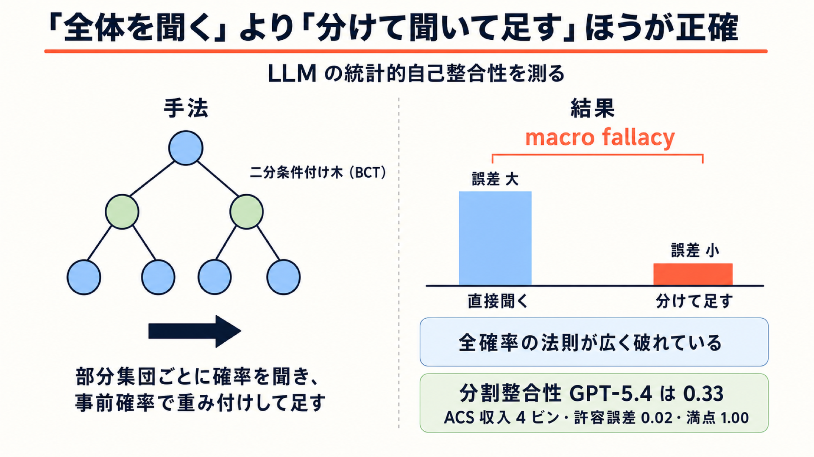

# 「全体を聞く」より「分けて聞いて足す」ほうが正確 — LLM の統計的自己整合性を測る

## この論文のひとことまとめ

大規模言語モデル（LLM）に「アメリカ人の年収が 5 万ドルを超える確率は？」と直接聞くのと、「31〜68 歳で就業中の人なら？」といった細かい部分集団ごとに聞いてから確率の重み付き和で足し上げるのとでは、答えが食い違います。本論文は、この食い違いを「二分条件付け木（binary conditioning tree, BCT）」という枠組みで系統的に測定しました。その結果、最先端モデルでも確率論の基本法則（全確率の法則）が広く破れていること、そして分けて聞いて足したほうが人間の参照データに近いという傾向（著者らが macro fallacy と呼ぶ現象）を報告しています。この整合性チェックは正解データを必要とせず、モデルの総合的な能力指標とも相関が見られませんでした。

## なぜこの研究が重要か

いま LLM は、単に文章を書く道具としてだけでなく、「ある属性を持つ人々はどう答えるか」を推定する道具としても使われています。合成サーベイの生成、ペルソナを与えた意見シミュレーション、条件付きの予測タスクなどがその例です。

こうした使い方の裏には、ひとつの暗黙の前提があります。プロンプトが文脈（条件）を指定し、モデルの出力はそれに対応する条件付き分布の推定値とみなせる、という前提です。論文ではこれを条件付き推論（conditional inference）と呼んでいます。

この前提が本当に成り立つなら、モデルの出力は確率の公理に従うはずです。ところが本論文が示すのは、それが成り立っていないという事実です。同じ集団について統計的に等価な 2 通りの聞き方をすると、両立しない答えが返ってきます。つまり、プロンプトをどの粒度で書くか、条件をどの順で並べるかという、本来は答えに影響しないはずの選択が結果を左右してしまうのです。

## 背景：何が問題だったのか

LLM の「人間らしさ」を測る指標として、これまで広く使われてきたのは分布的アラインメント（distributional alignment）でした。モデルの出力分布が人間の参照統計とどれだけ一致するかを見る指標です。

しかしこの指標には、外部の正解データ（サーベイ結果など）が必要という制約があります。参照データが存在しない領域では使えません。また、集団レベルでうまく一致していても、その内訳である部分集団の推定が正確とは限りません。

先行研究では、条件付き推論という解釈そのものへの疑義、素朴なシミュレーションの信頼性への懸念、プロンプトの書き方に対する感度の高さなどが個別に指摘されてきました。ただし、「モデルの出力が確率の公理を満たすか」を系統的に検証する枠組みは十分に整備されていませんでした。

本論文はここに、分割（partition）にもとづく評価の枠組みを持ち込みます。集団をどう分割しても、全確率の法則にもとづく再構成は同じ答えになるはずだ——この恒等式を検査項目に変えることで、正解データのいらない（reference-free な）自己整合性チェックが作れる、という着想です。

## 提案手法：何をしたのか

### 二分条件付け木（BCT）で集団を階層的に切り分ける

まず、対象となる集団を再帰的に二分していく木構造を用意します。これが二分条件付け木（BCT）です。

一般的な決定木と違うのは、**同じ層のノードにはすべて同じ分割関数を適用する**点です。第 1 層では全ノードを年齢で切り、第 2 層では全ノードを就業状態で切る、といった具合です。こうすると、木の各層がそのまま「集団の妥当な分割」（互いに素で、全体を覆う）になります。

たとえば米国の成人集団を根に置き、以下のように切っていきます。

ここで使う属性は、米国の大規模世帯調査 American Community Survey（ACS、アメリカ・コミュニティ調査）の変数です。以下の括弧内は ACS での変数名にあたります。

- 第 1 層: 年齢が 31〜68 歳か否か（変数 AGEP。31〜68 歳を "working age" とする）
- 第 2 層: 就業中または自営業か否か（就業形態を表す変数 COW）
- 第 3 層: 週労働時間が 40 時間未満か以上か（変数 WKHP）
- 第 4 層: 職業を 2 群に分ける（職業コードの変数 OCCP）

### 部分集団を言葉にしてモデルに問う

各ノードは、根からの分割条件の系列で一意に定まります。その系列を自然言語に直して、プロンプトの文脈として与えます。論文では ACS 実験に folktexts というツールを使っています。

実際の文脈は、たとえば次のように積み上がります（可読性のため短縮した表記）。

- C0: "A person living in the U.S."
- C1: "A person between 31 and 68 years old."
- C2: "A person who is employed or self-employed."

C0 だけを与える場合を **direct prompting**（直接プロンプティング）と呼びます。

そのうえで、年収 Y に対する閾値事象（例: Y > 50000 ドル）の確率をモデルに推定させます。質問文はたとえば "What is the probability that the income of this person is above 50000 USD?" という形です。

さらに各層について、その分割に対する事前確率（priors、たとえば「米国人のうち 31〜68 歳は何割か」）もモデルに問い、生の出力を再正規化して 50 回分を平均します。

### 全確率の法則で再構成する

条件付き推定と事前確率が揃えば、全確率の法則にもとづいて集団レベルの推定を再構成できます。層 l の各部分集団 S について、事前確率で重み付けした条件付き推定を足し合わせるだけです。

条件付き推論の解釈が正しければ、この再構成値は**どの層で計算しても同じ**になり、しかも直接プロンプティング（l = 0）の答えとも一致するはずです。この一致が崩れる度合いが、本論文の測定対象になります。

### 2 種類の自己整合性チェック

論文は、正解データを一切使わない検査項目を 2 つ定義します。

- **分割整合性（split consistency）**: ある条件付け事象 S に対する直接推定と、S をさらに 1 つの属性で二分して事前重み付き集約した値が、許容誤差 ε 以内で一致するか。確率的な合成が正しく行えているかの検査です。
- **順序整合性（order consistency）**: 同じ部分集団を、条件の言語化順序を変えて提示したときに推定が変わらないか。"young and employed" と "employed and young" は同じ集団を指すのですから、答えは変わらないはずです。

いずれも、「全チェック項目のうち何割を満たしたか」というスコア（0〜1）として集計します。順序整合性は全順序を試すのが非現実的なため、属性 2 つの事象に限定したペアワイズのチェックに帰着させています。

なお論文は、分割整合性が層をまたいで積み上がる場合の誤差上界（層数 l に対して l × ε）も示していますが、実験ではこの最悪ケース上界よりかなり緩やかな増加にとどまりました。

ここでいう「一致するか」を測るには、2 つの分布のズレを数値化する必要があります。論文は答えの種類によって物差しを使い分けています。収入の階級のように大小の順序があるカテゴリ（順序付きカテゴリ）には正規化 Wasserstein-1 距離を、職業の種類のように順序のないカテゴリ（名義カテゴリ）には全変動距離（total variation distance、2 つの分布のズレの大きさを測る代表的な指標）を用います。選択肢数の異なる設問間でも許容誤差 ε を比較できるようにするための工夫です。

### Micro-to-macro プロンプティング

もうひとつ、軽量な介入も提案されています。外部から分割を与えず、単一のクエリ内で「まず関連する部分集団について考えてから、集団レベルの推定を返しなさい」と指示する方法です。どう分割するかはモデルが暗黙に選びます。

## 結果：何が分かったのか

### 実験のセットアップ

主データセットは 2024 年の American Community Survey (ACS) 1-Year PUMS です。米国の 380 万人分の回答を含み、厳密な標本設計と母集団ウェイトを備えることから、著者らは「米国人口の最良の代表の一つ」として正解参照に用いています。

これに加えて、World Values Survey（WVS、カナダとインドネシア）と、2 種類の合成予測タスク（テニスの試合予測、ファンタジー戦闘の勝敗予測）でも評価しています。誤差棒は 1000 サンプルのブートストラップによる 90% 信頼区間です。

### macro fallacy: 分けて聞いて足したほうが正確

最も目を引く観察が macro fallacy です。集団レベルの確率をモデルに直接聞くより、より細かい条件付き推定と事前確率から全確率の法則で再構成したほうが、体系的に正解に近くなります。この効果は、対象とする量・モデル・木の層をまたいで頑健に観測されました。

重要なのは、**この利得がプロンプトの仕方だけから生じている**ことです。部分集団の事前確率も条件付き推定も、どちらも同じ LLM から引き出しており、外部知識は一切注入していません。

ただし、平均的な集約利得は木の深さに対して凹型のトレンドを描きます。ある程度までは深くするほど改善しますが、群の記述が複雑になりすぎると低下に転じます。

### なぜ深くしすぎると悪化するのか

論文は誤差源を分解して説明しています。

- **条件付き推定側**: ノード単位のアラインメント誤差は、根から最初の 2 レベルで大きく改善します。第 3 レベルでも事前重み付きの誤差は根より低いままですが、改善は部分集団ごとに一様ではありません。事前確率がほぼゼロ（＝該当する人がほとんどいない）の 2 ノードで大きな誤差が出ています（もっとも、加重平均への寄与は小さいので実害は限定的です）。
- **事前確率側**: LLM が推定した事前確率と、サーベイにもとづく真の事前確率との全変動距離（分布のズレの大きさ）は、木を深く精緻化するほど増大します。これはモデル横断で観測されました。

つまり集約は、「条件付けが具体的になって推定が正確になる」ことと、「母集団の重み付けが難しくなる」ことのトレードオフを伴うわけです。なお、事前確率を正解値に置き換えたオラクル条件でも結果はほぼ同様で、改善は木の深さに対して単調ではありませんでした。

分散の観点からも同じ構図が見えます。木を深くすると期待群内分散は減少し、群間分散は増加します。細分化は「未解決の群内の異質性」を「部分集団間の明示的な差異」へ移し替えている、というわけです。

具体的な失敗例も報告されています。ACS の収入タスクでは、直接プロンプティングは若年層を過小に重み付けしているように見え、その結果として収入を過大推定していました。この部分群を明示的に指定すると、モデルは正確な推定を返します。知識は持っているのに、直接聞くと引き出せていないのです。

### 自己整合性スコアは総じて低い

許容誤差 ε = 0.02、属性集合を「年齢・就業状態」としたときの ACS でのスコアは次のとおりです（1.0 が満点）。

**(a) 収入（4 ビン）**

| モデル | split | order |
|---|---|---|
| GPT-5.4 | 0.33 | 1.00 |
| Sonnet 4.6 | 0.00 | 0.25 |
| Grok 4.3 | 0.00 | 0.50 |
| Qwen3.6 Plus | 0.17 | 0.50 |

**(b) 通勤時間（4 ビン）**

| モデル | split | order |
|---|---|---|
| GPT-5.4 | 0.17 | 0.50 |
| Sonnet 4.6 | 0.17 | 0.50 |
| Grok 4.3 | 0.17 | 0.50 |
| Qwen3.6 Plus | 0.33 | 0.25 |

注目すべきは、集団構造を固定したまま予測対象だけを収入から通勤時間に変えると、スコアが大きく変わる点です。自己整合性はモデルや木構造だけの性質ではなく、予測タスクによっても変わります。

WVS の大域的意見予測（深さ 2 の BCT、5 問）でも、平均 split consistency は GPT-5.4 が 0.55、Sonnet 4.6 が 0.70、Grok 4.1 Fast が 0.48、DeepSeek V-3.2 が 0.32、Qwen3.6 Plus が 0.50 など、どのモデルも質問横断で一様に整合的ではありませんでした。

合成タスクでも同様です。テニス予測では「どのモデルも split consistency チェックの半分を超えて満たさない」という結果でした。ファンタジー戦闘タスクのほうは 0.00 から 1.00 まで大きくばらついています。なお合成タスクには外部の正解が存在しないため分布的アラインメントは測れませんが、自己整合性は原理的に評価できます。これは提案手法の適用範囲の広さを示す例でもあります。

合成予測タスクでは、順序整合性のスコアが一貫して分割整合性を上回りました。モデル横断の比較でも、順序整合性のほうが概して高い傾向が見られます。ただし通勤時間タスクの Qwen3.6 Plus のように、分割整合性のほうが高くなる例もあります。全体としては、モデルは確率的な合成よりも条件の並べ替えに対してのほうが頑健だ、と言えそうです。

### モデルの総合能力とは相関しない

GPT / Qwen / Gemini / Claude 系の計 24 モデルを、外部の総合能力指標である Artificial Analysis Intelligence (AAI) Index と並べて比較した結果、著者らは「モデルファミリ内で AAI Index が大幅に上がっても、split・order のいずれの整合性も体系的には改善しない」と報告しています。整合性スコアが標準ベンチマーク指標と相関するという証拠も見つかりませんでした。

統計的自己整合性は、強力な総合性能とともに自然に現れるものではなく、現行モデルでは飽和にはほど遠い、というのが著者らの結論です。

### Micro-to-macro プロンプティングは効くが不安定

単一クエリ内で部分集団を考えさせる介入は、ACS の収入タスクで多くの場合に誤差を減らしました。ただし効果は明示的な木ベースの集約よりモデル依存的で、体系性に欠けます。各国の意見調査をまとめたベンチマークで、上記 WVS のもとにもなっている GlobalOpinionQA の二値回答質問でも同様の傾向で、モデルによっては誤差が増えました。

この結果から著者らは、集約による利得はテスト時の計算量が増えたことだけでは説明できないと論じています。理由は 2 つで、(i) micro-to-macro は単一クエリで利得の一部を回収できること、(ii) 集約利得は木の深さに対して非単調であり、深い分割はモデル呼び出しを増やすのに最終的には集約が悪化すること、です。

### プロンプト形式の影響

一人称でロールプレイさせるペルソナプロンプティング（persona prompting）と、三人称の属性リストで記述する社会人口学的プロンプティング（sociodemographic prompting）を比較したところ、どちらでも全確率の法則で再構成した推定のほうが多くの閾値で正解に近くなりました。ただしペルソナプロンプティングは真の確率を体系的に過大推定する傾向があったため、本論文では一貫して後者を採用しています。

## 意義と限界

### 意義

この研究が突きつけるのは、集団レベルでうまくアラインしていても、その内訳の推定が正確とは限らないという事実です。結果として下流の推定は、プロンプトの粒度・分解の仕方・条件の順序という、本来は答えに影響しないはずの選択に依存してしまいます。

とくに文脈内パーソナライゼーション（in-context personalization、プロンプトで対象者の属性を与えて出力をその人向けに寄せる使い方）、合成サーベイ生成、予測といった応用は、モデル出力を文脈依存の条件付き確率とみなす前提の上に立っています。学習された事後信念からのサンプルとみなす手法群も同じ前提に依存します。著者らは、自己整合性が明示的に検証・強制されるまで、条件付き推論観に依拠する手法は部分的にしか正当化されない、と述べています。

実用面では、提案する集約恒等式が外部の教師信号を必要としない点が効いてきます。分布的アラインメントが測れない場面でも、検証可能な制約を生成できるからです。

さらに著者らは、macro fallacy が「自己整合性の破れ方には体系的な向きがある」ことを示している、と指摘します。整合性チェックはズレの有無しか見ません。細かい推定を集団レベルの推定に合わせても、その逆でも、スコアの上では同じです。しかし macro fallacy によって「細かく分けた推定のほうが人間の統計に近い」という向きが分かっています。ならば、より正確な下位レベルの推定のほうを基準として固定し、そこから集団レベルの推定を補正していけばよい——こうして細かい情報を上位へ伝えることで、集団レベルの推定を改善できる可能性がある、というわけです。

### 限界

論文自身が挙げる限界は以下のとおりです。

- 分布的アラインメントと macro fallacy の実証は主に ACS データに依拠しており、特定の応用ドメインしかカバーしていない。
- 得られるアラインメント誤差は、言語化された確率抽出、事後正規化、選定した人口統計的分割といった設計上の選択に依存する。
- 自己整合性は忠実な条件付き推論のための**必要条件にすぎない**。モデルが内部的に整合的でありながら、目標分布とはずれていることはありうる。
- 合成例は整合性の視点がサーベイ評価に縛られないことを示すが、それ自体では実世界の予測・意思決定における正確性を立証しない。

今後の課題としては、より広いドメイン・より豊かな条件付け構造・別の抽出手法での評価に加えて、分布的アラインメントと統計的自己整合性を直接最適化する介入の開発が挙げられています。

## まとめ

LLM に集団の統計量を尋ねるとき、「全体をまとめて聞く」より「部分集団に分けて聞き、事前確率で重み付けして足す」ほうが体系的に正確になる——これが本論文の報告する macro fallacy です。その背後には、最先端モデルでも全確率の法則が広く破れているという事実があります。著者らはこの破れを正解データなしで測る 2 種類のチェック（分割整合性・順序整合性）を定義し、統計的自己整合性が総合的なモデル能力とは相関せず、まだ飽和にほど遠い品質軸であることを示しました。

## 用語集

- **条件付き推論（conditional inference）**: プロンプトが文脈を指定し、モデル出力を対応する条件付き分布からの抽出、あるいはその推定値とみなす解釈。
- **全確率の法則（law of total probability）**: 集団を互いに素な部分集団に分割したとき、全体の確率が各部分集団の確率を事前確率で重み付けした和に一致するという恒等式。本論文の中核。
- **二分条件付け木（binary conditioning tree, BCT）**: ベース集団を再帰的に細分化する二分木。層ごとに 1 つの分割関数を共有する点が一般の決定木と異なる。
- **macro fallacy**: 直接の集団レベル推定が、構成要素の推定を引き出して明示的に再結合する方式より信頼性が低くなる傾向。
- **分割整合性 / 順序整合性（split / order consistency）**: 前者は親ノードの直接推定と子ノードの事前重み付き集約の一致（確率的合成の検査）、後者は条件制約の提示順序に対する推定の不変性。
- **参照フリー（reference-free）**: 外部の正解ラベルではなく、同一モデルが出した他の推定とだけ比較して内部整合性を評価すること。
- **分布的アラインメント（distributional alignment）**: LLM 出力の分布が人間の参照統計とどれだけ一致するかの指標。自己整合性とは相補的な診断とされる。
- **ペルソナプロンプティング / 社会人口学的プロンプティング**: 前者はモデルに一人称で対象人物を演じさせる方式、後者は属性の構造化リストとして三人称で対象を記述する方式。本論文は後者を採用。
- **正規化 Wasserstein-1 距離**: 順序付き離散台上の Wasserstein-1 距離を選択肢数 −1 で割って [0,1] に正規化した距離。収入の階級のように大小の順序があるカテゴリに用いる。選択肢数の異なる設問間で許容誤差を比較可能にする。
- **全変動距離（total variation distance）**: 2 つの確率分布のズレの大きさを測る指標。本論文では職業の種類のように順序のないカテゴリ（名義カテゴリ）の比較に用いる。
- **文脈内パーソナライゼーション（in-context personalization）**: モデルのパラメータを更新せず、プロンプトに対象者の属性や文脈を書き込むことで、出力をその人物向けに調整する使い方。本論文が前提を問い直す応用のひとつ。
- **American Community Survey（ACS）**: 米国の大規模世帯調査。本論文は 2024 年版の個票データを正解参照に用いる。AGEP（年齢）、COW（就業形態）、WKHP（週労働時間）、OCCP（職業コード）などの変数を持つ。

## 原論文

- Partition, Prompt, Aggregate: Statistical Self-Consistency in Language Models（https://arxiv.org/abs/2607.15277）
- コード: https://github.com/patrikwolf/statistical_self_consistency
