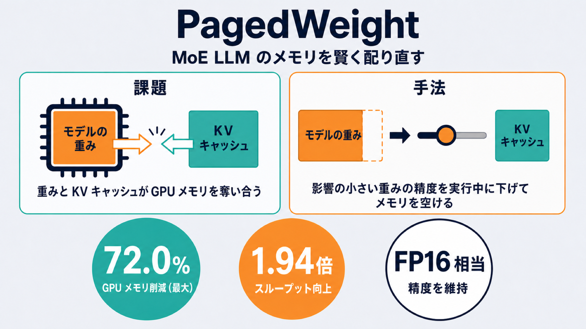

# 重みの精度を「使いながら」変える：MoE LLM のメモリを賢く配り直す PagedWeight

## この論文のひとことまとめ

大規模言語モデル（LLM）を実際に動かすとき、GPU のメモリは「モデルの重み」と「会話の文脈を覚えておくキャッシュ」で奪い合いになります。この論文が提案する「PagedWeight」は、文脈が長くなってキャッシュが膨らんできたら、影響の小さいところから重みの精度（ビット幅）を実行中に下げてメモリを空ける、という管理手法です。とくにメモリを食いやすい MoE（Mixture-of-Experts）型の LLM を対象に、著者らは FP16 相当の精度を保ったまま最大 72.0% の GPU メモリ削減と 1.94 倍のスループット向上を報告しています。

## なぜこの研究が重要か

いま話題の LLM を自分たちのサービスで動かそうとすると、真っ先にぶつかるのが GPU メモリの壁です。メモリに載せなければならないものは大きく 2 つあります。1 つはモデルの重みそのもの、もう 1 つは「KV キャッシュ（KV cache）」と呼ばれる、文章を生成しながら溜めていく途中経過のキャッシュです。

この 2 つは同じ GPU メモリを取り合う関係にあります。会話やドキュメントが長くなるほど KV キャッシュは増え続け、重みのために使える余地を圧迫します。しかも MoE 型のモデルは、賢さを保ちながら計算を減らせる代わりに総パラメータ数が非常に大きく、重みだけで GPU メモリの 6 割超を占めることもあると論文は指摘します。この「重みと KV キャッシュの綱引き」をうまくさばけるかどうかが、LLM を安く安定して動かせるかを左右します。

## 背景：何が問題だったのか

これまでも、綱引きの片側である KV キャッシュを軽くする工夫はありました。vLLM の PagedAttention（KV キャッシュを「ページ」という小さなブロックに分けて無駄なく管理する手法）や、KV キャッシュそのものを圧縮する手法です。しかし論文によれば、もう一方の当事者である MoE の重みには、ほとんど手が打たれてきませんでした。

重みを軽くする代表的な方法は「量子化（quantization）」、つまり数値を粗い精度で表してデータ量を減らす技術です。ところが従来の量子化はほとんどが**静的（static）**、すなわち実行前に一度だけ精度を決めてしまい、その後は変えられません。実行中に精度を変えられる先行研究もありますが、それを「メモリを配り直す」目的には使っていませんでした。

そこで本当に解きたい問題が浮かび上がります。KV キャッシュがじわじわ増えていくなかで、生成を止めず、品質もできるだけ落とさずに、重要度の低い重みからメモリを解放できないか、という点です。

## 提案手法：何をしたのか

PagedWeight の中核となる発想は、「重みも KV キャッシュと同じようにページとして扱い、実行中にそのビット幅を下げたり戻したりする」ことです。KV キャッシュをページで管理する PagedAttention の考え方を、今度は重み側に持ち込んだ形で、名前もそこから来ています。

これを実現するために、著者らは 3 つの設計目標を掲げています。

- **動的な KV／重みトレードオフ（dynamic KV/weight tradeoff）**：KV キャッシュがメモリを必要としたら、そのぶん重みが占めるメモリを解放する。
- **品質認識型のエキスパート選択（quality-aware expert selection）**：精度を下げても出力品質への悪影響が最も小さいと予測される箇所を選んで下げる。
- **非同期実行（asynchronous execution）**：ページの入れ替え作業を通常の生成処理と重ねて行い、余計な待ち時間を生まない。

技術的な土台になっているのが「Any-Precision LLM（APL）」という手法です。これは、複数のビット幅を層状に重ねた「ビットプレーン（bit-plane）」という形式で重みを持ち、実行中に量子化レベルを切り替えられるようにするものです。PagedWeight は、この APL のビットプレーンと、量子化した値を復元するための対応表（lookup table、LUT）をひとまとまりの「重みページ」とみなし、GPU 上に置いたままビット幅を上げ下げします。

量子化を切り替える単位は、エキスパート丸ごとではなく、エキスパートを構成する「linear-block」というより細かい部品です（種類は gate_up と down の 2 つ）。それぞれの linear-block について、対応できるビット幅の集合、いま推論に使っている精度（committed bitwidth）、planner が下げたい目標精度（desired bitwidth）、各ビットプレーンが GPU 上にあるか CPU 側にあるか転送中か、といった状態を「weight page table」という表で管理します。

どこの精度をどこまで下げるかを決めるのが「品質認識型ランタイムプランナー（quality-aware runtime planner）」です。プランナーは、精度を下げたときの品質への悪影響（ダメージ）を次の 3 つの情報を組み合わせて見積もります。

- **オフラインの全体感度（offline global sensitivity）**：モデル全体で見て、どの部分をどのビット幅まで下げるとどれだけ品質が落ちやすいか、を Hessian（誤差の曲がり具合を表す量）に基づく感度スコアであらかじめ計算しておく。
- **オンラインのルーティング統計（online routing statistics）**：MoE ではどのエキスパートが選ばれるかに大きな偏りがあります。よく選ばれるエキスパートほど重要とみなし、生成中に選択頻度を集計して、頻繁に使われる（ホットな）エキスパートには精度を守る保護をかける。
- **実行時のプロンプト残差（runtime prompt residual）**：量子化の影響は入力によっても変わるため、そのときのプロンプトの特徴から、事前見積もりとのズレを補正する。

そのうえで、KV キャッシュの圧力を「あと何バイト空けたいか」という目標に置き換え、「解放できるバイトあたりのダメージが小さい」順に候補を並べ、目標を満たすまで安いものから貪欲に選んでいきます。実際のページの移動は「非同期ページ移動（asynchronous page movement）」として生成処理と重ねて行われ、安全なタイミングでのみ現在の精度（committed bitwidth）を更新します。さらに、ルーティング・エキスパートの計算・出力の集計までを 1 つにまとめた専用の CUDA カーネルにより、linear-block ごとに異なるビット幅を扱えるようにしています。

## 結果：何が分かったのか

評価には規模の異なる 3 つの MoE モデルが使われました。Qwen1.5-MoE-A2.7B（総パラメータ 14.3B）、Mixtral-8×7B-v0.1（46.7B）、Gemma-4-26B-A4B（25.2B）です。比較相手（ベースライン）は、精度を落とさない FP16、均一に量子化する Any-Precision LLM、静的な混合精度の MxMoE、動的な層別混合精度の DP-LLM です。サービング基盤には vLLM を用いています。

論文が掲げる代表的な数値は次のとおりです。

- FP16 と同等の精度を保ったまま、**最大 72.0% の GPU メモリ削減**と**1.94 倍のスループット向上**を達成。
- 同じくらいのメモリ予算で比べると、他の量子化手法に対して品質を**最大 39.3% 改善**し、そのときのスループットの低下は**最大でも 4.1%**に収まった。

品質とメモリのトレードオフを見た実験では、3 モデル・4 タスクのすべてで、PagedWeight が最も少ないメモリ消費で高い品質に到達したと報告されています。FP16 に迫る品質に届くメモリ量は、Qwen1.5-MoE-A2.7B で 16GB、Mixtral-8×7B で 35GB、Gemma-4-26B-A4B で 22GB でした。

長い文脈を扱うタスク（LongBench）では、メモリが厳しい条件での差が目立ちます。Qwen1.5-MoE-A2.7B の場合、FP16 は 35.25GB を使って平均 17.0% のスコアでしたが、PagedWeight は 9.86GB という約 4 分の 1 のメモリで同じ平均 17.0% に到達しました。同じくらいのメモリを使う均一量子化（APL の 3bit、9.40GB）は平均 12.2% にとどまります。とくに厳しいメモリ下では、Passage Retrieval のスコアが 10.5% から 17.5% へ、NarrativeQA が 4.9% から 10.0% へと改善したとされています。

スループットについては、Qwen1.5-MoE-A2.7B で均一量子化のベースラインと同等以下のメモリを使いつつ、性能を維持できたと報告されています。スループットの低下は、バッチサイズ 1 のときで最大 3.3%、バッチサイズ 4 のときで最大 4.1% でした。

どの工夫が効いているかを調べた切り分け実験（アブレーション）では、完全な PagedWeight が最も良い perplexity（値が低いほど良い言語モデルの指標）を示しました。ルーティング統計を外す、プロンプト残差の補正を外すと少しずつ悪化し、ページ移動を外すと静的な混合精度に、全体感度を外すと均一量子化に退化して最も悪くなりました。オンラインで計測する 2 つの情報（ルーティング統計とプロンプト残差）が、いずれも品質に寄与していることが確認できたとしています。

## 意義と限界

この研究の位置づけは、KV キャッシュ側を軽くする既存手法（PagedAttention など）と**補い合う**関係にある点です。PagedWeight は重み側に働きかけて、増えていく KV キャッシュのための空きを作ります。また、エキスパートを丸ごと切り替える先行研究に比べ、エキスパートの内部部品（linear-block）というより細かい単位で精度を制御でき、しかもその制御を KV キャッシュからのリアルタイムなメモリ圧力によって導く点が新しいとしています。

一方で限界も述べられています。本研究は、特定の量子化フォーマットと感度指標のもとでの結果を示したものです。今後の課題として、互換性のある別の量子化フォーマットへの拡張や、プロンプト単位でのエキスパート感度の推定を補う手法の探求を挙げています。

## まとめ

PagedWeight は、MoE 型 LLM を動かす際の「重みと KV キャッシュのメモリ争い」を、重みの精度を実行中に賢く上げ下げすることでさばく管理手法です。品質への影響が小さい箇所を見極めてメモリを解放するため、著者らの評価では FP16 相当の品質を保ちながら大幅なメモリ削減とスループット維持を両立できたと報告されています。

## 用語集

- **MoE（Mixture-of-Experts）**：複数の「エキスパート」ネットワークとルータからなる層。ルータが各トークンに上位 K 個のエキスパートを選び、一部だけを使うことで計算量を抑えつつ精度を保つ。
- **KV キャッシュ（KV cache）**：文章を生成しながら溜めていくキー・バリューのキャッシュ。文脈が長くなるほど増え、GPU メモリ圧迫の主因になる。
- **量子化（quantization）**：数値を粗い精度で表してデータ量を減らす技術。多くは実行前に一度だけ行う「静的」なもの。
- **Any-Precision LLM（APL）**：複数のビット幅を重ねた「ビットプレーン」形式で重みを持ち、実行中に量子化レベルを切り替えられる手法。
- **linear-block**：MoE のエキスパートを構成する重みの部品。本手法での量子化の最小単位で、種類は gate_up と down の 2 つ。
- **committed / desired bitwidth**：committed はいま推論に使っている精度、desired はプランナーが狙う目標精度。
- **ルーティング統計 / routing mass**：各エキスパートがどれだけ選ばれているかの偏りを表す量。エキスパートの重要度の目安になる。
- **感度（sensitivity）**：ある精度まで量子化したときに品質がどれだけ落ちやすいかの推定量。Hessian に基づいて定義される。
- **PagedAttention**：vLLM が KV キャッシュを小さなページで管理してメモリの無駄を減らす手法。PagedWeight の発想の対比元。

## 原論文

- PagedWeight: Efficient MoE LLM Serving with Dynamic Quality-Aware Weight Quantization（https://arxiv.org/abs/2607.16184）
