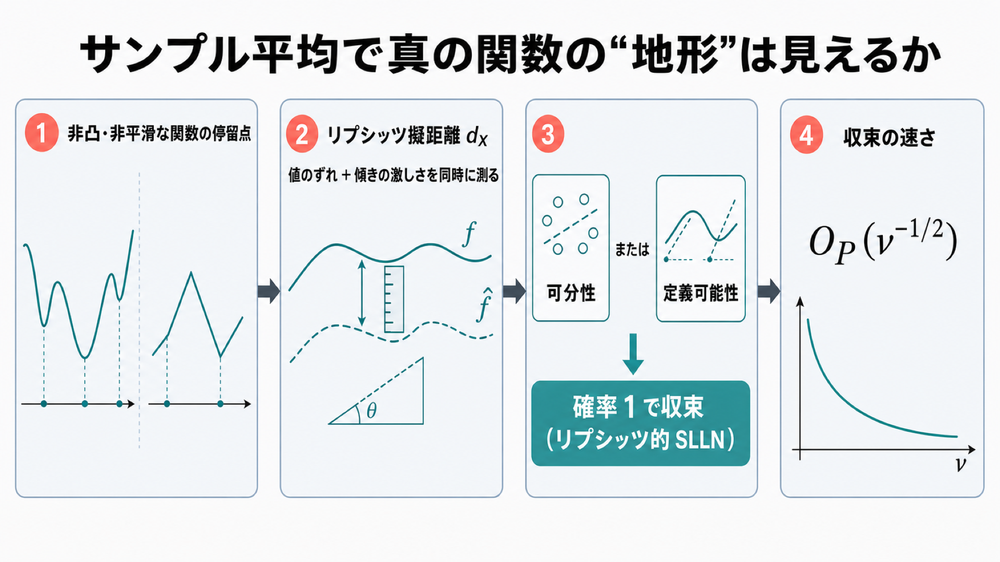

# 「サンプル平均で真の姿は見えるのか」を、非凸・非平滑な関数にまで広げて証明する

## この論文のひとことまとめ

機械学習では、本当は計算できない「期待値の関数」を、有限個のサンプルの平均で近似して最適化します。この論文は、その近似が元の関数へどれくらい忠実に近づくかを、非凸で角ばった（微分できない点を持つ）関数まで含めて数学的に保証しました。鍵は、関数の値だけでなく「傾きの激しさ」まで同時に測る特別なものさし（リプシッツ擬距離）を導入した点です。可分性（separability）という位相的な条件か、定義可能性（definability）というモデル理論的な条件のいずれかが成り立てば、サンプル平均は真の関数へ確率 1 で収束することを示しています。

## なぜこの研究が重要か

深層学習の訓練では、「全データにわたる期待値としての損失関数」を最小化したいのですが、その期待値は普通は正確に計算できません。そこで、手元のサンプルを使った平均、いわゆる**標本平均近似（sample-average approximation, SAA）**で置き換えて最適化します。

このとき当然、こんな疑問が湧きます。「サンプル平均で見ている地形（landscape）は、本当に見たかった真の地形と同じ形をしているのか」。谷の位置（最適解）だけでなく、平らな踊り場（停留点）まで一致してくれるのか、という問いです。

大域的な最適解については、この対応はよく理解されています。しかし、現代の深層学習の損失関数のように**非凸（谷が複数ある）**で、しかも**非平滑（ReLU のように角があって微分できない点を持つ）**な関数の停留点については、話がずっと難しくなります。この論文は、まさにその難しいクラスに対して「サンプル平均で真の姿が見える」ことの保証を与えます。

## 背景：何が問題だったのか

非平滑な関数では、普通の勾配（微分）が定義できません。代わりに「その点で取り得る傾きの集合」である**劣微分（subdifferential）**を使います。停留点であることは「劣微分の集合に 0 が含まれる」という形で表現します。

停留点の一致を調べたいなら、サンプル平均側の劣微分 ∂Eνf と、真の関数側の劣微分 ∂Ef を直接比べたいところです。ところが、これは難物です。そこで従来の研究の多くは、期待値と劣微分の順番を入れ替える近道をとってきました。つまり「劣微分してから平均」ではなく「平均してから劣微分」に相当する集合を扱い、そこで**弱停留性（weak stationarity）**という緩い概念を研究してきたのです。

この近道には落とし穴があります。緩い仮定で一致は示せるものの、真の関数にはひとつも停留点がないのに、どんな点でも弱停留になってしまう例が作れます。結論が中身のない（vacuous、空虚な）主張になりかねないのです。

一方、期待値の関数そのものの劣微分で定義する本来の**停留性（stationarity）**は、より鋭くて意味のある概念ですが、標準的な仮定の下ですら成り立たなくなる（破綻する）ことが、著者ら自身の先行研究で示されていました。さらに劣微分にも「鋭さ」の違いがあり、より鋭い**極限劣微分（limiting subdifferential）**を、角のある不規則な関数まで含めて一様に比較する法則は、著者らの知る限りそれまで存在しませんでした。

## 提案手法：何をしたのか

この論文の中核アイデアは、発想の順番を変えることにあります。**劣微分に移る「前」に、関数そのものを比較する**のです。

そのために、関数どうしの近さを測る特別なものさしを導入します。それが**リプシッツ擬距離（Lipschitz pseudometric）dX** です。ここで「リプシッツ」とは、関数の傾きの激しさに上限がある性質のことです。二つの関数 h と g に対し、dX は次の 2 つを同時に制御します。

- 二つの関数の**値のずれ**
- 二つの関数の差の**大域的な傾きの激しさ**（global Lipschitz modulus, 大域リプシッツ係数）

つまり、単に「同じような値をとるか」だけでなく「傾きの振る舞いまでそっくりか」までを一度に測る、強い意味での近さです。

この距離を選んだ理由が巧妙です。関数がこの擬距離の意味で近ければ、そこから劣微分どうしの近さも自動的に従うことを示せます。具体的には、極限劣微分でもクラーク劣微分（Clarke subdifferential, 極限劣微分を凸包で丸めたやや粗い版）でも、両方の一様な近さが dX から一挙に得られます。関数レベルで近さを押さえておけば、面倒な劣微分の直接比較を経由せずに済む、という戦略です。

そのうえで著者らは、サンプル平均 Eνf が真の関数 Ef へこの擬距離で収束することを、性質の異なる 2 つの条件のもとで証明します。これを**リプシッツ的強大数の法則（Lipschitzian SLLN）**と呼びます。強大数の法則（strong law of large numbers, SLLN）とは、サンプル平均が確率 1 で真の値に近づくという古典的な法則ですが、ここではそれを「数値」ではなく「関数」に対して述べている点が新しさです。

2 つの条件は次のとおりです。

1. **可分性条件（separability）**: 関数たちの族が、リプシッツ関数の空間の中で「可算（＝1 個ずつ番号を振って数え上げられる程度に少ない）で稠密（＝どの関数のいくらでも近くに代表を取れるほど詰まっている）な部分集合を持つ」ような小さな部分空間に収まっている、という位相的（空間の“近さ・つながり方”に関する）条件です。たとえばサンプルが離散分布に従い、関数の種類が可算個しかなければ自然に成り立ちます。
2. **定義可能性条件（definability）**: 各サンプルに対応する関数が、**o-極小構造（o-minimal structure）**という「病的な振る舞いを排除する数学的な舞台」の上で、一階論理（“ある x について……／すべての x について……”までを許す基本的な論理）の式で書ける、というモデル理論的（“論理式で書けるかどうか”に関する）条件です。実指数体 R_exp（実数に指数関数を加えた構造）はその例で、多くの現代的な深層学習モデルの訓練損失はこの上で書けることが知られています。

興味深いのは、この 2 つが本質的に異なる性格の条件だという点です。片方は位相的（空間の“近さ・つながり方”に関する）、もう片方は組合せ論的・論理的（“どんな式で書けるか・場合分けの構造がどうなっているか”に関する）ものです。それでもどちらか一方が成り立てば、著者らの先行研究が指摘した「収束の破綻」が起きないことを保証できます。特に、非平滑最適化の分野で病的挙動を排除するのに使われてきた o-極小性そのものよりも弱い、**NIP（non-independence property, 非独立性）**という組合せ論的な性質だけで収束が従う点を、著者らは強調しています。

## 結果：何が分かったのか

この論文は理論研究であり、数値実験やベンチマークは行いません。成果は証明された定理という形で示されます。主なものを紹介します。

- **リプシッツ的 SLLN（可分性版・定義可能性版）**: 緩い可積分性・リプシッツ性の仮定のもとで、可分性か定義可能性のいずれかがあれば、dX(Eνf, Ef) が確率 1 で 0 に収束します。可分性版は古典的なコルモゴロフの強大数の法則を一般化するものだと位置づけられています。

- **劣微分の一様収束**: 上記の収束から、有限とは限らない領域の上でも、極限劣微分とクラーク劣微分の両方について、サンプル平均側と真の関数側の劣微分が一様に近づくことが従います。これが停留点の一致を直接与えます。特に極限劣微分に対する一様法則は、本研究がほぼ初めてだとされています。

- **収束の速さ**: サンプル空間を有限個の断片で覆えて、2 次のモーメント条件が成り立つ場合、収束の速さは O_P(ν^{−1/2}) になります（ν はサンプル数）。これは統計でおなじみの標準的なレートです。

- **有限個の断片が本質的（速さについての否定的結果）**: 一方、断片が可算無限個になると、この速さは失われ、収束はいくらでも遅くなり得ます。半代数的（多項式の等式・不等式だけで書けるごく素直な関数）なごく単純な関数でも、どんな収束の速さ r をあらかじめ決めておいても、それより遅くしか収束しない（＝決めた速さ r を達成できない）確率法則を作れることを示しています。著者らはこれを、標本に現れなかった部分の質量に関する「missing mass problem」に関連づけています。これは、有限次元のベクトルの平均（有限 2 次モーメントで ν^{−1/2} のレートが出る）と、関数の平均とでは根本的に事情が違うことを浮き彫りにします。

- **条件を外すと本当に壊れる**: 可分性の条件を外すと、各サンプルの関数がたとえ凸であっても、収束せずに一定の隔たりが残り続ける（いくら標本を増やしても、隔たりの下限が正の値のまま消えない）例が存在します。また、`f(ξ,x)=|x−ξ|` というごく単純な凸関数ですら可分性を満たさない場合があり、この条件が決して自明ではないことも例で示されています。

- **有限標本での解の同定**: 真の問題の最小解の集合が空でなく「鋭い（sharp）」なら、サンプル数が十分大きくなった時点で、サンプル平均側の最小解が真の最小解の集合に含まれることが確率 1 で成り立ちます。凸性や分布の有限性を要求せずにこれが言える点が、既存結果の拡張になっています。

## 意義と限界

この研究の意義は、期待値と劣微分を入れ替えるという従来の近道を使わず、しかも丸められる前の鋭い極限劣微分そのものを扱う一貫性理論を、非凸・非平滑・不規則という難しいクラスに対して初めて確立した点にあります。多くの深層学習の損失関数がこの理論の対象クラスに入ることも示されており、応用の裾野は広いと言えます。

一方で、論文は限界も明示しています。

- 標準的な収束レート ν^{−1/2} を得るには、サンプル空間を有限個の断片で覆えることが必要で、この条件は外せません（可算無限だと収束が任意に遅くなり得ます）。
- レートに現れる定数は一様に制御できず、明示的な上界は構造の整った設定でのみ得られる見込みで、本論文では追求されていません。
- 関数がモデル理論的に書けること（joint definability）は、期待値をとった後の関数 Ef が同じように書けることまでは保証せず、分布の側に追加の条件が要る場合があります。
- 一部の可算性の仮定は、著者ら自身も追加の仮定なしには外せないだろうと予想していますが、これは未証明の予想として残されています。

## まとめ

サンプル平均で真の関数の「地形」がどこまで正しく見えるのか、という問いに対し、この論文は関数の値と傾きを同時に測るリプシッツ擬距離を導入し、可分性か定義可能性のどちらかがあれば確率 1 で収束することを証明しました。これにより、非凸・非平滑な関数の停留点の一致という難しい問題に、鋭い形で理論的な足場を与えています。

## 用語集

- **標本平均近似（sample-average approximation, SAA）**: 計算できない期待値の目的関数を、有限個のサンプルの平均で置き換えて最適化する枠組み。
- **強大数の法則（strong law of large numbers, SLLN）**: サンプル平均が確率 1（概収束）で真の値に近づくという古典的法則。本論文はこれを「関数」に対して述べる。
- **リプシッツ擬距離（Lipschitz pseudometric）dX**: 二つの関数の値のずれと、傾きの激しさ（大域リプシッツ係数）を同時に測る、強い意味での近さのものさし。
- **劣微分（subdifferential）**: 微分できない非平滑な関数に対して「その点で取り得る傾きの集合」を与える一般化された勾配。極限劣微分は鋭く、クラーク劣微分はそれを凸包で丸めたやや粗い版。
- **停留性（stationarity）/ 弱停留性（weak stationarity）**: 前者は期待値関数の劣微分に 0 が含まれること、後者は期待値と劣微分の順番を入れ替えた集合で定義する緩い概念。前者の方が鋭い。
- **可分性（separability）**: 空間が可算（数え上げられる程度に少ない）で稠密（どの点のいくらでも近くに代表を取れるほど詰まっている）な部分集合を持つという位相的性質。本論文の第 1 の主条件。
- **定義可能性（definability）/ o-極小構造（o-minimal structure）/ NIP**: 関数が論理の式で書けること、病的挙動を排除する数学的舞台、そのための組合せ論的性質。本論文の第 2 の主条件を支える。
- **P-a.s.（P-almost surely, 概収束）**: 確率 1 で成り立つこと。
- **O_P（bounded in probability, 確率有界）**: 収束の速さを表す記法。O_P(ν^{−1/2}) は統計で標準的なレート。

## 原論文

- Lipschitzian SLLNs for random functions（https://arxiv.org/abs/2607.20411）
