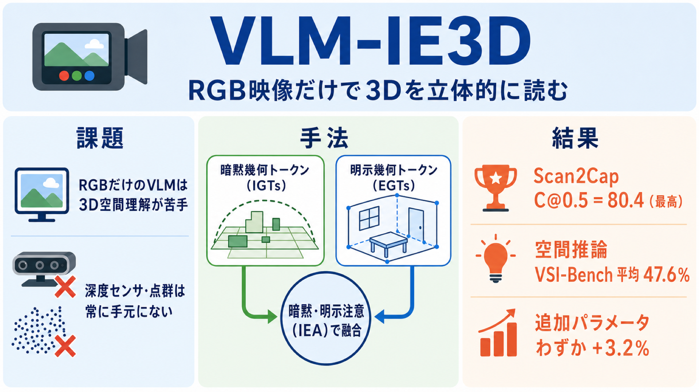

# RGB 映像だけで空間を立体的に読む：暗黙と明示の 2 種類の 3D 幾何を VLM に注入する VLM-IE3D

## この論文のひとことまとめ

普通のカラー映像（RGB）だけを入力に、2 種類の異なる 3D 幾何情報を視覚言語モデル（Vision-Language Model、VLM）に注入するフレームワーク「VLM-IE3D」を提案した研究です。粗く大域的な空間のとらえ方（暗黙表現）と、細かく定量的な構造情報（明示表現）を組み合わせ、両者を専用の注意機構で融合します。深度センサや点群といった追加の 3D 入力を一切使わずに、3D 物体検出・3D の言語による物体特定・3D シーンの文章生成・空間推論という複数のタスクで、RGB のみを使う手法として最高性能を達成しました。

## なぜこの研究が重要か

「この机の右手前にあるカップを取って」といった指示をロボットが理解するには、映像の中の物体が空間のどこにあるかを立体的に把握する必要があります。しかし、2 次元のカラー画像から学習された既存の VLM は、こうした細かな空間理解や推論を要する 3D タスクを苦手としてきました。

一方で、深度センサや点群（point cloud）といった 3D 専用のデータを使えば空間把握は正確になりますが、そうしたセンサは常に手元にあるとは限りません。もし普通のカラー映像だけから立体的な理解を引き出せれば、特別なハードウェアなしに VLM を空間認識へ応用できます。この研究は、その「RGB だけでどこまで 3D を理解できるか」という問いに一つの答えを与えるものです。

## 背景：何が問題だったのか

近年は、点群のような明示的な 3D データを直接使うのではなく、2 次元の観測から 3D の表現を学ぶ流れが生まれています。その代表的なアプローチは、3D 幾何エンコーダ（3D geometry encoder）を導入し、映像列から「暗黙の 3D 表現（implicit 3D representations）」を学習させるものです。

ただし、この暗黙表現には弱点があります。捉えられるのはシーン全体の粗く大域的なレイアウトにとどまり、精密な位置の特定や細かな推論を要するタスクには不十分なのです。論文はこれを人間の認知になぞらえて説明します。人間は幾何的な詳細を伴わない粗い「3D 認知地図（3D cognitive map）」を頭の中に作ります。既存 VLM の暗黙表現もこれと同じように高レベルの空間的な手がかりは与えますが、圧縮された潜在的な形式であるため、言語モデルが「何メートル離れているか」といった定量的な幾何量を読み取るのは難しいのです。

これに対しロボットのシステムは、深度マップや点群といった明示的な 3D 表現（構造化された「3D 再構成地図」）を使い、定量的な幾何データに直接アクセスします。しかし、この明示的な表現は RGB のみで動く VLM の枠組みではほとんど活用されてきませんでした。そこで本研究は、VLM に「大域的な認知地図」と「細粒度の再構成地図」の両方を備えさせ、このギャップを埋めることを狙います。

## 提案手法：何をしたのか

中核となるアイデアは、純粋な RGB の映像列から相補的な 2 種類の幾何表現を取り出し、VLM に強い 3D の帰納バイアス（3D 情報を優先的に使うような手がかり）を注入することです。フレームワークは主に次の 3 つの部品からなります。

- **暗黙幾何トークン（Implicit Geometry Tokens、IGTs）**：3D 幾何エンコーダが生成する、大域的で高レベルな空間情報（シーン全体のレイアウトや物体どうしの空間関係など）を捉えたトークンです。3D 幾何エンコーダには AnySplat を採用し、その融合デコーダ（fusion decoder）が出す暗黙の潜在ベクトルを IGTs として使います。
- **明示幾何トークン（Explicit Geometry Tokens、EGTs）**：再構成された明示的な 3D 属性（深度マップ・点群・3D ガウススプラット）を、軽量な埋め込みモジュールで符号化したトークンです。明確な幾何的解釈を持ち、細かな構造や定量的な位置情報を保持します。深度マップ・カメラの向き・3D ガウススプラットは 3D 幾何エンコーダの予測ヘッドから直接取得し、点マップは深度マップを、再構成したカメラの向きに沿って 3D 座標へ逆投影（2 次元の画素を 3 次元空間へ投げ戻す操作）して得ます。処理を軽く保つため、重い 3D バックボーンは避け、1 層のパッチ埋め込みと 2 層の MLP（多層パーセプトロン）という単純な構成にしています。
- **3D 対応アダプタ（3D-Aware Adapter）**：通常の 2D 視覚トークン・IGTs・EGTs という 3 種類のトークンを統合し、一つにまとまった「3D を意識した視覚埋め込み」を作る融合モジュールです。

3D 対応アダプタの中では、まず空間的に隣接する 2×2 の特徴をまとめて 2 層 MLP で圧縮します。その後、要となる **暗黙・明示注意（Implicit–Explicit Attention、IEA）** というモジュールが働きます。IEA はフレームごとに、圧縮した IGTs（暗黙表現）を問い合わせる側、圧縮した EGTs（明示表現）を参照される側として、両者を照らし合わせるマルチヘッド交差注意（multi-head cross-attention）を行います。この照合によって粗い暗黙表現と細かい明示表現を融合し、その結果を残差接続（residual connection、元の入力に処理結果を足し戻す接続）で元の表現に足し合わせます。こうしてできた 3D トークンを、圧縮済みの 2D 視覚トークンと要素ごとに加算してひとつにまとめます。

最終的に、この統一された 3D 対応視覚表現をテキストの埋め込みと一緒に、事前学習済みの VLM へ入力して予測を行います。全体を通じて入力は RGB のみで、追加の 3D 入力は一切必要としません。

## 結果：何が分かったのか

実装では VLM バックボーンに Qwen2.5-VL-3B、3D 幾何エンコーダに AnySplat を用い、2D 視覚エンコーダと 3D 幾何エンコーダは凍結（重みを固定）したまま、VLM バックボーンと明示埋め込み部分を学習しました。学習は 1 エポック、8 枚の H100 80G GPU で実施しています。以下は原論文が報告する主要な数値です。なお以降の指標記号は、C が CIDEr、M が METEOR に基づく指標を表し、@0.5 は IoU 0.5、@0.25 は IoU 0.25 という重なり条件を示します（P25・R25・F125 は IoU 0.25 での適合率・再現率・F1）。

- **3D シーンの文章生成（Scan2Cap ベンチマーク）**：比較したすべての手法の中で最高の C@0.5＝80.4 を達成しました。2D 視覚入力の手法の中では最高の M@0.5＝28.8 です。ベースラインの Qwen2.5-VL-3B に対して C@0.5 で +22.4、暗黙表現のみを使う主要比較手法 VG LLM に対して +1.8 の改善です。しかも VLM-IE3D は 3D シーン入力を使いません。
- **3D の言語による物体特定（ScanRefer）**：3D 入力なしの手法として最高の Acc@0.25＝43.2%、Acc@0.50＝16.9% を記録しました。Qwen2.5-VL-3B に対し Acc@0.25 で +9.2、VG LLM に対し +6.8 です。候補領域の精緻化（proposal refinement）を適用すると 55.4% / 48.9% となり、3D シーン入力を使う手法との差を縮めます。
- **3D 動画物体検出**：IoU 閾値 0.25 での適合率・再現率・F1 でそれぞれ P25＝44.2%、R25＝41.9%、F125＝42.8% を達成しました。ベースラインに対して +12.1 / +11.8 / +11.9、VG LLM に対して +2.5 / +6.2 / +4.6 の改善です。
- **効率**：VG LLM の学習可能パラメータ 3.13B に対し、VLM-IE3D は 3.23B です。明示埋め込み・3D 対応アダプタ・EGTs 用の 3D 属性再構成を加えても、増加分はわずか 0.10B（3.2% 増）にとどまります。推論速度も単一 H100 GPU で 7 FPS から 6 FPS へ 1 FPS 低下するだけです。
- **空間推論（VSI-Bench）**：4B パラメータで平均 47.6% を達成し、Gemini-1.5-Pro（45.4%）や LLaVA-NeXT-Video-72B（40.9%）を含むすべてのベースラインを上回りました。物体カウントで 67.5%（VG LLM を +1.5 で上回る）、相対距離の推定で 47.7%（VG LLM の 44.6% に対し +3.1）です。

どの部品が効いているかを調べたアブレーション（要素を外して比較する実験）も 3D 動画物体検出で行われています。F1（F125）で見ると、ベースライン 30.9 に対し、EGTs を加えると 34.7、IGTs を加えると 40.5、両方を統合すると 42.8 と段階的に向上しました。IGTs 単独の方が EGTs 単独より改善幅が大きく、より豊かで一般的な 3D の事前知識を符号化していると解釈されています。融合戦略の比較では、単純な連結（41.5）や加算（42.4）よりも提案の IEA が最良でした。明示的な 3D 属性の種類は、点マップ・深度マップ・ガウススプラットのいずれでも一貫して改善し（F125 は 42.5〜42.8）、最も入手しやすくパラメータ効率のよい深度マップを既定としています。

## 意義と限界

この研究の意義は、暗黙と明示という 2 種類の相補的な 3D 幾何表現を、純粋な 2D 視覚入力だけから統合してみせた点にあります。各種の 3D シーン理解・空間推論タスクで 2D 視覚入力の手法を上回り、3D シーン入力を使う手法とも競合する結果を示しました。フレームワークは多様な 3D 幾何エンコーダ（AnySplat のほか π3 や VGGT でも検証済み）と柔軟に組み合わせられ、今後の 3D 幾何エンコーダの進歩をそのまま取り込める余地を持ちます。

限界について、論文本文には独立した「限界」の節は置かれていません。ただし定量結果として、候補領域の精緻化を適用しても ScanRefer では 3D シーン入力を使う手法（例：Video-3D LLM の Acc@0.25＝58.1、Acc@0.50＝51.7）との差が残ります。著者らも、明示的な 3D 入力が精密な位置特定に利点を与える一方で、本手法の暗黙・明示の幾何符号化はその競合的な代替になりうる、という位置づけで述べています。

## まとめ

VLM-IE3D は、RGB 映像だけを入力に、粗く大域的な暗黙表現と細かく定量的な明示表現の 2 種類の 3D 幾何を VLM へ注入し、暗黙・明示注意（IEA）で両者を融合するフレームワークです。追加の 3D 入力もわずかなパラメータ増（3.2%）だけで、複数の 3D 理解・空間推論タスクにおいて RGB のみの手法として最高性能を示しました。

## 用語集

- **VLM（Vision-Language Model、視覚言語モデル）**：視覚と言語を統合的に扱うモデル。本研究では Qwen2.5-VL を土台に用いる。
- **暗黙幾何トークン（Implicit Geometry Tokens、IGTs）**：3D 幾何エンコーダが生成する、粗く高レベルな大域的空間情報を潜在ベクトルとして符号化したトークン。
- **明示幾何トークン（Explicit Geometry Tokens、EGTs）**：深度マップ・点群・ガウススプラットなど明示的な 3D 属性から軽量な埋め込みで得る、細粒度で定量的な幾何情報を保持するトークン。
- **3D 幾何エンコーダ（3D geometry encoder）**：2D 画像から 3D 幾何情報を学習・表現するモデル。本論文では AnySplat を採用。
- **暗黙・明示注意（Implicit–Explicit Attention、IEA）**：IGTs を問い合わせ、EGTs を参照先とする交差注意で両表現を整合・融合する提案モジュール。
- **3D 認知地図 / 3D 再構成地図**：それぞれ「幾何的詳細を欠く粗い大域的な地図」と「定量的な幾何にアクセスできる構造化された地図」を指す、本論文の対比的な比喩。
- **深度マップ / 点群 / 3D ガウススプラット**：EGTs の元となる明示的 3D 属性の種類。
- **Scan2Cap / ScanRefer / VSI-Bench**：それぞれ 3D シーンの文章生成、3D の言語による物体特定、空間推論を評価するベンチマーク。
- **VG LLM**：暗黙表現のみを用いる主要比較手法（暗黙のみのベースライン）。
- **C@0.5 / M@0.5 / P25 / R25 / F125**：C@0.5・M@0.5 は Scan2Cap の指標（CIDEr / METEOR ベース、IoU 0.5 条件）、P25・R25・F125 は IoU 閾値 0.25 での適合率・再現率・F1。

## 原論文

- 3D-Aware VLMs with Implicit and Explicit Geometries（https://arxiv.org/abs/2607.21595）
