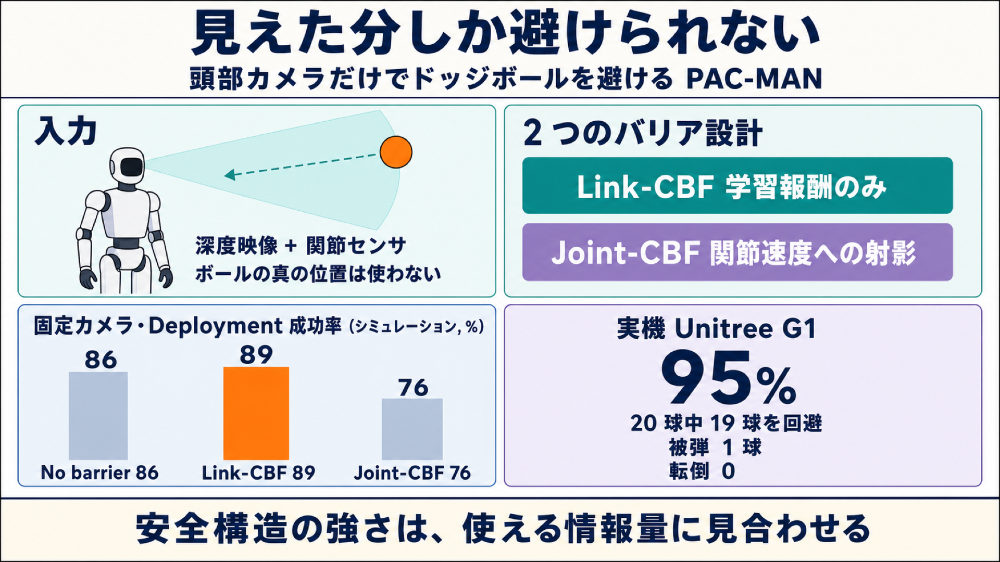

# ヒューマノイドは「見えた分しか避けられない」— 頭部カメラだけでドッジボールを避ける PAC-MAN

## この論文のひとことまとめ

人型ロボットが飛んでくるボールを避ける、という課題に取り組んだ研究です。著者らは「ロボットが実際に搭載しているセンサで何が見えるか」と「安全性をどう数式で保証するか」を切り離さず、ひとつの設計問題として扱う枠組み PAC-MAN を提案しました。学習時にはボールの正確な位置を使って安全な動きを教え込みますが、実機で動かすときは頭部カメラの深度映像と関節センサの情報しか使いません。実機の Unitree G1 に載せたところ、手投げ 20 球のうち 19 球を回避し、転倒はゼロでした（成功率 95%）。

## なぜこの研究が重要か

人と同じ空間で働くロボットには、「動いてくるものを瞬時に避ける」能力が求められます。しかも人型ロボットの場合、避ける動作そのものでバランスを崩して転んでしまっては意味がありません。ドッジボールは、この「短時間で判断し、全身を使って安全を確保する」という問題をきれいに切り出した課題だと著者らは位置づけています。

この論文が面白いのは、「安全性の理論」と「センサで実際に見えるもの」のズレを正面から扱っている点です。理論上いくら強力な安全保証の仕組みを組み込んでも、ロボットがその判断に必要な情報を観測できなければ機能しません。むしろ性能が落ちることさえある、というのが本研究の中心的な発見です。

## 背景：何が問題だったのか

ロボット制御で安全性を扱う代表的な道具に、**制御バリア関数**（CBF: Control Barrier Function）があります。これは「安全な状態の集合」を数式で表現し、その集合から外れそうな指令を修正する仕組みです。ただし CBF には前提があります。安全判定に必要な状態量（この場合はボールの位置と速度）が手元で使えることです。

ところが搭載センサの現実は厳しいものです。論文が挙げる問題は次のとおりです。

- ボールは短い時間しか視野に入らない。
- カメラの視野から外れてしまう。
- 遠いうちは、ノイズの乗った数個の深度ピクセルとしてしか映らない。

この前提の崩れに対処する一つの方向が **CBF-RL** です。これはバリア条件の違反を強化学習（RL: Reinforcement Learning）の報酬に組み込み、方策（policy、観測から行動を決める関数）自身に安全構造を覚え込ませる手法です。実行時に特権的な幾何情報が要らなくなる利点があります。しかし著者らは、方策が内在化できる安全構造は「その観測が支えられる分だけ」だと指摘します。つまり脅威をどう表現するか（知覚）とバリアをどう設計するか（安全）は独立に決められるものではなく、結合した一つの問題として扱う必要があるという主張です。

なお、ドッジボールは移動ロボットのナビゲーションとも異なります。危険は一過性で、しかも「いつどう避けるか」を指示する目標速度も参照動作もロボットには与えられません。地形を走破する parkour 系の研究とも違い、危険なのは地面ではなく高速で飛んでくる物体です。

## 提案手法：何をしたのか

### 全体の構え

PAC-MAN の方策は、29 次元の関節位置目標を出力します。これは標準姿勢からのずれを表す値で、PD 制御器（比例微分制御器。目標値との差と、その差が縮まる速さの両方を見て指令を作る古典的な制御器）が 50 Hz で追従します。

実行時に方策が見られるのは、搭載センサから計算できる信号だけです。具体的には深度観測、関節の位置と速度、胴体の角速度、投影重力（重力方向がロボットから見てどちらか）、そして 1 ステップ前の行動です。**カメラを使う構成では、ボールの状態は方策の入力に一切含まれません。** ボールについて知ることはすべて深度画像から推論します。

学習には**非対称 actor-critic**（asymmetric actor-critic）を使います。行動を決める側（actor）は上記の観測しか見ませんが、状態の良し悪しを評価する側（critic）は学習中だけ特権情報（ボールの真の相対位置・速度・半径、可視性、全身リンクの運動学）を追加で見ます。この特権情報は実行時には捨てられます。

### 2 段階のバリア設計

論文の中核は、強さの異なる 2 種類のバリアの対比にあります。

**Link-CBF（リンクごとの軽量なクリアランス報酬）**

各リンク（腕・脚・胴など、身体を構成する各部位）について「ボールとの隙間」を計算します。式としてはボール中心とリンク中心の距離から、両者の有効半径の和を引いたものです。この値が 0 以上なら安全、というわけです。全身の安全集合は、全リンクの安全条件の共通部分として定義されます。骨盤だけを守るのでは、腕や脚に当たるケースに対処できないためです。

報酬は、最も切迫しているリンクのバリア条件の違反だけを罰します。ボールが空中を飛んでいるとき以外はゼロになるようゲートされるので、普段の直立姿勢には干渉しません。重要なのは、**Link-CBF は学習報酬を通してしか作用しない**という点です。実行時にオンラインでバリア条件を強制することはありません。

**Joint-CBF（関節空間への強い射影）**

こちらはより強力です。方策が出す関節位置目標は、現在の関節角との差を通じて「目標の関節速度」を意味しています。Joint-CBF はまず、最も脅かされている点でのバリア条件を「関節速度がこの範囲に収まっていれば安全」という 1 本の不等式（関節速度についての線形制約）に書き直します。そのうえで、目標速度がその範囲から外れていれば、範囲内の最も近い値へ直接（反復計算をせずに一度の計算で）引き戻します。制約がすでに満たされていれば、元の目標速度がそのまま通ります。さらに、接触までの残り時間が短いほど制約を締める「緊急度マージン」も入っています。

Joint-CBF は報酬にも 2 つの整形項を加えます。射影による修正量が大きいことへのコスト（フィルタが頻繁に介入しないよう促す）と、安全境界すれすれを滑ることを抑えるバッファコストです。

そして評価時には、この射影モジュールを外します。方策は深度と関節センサだけで自力で避けなければなりません。

**+filter（特権的な上限構成）**

比較用の上限として、射影をテスト時も有効に保つ構成 `+filter` も報告されています。ただしこの射影はオンラインでボールの真の状態を読むため、**視覚だけで実現できる展開可能な構成ではありません**。実機で動かすには、現状の視覚スタックが供給できない精度のボール状態推定器が必要だと論文は明記しています。

### 知覚の 3 レジーム

制御課題は固定したまま、ボールの見え方だけを 3 通りに変えて情報量の効果を切り分けます。

1. **State oracle**: ボールの真の状態を直接観測する構成（カメラなし）。安全情報の上限を与えます。
2. **Fixed depth camera**: 頭部に固定した単一カメラの RGB-D 映像からボールを切り出します。水平視野 102°、垂直視野 57°、上向き 20° の傾斜です。
   - 観測の作り方: ボール上のピクセルは実測深度を保ち、それ以外は最遠面に設定します。そのマスク画像を 16×9 にプーリングします。さらに連続フレームではなく、直近 `[0, 3, 8, 18]` フレームという疎な時間オフセットのスナップショットを重ねます。これは接近の手がかり（**looming**）と横方向の動きを符号化しつつ、方策に収まる小ささを保つためです。カメラは固定なので、視野外に出た球や遠すぎて小さく映る球は観測できません。
   - 学習時の外乱付与: ボールの全消失、不規則なピクセル欠損、深度のジッタ、輪郭のちらつきをランダムに加えます。実際の知覚失敗を模擬するためです。
3. **Active gimbal（視線追従）**: 同じカメラを ±30° のピッチ関節に載せ、飛行中のボールを追う構成です。ただし照準はボールの真の状態を使って駆動されるため、これはシミュレーション上の天井にあたります。展開可能な版は追跡結果で同じ関節を駆動すればよいものの、実機実現には追加ハードウェアが要るため今後の課題です。**実機に展開したのは固定カメラの構成です。**

### 動作の「形」を整える

バリア項は「どこが安全か」は決めますが、「どんな全身動作で避けるべきか」は決めません。そこで **AMP**（Adversarial Motion Prior、敵対的動作事前分布）を動作の正則化として加えます。識別器が方策の動きと人間由来の動作クリップ（かがむ、傾く、サイドステップ、跳ぶ、立つ）の動きを見分けようとし、方策は見分けがつきにくい動きを目指します。参照データは 1 分 43 秒分の人間動作を Unitree G1 にリターゲットしたものです。これにより、でたらめな関節の振れではなく、反射的なかがみや傾きが選ばれやすくなります。

学習は PPO（Proximal Policy Optimization、強化学習で標準的に使われる方策最適化アルゴリズム）と AMP 識別器を用い、8192 並列環境で 20k イテレーション、物理シミュレータ mjlab 上で行われます。

### 脅威モデルと評価基準

ボールは断続的に投げられ、投球の間には回復のための時間があります。既定の設定では、進行方向から ±25° 以内・前方 2〜3 m から発射され、飛行時間はおよそ 0.6 秒です。この 0.6 秒が反応の持ち時間を決めます。脅威は 2 種類を半々で混ぜます。脚を横切って落ちてくる球（横に踏み出す・またぐ）と、胴や頭の高さまで上がる低い弾道の球（かがむ・のけぞる）です。

評価基準は意図的に厳しく設定されています。**ボールがどの身体リンクに当たっても hit** とし、姿勢や胴体高さが閾値を超えれば fall（転倒）とします。骨盤との距離だけを測る評価だと、四肢をかすっているのに「安全に見える」手法を通してしまうためです。

## 結果：何が分かったのか

まず基準点として、**動かない静止ロボットは投球の 4% しか生き延びません**。ほぼすべての投球が命中する設定になっているということです。

シミュレーションでの全身成功率（%）は次のとおりです。Reset は投球ごとにロボットをリセットする条件、Deployment は投球の合間に移動制御で原点へ戻る条件です。転倒率は全条件で 0 でした。

| レジーム | 知覚 | No barrier | Link-CBF | Joint-CBF | +filter |
| --- | --- | --- | --- | --- | --- |
| Reset | State oracle | 98 | 88 | 96 | 99 |
| Reset | Fixed camera | 86 | **90** | 83 | 97 |
| Reset | Gimbal camera | 96 | 95 | 91 | 97 |
| Deployment | State oracle | 96 | 93 | 95 | 98 |
| Deployment | Fixed camera | 86 | **89** | 76 | 90 |
| Deployment | Gimbal camera | 92 | 94 | 90 | 95 |

太字は実機に展開した固定カメラ + Link-CBF の構成です。

ここから読み取れることを 3 点に整理します。

**搭載センサで済ませるコストは数ポイントに留まる。** 同じ Link-CBF 報酬で学習した固定カメラ方策（reset 90%、deployment 89%）は、ボールを保守的なマスク深度としてしか見ていないにもかかわらず、真の状態を見る構成（88% と 93%）と同等です。オラクル系の最良構成（96〜99%）でも、展開する方策との差は 10 ポイント未満です。著者らは「固定した搭載カメラだけで回避には十分であり、知覚が変えるのは**どの安全構造が機能するか**である」とまとめています。

**正確な情報が使えるなら、強い安全構成が最良になる。** ボールの真の状態が使える State oracle の 2 行を見ます。バリア報酬を足さない No barrier（ボールを遠ざけるだけの基本報酬）でも Reset 98%、Deployment 96% と十分に強いのですが、関節空間バリアを実行時フィルタとして残した `+filter` はそれを上回り、Reset 99%、Deployment 98% に達します。`+filter` の列は表の全行で最良です。ただし繰り返しになりますが、この改善には搭載スタックが現状供給できないボール状態が必要です。

**実行時のボール状態なしで動く構成では順位が逆転する。** Fixed camera の 2 行では Link-CBF が両レジームで最良（Reset 90%、Deployment 89%）となり、No barrier（ともに 86%）を上回ります。一方、素の Joint-CBF は deployment で 76% まで落ち込みます。著者らはこの差を知覚の問題だと理論づけています。方策が「十分正確に知覚できない全身バリア」を内在化しようとして、かえって悪い回避を学んでしまう、という説明です。

この解釈を裏づけるのは、Joint-CBF の落ち込みを修復する 2 つの変更がいずれも「固定カメラに欠けているボール情報を補う」ものである点です。実行時フィルタとして残せば固定カメラは 90〜97% に上がり、オラクル照準のジンバルを与えれば同じ Joint-CBF 学習はもはや害にならず deployment 90%（固定カメラでは 76%）になります。論文の言葉では「全身バリアはボールが十分に観測可能なときにのみ成功する」ということです。設計上の含意は明快で、**安全構造の強さは、利用できる情報量に見合わせなければならない**となります。

先行するヒューマノイドドッジボール研究 SMP との比較も行われています。SMP の設定（全方位 360°、8〜10 m からの投球、オラクル観測）に揃えたところ、PAC-MAN は reset 98% を記録し、SMP の報告値である約 99% と同程度でした。

### 実機実験

Unitree G1 に頭部搭載の ZED Mini を付け、Link-CBF の固定カメラ方策を展開しました。シミュレータのセグメンテーションは、学習型トラッカ **EfficientTAM** に置き換えられています。クリックした前景点で初期化されたトラックが RGB 映像中のボールを約 60 Hz でセグメントします。制御レートの 50 Hz より速いので、深度観測は実質的に毎ステップ新しい情報になります。

このトラッカは任意の物体で初期化できるため、**同じ方策のままで異なるボールを避けられます**。論文にはフォームボールの代わりにサッカーボールを避ける例が示されています。

実機フィードを保守的に保つため、次の 3 つのフィルタが入っています。

- **低パーセンタイルのプーリング**: ZED の飛びピクセル（実際には無い距離を返す誤検出）を捨てるため、深度の小さい側の値だけを使ってまとめます。ボール自体は残ります。
- **距離考慮のマスクサイズチェック**: 測った距離のわりにマスクが大きすぎるときは、ボールではないとみなして棄却します。
- **looming ゲート**: 平均深度が十分な速さで縮まっていない、つまり近づいてきていない追跡クラスタは抑制します。静止物体や過敏なセグメンテーションが回避動作を誘発するのを防ぐためです。

トラックが無い・棄却された・見失った場合、方策は偽の来球ではなく「何も無い」フレームを受け取ります。

**この実験では、ボールの真の状態も、速度推定も、実行時 CBF の入力も、どの時点でも利用できません。** 表中の固定カメラ Link-CBF セルとまったく同じ条件です。

結果は手投げ 20 球に対し、回避 19 球、被弾 1 球、転倒 0、成功率 95% でした。被弾以外の投球では、リンクごとに設けた立ち入り禁止領域（keep-out 領域）を 0.05〜1.7 m クリアしていました。

創発した回避動作は、かがみ・傾き・サイドステップの 3 種類です。いずれも脚・胴・腕を協調させ、胴体を平行移動させるだけでなく、脅かされたリンク自体を進路から動かすものになっていました。

## 意義と限界

この研究の核心的な主張は、知覚考慮型の CBF-RL が「安全性と情報の協調設計問題」だという点にあります。適切なバリア構造は、方策やフィルタが利用できる脅威表現に依存して変わります。正確なボール状態があれば Joint-CBF を実行時フィルタとして残す構成が最も成功率が高くなりますが、同じ関節空間バリアを報酬による誘導としてのみ使うと、固定カメラ方策はむしろ劣化します。Link-CBF は骨盤中心の目的を全身リンクへ広げつつ、限られた搭載知覚に耐える折衷点として機能しました。

著者らはこの結果を、バリア構造を方策の中に「内在化する」ことと、オンラインで「強制する」ことの区別として整理しています。内在化は方策が推論できる範囲に制限され、強制は実行時に正確な脅威状態を要求します。

論文が認めている限界は次のとおりです。

- `+filter` はオンラインでボールの真の状態を読むため、視覚のみで展開できる構成ではありません。実機で動かすには、視覚スタックが提供できない高精度なボール状態推定器が必要です。
- オラクル照準のジンバルも、照準にボールの真の状態を要するシミュレーション上の天井です。同じセグメンテーション結果で照準を駆動するハードウェアジンバルは今後の課題とされています。
- 今後の方向として、物理的な追従ジンバルか正確なオンライン推定器によって「知覚から CBF へ」のループを閉じること、そして課題を「立ち直った姿勢からの回避」から「歩きながらの回避」へ広げることが挙げられています。

ベンチマークと学習パイプラインは公開予定とされています。

## まとめ

PAC-MAN は、人型ロボットの全身安全性を「センサで何が見えるか」と切り離さずに設計する枠組みです。学習時にだけ使えるバリア情報で動きを形づくり、実機では頭部カメラの深度と関節センサだけで飛来物を避けます。実機の Unitree G1 で投球の 95% を回避しました。最も示唆的なのは、強い安全機構が常に良いとは限らず、観測できる情報量に見合った安全構造を選ぶ必要があるという発見です。

## 用語集

- **CBF（Control Barrier Function、制御バリア関数）**: 安全な状態の集合を関数として表現し、その集合の内側にとどまるようコントローラの指令を制約する枠組み。
- **CBF-RL**: バリア条件の違反を強化学習の報酬に注入し、方策自身に安全構造を覚えさせる手法。実行時に特権的な幾何情報を不要にできる。
- **Link-CBF**: 骨盤中心の目的を全身の各リンクへ拡張した軽量な報酬項。学習報酬を通してのみ作用し、実行時のオンライン強制は行わない。
- **Joint-CBF**: 関節速度に対する射影として働く、より強いバリア。学習の整形に使うことも、テスト時の特権的フィルタとして残すこともできる。
- **AMP（Adversarial Motion Prior、敵対的動作事前分布）**: 参照動作を明示的に追従させる代わりに識別器を使い、動作の「形」だけを人間らしく正則化する手法。安全集合の定義には関与しない。
- **非対称 actor-critic**: 価値関数だけが特権情報を観測し、方策は実行時に得られる観測のみを見る学習の枠組み。
- **セグメンテーションマスク深度**: RGB 映像でボールを切り出し、そのピクセルだけ実測深度を残して他を最遠面にした、コンパクトな脅威表現。
- **looming**: 対象が接近することで生じる視覚的な手がかり。時間方向にずらしたフレームを重ねることで符号化される。
- **any-link contact criterion（任意リンク接触基準）**: ボールがどの身体リンクに触れても被弾とみなす評価基準。骨盤だけを見る評価より厳しい。
- **EfficientTAM**: 実機実験で使われた学習型トラッカ。クリックした点から初期化し、RGB 映像中のボールを約 60 Hz でセグメントする。

## 原論文

- PAC-MAN: Perception-Aware CBF-RL for Whole-Body Safety in Humanoid Dodgeball（https://arxiv.org/abs/2607.28623）
