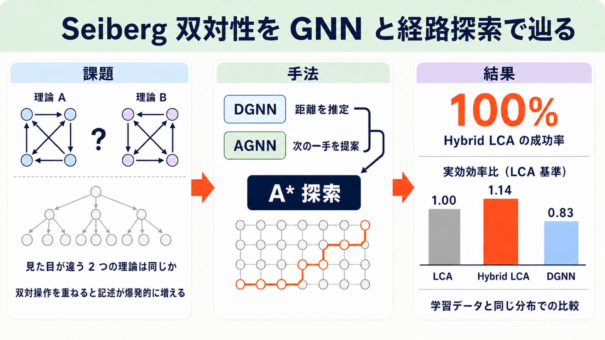

# 「この 2 つの理論は同じものか」を AI に解かせる — Seiberg 双対性を GNN と経路探索で辿る

## この論文のひとことまとめ

理論物理の世界には「見た目はまったく違うのに、実は同じ物理を記述している 2 つの理論」が存在します。この論文は、そうした関係（Seiberg 双対性）で 2 つの理論が結ばれているか、また何回の基本操作で結べるかを、グラフニューラルネットワーク（graph neural network, GNN）と経路探索アルゴリズムの組み合わせで解く枠組みを作りました。理論をグラフ（クイバー）として表し、距離を推定するネットワークと次の一手を提案するネットワークを学習させ、それらを A\* 探索のヒューリスティックとコストに組み込みます。ノード数 10 程度の中規模な問題では、この学習ベースの手法が決定論的アルゴリズムを上回る傾向を示しました。

## なぜこの研究が重要か

物理学における双対性（duality）とは、まったく違って見える 2 つの理論記述が、同じ物理現象を表しているという関係のことです。Kramers–Wannier 双対性、Maxwell 理論の電磁双対性、弦理論・M 理論・F 理論、ホログラフィーなど、幅広い分野に現れます。双対性が価値を持つのは、片方の記述では計算が困難な「強結合」の領域を、もう片方の記述では扱いやすい形で覗けるからです。

問題は、双対性のルール自体は既知でも、「与えられた 2 つの系が実際に双対かどうか」を効率よく確かめるのが計算上難しい点にあります。双対性は 2 つ以上の記述を結ぶことが多く、双対操作を重ねていくと記述の数が爆発的に増えてしまいます。つまりこれは、物理の問題であると同時に、探索空間が指数的に膨らむ組合せ探索の問題でもあります。

著者らは、この種の問題が「理論物理に適用される最先端 AI モデルの有用なベンチマークになりうる」と述べています。ルールは明確で正解の検証も可能、しかし素朴な探索では手が出ない、という性質は、機械学習側から見ても興味深い題材です。

## 背景：何が問題だったのか

この論文が扱うのは Seiberg 双対性です。もとは超対称ゲージ理論（supersymmetric QCD, SQCD）についての関係で、あるゲージ群を持つ理論と、別のゲージ群＋追加の場を持つ理論とが、低エネルギー領域で等価になることを述べます。ここでいう超対称性（supersymmetry）は、理論の形を強く制限する追加の対称性だと捉えておけば、この先を読み進められます。この関係をクイバーゲージ理論（quiver gauge theory）に適用すると、「指定した 1 つのノードを双対化する」という局所的な操作になります。

クイバー（quiver）とは有向グラフのことです。各ノードがゲージ群 SU(N_i) を表し、ノード間の矢印が物質場を表します。物質場は正確には bifundamental 表現のカイラル多重項と呼ばれるもので、ここでは「2 つのゲージ群にまたがって働く物質場」と考えてください。数学の言葉では、この 1 ノード双対化はクイバーの mutation（変異）と呼ばれ、Fomin–Zelevinsky 則という決まった式で隣接行列が書き換わります。

ここで探索の難しさが出てきます。1 回の mutation で新しいクイバーが生まれ、そこからまた別のノードを選んで mutation でき、理論の集合は木構造（duality tree）に広がっていきます。既存研究では、有限回の mutation で元に戻る「有限 mutation 型（finite mutation type）」という特殊なクイバーに AI/ML の適用が集中していました。より一般的な場合には、各双対性ごとに組合せ的な可能性が劇的に増えます。先行研究では、一般的な状況では双対理論が無限系列をなし、ゲージ結合定数（理論を特徴づける物理パラメータの 1 つ）の初期条件に鋭敏で、双対性の系列がカオス的に広がることも示されています。

著者らは、この構造が「与えられた結び目がほどけるか（unknot と関係するか）を判定する問題」と数学的に似ていると指摘しています。

## 提案手法：何をしたのか

### 問題の定式化

対象は 4D N=1 の SU 型ゲージ群を持つクイバーゲージ理論です。4D N=1 とは「4 次元時空で、超対称性を 1 組だけ持つ理論」を指す呼び方です。ただし超ポテンシャル（場どうしの相互作用を定める追加の物理データ）などは落とし、次の 2 つだけを扱います。

- 隣接行列 A（成分 A_ij は非負整数で、ノード i から j への矢印の本数）
- ランクベクトル N = {N_i}（各ゲージ群の大きさ）

著者らはこの組 (A, N) を、理論を指定するのに「必要だが十分ではないデータ（necessary but not sufficient data）」と明記しています。

ノード k での Seiberg 双対（simple duality operation）D_k は、そのノードのランクを N'_k = Σ_j N_j A_jk − N_k と更新し、他ノードはそのままにします。新しいランクが非負である限り、この操作は well-defined です。隣接行列のほうは Fomin–Zelevinsky 則で書き換わり、その過程で生じる vector-like pair（互いに逆向きの矢印の対）は質量項で消えるため自動的に削除します。

2 つのクイバー Q_A と Q_B の「双対距離」d(Q_A, Q_B) は、両者を結ぶのに必要な単純双対操作の最小回数と定義されます。

### データセットの作り方

出発点（seed）となる理論は、弦理論に現れる特定の幾何（トーリック Calabi–Yau 3 重特異点）とそれをプローブする D3-brane から導かれるクイバー群です。細かい出自に立ち入らずに言えば、「物理的に意味のある実例の集まり」だと考えてください。ここでは最大 12 ゲージノードのものを使います。ここから幅優先探索（BFS）で duality tree を層ごとに広げてデータセットを作ります。ランクが非正になる、あるいはクイバーが分裂してしまう mutation は枝刈りし、訪問済み集合を保持して重複や自明な往復を排除します。

距離のラベルは、木構造上の最短経路として計算します。具体的には 2 つの経路列の最長共通接頭辞を最小共通祖先（LCA）とみなし、d = |P_A| + |P_B| − 2|P_LCA| で求めます。ただしクイバーに置換対称性がある場合、この値は真の距離の上界にとどまります。学習ではこの上界をそのまま目標距離として使っています。

### 2 種類の GNN

いずれも、メッセージパッシング型 GNN によるトークナイザと Transformer エンコーダを組み合わせた既存の構成（GraphGPS 系）を採っています。

**Distance GNN（DGNN）** — 2 つの理論の距離を回帰推定します。入力はランクと重みの対数変換（x_i = log(1+N_i)、w_ij = log(1+A_ij)）。3 層の GNN トークナイザ（隠れ次元 64、LayerNorm と LeakyReLU、残差接続）を通し、2 層の Transformer エンコーダ（ヘッド数 4、射影次元 16）へ渡します。その後、ノードごとの差 d_local と、プーリング後の大域表現 z_A・z_B を連結し、MLP ヘッドと Softplus を通して予測距離 d̂ を出します。大域的な差だけでなく、プーリング前のノード単位の差も併用する点が設計上の要点です。

**Adviser GNN（AGNN）** — Q_A から Q_B へ向かうとき「最初にどのノードを mutate すべきか」の確率分布を出す方策ネットワーク（policy adviser）です。入力は 5 次元のノード特徴（ランクと入出次数などの対数）に Laplacian 位置符号化（Laplacian positional encoding, LPE）を加えたものです。LPE は、グラフ上でのノードの位置関係を数値化して入力に足す仕組みです。エンコーダを通した後、深層側の差・生の差・隣接行列の差を連結して MLP 分類ヘッドに渡します。実行できないノードのロジットは −∞ にする action masking を入れているため、不可能な mutation の確率は厳密にゼロになります。

なお、LPE を DGNN 側の入力にも導入したところ学習性能は劣化したと報告されています。著者らは、大域的な性質の抽出が難しくなるためではないかと推測しています。

### 経路探索（pathfinder）

学習したネットワークを、実際に 2 理論を結ぶ手順を探す探索アルゴリズムに組み込みます。著者らはこれを「クイバーのための Google マップ（Google Maps for quivers）」と表現しています。各ステップでクイバーは Weisfeiler–Lehman（WL）ハッシュで正準化して比較し、ノードの並び順の違いで一致を取り逃さないようにします。

- **BFS pathfinder**: ヒューリスティックを使わない双方向探索。無情報のベースライン。
- **DGNN pathfinder**: 双方向 A\* 探索。ヒューリスティック関数に DGNN の出力を使う。
- **AGNN pathfinder**: ビーム幅 3 の単方向ビームサーチ。コストは累積の負対数尤度。ビームサーチは逆方向のビームと交差する確率が極めて低いため、単方向に限定している。
- **Hybrid pathfinder**: DGNN をヒューリスティックに、AGNN の対数確率をステップコストに組み込んだ双方向 A\*。基本ステップコスト 1 を残すことで、探索の累積パスコスト g が 1 手ごとに必ず増加すること（admissibility）を保証します。ここで保証されるのは g の増加であって、後述する DGNN ヒューリスティックの単調性ではありません。この安全弁により、両ネットワークが誤っても最悪 BFS 相当に劣化するにとどまります。
- **LCA pathfinder**: 学習を使わない物理インフォームドなベースライン。ランクが減る／変わらない／増える場合のコスト比をおよそ 1 : 10 : 100 とハードコードし、ランクの増加を強く罰します。結果として探索木が「最小ランクの理論」へ重力井戸のように吸い寄せられます。これは、人間の物理学者が 2 つの理論のより単純な共通祖先を探す発想を模したものです。
- **Hybrid LCA pathfinder**: Hybrid に LCA のコストとヒューリスティックを統合したもの。ハイパーパラメータは「成功率 100% を保ちながら効率比を最大化する」よう最適化されています。

計算量の観点では、無情報探索が O(b^{d/2}) の指数関数であるのに対し、理想的な単調ヒューリスティックを持つ A\* は O(d) になります。AGNN のビームサーチは O(B · b_avg · d) と線形ですが、完全性（必ず見つける保証）を犠牲にします。Hybrid は AGNN の上位 k 個で実効分岐因子を抑えつつ、A\* のバックトラックを保つ設計です。

## 結果：何が分かったのか

評価は、主にノード数 13 以下のクイバーを対象に、学習データは最大 12 回の Seiberg 双対まで含むものを使っています。データセット生成は個人用ラップトップと UPenn のクラスタで 2〜3 日、8 CPU で 256 GB の RAM という規模で完了したと報告されています。各ベンチマークは無作為抽出した 500 組のクイバーペアに対して実施されました。

評価指標は次の通りです。成功率 SR（経路を見つけられた割合）、効率比 ER（ベースラインの展開ノード数 ÷ 手法の展開ノード数。1 より大きければ探索空間を削減できたことを意味する）、そして実効効率比 EER = ER × SR です。

### ネットワーク単体の性能

DGNN は約 250 エポック学習し、pathfinder に使ったチェックポイントはエポック 247、最終的な MSE 損失は 1.137 でした。ノード数別の平均絶対誤差（MAE）は、3 ノードで 6.547 と大きい一方、9 ノードで 1.132、13 ノードで 1.224 と、大きなクイバーではかなり正確です。小さいクイバーで大きな距離を予測するのが苦手、という傾向になります。

重要な弱点として、DGNN の出力は約 32.07% の割合で単調性（A\* が最適経路だけを展開するための条件）を破ります。著者らはこれが A\* の失敗要因になると明言しています。

AGNN は 49 エポックで学習を打ち切り（検証損失が増加に転じたため）、最良の検証損失はエポック 39 でした。top-1 精度は 70% を超えませんが、top-3 精度は平均で約 96% に達します。上位 3 ノードを分岐候補とみなせば「90% 以上の割合で正解を含む」ことになります。なお、クイバーの対称性と最短路の非一意性のため、これらの精度は真の成功率の下界にすぎないと注記されています。

### ベースライン比較

学習データと同じ分布（ID: in-distribution）での結果は次の通りです。

| Pathfinder | 成功率 SR (%) | ER（BFS 基準） | EER（BFS 基準） | ER（LCA 基準） | EER（LCA 基準） |
|---|---|---|---|---|---|
| DGNN | 99.94 | 430.25 | 429.99 | 0.83 | 0.83 |
| AGNN | 76.12 | 928.59 | 706.84 | 2.04 | 1.55 |
| Hybrid | 100.00 | 790.08 | 790.07 | 1.10 | 1.10 |
| LCA | 100.00 | 763.66 | 763.66 | — | — |
| Hybrid LCA | 100.00 | — | — | 1.14 | 1.14 |

「—」は、その手法自身が基準なので比が定義できない場合（LCA 行の LCA 基準）か、論文の該当表に数値の記載がない場合（Hybrid LCA 行の BFS 基準）を示します。

無情報の BFS を基準にすると、どの手法も数百倍のオーダーで探索空間を削減しています。しかし本当の勝負は、物理インフォームドな LCA を基準にしたときです。ここでは差がぐっと縮まり、DGNN 単体は LCA に届きません（0.83 倍）。AGNN は効率だけ見れば 2.04 倍と優秀ですが、成功率が 76.12% しかないため、成功率を掛けた実効値（EER）では 1.55 倍にとどまります。Hybrid（1.10 倍）と Hybrid LCA（1.14 倍）が、成功率 100% を保ったまま LCA を上回る構成です。

Hybrid と LCA の比較をさらに詳しく見ると、全体平均では 1.09 倍の高速化です。ノード数が 5 未満の小さいクイバーでは LCA のほうが効率的で、5 以上で Hybrid が上回り、10 以上では平均 1.18 倍までスケールします。距離では d が 2 から 8 の範囲で優位となり、4〜5 付近で約 1.21 倍のピークを迎えます。

興味深いのは経路長の内訳です。Hybrid が LCA より短い経路を見つけたのは約 3.4%、逆に長くなったのは約 12.6%、そして約 84% は同じ長さでした。つまり高速化の中身は「近道を発見したから」ではなく「探索で展開したノード数が減ったから」です。Hybrid LCA では平均 EER が 1.13 倍となり、ノード数・距離のいずれについても優位が長く続きます。

### 分布外での頑健性

学習に使っていない理論族（OOD: out-of-distribution）でのストレステストも行われています。ここには有限 mutation 型・無限 mutation 型の双方に加え、アノマリー相殺条件を破るクイバーも含まれます。アノマリー（anomaly）とは、量子効果によって理論の整合性が壊れてしまう現象のことで、これを相殺できない配位は物理的に成立しません。実際、アノマリーを持つ配位は 4D N=1 超対称ゲージ理論としては物理的な実現を持ちませんが、有向グラフ上の組合せ操作としての mutation は問題なく定義できるため、位相的な頑健性を試す材料として使われています。

結果ははっきり分かれました。DGNN pathfinder は成功率 97% 超を保ちます。AGNN pathfinder は距離が大きくなると崩れ、アノマリーを相殺できず物理的な実現を持たない理論や、有限回の mutation しか許さない理論では、成功率 0.00 と完全に失敗します。Hybrid もノード数の多いクイバーで経路発見に失敗しました。しかし Hybrid に LCA の方策を加えた Hybrid LCA では、成功率 100% が達成されています。効率面では、有限 mutation 型やアノマラスな理論群ではどの pathfinder も総じて LCA に及ばないものの、Hybrid LCA の最悪性能は LCA と同程度に踏みとどまります。無限 mutation 型では ID と同様の挙動を示し、LCA より約 1.6 倍速いピーク効率に達しました。

なお著者ら自身が、このベンチマークの厳しさを明示しています。LCA pathfinder はデータセット生成に使ったのと同じ基準（向きは逆）に従うため、生成されたデータセットは構造的に LCA に有利であり、そこで LCA を上回るのは最も難しいテストになる、という指摘です。

### どこで壊れるか

著者らは破綻点を調べるため、複雑性を C = d_true × log10 K（d_true は真の距離、K はノード数）と定義しました。ID データセットではノード数 10 まで距離 12、ノード数 13 まで距離 10 を学習しており、対応する複雑性はそれぞれ 12 と約 11.1 になります。そのうえで、学習複雑性を約 5.73 まで下げて再学習し、より高い複雑性まで評価しています。

その結果、DGNN pathfinder は学習複雑性に達する前から劣化しました。AGNN は高い複雑性で最も効率的に見えるものの、予測される成功率は急速にゼロへ向かいます。Hybrid と Hybrid LCA は、学習時の複雑性より大きい領域まで LCA を上回り続けます。具体的には、EER 基準で「LCA を上回れなくなる複雑性」を学習時の複雑性で割った比が、Hybrid で 1.44 倍、Hybrid LCA で 1.97 倍です（論文本文では 1.46 倍とも記されています）。重要なのは、Hybrid 系の破綻点が成功率 100% を割り込む前に訪れる点で、著者らは「LCA より良い性能を出している間はずっと信頼できる」と述べています。

## 意義と限界

この研究の位置づけは 2 つあります。1 つは物理側で、Seiberg 双対な理論を結ぶことの計算複雑性を、実際に測れる形にしたことです。もう 1 つは AI 側で、ルールが明快で正解の検証もできる一方、素朴な探索では歯が立たない問題を、最先端 AI モデルのベンチマーク候補として提示したことです。

手法面での教訓もはっきりしています。学習したネットワーク単体では、決定論的で物理に基づくヒューリスティック（LCA）に必ずしも勝てません。距離推定は単調性を 32.07% の割合で破って A\* を混乱させ、方策ネットワークは分布外で完全に失敗することもあります。それでも、両者を A\* の枠組みに組み込み、基本ステップコストによる安全弁を残し、さらに物理インフォームドな規則と併用すれば、成功率 100% を保ったまま効率で上回れます。この「学習と既存の探索・ドメイン知識を混ぜる」という結論は、この分野に限らない示唆を含んでいます。

一方、論文が自ら認めている限界も明確です。

- **物理データの省略**: 扱っているのは隣接行列とランク (A, N) のみで、超ポテンシャルやゲージ結合定数は含みません。これは 4D QFT を完全に指定するには「必要だが十分ではない」と著者らも書いています。
- **距離ラベルの不正確さ**: 学習の目標に使った距離は、クイバーに置換対称性がある場合には上界にすぎません。
- **DGNN の非単調性**: 32.07% の違反が A\* の再展開やタイムアウトを招きます。
- **AGNN のビームサーチ**: バックトラックを持たないため、誤って枝刈りして真の経路を失うと回復できません。
- **LCA の限界**: 学習を使わない LCA も、位相的複雑性の局所最小に捕まりうると指摘されています。

今後の課題としては、次の 4 点が挙げられています。

- ここで測った計算複雑性が、ホログラフィーにおける bulk の complexity（重力側で定義される複雑さの量）の提案と一致するかの検証
- 物理的に異なるクイバーゲージ理論の分類
- 4D Seiberg 双対以外への拡張（弦・M・F 理論のコンパクト化や、他の次元の QFT（量子場の理論））
- 学習データ規模とネットワーク規模のスケーリング則の研究

加えて著者らは、「2 つの双対化されたクイバーをそのまま渡して、LLM に最も効率的で正確な経路を見つけさせられないか」という問いも挙げ、専用の GNN が本当に必要かを検証したいと述べています。ただし、LLM と本研究の（かなり控えめな）計算資源との公平な比較は難しい、とも注意を添えています。

なお本論文には、コードの執筆に Gemini Pro 3.1 の助けを借りたという謝辞と、学習済みチェックポイントと pathfinder を GitHub リポジトリで公開しているという記載があります。また論文の最終化中に、同じくクイバーゲージ理論の Seiberg 双対性の同定を扱う別の研究が現れたことにも触れ、そちらは AI モデルの評価（検証器を使って誤った双対性の主張をデバッグする能力のテスト）が主眼であるのに対し、本論文は物理・計算複雑性・推論の理解が主眼であるという違いを説明しています。

## まとめ

見た目の違う 2 つの超対称ゲージ理論が Seiberg 双対で結ばれるかを、クイバーというグラフの上の経路探索問題として定式化し、距離推定 GNN と方策 GNN を A\* に組み込んで解いた研究です。学習した推定器は単独では物理インフォームドな決定論的ベースラインに届きませんが、両ネットワークと物理的な規則を組み合わせた Hybrid LCA pathfinder は、成功率 100% を保ちながら効率でベースラインを上回り、分布外のクイバーに対しても頑健でした。著者らはこの種の問題を、理論物理に適用される最先端 AI のベンチマークとして提案しています。

## 用語集

- **双対性（duality）**: まったく違って見える 2 つの理論記述が、同じ物理を表しているという関係。片方で扱いにくい強結合領域を、もう片方で見通しよく調べられる。
- **Seiberg 双対性（Seiberg duality）**: 超対称ゲージ理論における双対性。クイバーに適用すると「指定した 1 つのノードを双対化する」という局所操作になる。
- **超対称性（supersymmetry）／4D N=1**: 理論の形を強く制限する追加の対称性。4D N=1 は「4 次元時空で、その対称性を 1 組だけ持つ理論」を指す。
- **アノマリー（anomaly）**: 量子効果によって理論の整合性が壊れてしまう現象。相殺できない配位は物理的に成立しないが、グラフ上の組合せ操作としての mutation は定義できる。
- **LPE（Laplacian 位置符号化）**: グラフ上でのノードの位置関係を数値化して入力に足す仕組み。本論文では AGNN の入力に使い、DGNN に入れると性能が劣化した。
- **クイバーゲージ理論（quiver gauge theory）**: 有向グラフで指定されるゲージ理論。ノードがゲージ群 SU(N_i)、矢印が物質場（bifundamental 表現のカイラル多重項）を表す。
- **mutation（変異）**: クイバーのノードに対する組合せ的操作。Fomin–Zelevinsky 則で隣接行列が変換される。クラスター代数の用語。
- **duality tree**: 双対操作で互いに移り合える理論のなす木構造。
- **duality distance（双対距離）**: 2 つのクイバーを結ぶのに必要な単純双対操作の最小回数。
- **finite mutation type（有限 mutation 型）**: 有限回の mutation で元に戻るクイバー。既存の AI/ML 研究はこの特殊ケースに集中していた。
- **DGNN（Distance GNN）**: 2 理論間の距離を推定する GNN。A\* のヒューリスティック関数として使う。
- **AGNN（Adviser GNN）**: 次に mutate すべきノードの確率を出す方策ネットワーク。探索のコスト関数に使う。
- **pathfinder**: 2 理論を結ぶ双対操作の連鎖を探す探索アルゴリズム。本論文では双方向 A\* とビームサーチの 2 系統。
- **LCA pathfinder**: 学習を使わず、ランクを下げる方向に強くバイアスをかけて共通の祖先へ向かわせる物理インフォームドな探索。人間の物理学者の発想を模したベースライン。
- **単調ヒューリスティック（monotonic heuristic）**: A\* が最適経路だけを展開するための整合性条件。満たせば計算量は距離に比例する。
- **action masking**: 実行不可能な選択肢のロジットを −∞ にして、その確率を厳密にゼロにする手法。
- **WL ハッシュ（Weisfeiler–Lehman hashing）**: グラフをノードの並び順によらず正準化し、同型判定に使うハッシュ。
- **SR / ER / EER**: 成功率（Success Rate）、効率比（Efficiency Ratio、ベースラインに対する探索ノード数の削減倍率）、実効効率比（Effective Efficiency Ratio = ER × SR）。
- **ID / OOD**: in-distribution（学習に使った理論族から取ったテスト集合）／ out-of-distribution（学習外の理論族。有限・無限 mutation 型やアノマラスなクイバーを含む）。

## 原論文

- Learning to Trace Seiberg Dualities（https://arxiv.org/abs/2607.28628）
